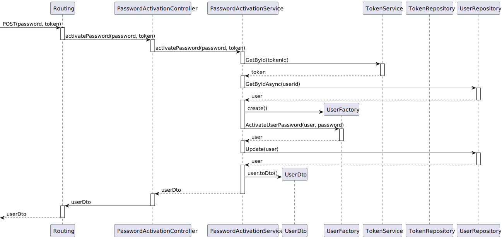

# US 01- As an Admin, I want to register new backoffice users (e.g., doctors, nurses, technicians, admins) via an out-of-band process, so that they can access the backoffice system with appropriate permissions


## 1. Context

The client has requested the team with implementing user registration functionality to be used by the admin to add users to the system/database via an out-of-band process.

## 2. Requirements

**Client Clarifications:**

>[**"QUESTION"** *by ROCHA 120160 - 12/10/2024]
>>**Q1:** A palavra-passe que os utilizadores irão definir será para o login no Google IAM (neste caso estamos a usar a IAM do google) ou será uma palavra-passe separada para aceder à aplicação? Se for uma palavra-passe separada, qual é a sua relevância, tendo em conta que o cliente referiu que tanto os backoffice users como os pacientes devem autenticar-se pelo IAM? Além disso, essa palavra-passe será armazenada na base de dados?
>>>**A1:** se estiverem a usar um IAM externo os aspetos de criação/gestão da password são tratados no IAM e não no sistema, pelo que não se aplica receberem um link para configurar a password

>[**"QUESTION"** *by UNIDENTIFIED STUDENT - 12/10/2024]
>>**Q2:** Se não existe login com password por exemplo com a autenticação google a us 5.1.2 As a Backoffice User (Admin, Doctor, Nurse, Technician), I want to reset my password if I forget it, so that I can regain access to the system securely, não faz sentido certo?
>>>**A2:** certo. esse requisito aplica-se apenas se usarem um IAM interno


**Acceptance Criteria:**

- **G001.1.** All backoffice users are registered by the admin and only the admin via an internal process.

- **G001.2.**  Admin assigns the roles during the registration process

- **G001.3.**  Registered users receive a one-time setup link via email to set their password to activate their account

- **G001.4.**  System enforces a strong password requirement policy

- **G001.5.**  After registration a confirmation is sent to the user

- **G001.6.**  Username is Email Address according to client specifications

**Dependencies/References:**

User story is only functionally dependent on the database schema and the way classes are modeled.

## 3. Analysis

### Admin Interaction System Sequence Diagram (Level 1 Process View)


### User Interaction System Sequence Diagram (Level 1 Process View)


> **Note:** Level 2 Process Views stand architecturally irrelevant as sprint 1 of project development encompasses only the development of the backend "Backoffice" module features, frontend interactions stand to be defined in future sprints.

### Relevant DM Excerpts


## 4. Design

* The team has designed to implement an authentication/authorization system using a token system developed by us.
* Considering this the token will be used for authentication and then authorization, this token will be used to implement SSO, this topic is further expanded upon in US06

### 4.1. Sequence Diagrams


### Admin Registers Backoffice User SD (Level 3 Process View)


### Backoffice User Verifies their Account SD (Level 3 Process View)



### 4.2. Applied Patterns

- Aggregate
- Entity
- Value Object
- Service
- MVC
- Layered Architecture
- DTO
- Clean Architecture
- C4+1

### 4.6 Design Commits:

* 05/10/2024 22:09 [US01] US06 Requirements and Analysis
* 16/10/2024 19:18 [US01] Sequence Diagram
* 16/10/2024 21:33 [US01] Sequence Diagram Update
* 16/10/2024 20:49 [US01] Implementation first iteration
* 16/10/2024 21:33 [US01] Added log tables
* 20/10/2024 18:03 [US01] Fixed log tables
* 20/10/2024 17:59 [US01] Fixed patient object
* 20/10/2024 18:10 [US01] General README file restructuring to be in accordance with scrum master request
* 20/10/2024 18:03 [US01] Documentation formatting change to be in accordance to team decision
* 26/10/2024 16:55 [US01] Documentation Implementation evidences


## 5. Implementation

### 5.1. Code Implementation

[RegisterBackofficeController](../../../src/Controllers/RegisterBackofficeController.cs)

```cs
[HttpPost("RegisterBackoffice")]
        public async Task<ActionResult<UserDto>> RegisterBackoffice(string emailAddress,[FromHeader] string tokenNumber)
        {
            TokenDto authToken = await _tokenSvc.GetByIdAsync(new TokenId(tokenNumber));

            if(authToken.TokenValue != TokenType.ADMIN_AUTH_TOKEN.ToString()){
                return BadRequest("ACCESS TO ADMIN PERMISSIONS DENIED.");
            }

            if (emailAddress == null)
            {
                return BadRequest("Staff email data cannot be null.");
            }
            var user = await _usrSvc.RegisterBackofficeUserAsync(emailAddress);

            if (user == null)
            {
                return BadRequest("Something went wrong when registering the user.");
            }

            // Ensure the response includes the whole UserDto object


            TokenDto token = await _tokenSvc.GeneratePasswordValidationTokenAsync(user);

            EmailService.sendActivationEmail(user.EmailAddress, token);
            
            return CreatedAtAction(nameof(RegisterBackoffice), new { id = user.EmailAddress }, user); 
        }
```

[UserService](../../../src/Domain/Users/UserService.cs)

```cs
public virtual async Task<UserDto> RegisterBackofficeUserAsync(string emailAddress)
        {
            UserFactory factory = new UserFactory();


            var user = await this._repo.AddAsync(factory.getUserWithoutPassword(emailAddress, UserRole.STAFF));
            await this._unitOfWork.CommitAsync();

            return new UserDto
            {
                EmailAddress = user.Id.AsString(),
                Role = user.Role.ToString(),
                ActivationStatus = user.ActivationStatus.ToString()
            };
        }
```

[TokenService](../../../src/Domain/Tokens/TokenService.cs)

```cs
public virtual async Task<TokenDto> GetByIdAsync(TokenId id){

            Token token = await _tokenRepo.GetByIdAsync(id);

            if(token == null){
                throw new Exception("Token does not exist");
            }

            return token.ToDto();
        }
```

[EmailService](../../../src/Services/EmailService.cs)

```cs
public static async void sendActivationEmail(string emailAddress, TokenDto pathAuthToken)
        {

            // Refresh access token
            string oAuthToken = await RefreshAccessTokenAsync(refreshToken, clientId, clientSecret);

            var request = new HttpRequestMessage(HttpMethod.Post, activationUrl);

        // Add headers
            request.Headers.Add("token", pathAuthToken.TokenId);

            // Create the email message
            var message = new MimeMessage();
            message.From.Add(new MailboxAddress("Hospital SEM5PI", "hospitalsem5pi@nope.com"));
            message.To.Add(new MailboxAddress(emailAddress, emailAddress));
            message.Subject = "NO-REPLY: Please Verify Your Password";

            // Convert the request to a string
            var requestString = $"{request.Method} {request.RequestUri}\nVersion: {request.Version}\nHeaders:\n";
            foreach (var header in request.Headers)
            {
                requestString += $"{header.Key}: {string.Join(", ", header.Value)}\n";
            }

            // Include the request details in the email body
            message.Body = new TextPart("plain") { Text = requestString + "\n\nTest Email --//3" };


            using (var client = new SmtpClient())
            {
                client.Connect("smtp.nope.com", 587, SecureSocketOptions.StartTls);

                // Authenticate using OAuth2
                var oauth2 = new SaslMechanismOAuth2("hospitalsem5pi@nope.com", oAuthToken);
                client.Authenticate(oauth2);

                client.Send(message);
                client.Disconnect(true);
            }
        }
```

[PasswordActivationController](../../../src/Controllers/PasswordActivationController.cs)

```cs
[HttpPost]
        public async Task<ActionResult<UserDto>> ActivatePassword([FromBody]string password,[FromHeader] string token)
        {            
            return await _passwordService.ActivatePassword(password, token);
        }
```

[PasswordActivationService](../../../src/Services/PasswordActivationService.cs)

```cs
public virtual async Task<UserDto> ActivatePassword(string password, string tokenId){

            var retrievedToken = await _tokenSvc.GetByIdAsync(new TokenId(tokenId));

            if (retrievedToken == null)
            {
                throw new Exception("Token not found" + tokenId);
            }

            if (retrievedToken.TokenValue != TokenType.VERIFICATION_TOKEN.ToString())
            {
                throw new Exception("Token type does not match operation - " + retrievedToken.TokenValue + " - " + TokenType.VERIFICATION_TOKEN);
            }

            var currentUser = await _userRepo.GetByIdAsync(new Username(retrievedToken.UserId));

            if (currentUser == null)
            {
                throw new Exception("User not found");
            }

            UserFactory factory = new UserFactory();

            currentUser.Activate();
            var updatedUser = factory.ActivateUserPassword(currentUser, password);

            

            var newUser = this._userRepo.Update(updatedUser);
            await this._unitOfWork.CommitAsync();

            _tokenSvc.RemoveToken(tokenId);

            return newUser.ToDto();
        }
```

### 5.2. Tests

**Assigned Tester:** Ricardo Dias - 1220976

## Register Backoffice Controller Unit Tests

This section provides an overview of the unit tests for the `PasswordActivationController`.

**Test File:** [PasswordActivationController.cs](../../../test/ControllerTest/PasswordActivationControllerTest.cs)

### Test Cases

1. **ActivatePassword_Success_WithGoodValues**
   Validates the successful activation of a backoffice user with the correct password. Mocks dependencies, including user, token repositories and the passwordService, to verify that the password is stored correctly.

### US01 Integration Tests

This section provides an overview of the integration tests for the `US01IntegrationTest` class. These tests ensure that the `RegisterBackoffice` endpoint correctly handles various scenarios in the Domain-Driven Design (DDD) architecture.

**Test File:** [US01IntegrationTest.cs](../../../test/IntegrationTest/US01IntegrationTest.cs)

#### Test Cases

1. **RegisterBackoffice_Success_WithGoodCredentials**
   Validates the successful registration of a backoffice user with proper parameters. Mocks dependencies, including user and token repositories, to verify that the user is registered correctly.
2. **RegisterBackoffice_Failure_WithWrongToken**
   Tests the scenario where a patient tries to use this functionality, through the creation of an `Patient_Auth_Token`, instead of a `Admin_Auth_Token`. Ensures that the endpoint returns a `BadRequestObjectResult` with an appropriate error message.
3. **RegisterBackoffice_Failure_WithoutEmail**
   Tests the scenario where the admin doesn't provide an e-mail. Ensures that the endpoint returns a `BadRequestObjectResult` with an appropriate error message.
4. **RegisterBackoffice_Failure_WithEmailIncorrect**
   Tests the scenario where the admin provides an invalid e-mail (without the correct format). Ensures that the endpoint catches the exception thrown by the method, checking if its the expected one.

Each test case mocks necessary services and repositories to ensure reliable isolation of the `RegisterBackoffice` functionality, enabling consistent verification of each unique scenario.

### System/E2E Testing

> Performed through POSTMAN, the modules through which system testing was done can be accessed in the following file:
>>[System Testing](test\SystemTest\SEM5PI-Testing.postman_collection.json)

## 6. Integration/Demonstration


## 7. Observations

Nothing to add.
