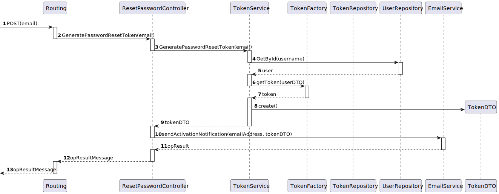

# US02 - As a Backoffice User (Admin, Doctor, Nurse, Technician), I want to reset my password if I forget it, so that I can regain access to the system securely.


## 1. Context

The client has requested the team with the task of implementing password recovery features into the system.

## 2. Requirements

**Client Clarifications:**

Nothing to Specify.


**Acceptance Criteria:**

- **G002.1.** Backoffice users can request a password reset by providing their email

- **G002.2.** The password reset link is sent via email

- **G002.3.** The reset link must expire after a set period of time

- **G002.4.** The new password must be at least 10 characters long and contain at least: a digit, a capital letter and a special character

**Dependencies/References:**

* The user story is functionally dependent on User Story 1 and in the implementation of the public API for password change requests.

## 3. Analysis

- The user story does not need much further contextualizing, the system will process the reset request and then generate a token that will be sent via email to the user
- In the future the link will redirect to the UI page dedicated to password resets but for now the token email is used more for proof of concept

### System Sequence Diagram (Level 1 Process View)


> **Note:** Level 2 Process Views stand architecturally irrelevant as sprint 1 of project development encompasses only the development of the backend "Backoffice" module features, frontend interactions stand to be defined in future sprints.


### Relevant DM Excerpts


## 4. Design

### 4.1. Realization

#### Request Password Reset SD (Level 3 Process View)




#### Reset Password SD (Level 3 Process View)


### 4.2. Applied Patterns

- Aggregate
- Entity
- Value Object
- Service
- MVC
- Layered Architecture
- DTO
- Clean Architecture
- C4+1

### 4.5 Design Commits:

* 05/10/2024 22:08 [US02] US02 Requirements and Analysis
* 17/10/2024 12:14 [US02] Final documentation iteration before implementation
* 17/10/2024 12:26 [US02] Documentation fix
* 17/10/2024 15:04 [US02] First implementation
* 24/10/2024 17:58 [US02] Documentation formatting fix
* 24/10/2024 18:02 [US02] Implementation iteration
* 25/10/2024 12:51 [US02] Documentation formatting change to be in accordance to team decision
* 26/10/2024 16:55 [US02] Documentation Implementation evidences

## 5. Implementation

[ResetPasswordController](../../../src/Controllers/ResetPasswordController.cs)

```cs
// PUT: api/Users/U1
        [HttpPut("RequestPasswordChange")]
        public async Task<ActionResult<TokenDto>> GeneratePasswordResetToken([FromQuery] string email)
        {            
            TokenDto dto = await _tokenService.GeneratePasswordResetToken(email);

            EmailService.sendActivationEmail(email, dto);

            return Ok();
        }
```

```cs
[HttpPost("ChangePassword")]
        public async Task<ActionResult<UserDto>> ResetPassword([FromBody] string password, [FromHeader] string token)
        {            
            TokenDto tokenDto = await _tokenService.GetByIdAsync(new TokenId(token));

            if(tokenDto.TokenValue != TokenType.PASSWORD_RESET_TOKEN.ToString()){
                return BadRequest("Invalid Token");
            }

            UserDto user = await _usrService.GetByIdAsync(new Username(tokenDto.UserId));

            if(user.ActivationStatus != ActivationStatus.ACTIVATED.ToString()){
                return BadRequest("User Not Activated");
            }


            UserDto userDto = await _passwordService.ResetPassword(password, user);
            _tokenService.RemoveToken(token);
            return Ok(userDto);
        }
```

[EmailService](../../../src/Services/EmailService.cs)

```cs
public static async void sendActivationEmail(string emailAddress, TokenDto pathAuthToken)
        {

            // Refresh access token
            string oAuthToken = await RefreshAccessTokenAsync(refreshToken, clientId, clientSecret);

            var request = new HttpRequestMessage(HttpMethod.Post, activationUrl);

        // Add headers
            request.Headers.Add("token", pathAuthToken.TokenId);

            // Create the email message
            var message = new MimeMessage();
            message.From.Add(new MailboxAddress("Hospital SEM5PI", "hospitalsem5pi@nope.com"));
            message.To.Add(new MailboxAddress(emailAddress, emailAddress));
            message.Subject = "NO-REPLY: Please Verify Your Password";

            // Convert the request to a string
            var requestString = $"{request.Method} {request.RequestUri}\nVersion: {request.Version}\nHeaders:\n";
            foreach (var header in request.Headers)
            {
                requestString += $"{header.Key}: {string.Join(", ", header.Value)}\n";
            }

            // Include the request details in the email body
            message.Body = new TextPart("plain") { Text = requestString + "\n\nTest Email --//3" };


            using (var client = new SmtpClient())
            {
                client.Connect("smtp.nope.com", 587, SecureSocketOptions.StartTls);

                // Authenticate using OAuth2
                var oauth2 = new SaslMechanismOAuth2("hospitalsem5pi@nope.com", oAuthToken);
                client.Authenticate(oauth2);

                client.Send(message);
                client.Disconnect(true);
            }
        }
```

[TokenService](../../../src/Domain/Tokens/TokenService.cs)

```cs
internal virtual async Task<TokenDto> GeneratePasswordResetToken(string resetPasswordDto)
        {
            TokenFactory factory = new TokenFactory();

            var user = await this._userRepo.GetByIdAsync(new Username(resetPasswordDto));
            Token token = factory.createPasswordResetToken(DateTime.Now.AddDays(1), user);

            

            token = await this._tokenRepo.AddAsync(token);

            if(token.TheUser == null){
                throw new ArgumentException("User of Token in DB is null lawl");
            }

            await this._unitOfWork.CommitAsync();

            return token.ToDto();
        }
```

[UserService](../../../src/Domain/Users/UserService.cs)

```cs
public virtual async Task<UserDto> GetByIdAsync(Username id)
        {
            var user = await this._repo.GetByIdAsync(id);
            
            if(user == null)
                return null;

            return new UserDto
            {
                EmailAddress = user.Id.AsString(),
                Role = user.Role.ToString(),
                ActivationStatus = user.ActivationStatus.ToString()
            };
        }
```


[PasswordActivationService](../../../src/Services/PasswordActivationService.cs)

```cs
public virtual async Task<UserDto> ResetPassword(string password, UserDto userDto)
        {

            User user = await _userRepo.GetByIdAsync(new Username(userDto.EmailAddress));

            user.ChangePassword(password);

            user = _userRepo.Update(user);

            await this._unitOfWork.CommitAsync();

            return user.ToDto();
        }
```

### 5.2. Tests

**Assigned Tester:** Ricardo Dias - 1220976

## Reset Password Controller Unit Tests

This section provides an overview of the unit tests for the `ResetPasswordControllerTest`.

**Test File:** [ResetPasswordControllerTest.cs](../../../test/ControllerTest/ResetPasswordControllerTest.cs)

### Test Cases

1. **ResetPassword_Success_WithGoodValues**
   Validates the successful reset of user's password with a new password. Mocks dependencies, including user, token repositories and the passwordService, to verify that the password is changed correctly.
2. **ResetPassword_Aunauthorized_WithBadToken**
   Tests the scenario where a different token is used to try to acess this functionality, through the creation of an `General_Access`, instead of a `Password_Reset_Token`. Ensures that the endpoint returns a `BadRequestObjectResult` with an appropriate error message.

### US02 Integration Tests

This section provides an overview of the integration tests for the `US02IntegrationTest` class. These tests ensure that the `ResetPassword` endpoint correctly handles various scenarios in the Domain-Driven Design (DDD) architecture.

**Test File:** [US02IntegrationTest.cs](../../../test/IntegrationTest/US02IntegrationTest.cs)

#### Test Cases

1. **ResetPassword_Success_WithGoodValues**
   Validates the successful reset of an user's password with the proper parameters. Mocks dependenciesincluding user, token repositories and the passwordService, to verify that the password is changed correctly.
2. **ResetPassword_Failure_WithBadToken**
   Tests the scenario where a different token is used to try to acess this functionality, through the creation of an `General_Access`, instead of a `Password_Reset_Token`. Ensures that the endpoint returns a `BadRequestObjectResult` with an appropriate error message.
3. **ResetPassword_Failure_WithDeactivatedUser**
   Tests the scenario where an deactivated user tries to reset the password. An deactivated user can't reset their password, because their password isn't set. Ensures that the endpoint returns a `BadRequestObjectResult` with an appropriate error message.

Each test case mocks necessary services and repositories to ensure reliable isolation of the `ResetPassword` functionality, enabling consistent verification of each unique scenario.

### System/E2E Testing

> Performed through POSTMAN, the modules through which system testing was done can be accessed in the following file:
>>[System Testing](test\SystemTest\SEM5PI-Testing.postman_collection.json)


## 6. Integration/Demonstration


## 7. Observations

* Nothing to add
