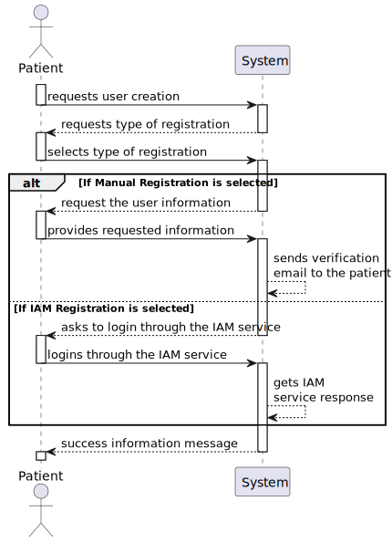
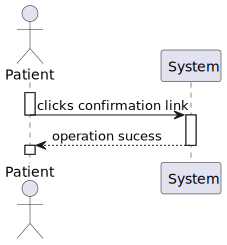
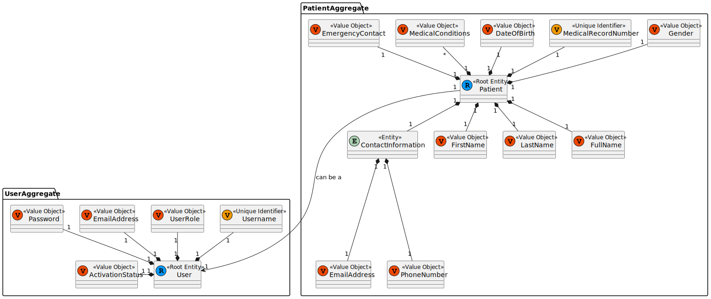
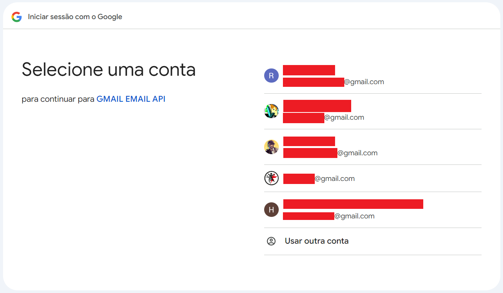
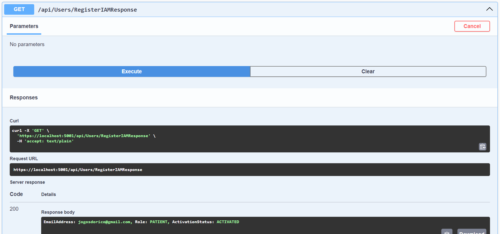
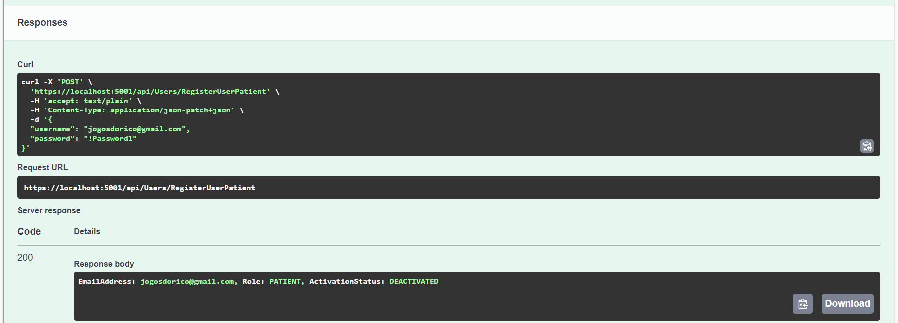
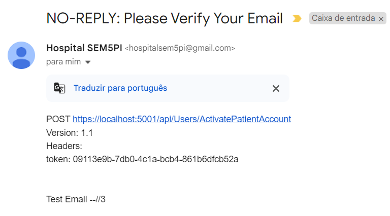
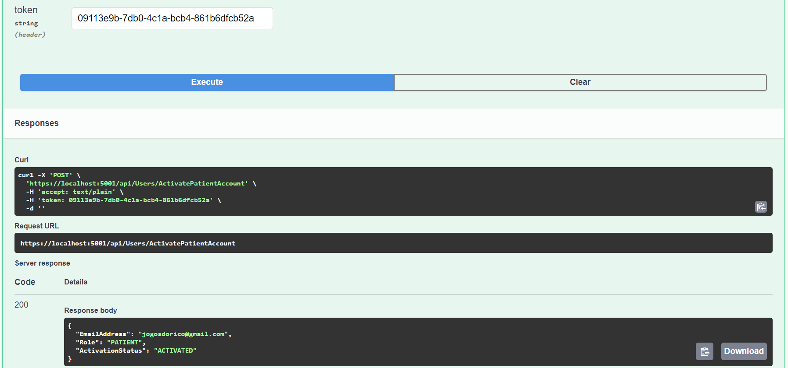

# US 03 - As a Patient, I want to register for the healthcare application, so that I can create a user profile and book appointments online

## 1. Context

This is the first time this US is tasked to us. It continues the process of user creation, this time for the patient themselves.

- It will be a functionality open to the public, since anyone can register as a patient.
- This functionality will be only accesible through the UI in the next sprint. This task only requires the creation of the functionality in the back-end.

## 2. Requirements

"**US 03 -** As a Patient, I want to register for the healthcare application, so that I can create a user profile and book appointments online."

**Client Specifications - Q&A:**
> [**"IAM external system"** *by VARELA 1220683 - Friday, 27th September 2024 at 17:42*]
> In IAM external system, if a patient is signed in with a google account and later uses other external system like Facebook, and both have different credentials, what happens?
>
>>**Answer -** Assume the system only supports one IAM.

> [**"Password Requirements"** *by VARELA 1220683 - Friday, 27th September 2024 at 17:51*]
What are the system's password requirements?
>
>>**Answer -** At least 10 characters long, at least a digit, a capital letter and a special character.

>[**"Username and Email requirements"** *by Ana Costa 1201313 - Saturday, 5th October 2024 at 18:54*]
>Dear Client,
Can you clarify the username and email requirements?
Thank you for your time.
>> **Answer -** The username is the "official" email address of the user. For backoffice users, this is the mechanographic number of the collaborator, e.g., D240003 or N190345, and the DNS domain of the system. For instance, Doctor Manuela Fernandes has email "D180023@myhospital.com". The system must allow for an easy configuration of the DNS domain (e.g., environment variable).
For patients, the username is the email address provided in the patient record and used as identity in the external IAM. For instance patient Carlos Silva has provided his email csilva98@nope.com the first time he entered the hospital. That email address will be his username when he self-registers in the system.

> [**"5.1.8 As an Admin, I want to create a new patient profile"** *by BRITO 1222135 - Tuesday, 8th of October of 2024 at 23:38*]
Dear client,
When an Admin creates a patient profile, should he already register them in the system, as users that can login, or should the registration always be responsibility of the patient?
If the latter is intended, should the patient's user credentials be linked to the existing profile?
Best regards, Tiago Brito
>> **Answer -** This was already clarified in a previous meeting. Registering a patient record is a separate action from the patient self-registering as a user.
>>> **Follow-Up Question -** That's right, it was clarified in a previous meeting, but I'm still not 100% clarified about my question.
I understand that the Admin can create the Pacient profile and leave the User as inactive, but how does the activation happen? If that pacient eventualy wants to register himself, should there be an option to activate an existing profile? For example, associate the e-mail from registration input with the existing profile's e-mail?
The feature 5.1.3 asks for the full registration, but doesn't say anything about profiles that already exist.
>>>> **Answer -** The admin register the patient (this does not create a user for that patient) optionally, the patient self-registers in the system by providing the same email that is currently recorded in their patient record and the system associates the user and the patient.
There is no option for someone who is not a patient of the system to register as a user.
Hope this is the clarification you were missing. if not, let me know.

> [**"5.1.3 Clarification about the verification of the email AC"** *por PINTO 1221171 - Friday, 11 de October de 2024 às 19:52*]
In user story 5.1.3, there is an acceptance criterion that caused me some doubts: "The system validates the email address by sending a verification email with a confirmation link."
I understand the relevance of this acceptance criterion when not using an external IAM (Identity and Access Management) system. It ensures that users can't claim someone else's email address, as they would need to access the email to confirm their registration (for example, by clicking a unique link sent to the email).
However, there is another acceptance criterion stating: "Patients can self-register using the external IAM system." In this case, with an external IAM, wouldn't it be possible to bypass the step of sending a confirmation link to validate the email?
Would the following approach be considered correct?
An unauthenticated user tries to log in/access a patient area/register.
The unauthenticated user submits their credentials through the external IAM login (proving ownership of the email in the process).
The system receives this user's information (email), and if there is no corresponding user in the system, it asks for registration details (such as name and phone number).
The user submits the registration details, completing the registration as a patient in the system.
Advantages of this approach:
Improved user experience: It simplifies the registration process by reducing steps, making it quicker and more convenient for users.
Efficiency: By relying on the external IAM for email validation, you avoid duplicating validation mechanisms and streamline the process.
This approach ensures that the email belongs to the patient without the need to send a confirmation email. Do you think this is a good solution, even though it doesn't comply with one of the acceptance criteria?
NOTE: Google's IAM will be used for this process, which is reliable and also provides the email of the user who logged in (I don't know if this approach will be possible with other IAM system)
>> **Answer -** imagine the following scenario,
a patient is admitted to the hospital and a clerk registers their patient record with email abc@abc.com. that's the patient personal email.
afterwards, that same patient wants to self-register in the system.
the system use external IAM provider xyz
the patient will create an account in the IAM provider, e.g., abc12@xy2z.com and will use that identity to self-register as patient abc@abc.com
the system needs to send a verification email to abc@abc.com
when the patient follows the link sent to their personal email, the system will be able to "connect" the two emails as identifying the same person, and provide access to the system

**Acceptance Criteria:**

- **US03.1.** Patients can self-register using the external IAM system.

- **US03.2.** During registration, patients provide personal details (e.g., name, email, phone) and create a profile.

- **US03.3.** The system validates the email address by sending a verification email with a confirmation link.

- **US03.4.** Patients cannot list their appointments without completing the registration process.

- **US03.5.** "There is no option for someone who is not a patient of the system to register as a user."

**Dependencies/References:**

- Although the process is similar to the **US01** ("As an Admin, I want to register new backoffice users..."), since both create a role-specific user, these two are independent from each other, not needing one to be finished for the other to be worked on.
- "**[US08]** *As an Admin, I want to create a new patient profile, so that I can register their personal details and medical history.*"
  - It is required to create a Patient Profile to test this functionality.

## 3. Analysis

This task requires the registration of an user with a specific role - **Patient**. Each role has a different set of attributes, but they are all associated to an User, which shares the same attributes with all. **This type of user can only be created if there's a patient profile to be associated with (same e-mail).**

The functionality only requires the completion of the User attributes. This process can be avoided if the individual decides to register through the *External IAM System* implemented, since all the required values are shared and the e-mail doesn't need to be verified.

The team decided to implement the **Google Authentication** for the *IAM System*. This system will be implemented in this US.

Effectivly, the registration process will depend on which path the actor chooses:

- **Normal Registration:**
  - Every attribute needs to be written manually.
  - A verification e-mail is sent to activate the account.
    - The user can only access the acount and its functionalities, if the account is active.
- **External IAM Registration:**
  - The user chooses to login/register with the external IAM Registration.
  - The account is automatically activated.

Both paths only are available if the **chosen e-mail is associated to a patient profile in the database**.

### System Sequence Diagram

#### Patient Registration SSD



#### Patient Email Response SSD



### Relevant DM Excerpts




## 4. Design

### 4.1. Realization


### 4.2. Applied Patterns

- Aggregate
- Entity
- Value Object
- Service
- MVC
- Layered Architecture
- DTO
- Clean Architecture
- C4+1

### 4.3. Design Commits

> **08/10/2024 10:49 [US03]** Documentation Started:
>
> -> Context and Requirements done. It might be updated in the future, thanks to the "Client Specifications" section.

> **15/10/2024 16:39 [US03]** Documentation Continued:
>
>-> Context and Requirements Updated;
>-> Analysis Completed - Patient Registration SSD, Patient Email Response SSD.
>-> Design Started - Patient Registration Sequence Diagram.

> **16/10/2024 11:18 [US03]** Documentation Continued:
>
>-> Design Finished.

> **16/10/2024 16:46 [US03]** Documentation Corrections to accomodate new client specifications:
>
>-> Context Updated;
>-> New Q&A added;
>-> Acceptance Criteria Updated;
>-> Analysis Updated;
>-> SSD & SD Updated..

## 5. Implementation

### 5.1. Code Implementation

**UsersController:**

```cs
public class UsersController {
  public class UsersController : ControllerBase
    {
        [HttpPost("RegisterUserPatient")]
        public async Task<ActionResult<string>> RegisterUserPatient(LoginCredentialsDto dto)
        {            
            var existingPatientProfile = await _patSvc.checkIfPatientProfileExists(dto.Username);

            if (existingPatientProfile == null){
                return "No Available Patient Profile shares the same e-mail as the one you are trying to login.";
            } else if (string.IsNullOrEmpty(existingPatientProfile.userId)){
                var user = await _service.AddWithPasswordAsync(dto);
                _patSvc.addUserToPatientProfile(existingPatientProfile.mrn, user.EmailAddress);
                
                TokenDto token = await _tokenSvc.GeneratePasswordValidationTokenAsync(user);
                
                EmailService.sendEmailVerificationEmail(dto.Username, token);
                return user.ToString();
            } else {
                return "The Patient Profile that shares the same email as the one you are trying to login, already has a user associated."+
                "\nTry logging in with your information.";
            }

        }

        [HttpGet("RegisterIAMResponse")]
        public async Task<ActionResult<string>> RegisterUserIAM()
        {            
            var result = await HttpContext.AuthenticateAsync(CookieAuthenticationDefaults.AuthenticationScheme);

            if (result?.Principal == null) {return Unauthorized();}
            
            var claimStrings = result.Principal.Identities.FirstOrDefault().Claims
            .Select(claim => $"Type:{claim.Type.Split('/').Last()}, Value:{claim.Value}")
            .ToArray();

            LoginCredentialsDto loginCredentialsDto = _logSvc.TreatAuthenticateResult(claimStrings);
            
            var existingPatientProfile = await _patSvc.checkIfPatientProfileExists(loginCredentialsDto.Username);

            if (existingPatientProfile == null){
                return "No Available Patient Profile shares the same e-mail as the one you are trying to login.";
            } else if (string.IsNullOrEmpty(existingPatientProfile.userId)){
                var user = await _service.AddIAMAsync(loginCredentialsDto);
                _patSvc.addUserToPatientProfile(existingPatientProfile.mrn, user.EmailAddress);
                return user.ToString();
            } else {
                return "The Patient Profile that shares the same email as the one you are trying to login, already has a user associated."+
                "\nTry logging in with your information.";
            }

        }


        [HttpPost("ActivatePatientAccount")]
        public async Task<ActionResult<UserDto>> ActivatePatientAccount([FromHeader] string token)
        {            
            return await _service.ActivatePatientAccount(token);
        }
    }
}
```

**PatientService:**

```cs
public class PatientService
    {
        public async Task<PatientDto> checkIfPatientProfileExists(string email){
            var patient = await _repo.GetByEmailAsync(new EmailAddress(email));
            if (patient==null){
                return null;
            } else {
                return patient.toDto();
            }
        }

        public async void addUserToPatientProfile(string patientMRN, string userId){
            var user = await _userRepo.GetByIdAsync(new Username(userId));
            var patient = await _repo.GetByIdAsync(new MedicalRecordNumber(patientMRN));
            patient.AddUser(user.Id, user);
            _repo.Update(patient);
            await _unitOfWork.CommitAsync();
        }
    }
```

**UserService:**

```cs
public class UserService
    {
      public async Task<UserDto> AddWithPasswordAsync(LoginCredentialsDto dto)
        {
            UserFactory factory = new UserFactory();

            var user = await this._repo.AddAsync(factory.CreateDeactivatedUser(dto.Username, dto.Password, UserRole.PATIENT));
            await this._unitOfWork.CommitAsync();

            return new UserDto
            {
                EmailAddress = user.Id.AsString(),
                Role = user.Role.ToString(),
                ActivationStatus = user.ActivationStatus.ToString()
            };
        }
    }
```

**TokenService:**

```cs
public class TokenService
    {
      public virtual async Task<TokenDto> GeneratePasswordValidationTokenAsync(UserDto userDto)
        {
            TokenFactory factory = new TokenFactory();

            var user = await this._userRepo.GetByIdAsync(new Username(userDto.EmailAddress));
            Token token = factory.createPasswordActivationToken(DateTime.Now.AddDays(1), user);

            token = await this._tokenRepo.AddAsync(token);

            if(token.TheUser == null){
                throw new ArgumentException("User of Token in DB is null lawl");
            }

            await this._unitOfWork.CommitAsync();

            return token.ToDto();
        }
    }
```

## 5.2. Tests

**Assigned Tester:** Alfredo Ferreira - 1220962

## Login Controller Unit Tests

This section provides an overview of the unit tests for the `LoginController`.

**Test File:** [LoginControllerTests.cs](../../../test/ControllerTest/LoginControllerTest.cs)

### Test Cases

1. **Login_ReturnsOk_WithValidCredentials**  
   Validates that a successful login with correct credentials returns an `OkObjectResult`. It mocks the login and token services to ensure valid output is returned.

2. **LoginIAM_ReturnsOk_WithValidAuthentication**  
   Confirms that valid authentication via the Identity Provider results in an `OkObjectResult` containing the correct token. It mocks the `IAuthenticationService` to simulate a successful authentication scenario.

3. **LoginIAM_ReturnsNotOk_WithInvalidAuthentication**  
   Tests the behavior when invalid authentication is provided. The user not existing causes an exception, which is caught by the service. Verifies that a `BadRequestObjectResult` is returned, ensuring appropriate error handling.

### US03 Integration Tests

This section provides an overview of the integration tests for the `US03IntegrationTest` class. These tests ensure that the `RegisterUserPatient` endpoint correctly handles various scenarios in the Domain-Driven Design (DDD) architecture.

**Test File:** [US03IntegrationTest.cs](../../../test/IntegrationTest/US03IntegrationTest.cs)

#### Test Cases

1. **RegisterUserPatient_Success_WithProperParameters**  
   Validates the successful registration of a patient user with proper parameters. Mocks dependencies, including patient, user, and token repositories, to verify that a user is registered and associated correctly.

2. **RegisterUserPatient_Failure_PatientProfileDoesNotExist**  
   Tests the scenario where a patient profile with the provided email does not exist. Ensures that the endpoint returns a `BadRequestObjectResult` with an appropriate error message.

3. **RegisterUserPatient_Failure_AlreadyAssociated**  
   Validates that if the patient profile is already associated with a user, the endpoint returns a `BadRequestObjectResult` with a specific error message. Verifies that no new user or token is created in this case.

Each test case mocks necessary services and repositories to ensure reliable isolation of the `RegisterUserPatient` functionality, enabling consistent verification of each unique scenario.

**NOTE**: Service Unit tests for the functionalities were deemed low importance since their features are incredibly simple.

### System/E2E Testing

> Performed through POSTMAN, the modules through which system testing was done can be accessed in the following file:
>>[System Testing](test\SystemTest\SEM5PI-Testing.postman_collection.json)


### Main Commits

> **17/10/2024 10:12 [US03]** External IAM Service Implemation:
>
>This is the first sketch of the IAM implementation which constitues the foundation of the service.
The service is working and showing the information gathered, but, for now, doing nothing with it.

> **23/10/2024 10:55 [US03]** Patient Correction:
>
>-> DateOfBirth attribute implemented.

> **26/10/2024 00:54 [US03]** Implementation:
>
>-> Functionality Implemented and Tested

> **26/10/2024 17:09 [US03]** Implementation:
>
>-> Functionality Fully Implemented - There were functionalities missing, so this is the actual full version.

## 6. Integration/Demonstration

**IAM Registration Demonstration:**




**Manual Registration Demonstration:**






## 7. Observations

The IAM Process requires URI redirections. Since the UI isn't being implemented in this sprint, the login process is through the **LoginIAM** method in the **LoginController**, for all the IAM functionalities.
