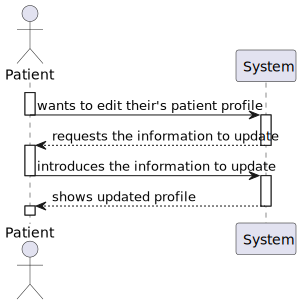
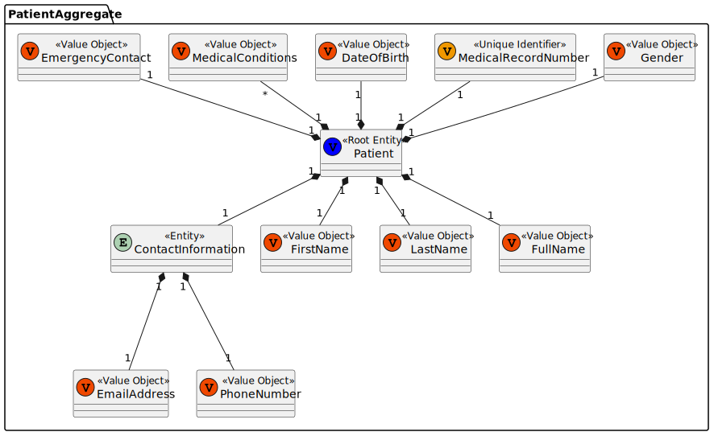
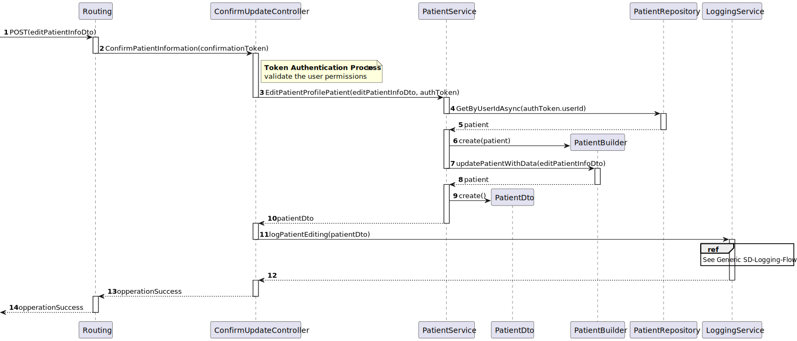
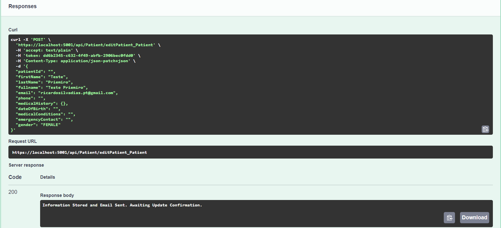
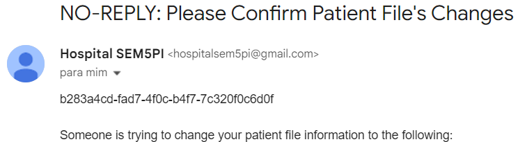
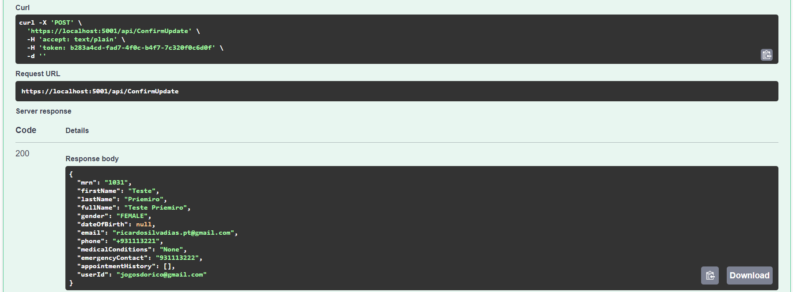

# US 04 - As a Patient, I want to update my user profile, so that I can change my personal details and preferences.

## 1. Context

This is the first time this US is tasked to us. It continues the process of patient creation, this time for the patient updating portion.

- It will be a functionality open to the public, since anyone can register as a patient.
- This functionality will be only accesible in the next sprint. This task only requires the creation of the functionality in the back-end.

## 2. Requirements

"**US 04 -** As a Patient, I want to update my user profile, so that I can change my personal details and preferences."

**Client Specifications - Document:**
>Patient Attributes:
>
>- `First Name`
>- `Last Name`
>- `Full Name`
>- `Date of Birth`
>- `Gender`
>- `Medical Record Number` (unique identifier)
>- `Contact Information` (email, phone)
>- `Allergies/Medical Conditions` (optional)
>- `Emergency Contact`
>- `Appointment History` (list of previous and upcoming appointments)
>
>Rules:
>
>- A patient must be unique in terms of `Medical Record Number`, `Email` and `Phone`.
>- Sensitive data (like medical history) must comply with GDPR, allowing patients to control their data access.

**Client Specifications - Q&A:**
> [**"Patient Profile"** *by MONTEIRO 1220783 - Friday, 4th October 2024 at 17:39*]
> In US 5.1.4., what do preferences mean in the patient profile?
>
>>**Answer -** Preferences are for now related to marketing consent or not by the patient, or other related GDPR preferences.

> [**"Password Requirements"** *by VARELA 1220683 - Friday, 27th September 2024 at 17:51*]
What are the system's password requirements?
>
>>**Answer -** At least 10 characters long, at least a digit, a capital letter and a special character.

> [**"US 5.1.8 - Format of data"** *by CARDOSO 1221083 - Thursday, 10th of October of 2024 at 16:43*]
Hello,
I hope you are well.
So, when the administrator starts creating the patient profile, what format(s) of the date of birth will they need to enter? Furthermore, what will be the format of the Medical Record Number generated after recording the data?
Compliments,
Rodrigo Cardoso, 1221083
>> **Answer -** From a usability perspective, dates should be presented to the user using the operating system's locale definitions. since for this sprint you are building an API, you should use a standard format like ISO 8601.
medical record numbers are generated by the system following the format YYYYMMnnnnnn where YYYY and MM are the year and month of the registration and nnnnnn is a sequential number

**Acceptance Criteria:**

- **US 04.1** Patients can log in and update their profile details (e.g., name, contact information, preferences).

- **US 04.2** Changes to sensitive data, such as email, trigger an additional verification step (e.g., confirmation email).

- **US 04.3** All profile updates are securely stored in the system.

- **US 04.4** The system logs all changes made to the patient's profile for audit purposes.

**Dependencies/References:**

- "**[US03]** *As a Patient, I want to register for the healthcare application, so that I can create a user profile and book appointments online.*"
  - The patient needs to be able to create an user, in order to update the patient profile associated with it.
- "**[US09]** *As an Admin, I want to edit an existing patient profile, so that I can update their information when needed.*"
  - Similar functionality, different information that can be updated.

## 3. Analysis

As previously mentioned, this US implements the same functionality of the **US09**, only changing the number of information the actor can change.

In this US, the actor is the patient, and it can change **every attribute** in the patient profile, but it still has to maintain the attribute rules - for example, the phone and e-mail have to be unique.

Any updates to sensitive data, will trigger an e-mail to be sent to confirm the update. **The update can't be made if the e-mail confirmation isn't made**. The sensitive data required for now is the `E-mail Address`.

### System Sequence Diagram



### Relevant DM Excerpts



## 4. Design

### 4.1. Realization

#### Edit Patient Profile Sequence Diagram


#### Confirm Patient Profile Update E-mail Sequence Diagram



### 4.2. Applied Patterns

- Aggregate
- Entity
- Value Object
- Service
- MVC
- Layered Architecture
- DTO
- Clean Architecture
- C4+1

### 4.5 Design Commits

> **08/10/2024 10:50 [US04]** Documentation Started:
>
>-> Context and Requirements done. It might be updated in the future, thanks to the "Client Specifications" section.

> **23/10/2024 09:53 [US04]** Design Update:
>
>-> Analysis Done - SSD & DM Excerpt
>-> Design Done - SD.

## 5. Implementation

### 5.1. Code Implementation

**PatientController:**

```cs
public class PatientController : ControllerBase
    {
      [HttpPost("editPatient_Patient")]
        public virtual async Task<ActionResult<string>> EditPatientProfilePatient([FromBody] EditPatientDto_Patient editData, [FromHeader] string token)
        {
            TokenDto tokenDto = await _tokenSvc.GetByIdAsync(new TokenId(token));

            if(tokenDto.TokenValue != TokenType.PATIENT_AUTH_TOKEN.ToString()){
                return BadRequest("ACCESS TO RESOURCE DENIED.");
            }
            PatientDto patientDto = await _patSvc.EditPatientProfilePatient(editData, tokenDto);

            if (!string.IsNullOrEmpty(editData.Email)){
                await _logSvc.LogPatientEditingAttempt(patientDto, tokenDto.UserId);
                return Ok("Information Stored and Email Sent. Awaiting Update Confirmation.");
            }

            await _logSvc.LogPatientEditing(patientDto);
            return Ok(patientDto);
        }
    }
```

**PatientService:**

```cs
public class PatientService
    {
      public virtual async Task<PatientDto> EditPatientProfilePatient(EditPatientDto_Patient editData, TokenDto tokenDto)
            {
                Patient patient = await _repo.GetByUserIdAsync(new Username(tokenDto.UserId));

                if(patient == null){
                    throw new ArgumentNullException(nameof(patient), "Patient associated with User not found.");
                }

                bool sensitiveInfomationWasAltered = false;
                // Update fields if they are not null
                if (!string.IsNullOrEmpty(editData.FirstName))
                {
                    patient.firstName = new FirstName(editData.FirstName); 
                }

                if (!string.IsNullOrEmpty(editData.LastName))
                {
                    patient.lastName = new LastName(editData.LastName); 
                }

                if (!string.IsNullOrEmpty(editData.Fullname))
                {
                    patient.fullName = new FullName(editData.Fullname);
                }

                if (!string.IsNullOrEmpty(editData.Email))
                {
                    patient.ContactInformation.Email = new EmailAddress(editData.Email);
                    sensitiveInfomationWasAltered = true;
                }

                if (!string.IsNullOrEmpty(editData.Phone))
                {
                    patient.ContactInformation.Phone = new PhoneNumber(editData.Phone);
                }

                if (editData.MedicalHistory != null && editData.MedicalHistory.id != null)
                {
                    AppointmentService appSvc = new AppointmentService();
                    Appointment appointment = await this._appRepo.GetByIdAsync(new AppointmentID(editData.MedicalHistory.id));
                    if (appointment == null){
                        await appSvc.registerAppointment(editData.MedicalHistory);
                    } else {
                        await appSvc.updateAppointment(editData.MedicalHistory, appointment);
                    }
                }

                if (!string.IsNullOrEmpty(editData.DateOfBirth))
                {
                    patient.dateOfBirth = new DateOfBirth(editData.DateOfBirth);
                }

                if(!string.IsNullOrEmpty(editData.MedicalConditions)){
                    patient.medicalConditions = editData.MedicalConditions;
                }
                
                if(!string.IsNullOrEmpty(editData.Gender)){
                    if (editData.Gender.Equals("MALE")){patient.gender= Gender.MALE;}
                    else if (editData.Gender.Equals("FEMALE")){patient.gender = Gender.FEMALE;}
                    else if (editData.Gender.Equals("OTHER")){patient.gender = Gender.OTHER;}
                    else if (editData.Gender.Equals("NONSPECIFIED")){patient.gender = Gender.NONSPECIFIED;}
                    else { throw new ArgumentException("Gender must be valid."); }
                }
                
                if(!string.IsNullOrEmpty(editData.EmergencyContact)){
                    patient.medicalConditions = editData.MedicalConditions;
                }

                if (sensitiveInfomationWasAltered)
                {
                    TokenDto confirmationToken = await this._tokenService.GenerateUpdateConfirmationToken(tokenDto.UserId);
                    EmailService.sendPatientUpdateNotification(tokenDto.UserId, confirmationToken, patient.toDto());
                    return patient.toDto();
                }

                // Save the updated patient back to the repository
                Patient retPatient = _repo.Update(patient);
                await _unitOfWork.CommitAsync();            

            // Return the updated patient as a DTO
            return retPatient.toDto();
            }
```

**TokenService:**

```cs
public class TokenService
    {
      public virtual async Task<TokenDto> GenerateUpdateConfirmationToken(string userId){
            TokenFactory factory = new TokenFactory();

            var user = await this._userRepo.GetByIdAsync(new Username(userId));
            if (user == null)
                throw new ArgumentException("User not found for the given userId.");
            Token token = factory.createUpdateConfirmationToken(DateTime.Now.AddDays(1), user);

            token = await this._tokenRepo.AddAsync(token);

            if(token.TheUser == null){
                throw new ArgumentException("User of Token in DB is null lawl");
            }

            await this._unitOfWork.CommitAsync();

            return token.ToDto();
        }
    }
```

**EmailService:**

```cs
static class EmailService
    {
      public static async void sendDeletionConfirmation(string emailAddress, TokenDto token)
        {
            // Refresh access token
            string oAuthToken = await RefreshAccessTokenAsync(refreshToken, clientId, clientSecret);

            // Send email using the refreshed access token

            var message = new MimeMessage();
            message.From.Add(new MailboxAddress("Hospital SEM5PI", "hospitalsem5pi@nope.com"));
            message.To.Add(new MailboxAddress(emailAddress, emailAddress));
            message.Subject = "NO-REPLY: Please Confirm Patient File's Deletion";
            message.Body = new TextPart("plain") { Text = token.TokenId + "\n\nSomeone is trying to delete your patient file information.\nIf you wish to proceed, confirm with the Token above." };

            using (var client = new SmtpClient())
            {
                client.Connect("smtp.nope.com", 587, SecureSocketOptions.StartTls);

                // Authenticate using OAuth2
                var oauth2 = new SaslMechanismOAuth2("hospitalsem5pi@nope.com", oAuthToken);
                client.Authenticate(oauth2);

                client.Send(message);
                client.Disconnect(true);
            }            

        }
    }
```

**LoggingService:**

```cs
public class LogService
    {
      public virtual async Task<LogDto> LogPatientEditing(PatientDto patientDto)
            {
                // Check if the patientDto is null
                if (patientDto == null)
                {
                    throw new ArgumentNullException(nameof(patientDto), "PatientDto cannot be null.");
                }

                // Check if the MRN (Medical Record Number) is null or empty
                if (string.IsNullOrWhiteSpace(patientDto.mrn))
                {
                    throw new ArgumentException("Medical Record Number cannot be null or empty.", nameof(patientDto.mrn));
                }

                // Create the LogDto object
                LogDto dto = new LogDto
                {
                    LoggedId = patientDto.mrn,
                    LoggedInformation = patientDto.ToString(),
                    LoggedType = ObjectLoggedType.PATIENT.ToString(),
                    LoggedDate = DateTime.Now.AddSeconds(5).ToString()
                };

                // Call the asynchronous method to add the log
                return await AddLogAsync(dto);
            }

      public virtual async Task<LogDto> LogPatientEditingAttempt(PatientDto patientDto, string userID)
            {
                if (patientDto == null)
                {
                    throw new ArgumentNullException(nameof(patientDto), "PatientDto cannot be null.");
                }

                if (string.IsNullOrWhiteSpace(patientDto.mrn))
                {
                    throw new ArgumentException("Medical Record Number cannot be null or empty.", nameof(patientDto.mrn));
                }

                LogDto dto = new LogDto
                {
                    LoggedId = userID,
                    LoggedInformation = patientDto.ToString(),
                    LoggedType = ObjectLoggedType.PATIENT_UPDATE_ATTEMPT.ToString(),
                    LoggedDate = DateTime.Now.AddSeconds(5).ToString()
                };

                return await AddLogAsync(dto);
            }
    }
```

## 5.2. Tests

**Assigned Tester:** Alfredo Ferreira 1220962

## Log Service Unit Tests

This section describes the unit tests implemented for the `LogService`.

Test File: [LogServiceTest.cs](../../../test/ServiceTest/LogServiceTest.cs)

1. **LogPatientEditingAttempt_Success_WithValidPatientDTO**:  
   Ensures that a log entry is successfully created and recorded when provided with a valid `PatientDto`. Mocks a log entry using a `LogsBuilder` and verifies that the log details, including `LoggedInformation`, `LoggedId`, and `LoggedType`, match the expected values. Also checks that the `AddAsync` method of the `LogRepository` and `CommitAsync` method of the `UnitOfWork` are each called once.

2. **LogPatientEditingAttempt_Failure_WithInvalidMedicalRecordNumber**:  
   Tests that an `ArgumentException` is thrown when attempting to log a patient editing attempt with an invalid medical record number (`mrn` is empty). Mocks a scenario where `AddAsync` is called with invalid data and verifies that no log is created, and no commits occur.


## Patient Service Unit Tests

This section describes the unit tests implemented for the `PatientService`.

Test File: [PatientServiceTest.cs](../../../test/ServiceTest/PatientServiceTest.cs)

1. **EditPatientProfilePatient_ThrowsException_WhenPatientNotFound**:  
   Ensures that an `ArgumentNullException` is thrown when attempting to edit a patient profile for a nonexistent patient. Mocks the `GetByUserIdAsync` method of the `IPatientRepository` to return `null`.

2. **EditPatientProfilePatient_SavesChanges_WhenDataIsUpdated**:  
   Tests that changes are saved when valid data is provided. Mocks the retrieval of a patient and updates their first name, verifying that the `Update` method of the `IPatientRepository` and `CommitAsync` method of the `IUnitOfWork` are called once. Also checks that the updated patient's first name matches the expected value.

3. **EditPatientProfilePatient_SendsEmailNotification_WhenEmailChanged**:  
   Verifies that an email notification is sent when the patient's email is updated. Mocks the necessary methods to check that both the `Update` method of the `IPatientRepository` and the `GenerateUpdateConfirmationToken` method of the `TokenService` are called once, as well as confirming that changes are committed.

## US04 Integration Tests

This section outlines the integration tests implemented for the `PatientController` related to the patient profile editing functionality.

Test File: [US04IntegrationTest.cs](../../../test/IntegrationTest/US04IntegrationTest.cs)

1. **EditProfile_Success_WithCorrectInputs**:  
   Verifies that the patient profile is successfully edited when provided with correct inputs. It mocks the necessary dependencies to return a valid token and patient data. After executing the controller action, it checks that the response is an `OkObjectResult` containing the updated patient information. Additionally, it verifies that the corresponding repository methods are called once.

2. **EditProfile_AuthFail**:  
   Tests the scenario where authentication fails due to an invalid token type. The mock setup returns a token with insufficient permissions. It asserts that the response is a `BadRequestObjectResult` with the message "ACCESS TO RESOURCE DENIED." and verifies that the token retrieval method was called.

3. **EditPatientProfilePatient_SendsEmail_WithSensitiveInformation**:  
   Ensures that an exception is thrown when sensitive information (email) is being edited without proper handling. The test sets up the mock to return a valid token and existing patient data. It asserts that an `ArgumentException` is thrown when the controller action is called, checking that the appropriate repository methods are invoked.

### System/E2E Testing

> Performed through POSTMAN, the modules through which system testing was done can be accessed in the following file:
>>[System Testing](test\SystemTest\SEM5PI-Testing.postman_collection.json)


### Main Commits

> **25/10/2024 18:48 [US04]** Implementation:
>
>-> Update to previous classes to accomodate new functionalities.

> **25/10/2024 18:52 [US04]** Implementation:
>
>-> Update to some repositories to accomodate the new functionalities.

> **25/10/2024 18:55 [US04]** Implementation:
>
>-> Whole functionality implemented with classes created and connected classes updated.
>-> Both functionality paths tested, but not with test implemented.

## 6. Integration/Demonstration





## 7. Observations

Since the program doesn't include the UI, the e-mail segment is still provisory. For now, the user gets the **token** and manually fills it in another controller. When the UI is implemented, this will be a link to a specific page.
