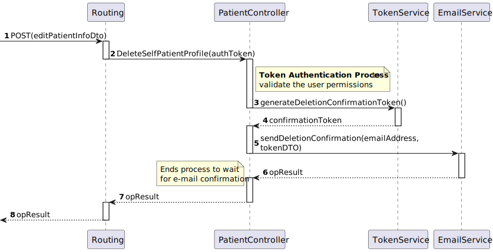

# US 05 - As a Patient, I want to delete my account and all associated data, so that I can exercise my right to be forgotten as per GDPR

## 1. Context

This is the first time this US is tasked to us. It continues the process of patient profile creation, this time for the deletion portion.

- It will be a functionality open to the public, since anyone can register as a patient.
- This functionality will be only accesible in the next sprint. This task only requires the creation of the functionality in the back-end.

## 2. Requirements

"**US 05 -** As a Patient, I want to delete my account and all associated data, so that I can exercise my right to be forgotten as per GDPR."

**Client Specifications - Q&A:**
> [**"Identifiable Data and Profile deletion time frame"** *by VARELA 1220683 - Tuesday, 1st October 2024 às 22:34*]
As I understand it, a patient's profile has plenty of information about the user, such as name, contact information (phone and email), preferences, appointment history, medical records, etc.
What data do you consider to be identifiable? Are medical and appointment records deemed identifiable from your perspective? What data from the user's profile can be retained in the system after the legal time frame related to the GDPR has passed?
Also, how much time do you want to be set as the time frame for deletion and retention of data in the system? Is the user informed on how many days are left for the deletion of its data? Like by email or somewhere in the UI of their account?
>
>>**Answer -** It is part of the team's work for the GDPR module to define the policy.

> [**"Predefined time frame for deletion of data"** *by SANTOS 1220738 - Saturday, 5th October 2024 às 21:35*]
Boa noite,
Gostávamos de perguntar se na funcionalidade que pretende que envolve remover o perfil de pacientes que já não se encontram a receber ajuda ou tratamento da entidade hospitalar (5.1.10) se quando é mencionado "(...)all patient data is permanently removed from the system within a predefined time frame." se o tempo predefinido é do sistema em si ou se é definido pelo admin que apaga os dados.
Caso seja definido já no sistema, qual seria o tempo prefinido?
Cumprimentos,
G38.
>> **Answer -** Faz parte das vossas responsabilidades no âmbito do módulo de proteçãod e dados e de acordo com a politica que venham a definir.

**Acceptance Criteria:**

- **US 05.1** Patients can request to delete their account through the profile settings.

- **US 05.2** The system sends a confirmation email to the patient before proceeding with account deletion.

- **US 05.3** Upon confirmation, all personal data is permanently deleted from the system within the legally required time frame (e.g., 30 days).

- **US 05.4** Patients are notified once the deletion is complete, and the system logs the action for GDPR compliance.

- **US 05.5** Some anonymized data may be retained for legal or research purposes, but all identifiable information is erased.

**Dependencies/References:**

- "**[US03]** *As a Patient, I want to register for the healthcare application, so that I can create a user profile and book appointments online.*"
  - The patient needs to be able to create a user, in order to delete it.
- "**[US10]** *As an Admin, I want to delete a patient profile, so that I can remove patients who are no longer under care*"
  - Same functionality, different actor. Process varies due to user permissions.

## 3. Analysis

Although this functionality is similar to the **US10** implementation, the process is almost all diferent.

In this functionality, the patient can request to delete their profile. In doing so, it **triggers an e-mail to be sent to confirm the procedure**.

Upon confirmation, the program will delete the **patient profile and user** associated with it. Both won't be available in the database anymore, but their previous presence will be recorded in the programm logs.

### System Sequence Diagram


### Relevant DM Excerpts


## 4. Design

### 4.1. Realization

#### Patient Deletion Sequence Diagram



#### Patient Deletion Confirmation Sequence Diagram


### 4.2. Applied Patterns

- Aggregate
- Entity
- Value Object
- Service
- MVC
- Layered Architecture
- DTO
- Clean Architecture
- C4+1

### 4.3 Design Commits

> **08/10/2024 10:50 [US05]** Documentation started:
>
>-> Context and Requirements done. It might be updated in the future, thanks to the "Client Specifications" section.

> **23/10/2024 09:55 [US05]** Design Updated:
>
>-> Analysis Done - SSD & DM Excerpt
>-> Design Done - SD.

## 5. Implementation

### 5.1. Code Implementation

**PatientController:**

```cs
public class PatientController : ControllerBase
    {
      [HttpDelete("DeleteSelfPatient")]
        public async Task<ActionResult<string>> DeleteSelfPatientProfile([FromHeader] string token)
        {
            var tokenDto = await _tokenSvc.GetByIdAsync(new TokenId(token));

            if(tokenDto.TokenValue != TokenType.PATIENT_AUTH_TOKEN.ToString()){
                return BadRequest("ACCESS TO RESOURCE DENIED.");
            }

            TokenDto confirmationToken = await this._tokenSvc.GenerateDeletionConfirmationToken(tokenDto.UserId);
            EmailService.sendDeletionConfirmation(tokenDto.UserId, confirmationToken);

            return BadRequest("Patient Deletion requires Email Confirmation. Check your inbox to confirm the process.");
        }
    }
```

**TokenService:**

```cs
public class TokenService
    {
      public virtual async Task<TokenDto> GenerateDeletionConfirmationToken(string userId){
            TokenFactory factory = new TokenFactory();

            var user = await this._userRepo.GetByIdAsync(new Username(userId));
            if (user == null)
                throw new ArgumentException("User not found for the given userId.");
            Token token = factory.createDeletionConfirmationToken(DateTime.Now.AddDays(1), user);

            token = await this._tokenRepo.AddAsync(token);

            if(token.TheUser == null){
                throw new ArgumentException("User of Token in DB is null lawl");
            }

            await this._unitOfWork.CommitAsync();

            return token.ToDto();
        }
    }
```

**EmailService:**

```cs
static class EmailService
    {
      public static async void sendDeletionConfirmation(string emailAddress, TokenDto token)
        {
            // Refresh access token
            string oAuthToken = await RefreshAccessTokenAsync(refreshToken, clientId, clientSecret);

            // Send email using the refreshed access token

            var message = new MimeMessage();
            message.From.Add(new MailboxAddress("Hospital SEM5PI", "hospitalsem5pi@nope.com"));
            message.To.Add(new MailboxAddress(emailAddress, emailAddress));
            message.Subject = "NO-REPLY: Please Confirm Patient File's Deletion";
            message.Body = new TextPart("plain") { Text = token.TokenId + "\n\nSomeone is trying to delete your patient file information.\nIf you wish to proceed, confirm with the Token above." };

            using (var client = new SmtpClient())
            {
                client.Connect("smtp.nope.com", 587, SecureSocketOptions.StartTls);

                // Authenticate using OAuth2
                var oauth2 = new SaslMechanismOAuth2("hospitalsem5pi@nope.com", oAuthToken);
                client.Authenticate(oauth2);

                client.Send(message);
                client.Disconnect(true);
            }            

        }
    }
```

## 5.2. Tests

**Assigned Tester:** Alfredo Ferreira - 1220962

### Unit Tests

### PatientControllerTest

This section provides an overview of the integration tests for the `PatientControllerTest` class. These tests ensure that the `EditPatientProfilePatient` and `ConfirmPatientDeletion` endpoints correctly handle various scenarios in the Domain-Driven Design (DDD) architecture.

**Test File:** [PatientControllerTest.cs](../../../test/ControllerTest/PatientControllerTest.cs)

#### Test Cases

1. **DeleteSelfPatientProfile_Failure_BadAuthentication**  
   This test verifies that the `DeleteSelfPatientProfile` method correctly handles the case when a bad authentication token is provided. The endpoint should return a `BadRequestObjectResult` with the message "ACCESS TO RESOURCE DENIED."

2. **DeleteSelfPatientProfile_Success_GoodValues**  
   This test checks that the `DeleteSelfPatientProfile` method functions correctly when a valid deletion token is provided. The endpoint should return an `OkObjectResult` with the message "Patient Deletion requires Email Confirmation. Check your inbox to confirm the process."

3. **ConfirmPatientDeletion_Failure_BadAuthentication**  
   This test verifies that the `ConfirmPatientDeletion` method correctly handles the case when a bad authentication token is provided. The endpoint should return a `BadRequestObjectResult` with the message "ACCESS TO RESOURCE DENIED."

4. **ConfirmPatientDeletion_Success_GoodValues**  
   This test checks that the `ConfirmPatientDeletion` method functions correctly when a valid deletion token is provided. The endpoint should return an `OkObjectResult` with the message "Confirmation Accepted. Patient Deletion is scheduled to happen within the GDPR Parameters."


### LogServiceTest

This section provides an overview of the integration tests for the `LogServiceTest` class. These tests ensure that the logging functionality in the `LogService` handles various scenarios correctly.

**Test File:** [LogServiceTest.cs](../../../test/ServiceTest/LogServiceTest.cs)

#### Test Cases

1. **LogPatientDeletion_Success_WithValidPatientDTO**  
   Validates the successful logging of a patient deletion attempt when provided with valid parameters. Mocks dependencies, including log and unit of work repositories, to ensure that the log entry is created and stored correctly.

2. **LogPatientDeletion_Failure_WithInvalidMedicalRecordNumber**  
   Tests the scenario where an invalid Medical Record Number (MRN) is provided during the patient deletion attempt. Ensures that an `ArgumentException` is thrown, verifying the method's ability to handle invalid input gracefully.


### TokenServiceTest

This section provides an overview of the integration tests for the `TokenServiceTest` class. These tests ensure that the token generation functionality in the `TokenService` handles various scenarios correctly.

**Test File:** [TokenServiceTest.cs](../../../test/ServiceTest/TokenServiceTest.cs)

#### Test Cases

1. **GenerateDeletionConfirmationToken_Success_WithGoodValues**  
   Validates the successful generation of a deletion confirmation token when provided with valid user values. Mocks dependencies, including user and token repositories, to ensure that the token is created and stored correctly.

2. **GenerateDeletionConfirmationToken_Failure_WithBadValues**  
   Tests the scenario where a null user is returned during the token generation attempt, verifying that an `ArgumentException` is thrown. This ensures that the method correctly handles invalid user scenarios.


### Integration Tests

Assigned Tester: Alfredo Ferreira - 1220962

### US05IntegrationTest

This section provides an overview of the integration tests for the `US05IntegrationTest` class. These tests ensure that the `ConfirmPatientDeletion` endpoint correctly handles various scenarios in the Domain-Driven Design (DDD) architecture.

**Test File:** [US05IntegrationTest.cs](../../../test/IntegrationTest/US05IntegrationTest.cs)

#### Test Cases

1. **US05_Success_WithGoodValues**  
   Validates the successful confirmation of patient deletion when provided with valid parameters. Mocks dependencies, including patient, token, and log repositories, to verify that the confirmation process completes successfully and logs the action.

2. **US05_Failure_WithBadAuth**  
   Tests the scenario where a token with bad authentication is provided. Ensures that the endpoint returns a `BadRequestObjectResult` with the message "ACCESS TO RESOURCE DENIED."

3. **US05_Exception_WithBadMrn**  
   Verifies that the method correctly handles the case when a patient with an invalid Medical Record Number (MRN) is attempted to be deleted. It checks that an `ArgumentNullException` is thrown, ensuring proper error handling.

**Each test case mocks necessary services and repositories to ensure reliable isolation of the `PatientController` functionality, enabling consistent verification of each unique scenario.**

### System/E2E Testing

> Performed through POSTMAN, the modules through which system testing was done can be accessed in the following file:
>>[System Testing](test\SystemTest\SEM5PI-Testing.postman_collection.json)

### 5.3. Main Commits

> **23/10/2024 17:53 [US05]** Implementation Completion:
>
>-> Functionality fully implemented and tested.

## 6. Integration/Demonstration


## 7. Observations

Since the program doesn't include the UI, the e-mail segment is still provisory. For now, the user gets the **token** and manually fills it in another controller. When the UI is implemented, this will be a link to a specific page.