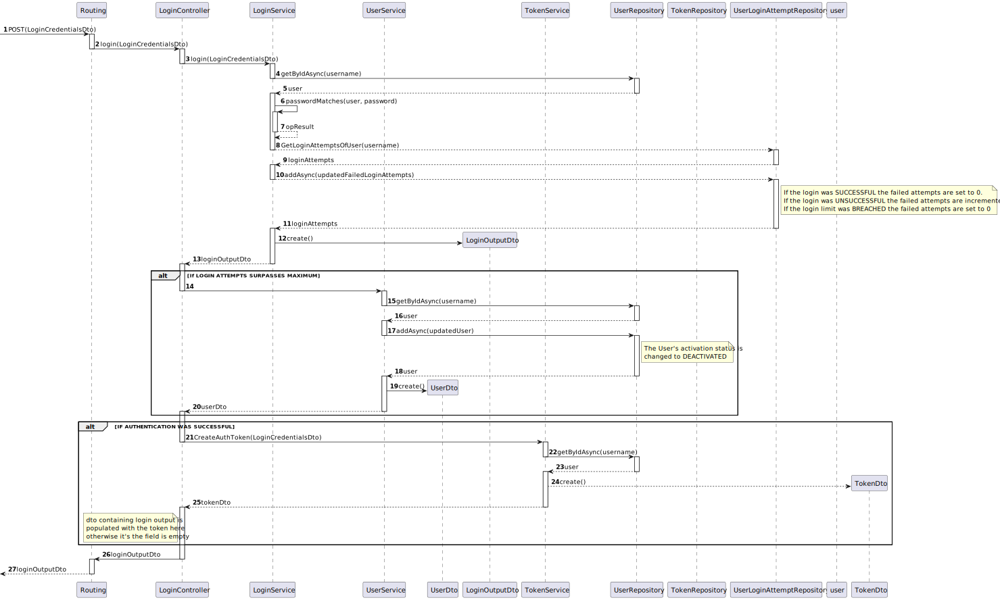

# US 06 - As a (non-authenticated) Backoffice User, I want to log in to the system using my credentials, so that I can access the backoffice features according to my assigned role.


## 1. Context

The client has tasked the team with implementing a login feature with authentication capabilities.

## 2. Requirements

**Client Clarifications:**

>[**"QUESTION"** *by UNIDENTIFIED STUDENT - 12/10/2024]
>>***Q4**: What happens when a user fails to log in more than five times, and what is the process for unlocking their account?*
>>> ***A4**: After five failed login attempts, the system will temporarily lock the account. The process for unlocking the account is typically handled outside the system by an administrator, who would verify that the failed attempts were not made with malicious intent. However, this unlocking process is not part of the current system.*


**Acceptance Criteria:**

- **G006.1.** Backoffice users log in using their username and password

- **G006.2.** Authentication and Authorization features should make sure users only have access to their appropriate features

- G006.3. After five failed login attempts, the user account is temporarily locked, and a notification is sent to the admin

- G006.4. Login sessions expire after a period of inactivity to ensure security

**Dependencies/References:**

- The user story depends on the database schema and the way users are stored/structured

## 3. Analysis

The login will be done using a token system, the login will take advantage of the tokens to provide SSO functionality.

- In case of a user being able to authenticate themselves a token with a shelf life of 1 hour is created, after that 1 hour the session expires and a log in is required
- The system will keep track of the tokens it has created by persisting them in the database.

### System Sequence Diagram (Level 1 Process View)


> **Note:** Level 2 Process Views stand architecturally irrelevant as sprint 1 of project development encompasses only the development of the backend "Backoffice" module features, frontend interactions stand to be defined in future sprints.


### Relevant DM Excerpts


## 4. Design

### 4.1. Realization

#### Login SD (Level 3 Process View)



### 4.2. Applied Patterns

- Aggregate
- Entity
- Value Object
- Service
- MVC
- Layered Architecture
- DTO
- Clean Architecture
- C4+1

### 4.5 Design Commits:

* 05/10/2024 22:09 [US06] US06 Requirements and Analysis
* 16/10/2024 19:18 [US06] Sequence Diagram
* 16/10/2024 20:49 [US06] Sequence Diagram Update
* 16/10/2024 21:33 [US06] Implementation first iteration
* 20/10/2024 17:59 [US06] Added log tables
* 20/10/2024 18:02 [US06] Added log tables
* 20/10/2024 18:03 [US06] Fixed log tables
* 20/10/2024 18:10 [US06] Fixed patient object
* 25/10/2024 00:52 [US06] General README file restructuring to be in accordance with scrum master request
* 25/10/2024 12:51 [US06] Documentation formatting change to be in accordance to team decision
* 26/10/2024 16:55 [US06] Documentation Implementation evidences

## 5. Implementation

[LoginController](../../../src/Controllers/LoginController.cs)

```cs
        [HttpPost("Login")]
        public async Task<ActionResult<LoginOutputDto>> Login(LoginCredentialsDto loginCredentialsDto)
        {            
            LoginOutputDto dto = await _logSvc.Login(loginCredentialsDto);

            if(dto.Result==LoginResult.DEACTIVATED.ToString()){
                UserDto userDto = await _usrService.DeactivateAsync(new Username(loginCredentialsDto.Username));
                return BadRequest("Deactivated, Loging Attempts Exceeded");
            }

            if(dto.Result==LoginResult.Failure.ToString()){
                return BadRequest("Login Credentials do not match.");
            }

            TokenDto tokenDto = await _tokenService.CreateAuthToken(loginCredentialsDto);

            dto.Token= tokenDto.TokenId;

            return Ok(dto); 

        }
```

[UserService](../../../src/Domain/Users/UserService.cs)

```cs
public async Task<UserDto> DeactivateAsync(Username id)
        {
            var user = await this._repo.GetByIdAsync(id);

            if (user == null)
                return null;

            user.Deactivate();
            await this._unitOfWork.CommitAsync();

            return new UserDto
            {
                EmailAddress = user.Id.AsString(),
                Role = user.Role.ToString(),
                ActivationStatus = user.ActivationStatus.ToString()
            };
        }
```

[LoginService](../../../src/Domain/LoginAttemptTrackers/LoginService.cs)

```cs
public virtual async Task<LoginOutputDto> Login(LoginCredentialsDto credentials)
        {
            LoginOutputDto retDto = new LoginOutputDto();
            User user = await _usrRepo.GetByIdAsync(new Username(credentials.Username));

            // Check if the user exists
            if (user == null)
            {
                throw new Exception("User not found:\n\tUsername: "+credentials.Username+"\n\tPassword: "+credentials.Password);
            }

            if(user.ActivationStatus == ActivationStatus.DEACTIVATED){
                
                retDto.Result = LoginResult.DEACTIVATED.ToString();

                return retDto;
            }

            LoginAttemptTracker loginAttempts = await _loginRepo.GetByIdAsync(user.Id);
            


            if(PasswordMatches(user.Password, credentials.Password)){
                retDto.Result = LoginResult.Success.ToString();

                if(loginAttempts == null){
                    
                    loginAttempts = LoginAttemptTrackerFactory.Create(user.Id, 0);
                    await _loginRepo.AddAsync(loginAttempts);
                }else{
                    loginAttempts.AttemptCounterReset();
                     _loginRepo.Update(loginAttempts);
                }

            }else{
                retDto.Result = LoginResult.Failure.ToString();
                
                if(loginAttempts == null){
                    
                    loginAttempts = LoginAttemptTrackerFactory.Create(user.Id,1);
                    await _loginRepo.AddAsync(loginAttempts);
                }else{
                    loginAttempts.IncrementAttemptCounter();
                     _loginRepo.Update(loginAttempts);
                }

                if(loginAttempts.LoginAttempts() > MAXIMUM_LOGINS){
                    loginAttempts.AttemptCounterReset();
                    retDto.Result = LoginResult.AccountLocked.ToString();
                     _loginRepo.Update(loginAttempts);
                }
                
            }

            await _unitOfWork.CommitAsync();
            
            return retDto;

        }


        private bool PasswordMatches(Password actualPassword, string verifyPassword){
            return (new Password(verifyPassword).Equals(actualPassword));
        }

        public virtual LoginCredentialsDto TreatAuthenticateResult(string[] result)
        {
            string username = result[4].Split(':').Last();
            string password = "IAM-" + result[0].Split(':').Last();

            return new LoginCredentialsDto(username, password);
        }
```

[TokenService](../../../src/Domain/Tokens/TokenService.cs)

```cs
public virtual async Task<TokenDto> CreateAuthToken(LoginCredentialsDto userDto)
        {
            TokenFactory factory = new TokenFactory();

            var user = await this._userRepo.GetByIdAsync(new Username(userDto.Username));
            Token token = factory.CreateLoginAuthToken(DateTime.Now.AddMinutes(10), user, user.Role);

            token = await this._tokenRepo.AddAsync(token);

            if(token.TheUser == null){
                throw new ArgumentException("User of Token in DB is null lawl");
            }

            await this._unitOfWork.CommitAsync();

            return token.ToDto();
        }
```


### 5.2. Tests

**Assigned Tester:** Ricardo Dias - 1220976

## Login Service Unit Tests

This section describes the unit tests implemented for the `LoginService`.

Test File: [LoginServiceTest.cs](../../../test/ServiceTest/LoginServiceTest.cs)

1. **Login_Success_ReturnsSuccessResult**:  
   Ensures a successful login returns a `Success` result. Mocks a valid, active user with correct credentials and no prior login attempts. Verifies the result is "Success", the login attempts are recorded, and the `UnitOfWork` commits.

2. **Login_Failure_ReturnsFailureResultAndIncrementsAttemptCounter**:  
   Tests that a failed login due to incorrect credentials returns `Failure`, and the login attempt counter is incremented. Mocks a user with a wrong password and checks the `LoginAttemptTracker` and `UnitOfWork`.

3. **Login_AccountLocked_AfterMaximumFailedAttempts**:  
   Verifies that after the maximum number of failed login attempts (5), the user's account is locked (`DEACTIVATED`). No further login attempts are recorded, and no changes are committed.

4. **Login_DeactivatedUser_ReturnsDeactivatedResult**:  
   Ensures that attempting to log in with a deactivated user returns `DEACTIVATED`, and no login attempt tracking or database commits occur.

5. **Login_UserNotFound_ThrowsException**:  
   Ensures that an exception is thrown when a nonexistent user attempts to log in. Mocks a `null` return from the `UserRepository` and verifies the appropriate exception is raised.

## Login Controller Unit Tests

This section provides an overview of the unit tests for the `LoginController`.

**Test File:** [LoginControllerTests.cs](../../../test/ControllerTest/LoginControllerTest.cs)

## Test Cases

1. **Login_ReturnsOk_WithValidCredentials**  
   Validates that a successful login with correct credentials returns an `OkObjectResult`. It mocks the login and token services to ensure valid output is returned.

2. **LoginIAM_ReturnsOk_WithValidAuthentication**  
   Confirms that valid authentication via the Identity Provider results in an `OkObjectResult` containing the correct token. It mocks the `IAuthenticationService` to simulate a successful authentication scenario.

3. **LoginIAM_ReturnsNotOk_WithInvalidAuthentication**  
   Tests the behavior when invalid authentication is provided, the user not existing causes an exception which is caught by the service. Verifies that a `BadRequestObjectResult` is returned, ensuring appropriate error handling.

## Integration Tests

This section describes the integration tests implemented for the `US06IntegrationTest` flow.

**Test File:** [US06IntegrationTest.cs](../../../test/IntegrationTest/US06IntegrationTest.cs)

### System/E2E Testing

> Performed through POSTMAN, the modules through which system testing was done can be accessed in the following file:
>>[System Testing](test\SystemTest\SEM5PI-Testing.postman_collection.json)

## Test Cases

1. **Login_WithMAXATTEMPTS_BLOCKS**  
   Ensures that when the user reaches the maximum number of login attempts (5), the account is locked and further login attempts are blocked. Mocks a user with 5 failed login attempts and verifies that the login result is `AccountLocked`. Also confirms that the `UnitOfWork` is committed.

2. **Login_WithInvalidCredentials_ReturnsFailure**  
   Validates that if invalid login credentials are provided, the login attempt fails. It mocks a user with incorrect credentials and checks that the result is `Failure`. Also ensures that the `UnitOfWork` commits successfully after the failed login attempt.

3. **Login_AccountLogsIn**  
   Tests the case where the user logs in with valid credentials and normal login conditions (e.g., 2 previous login attempts). Mocks a valid user and confirms the result is `Success`. Verifies that the `UnitOfWork` is committed after a successful login attempt.

Each test case mocks necessary services and repositories to ensure reliable isolation of the `Login` functionality, enabling consistent verification of each unique scenario.

## 6. Integration/Demonstration


## 7. Observations

* Nothing to add
