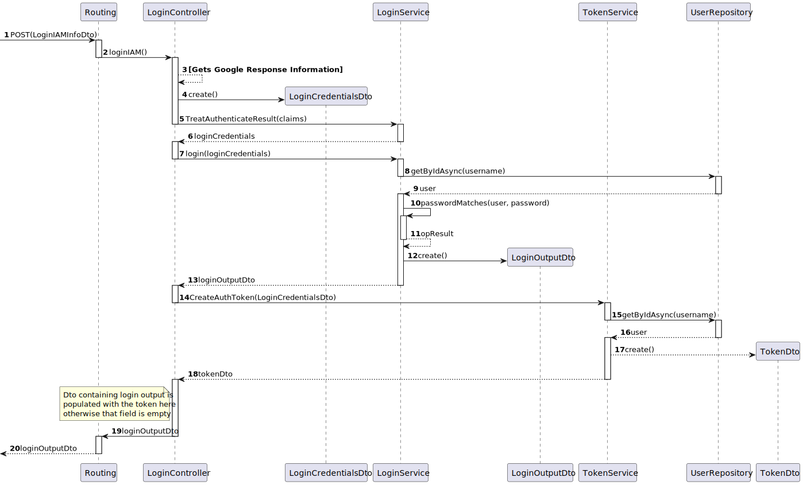

# US 07 - As a Patient, I want to log in to the healthcare system using my external IAM credentials, so that I can access my appointments, medical records, and other features securely

## 1. Context

This is the first time this US is tasked to us. It requires to create a login option for the patient users, for them to access all the functionalities they have available.

- It will be a functionality open to the public, since anyone can register as a patient.
- This functionality will be only accesible through the UI in the next sprint. This task only requires the creation of the functionality in the back-end.

## 2. Requirements

"**US 07 -** As a Patient, I want to log in to the healthcare system using my external IAM credentials, so that I can access my appointments, medical records, and other features securely."

**Client Specifications - Q&A:**
> [**"Account Inactivity"** *by VARELA 1220683 - Friday, 27th September 2024 at 17:50*]
How much time does it takes of inactivity to automatically log off of an account? What do you define as inactivity? Like no input from the mouse?
>>**Answer -** Well, that's typically what you're going to do in any given situation. For this first sprint, it's not really important, because you're not going to be doing that up front yet.
In the second sprint, you'll be doing the front end. So session inactivity is typically no interaction of any kind. In this case, with the API.
So you need to make sure that you prepare your API in a way that... And now I'm going to get a little bit more technical, okay? But ideally, your API should not even have a session. It should be completely stateless. So, it should not have a session.
There should be an authentication validation for each visit request. But if you use some kind of session in the API, you need to see when was the last request for that session. And if it was longer than a certain level, usually a web session is around 20 minutes, no more than that.
So you should completely disconnect the user. When you build the application up front in the second sprint, of course, it will be easier to see and understand this. So if I'm not using the application at all, if I'm not doing any kind of action in the application, yes, after 20 minutes, the session should disconnect and I should force it to log in with my credentials.

> [**"Us 5.1.7"** *by CASTRO 1220636 - Monday, 14th of October of 2024 at 22:31*]
Boa noite professor.
Sei que já esclareceu que devemos utilizar apenas um IAM. Se escolhermos um IAM interno não teremos forma de responder ao requisito da Us 5.1.7 (As a Patient, I want to log in to the healthcare system using my external IAM) certo? Neste caso, ignoramos esta Us?
Cumprimentos,
Rodrigo Castro 1220636
>> **Answer -** Boa tardr
Nesse caso devem entender esse requisito como
As a Patient, I want to log in to the healthcare system using my internal IAM

**Acceptance Criteria:**

- **US07.1** Patients log in via an external Identity and Access Management (IAM) provider (e.g., Google, Facebook, or hospital SSO).

- **US07.2** After successful authentication via the IAM, patients are redirected to the healthcare system with a valid session.

- **US07.3** Patients have access to their appointment history, medical records, and other features relevant to their profile.

- **US07.4** Sessions expire after a defined period of inactivity, requiring reauthentication.

**Dependencies/References:**

- "**[US03]** *As a Patient, I want to register for the healthcare application, so that I can create a user profile and book appointments online.*"
   - Both USs will use the IAM External Service, and since the service will be implemented in that US, this US can only start after that implementation.
- "**[US06]** *As a (non-authenticated) Backoffice User, I want to log in to the system using my credentials, so that I can access the backoffice features according to my assigned role.*"
   - Both of this USs target the login process, thus sharing the same operation process/logic (sequence diagram).

## 3. Analysis

As previously mentioned in the "**Dependencies/References**" section, this US tasks the same functionality implemented in the **US06** - Login of a specific User - but this time, through the IAM External Service.

The team decided to implement the **Google Authentication** for the *IAM System*. This system will be implemented in this **US03**, since it was the first one to require it.

This functionality will essencialy take the login process created in the **US06** and allow it to work with the External IAM System implemented in the **US03**. *(this US's process will be really similar to the US06 process)*

### System Sequence Diagram


### Relevant DM Excerpts


## 4. Design

### 4.1. Realization



### 4.3. Applied Patterns

- Aggregate
- Entity
- Value Object
- Service
- MVC
- Layered Architecture
- DTO
- Clean Architecture
- C4+1

### 4.3. Design Commits

> **08/10/2024 10:51 [US07]** Documentation started:
>
>-> Context and Requirements done. It might be updated in the future, thanks to the "Client Specifications" section.

> **20/10/2024 12:06 [US07]** Documentation Update:
>
>-> Client Q&A Update and Dependencies correction.

> **21/10/2024 14:22 [US07]** Documentation Update:
>
>-> Analysis Completed - DM Excerpt and SSD.
>-> Design Completed - SD.

## 5. Implementation

### 5.1. Code Implementation

**ExampleController:**

```cs
public class LoginController : ControllerBase
    {
      [HttpGet("LoginIAM")]
        public async Task Login() 
        {
            await HttpContext.ChallengeAsync(GoogleDefaults.AuthenticationScheme, 
                new AuthenticationProperties {
                    RedirectUri = Url.Action("GoogleResponse")
                });
        }

        [HttpGet("LoginIAMResponse")]
        public async Task<ActionResult<LoginOutputDto>> LoginIAM()
        {            
            var result = await HttpContext.AuthenticateAsync(CookieAuthenticationDefaults.AuthenticationScheme);

            if (result?.Principal == null) {return Unauthorized();}
            
            var claimStrings = result.Principal.Identities.FirstOrDefault().Claims
            .Select(claim => $"Type:{claim.Type.Split('/').Last()}, Value:{claim.Value}")
            .ToArray();

            LoginCredentialsDto loginCredentialsDto = _logSvc.TreatAuthenticateResult(claimStrings);

            LoginOutputDto dto = new LoginOutputDto();
            try{
            dto = await _logSvc.Login(loginCredentialsDto);
            }catch(ArgumentException e){
                return BadRequest("User Does Not Exist");
            }
            TokenDto tokenDto = await _tokenService.CreateAuthToken(loginCredentialsDto);

            dto.Token= tokenDto.TokenId;

            return Ok(dto); 

        }
    }
```

**LoginService:**
```cs
public class LoginService
    {
      public virtual async Task<LoginOutputDto> Login(LoginCredentialsDto credentials)
        {
            LoginOutputDto retDto = new LoginOutputDto();
            User user = await _usrRepo.GetByIdAsync(new Username(credentials.Username));

            // Check if the user exists
            if (user == null)
            {
                throw new Exception("User not found:\n\tUsername: "+credentials.Username+"\n\tPassword: "+credentials.Password);
            }

            if(user.ActivationStatus == ActivationStatus.DEACTIVATED){
                
                retDto.Result = LoginResult.DEACTIVATED.ToString();

                return retDto;
            }

            LoginAttemptTracker loginAttempts = await _loginRepo.GetByIdAsync(user.Id);
            


            if(PasswordMatches(user.Password, credentials.Password)){
                retDto.Result = LoginResult.Success.ToString();

                if(loginAttempts == null){
                    
                    loginAttempts = LoginAttemptTrackerFactory.Create(user.Id, 0);
                    await _loginRepo.AddAsync(loginAttempts);
                }else{
                    loginAttempts.AttemptCounterReset();
                     _loginRepo.Update(loginAttempts);
                }

            }else{
                retDto.Result = LoginResult.Failure.ToString();
                
                if(loginAttempts == null){
                    
                    loginAttempts = LoginAttemptTrackerFactory.Create(user.Id,1);
                    await _loginRepo.AddAsync(loginAttempts);
                }else{
                    loginAttempts.IncrementAttemptCounter();
                     _loginRepo.Update(loginAttempts);
                }

                if(loginAttempts.LoginAttempts() > MAXIMUM_LOGINS){
                    loginAttempts.AttemptCounterReset();
                    retDto.Result = LoginResult.AccountLocked.ToString();
                     _loginRepo.Update(loginAttempts);
                }
                
            }

            await _unitOfWork.CommitAsync();
            
            return retDto;

        }

        public virtual LoginCredentialsDto TreatAuthenticateResult(string[] result)
        {
            string username = result[4].Split(':').Last();
            string password = "IAM-" + result[0].Split(':').Last();

            return new LoginCredentialsDto(username, password);
        }
    }
```

### Main Commits:

> **24/10/2024 15:41 [US07]** Implementation First Sketch:
> -> IAM Login Method Added to LoginController: LoginIAM, LoginIAMResponse.
>-> New method and small update in the LoginService:
>TreatAuthenticateResult, user==null Exception.

### 5.2. Tests

**Assigned Tester:** Alfredo Ferreira - 1220962

## Login Service Unit Tests

This section describes the unit tests implemented for the `LoginService`.

Test File: [LoginServiceTest.cs](../../../test/ServiceTest/LoginServiceTest.cs)

1. **Login_Success_ReturnsSuccessResult**:  
   Ensures a successful login returns a `Success` result. Mocks a valid, active user with correct credentials and no prior login attempts. Verifies the result is "Success", the login attempts are recorded, and the `UnitOfWork` commits.

2. **Login_Failure_ReturnsFailureResultAndIncrementsAttemptCounter**:  
   Tests that a failed login due to incorrect credentials returns `Failure`, and the login attempt counter is incremented. Mocks a user with a wrong password and checks the `LoginAttemptTracker` and `UnitOfWork`.

3. **Login_AccountLocked_AfterMaximumFailedAttempts**:  
   Verifies that after the maximum number of failed login attempts (5), the user's account is locked (`DEACTIVATED`). No further login attempts are recorded, and no changes are committed.

4. **Login_DeactivatedUser_ReturnsDeactivatedResult**:  
   Ensures that attempting to log in with a deactivated user returns `DEACTIVATED`, and no login attempt tracking or database commits occur.

5. **Login_UserNotFound_ThrowsException**:  
   Ensures that an exception is thrown when a nonexistent user attempts to log in. Mocks a `null` return from the `UserRepository` and verifies the appropriate exception is raised.


## Login Controller Unit Tests

This section provides an overview of the unit tests for the `LoginController`.

**Test File:** [LoginControllerTests.cs](../../../test/ControllerTest/LoginControllerTest.cs)

## Test Cases

1. **Login_ReturnsOk_WithValidCredentials**  
   Validates that a successful login with correct credentials returns an `OkObjectResult`. It mocks the login and token services to ensure valid output is returned.

2. **LoginIAM_ReturnsOk_WithValidAuthentication**  
   Confirms that valid authentication via the Identity Provider results in an `OkObjectResult` containing the correct token. It mocks the `IAuthenticationService` to simulate a successful authentication scenario.

3. **LoginIAM_ReturnsNotOk_WithInvalidAuthentication**  
   Tests the behavior when invalid authentication is provided, the user not existing causes an exception which is caught by the service. Verifies that a `BadRequestObjectResult` is returned, ensuring appropriate error handling.

## Integration Tests

This section describes the integration tests implemented for the `US07IntegrationTest` flow.

**Test File:** [US07IntegrationTest.cs](../../../test/IntegrationTest/US07IntegrationTest.cs)

## Test Cases

1. **LoginIAM_Sucess_AccountLogsIn**  
   Tests the case where the user logs in with valid credentials and normal login conditions (e.g., 2 previous login attempts). Mocks a valid user and confirms the result is `Success`. Verifies that the `UnitOfWork` is committed after a successful login attempt.

2. **LoginIAM_Failure_WithInvalidPassword**  
   Validates that if an invalid password is provided, the login attempt fails. It mocks a user with incorrect credentials and checks that the result is `Failure`. Also ensures that the `UnitOfWork` commits successfully after the failed login attempt.

3. **LoginIAM_Failure_WithInvalidEmail**
   Validates that if an invalid email is provided, the login attempt fails. It mocks a user with incorrect credentials and ensures that the endpoint catches the exception thrown by the method, checking if its the expected one.

### System/E2E Testing

> Performed through POSTMAN, the modules through which system testing was done can be accessed in the following file:
>>[System Testing](test\SystemTest\SEM5PI-Testing.postman_collection.json)   

## 6. Integration/Demonstration


## 7. Observations

The IAM Process requires URI redirections. Since the UI isn't being implemented in this sprint, the login process is through the **LoginIAM** method in the **LoginController**, for all the IAM functionalities.