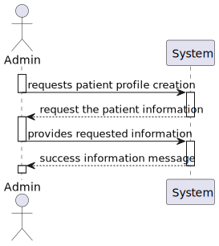
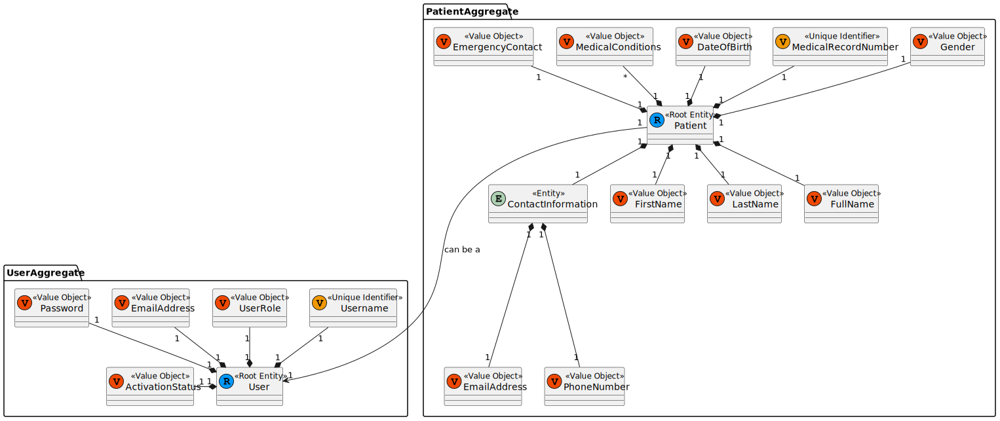
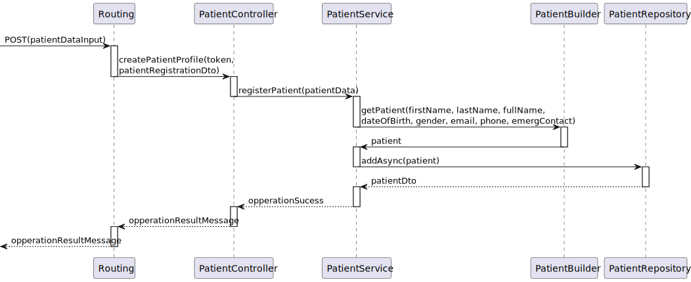
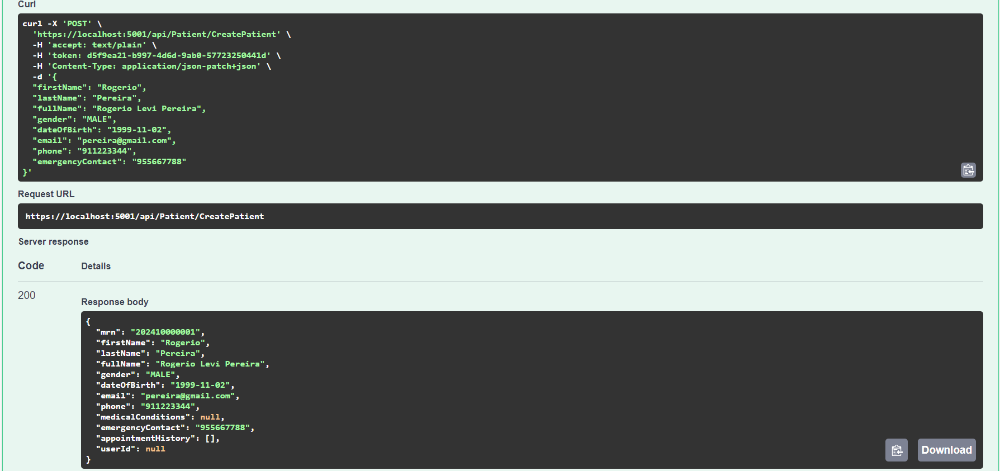

# US 08 - As an Admin, I want to create a new patient profile, so that I can register their personal details and medical history

## 1. Context

This is the first time this US is tasked to us. It starts the process of patient profile creation.

- It will be a functionality will only be for the admins and not open to the public, since the admin are specific actors.
- This functionality will be only accesible through the UI in the next sprint. This task only requires the creation of the functionality in the back-end.

## 2. Requirements

"**US 08 -** As an Admin, I want to create a new patient profile, so that I can register their personal details and medical history."

**Client Specifications - Document:**
>Patient Attributes:
>
>- `First Name`
>- `Last Name`
>- `Full Name`
>- `Date of Birth`
>- `Gender`
>- `Medical Record Number` (unique identifier)
>- `Contact Information` (email, phone)
>- `Allergies/Medical Conditions` (optional)
>- `Emergency Contact`
>- `Appointment History` (list of previous and upcoming appointments)
>
>Rules:
>
>- A patient must be unique in terms of `Medical Record Number`, `Email` and `Phone`.
>- Sensitive data (like medical history) must comply with GDPR, allowing patients to control their data access.

**Client Specifications - Q&A:**
> [**"US-5.1.8"** *by BARBOSA 1220841 - Sunday, 6th October  2024 at 15:25*]
It is specified that the admin can input some of the patient's information (name, date of birth, contact information, and medical history).
Do they also input the omitted information (gender, emergency contact and allergies/medical condition)?
Additionally, does the medical history that the admin inputs refer to the patient's medical record, or is it referring to the appointment history?
>> **Answer -** The admin can not input medical history nor allergies. They can however input gender and emergency contact.

> [**"5.1.8 As an Admin, I want to create a new patient profile"** *by BRITO 1222135 - Tuesday, 8th of October of 2024 at 23:38*]
Dear client,
When an Admin creates a patient profile, should he already register them in the system, as users that can login, or should the registration always be responsibility of the patient?
If the latter is intended, should the patient's user credentials be linked to the existing profile?
Best regards, Tiago Brito
>> **Answer -** This was already clarified in a previous meeting. Registering a patient record is a separate action from the patient self-registering as a user.
>>> **Follow-Up Question -** That's right, it was clarified in a previous meeting, but I'm still not 100% clarified about my question.
I understand that the Admin can create the Pacient profile and leave the User as inactive, but how does the activation happen? If that pacient eventualy wants to register himself, should there be an option to activate an existing profile? For example, associate the e-mail from registration input with the existing profile's e-mail?
The feature 5.1.3 asks for the full registration, but doesn't say anything about profiles that already exist.
>>>> **Answer -** The admin register the patient (this does not create a user for that patient) optionally, the patient self-registers in the system by providing the same email that is currently recorded in their patient record and the system associates the user and the patient.
There is no option for someone who is not a patient of the system to register as a user.
Hope this is the clarification you were missing. if not, let me know.

> [**"US 5.1.8 - Format of data"** *by CARDOSO 1221083 - Thursday, 10th of October of 2024 at 16:43*]
Hello,
I hope you are well.
So, when the administrator starts creating the patient profile, what format(s) of the date of birth will they need to enter? Furthermore, what will be the format of the Medical Record Number generated after recording the data?
Compliments,
Rodrigo Cardoso, 1221083
>> **Answer -** From a usability perspective, dates should be presented to the user using the operating system's locale definitions. since for this sprint you are building an API, you should use a standard format like ISO 8601.
medical record numbers are generated by the system following the format YYYYMMnnnnnn where YYYY and MM are the year and month of the registration and nnnnnn is a sequential number

**Acceptance Criteria:**

- **US 08.1** Admins can input patient details such as first name, last name, date of birth, contact information, and medical history.

- **US 08.2** A unique patient ID (Medical Record Number) is generated upon profile creation.

- **US 08.3** The system validates that the patient’s email and phone number are unique.

- **US 08.4** The profile is stored securely in the system, and access is governed by role-based permissions.

**Dependencies/References:**

- None to be documented.

## 3. Analysis

This task tackles a new object, **Patient Profile**. The object creation and repository implementation are going to be made in this US.

The functionality only requires the completion of some of the Patient attributes. The attributes that the Admin can enter are:

- `First Name`
- `Last Name`
- `Date of Birth`
- `Gender`
- `Contact Information` *(email, phone)*
- `Emergency Contact`

The other attributes that cannot be filled are:

- `Appointment History` *(list of previous and upcoming appointments)* and `Allergies/Medical Conditions` *(optional)* - Only the Patient can fill it.
- `Medical Record Number` *(unique identifier)* - Is automatically assigned.

### System Sequence Diagram



### Relevant DM Excerpts



## 4. Design

### 4.1. Realization



### 4.2. Applied Patterns

- Aggregate
- Entity
- Value Object
- Service
- MVC
- Layered Architecture
- DTO
- Clean Architecture
- C4+1

### 4.5 Design Commits

> **08/10/2024 10:52 [US08]** Documentation started:
>
>-> Context and Requirements done. It might be updated in the future, thanks to the "Client Specifications" section.

> **16/10/2024 16:50 [US08]** Documentation Continued:
>
>-> Context and Requirements Updated;
>-> Analysis Completed - SSD & DM;
>-> Design Completed - SD.

> **20/10/2024 12:08 [US08]** Documentation Update:
>
>-> Client Q&A Update.

## 5. Implementation

### 5.1. Code Implementation

**PatientController:**

```cs
public class PatientController : ControllerBase
    {
        [HttpPost("CreatePatient")]
        public async Task<ActionResult<PatientDto>> CreatePatientProfile([FromHeader] string token, PatientRegistrationDto dto)
        {
            var tokenDto = await _tokenSvc.GetByIdAsync(new TokenId(token));

            if(tokenDto.TokenValue != TokenType.ADMIN_AUTH_TOKEN.ToString()){
                return BadRequest("ACCESS TO RESOURCE DENIED.");
            }
            
            var patientDto = await _patSvc.registerPatient(dto);

            return Ok(patientDto); 
        }
    }
```

```cs
public class PatientService
    {
        public async Task<PatientDto> registerPatient(PatientRegistrationDto dto)
        {
            PatientBuilder builder = new PatientBuilder();

            Patient patient =
            builder.WithFirstName(dto.firstName)
                .WithLastName(dto.lastName)
                .WithFullName(dto.fullName)
                .WithGender(dto.gender)
                .WithDateOfBirth(dto.dateOfBirth)
                .WithContactInformation(dto.phone, dto.email)
                .WithEmergencyContactNumber(dto.emergencyContact)
                .WithMedicalRecordNumber()
                .Build();

            if(patient == null){
                PatientDto errorPatient = new PatientDto();

                errorPatient.email = "Patient is null";
                return errorPatient;
            }

            await this._repo.AddAsync(patient);
            await this._unitOfWork.CommitAsync();

            return patient.toDto();
        }
    }
```

## 5.2. Tests


Assigned Tester: Alfredo Ferreira - 1220962

### Integration Tests

This section provides an overview of the integration tests for `US08IntegrationTest`. These tests ensure that the `PatientController` handles patient profile creation requests properly, validating both successful and failed requests due to invalid tokens or patient information.

**Test File:** [US08IntegrationTest.cs](../../../test/IntegrationTest/US08IntegrationTest.cs)

#### Test Cases

1. **CreatePatient_Success_WithGoodValues**  
   Tests the successful creation of a patient profile when valid patient data and a valid token are provided. Mocks repositories to ensure a new patient is added to the database.
    - **Expected Result**: Returns `OkObjectResult` containing a `PatientDto` with details matching the input data.

2. **CreatePatient_BadRequest_WithBadToken**  
   Validates that the controller denies access when a token with the incorrect type (e.g., `PASSWORD_RESET_TOKEN` instead of `ADMIN_AUTH_TOKEN`) is provided.
    - **Expected Result**: Returns `BadRequestObjectResult` with an error message `"ACCESS TO RESOURCE DENIED."`

3. **CreatePatient_Failure_WithBadValues**  
   Ensures that the controller throws an `ArgumentException` when invalid patient data, such as an incorrect date format for the date of birth, is provided.
    - **Expected Result**: Throws an `ArgumentException`, demonstrating that input validation prevents profile creation with malformed data.

Each test case uses mock dependencies to validate the behavior of the `PatientController` when interacting with the `PatientService`, `TokenService`, and `LogService` components.

### PatientController Unit Tests

This section provides an overview of the unit tests for `PatientControllerTest`. 

**Test File:** [US08IntegrationTest.cs](../../../test/IntegrationTest/US08IntegrationTest.cs)

1. **CreatePatientProfile_Failure_BadAuth**
    Tests failure of authentication upon trying to access with a bad token
    - **Expected Result:** Receives an `BadRequestObjectResult`, demonstrating the blocking of unauthorized users

### PatientService Unit Tests

This project contains unit tests for the `PatientService` class in the DDDNetCore application.

**Test File:** [US08IntegrationTest.cs](../../../test/ServiceTest/PatientServiceTest.cs)

1. **RegisterPatient_Registers_WithValidPatient**  
   Tests the successful registration of a patient profile when valid patient data is provided. Mocks repositories to ensure the patient is added to the database.
    - **Expected Result**: Returns a `PatientDto` with matching details, confirming a successful save in the repository.

2. **CheckPatientExists_Success_WithPatientExists**  
   Ensures that the `checkIfPatientProfileExists` method returns a valid patient when a profile with the given email exists.
    - **Expected Result**: Returns the existing patient’s details, validating the email check functionality.

### System/E2E Testing

> Performed through POSTMAN, the modules through which system testing was done can be accessed in the following file:
>>[System Testing](test\SystemTest\SEM5PI-Testing.postman_collection.json)

### Main Commits

> **20/10/2024 12/11 [US08]** Implementation Started:
>
>-> Patient Classes and Implementation Done:
>--> Patient.cs
>--> PatientBuilder.cs
>--> PatientDto.cs
>--> PatientEntityTypeConfiguration.cs

> **20/10/2024 12:13 [US08]** Implementation Continued:
>
>-> Patient Additional Classes Added:
>--> MedicalRecordNumber.cs
>--> Gender.cs

> **20/10/2024 12:16 [US08]** Implementation Continued:
>
>-> Appointment (Patient Aditional Class) created, and respective aditional classes:
>--> Appointment.cs
>--> AppointmentBuilder.cs
>--> AppointmentDto.cs
>--> AppointmentStatus.cs
>--> AppointmentID.cs
>--> AppointmentStatus.cs
>--> DateAndTime.cs (previously ExpirationDate.cs)

> **20/10/2024 12:18 [US08]** Implementation Continued:
>
>-> Patient and Appointment Repository Configuration:
>--> IAppointmentRepository.cs
>--> IPatientRepository.cs
>--> HospitalDBContext.cs (updated)
>--> AppointmentRepository.cs
>--> PatientRepository.cs

> **20/10/2024 12:21 [US08]** Implementation Continued:
>
>-> Patient and Appointment Service Implemented:
>--> PatientService.cs
>--> AppointmentService.cs
>--> AppointmentEntityTypeConfiguration.cs (shadowCommit)
>-> PatientRegistrationController first draft.

> **20/10/2024 12:22 [US08]** Implementation Continued:
>
>-> Global classes Updated:
>--> Startup.cs
>--> Token.cs

> **26/10/2024 00:37 [US08]** Final Implementation Commit:
>
>-> Final updates, tests and corrections.

## 6. Integration/Demonstration


