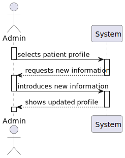
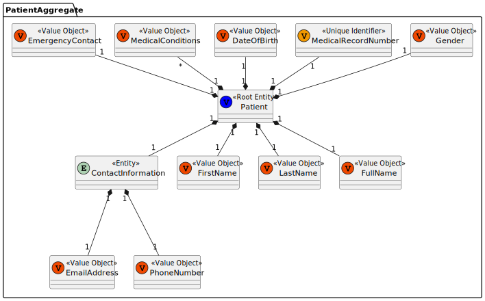
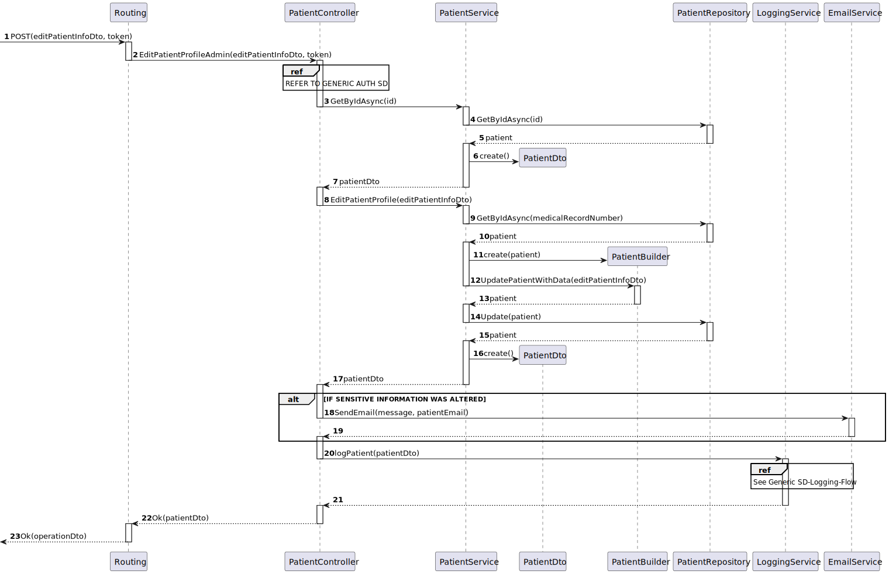
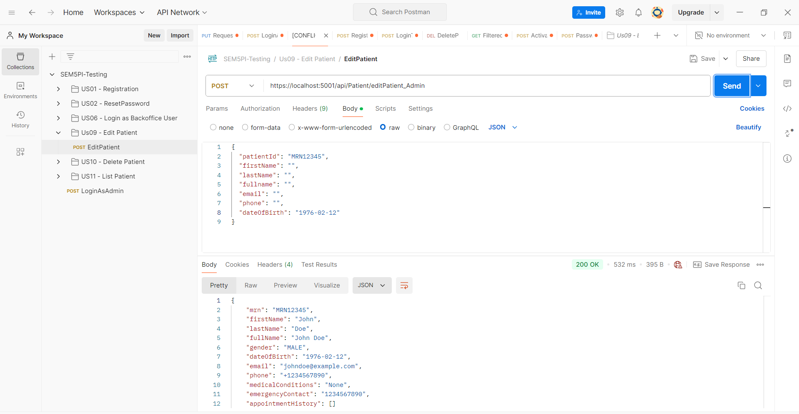

# US09 - As an Admin, I want to edit an existing patient profile, so that I can update their information when needed.


## 1. Context

The client has tasked the team with implementing a feature that allows the administrator to edit an existing patient profile, to this end an UI will be provided to the admin to facilitate this process.


## 2. Requirements

**Client Clarifications:**

>[**"QUESTION"** *by FERREIRA 1220962 - 5/10/2024]
>>**Q1:** When one of the contents that administrator edits is a sensitive content (eg. email), the notification is sent for what patient's email, the email in patient account, the old email of patient or the new email of patient?
>>>**A1:** if the email is changed, the notification should be sent to the "old" email


**Acceptance Criteria:**

- G009.1. Admins should be able to search and select which patient profiles to edit

- G009.2. Admins should be able to edit name, contact information, medical history, and allergies.

- G009.3. Changes to a sensitive field should trigger a notification email to the user

- G009.4. All profile changes should be logged for auditing purposes

- **G009.5.** In case the email is changed the patient should be sent a notification to their old email.

**Dependencies/References:**

* This user story has a functional dependency to User Story 1 and the implementation of the public API
* This user story has a functional dependency to User Story 11 that provides the list view of the patient profiles.

## 3. Analysis

The team has decided that sensitive data consists of uniquely identifying information of the patient, in this case this only constitutes their legal name and all aspects of it.

### System Sequence Diagram (Level 1 Process View)



> **Note:** Level 2 Process Views stand architecturally irrelevant as sprint 1 of project development encompasses only the development of the backend "Backoffice" module features, frontend interactions stand to be defined in future sprints.

### Relevant DM Excerpts



## 4. Design


### 4.1. Realization

#### Sequence Diagram (Level 3 Process View)




### 4.2. Applied Patterns

- Aggregate
- Entity
- Value Object
- Service
- MVC
- Layered Architecture
- DTO
- Clean Architecture
- C4+1

### 4.3 Design Commits:

* 05/10/2024 22:10 [US09] US09 Requirements and Analysis
* 21/10/2024 10:32 [US09] Post implementation SD brush up
* 22/10/2024 15:02 [US09] Documentation fix
* 23/10/2024 11:40 [US09] Implementation
* 23/10/2024 12:44 [US09] Implementation fix
* 24/10/2024 17:59 [US09] Documentation formatting fix
* 24/10/2024 18:19 [US09] Implementation iteration
* 25/10/2024 00:52 [US09] General README file restructuring to be in accordance with scrum master request
* 25/10/2024 12:51 [US09] Documentation formatting change to be in accordance to team decision
* 26/10/2024 16:55 [US09] Documentation Implementation evidences

## 5. Implementation

[PatientController](../../../src/Controllers/PatientController.cs)

```cs
[HttpPost("editPatient_Admin")]
        public async Task<ActionResult<PatientDto>> EditPatientProfileAdmin([FromBody] EditPatientDto_Admin editData, [FromHeader] string token)
        {
            var tokenDto = await _tokenSvc.GetByIdAsync(new TokenId(token));

            if(tokenDto.TokenValue != TokenType.ADMIN_AUTH_TOKEN.ToString()){
                return BadRequest("ACCESS TO RESOURCE DENIED.");
            }

            string email = (await _patSvc.GetByIdAsync(editData.patientId)).email;

            PatientDto patientDto = await _patSvc.EditPatientProfileAdmin(editData);

            

            if(editData.FirstName != null || editData.Fullname != null || editData.LastName != null || editData.Phone != null){
                EmailService.SendEmail(tokenDto.UserId, "Some sensitive information of yours in our platform was altered by an administrator. Please do check your profile and contact us if necessary.");
            }
            

            await _logSvc.LogPatientEditing(patientDto);

            return Ok(patientDto);
        }
```

[PatientService](../../../src/Domain/Patient/PatientService.cs)

```cs
public virtual async Task<PatientDto> EditPatientProfileAdmin(EditPatientDto_Admin editData)
            {
                Patient patient = await _repo.GetByIdAsync(new MedicalRecordNumber(editData.patientId));

                // Update fields if they are not null
                if (!string.IsNullOrEmpty(editData.FirstName))
                {
                    patient.firstName = new FirstName(editData.FirstName); 
                }

                if (!string.IsNullOrEmpty(editData.LastName))
                {
                    patient.lastName = new LastName(editData.LastName); 
                }

                if (!string.IsNullOrEmpty(editData.Fullname))
                {
                    patient.fullName = new FullName(editData.Fullname);
                }

                if (!string.IsNullOrEmpty(editData.Email))
                {
                    patient.ContactInformation.Email = new EmailAddress(editData.Email);
                }

                if (!string.IsNullOrEmpty(editData.Phone))
                {
                    patient.ContactInformation.Phone = new PhoneNumber(editData.Phone);
                }

                if (editData.MedicalHistory != null)
                {
                    AppointmentService appSvc = new AppointmentService();
                    Appointment appointment = await this._appRepo.GetByIdAsync(new AppointmentID(editData.MedicalHistory.id));
                    if (appointment == null){
                        await appSvc.registerAppointment(editData.MedicalHistory);
                    } else {
                        await appSvc.updateAppointment(editData.MedicalHistory, appointment);
                    }
                }

                if (!string.IsNullOrEmpty(editData.DateOfBirth))
                {
                    patient.dateOfBirth = new DateOfBirth(editData.DateOfBirth);
                }

                // Save the updated patient back to the repository
                Patient retPatient = _repo.Update(patient);
                await _unitOfWork.CommitAsync();
                
                // Return the updated patient as a DTO
                return retPatient.toDto();
            }
```

[LogService](../../../src/Domain/Logs/LogService.cs)

```cs
public virtual async Task<LogDto> LogPatientEditing(PatientDto patientDto)
            {
                // Check if the patientDto is null
                if (patientDto == null)
                {
                    throw new ArgumentNullException(nameof(patientDto), "PatientDto cannot be null.");
                }

                // Check if the MRN (Medical Record Number) is null or empty
                if (string.IsNullOrWhiteSpace(patientDto.mrn))
                {
                    throw new ArgumentException("Medical Record Number cannot be null or empty.", nameof(patientDto.mrn));
                }

                // Create the LogDto object
                LogDto dto = new LogDto
                {
                    LoggedId = patientDto.mrn,
                    LoggedInformation = patientDto.ToString(),
                    LoggedType = ObjectLoggedType.PATIENT.ToString(),
                    LoggedDate = DateTime.Now.AddSeconds(5).ToString()
                };

                // Call the asynchronous method to add the log
                return await AddLogAsync(dto);
            }
```

[TokenService](../../../src/Domain/Tokens/TokenService.cs)

```cs
public virtual async Task<TokenDto> GetByIdAsync(TokenId id){

            Token token = await _tokenRepo.GetByIdAsync(id);

            if(token == null){
                throw new Exception("Token does not exist");
            }

            return token.ToDto();
        }
```

### 5.2. Tests

**Assigned Tester:** Ricardo Dias - 1220976

## Patient Controller Unit Tests

This section provides an overview of the unit tests for the `PatientControllerTest`.

**Test File:** [PatientControllerTest.cs](../../../test/ControllerTest/PatientControllerTest.cs)

### Test Cases

1. **EditPatientProfileAdmin_Failure_WithBadToken**
   Tests the scenario where a patient tries to use this functionality, through the creation of an `Patient_Auth_Token`, instead of a `Admin_Auth_Token`. Ensures that the endpoint returns a `BadRequestObjectResult` with an appropriate error message.
2. **EditPatientProfileAdmin_Sucess_WithCorrectInputs**
   Validates the successful update of a patient profile with the proper parameters. Mocks dependencies, including the patient, log and token service, to verify that the password is changed correctly.

### US09 Integration Tests

This section provides an overview of the integration tests for the `US09IntegrationTest` class. These tests ensure that the `EditPatientProfileAdmin` endpoint correctly handles various scenarios in the Domain-Driven Design (DDD) architecture.

**Test File:** [US09IntegrationTest.cs](../../../test/IntegrationTest/US09IntegrationTest.cs)

#### Test Cases

1. **EditPatientProfileAdmin_Sucess_WithCorrectInputs**
   Validates the successful update of a patient profile with the proper parameters. Mocks dependencies, including user, token, patient and log repositories and the patient, log and token service, to verify that the password is changed correctly.
2. **EditPatientProfile_Failure_AuthFail**
   Tests the scenario where a patient tries to use this functionality, through the creation of an `Patient_Auth_Token`, instead of a `Admin_Auth_Token`. Ensures that the endpoint returns a `BadRequestObjectResult` with an appropriate error message.
3. **EditPatientProfileAdmin_Failure_WithIncorrectInputs**
   Tests the scenario where the admin provides an invalid e-mail (without the correct format). Ensures that the endpoint catches the exception thrown by the method, checking if its the expected one.

Each test case mocks necessary services and repositories to ensure reliable isolation of the `EditPatientProfileAdmin` functionality, enabling consistent verification of each unique scenario.


### System/E2E Testing

> Performed through POSTMAN, the modules through which system testing was done can be accessed in the following file:
>>[System Testing](test\SystemTest\SEM5PI-Testing.postman_collection.json)


## 6. Integration/Demonstration



## 7. Observations

* Nothing to add