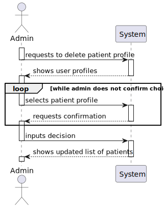
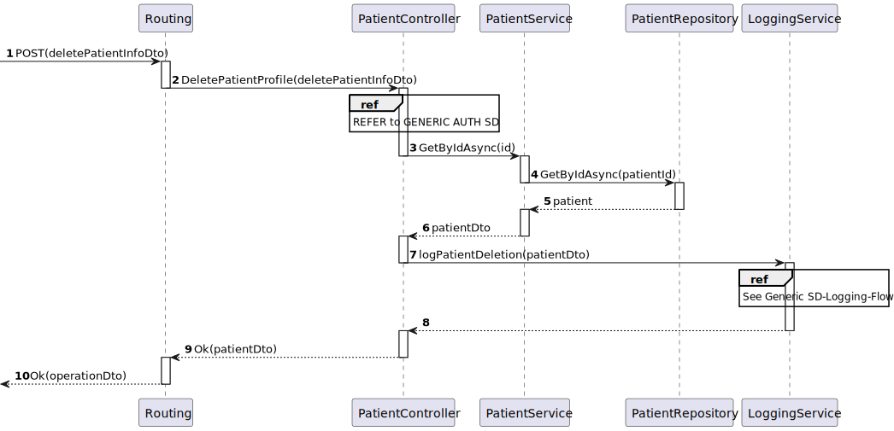
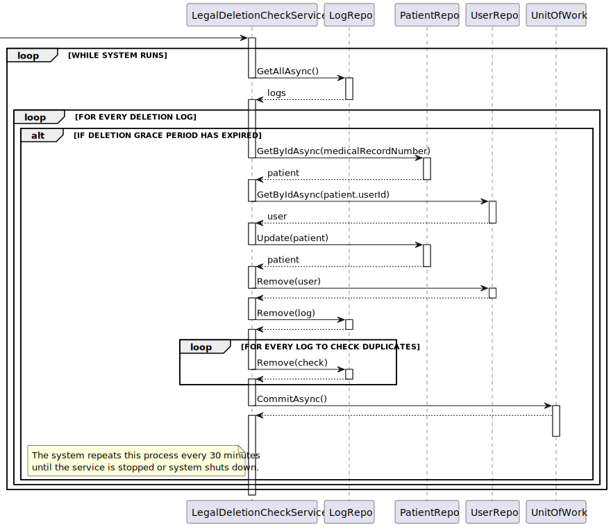
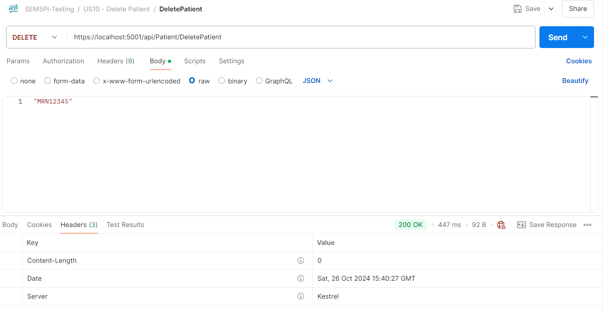
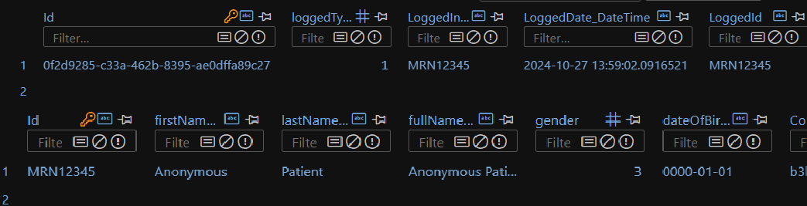

# US10 - As an Admin, I want to delete a patient profile, so that I can remove patients who are no longer under care


## 1. Context

The client has tasked the team with implementing a feature that allows the administrator to delete an existing patient profile, to this end an UI will be provided to the admin to facilitate this process.

## 2. Requirements

>[**"QUESTION"** *by UNIDENTIFIED USER - 28/09/2024]
>>**Q1:** What happens to patient data after the profile is deleted?
>>>**A1:** Either anonymize, delete or anonymize. Sorry, just to clarify and try to understand. Because I consider that there are two contexts here, right? Maybe it will be the same.


**Acceptance Criteria:**

- **G010.1.** Admins can search for a patient profile and mark it for deletion

- **G010.2.** Before deletion, the system should prompt the admin to confirm the action.

- **G010.3.** Once deleted, all sensitive patient data should be anonymized removed from the system within a predefined time frame.

- **G010.4.** The system should log the deletion for audit and GDPR compliance purposes.

- **G010.5.** Before performing the deletion/anonymization process begins a minimum legal time period must pass to ensure legal compliance.

- **G010.6** When a patient profile deletion order is carried out the associated User profile (if it exists) must also be deleted

**Dependencies/References:**

* This user story has a functional dependency to User Story 1 and the defined database schema.
* This user story also is functionally dependent on the GDPR compliance protocol the team must follow while developing the system

## 3. Analysis

* So upon further analysis the team has decided that deletion will be interpreted as anonymization of the patient profile and deletion of their user account
* This anonymization will be done after a period of **1 week** after the deletion order is issued
* The anonymization and deletion process will be executed by a background service running parallel to the application.

### System Sequence Diagram (Level 1 Process View)



> **Note:** Level 2 Process Views stand architecturally irrelevant as sprint 1 of project development encompasses only the development of the backend "Backoffice" module features, frontend interactions stand to be defined in future sprints.


### Relevant DM Excerpts


## 4. Design

### 4.1. Realization

#### Sequence Diagram (Level 3 Process View)




#### Sequence Diagram of Deletion Service (Level 3 Process View)




### 4.2. Applied Patterns

- Aggregate
- Entity
- Value Object
- Service
- MVC
- Layered Architecture
- DTO
- Clean Architecture
- C4+1

### 4.3 Design Commits:

* 05/10/2024 22:10 [US10] US10 Requirements and Analysis
* 22/10/2024 23:51 [US10] SVG files
* 22/10/2024 20:47 [US10] US10 implementation
* 23/10/2024 16:30 [US10] Implementation iteration
* 23/10/2024 11:40 [US10] Patient Constructor fix
* 23/10/2024 12:22 [US10] Implementation
* 24/10/2024 17:59 [US10] Documentation formatting fix
* 25/10/2024 00:52 [US10] General README file restructuring to be in accordance with scrum master request
* 25/10/2024 12:51 [US10] Documentation formatting change to be in accordance to team decision
* 25/10/2024 12:51 [US10] Implementation Fix
* 26/10/2024 16:55 [US10] Documentation Implementation evidences

## 5. Implementation

[PatientController](../../../src/Controllers/PatientController.cs)

```cs
[HttpDelete("DeletePatient")]
        public async Task<IActionResult> DeletePatientProfile([FromBody] string mrn, [FromHeader] string token)
        {
            var tokenDto = await _tokenSvc.GetByIdAsync(new TokenId(token));

            if(tokenDto.TokenValue != TokenType.ADMIN_AUTH_TOKEN.ToString()){
                return BadRequest("ACCESS TO RESOURCE DENIED.");
            }
            PatientDto patient = await _patSvc.GetByIdAsync(mrn);
            

            await _logSvc.LogPatientDeletion(patient);

            return Ok();
        }
```

[PatientService](../../../src/Domain/Patient/PatientService.cs)

```cs
public virtual async Task<PatientDto> GetByIdAsync(string id)
        {
            var patient = await this._repo.GetByIdAsync(new MedicalRecordNumber(id));

            return patient == null ? null : patient.toDto();
        }
```

[LegalDeletionCheckService](../../../src/Services/LegalDeletionCheckService.cs)

```cs
public class LegalDeletionCheckService : BackgroundService
    {
        private readonly IServiceProvider _serviceProvider;

        public LegalDeletionCheckService(IServiceProvider serviceProvider)
        {
            _serviceProvider = serviceProvider;
        }

        protected override async Task ExecuteAsync(CancellationToken stoppingToken)
        {
            while (!stoppingToken.IsCancellationRequested)
            {
                using (var scope = _serviceProvider.CreateScope())
                {
                    var unitOfWork = scope.ServiceProvider.GetRequiredService<IUnitOfWork>();
                    var patientRepo = scope.ServiceProvider.GetRequiredService<IPatientRepository>();
                    var userRepo = scope.ServiceProvider.GetRequiredService<IUserRepository>();
                    var logRepo = scope.ServiceProvider.GetRequiredService<ILogRepository>();

                    var logs = await logRepo.GetAllAsync();

                    foreach (var log in logs)
                    {
                        if(log.loggedType == ObjectLoggedType.PATIENT_DELETION && (DateTime.Now - log.LoggedDate.DateTime).TotalDays >= 7){
                            Patient patient = await patientRepo.GetByIdAsync(new MedicalRecordNumber(log.LoggedId));
                            User user = await userRepo.GetByIdAsync(patient.userId);
                        

                            patient.Anonymize();

                            patientRepo.Update(patient);
                            userRepo.Remove(user);
                            logRepo.Remove(log);
                            

                            foreach (var check in logs){
                                if(check.LoggedId == log.LoggedId && check.loggedType == log.loggedType){
                                    logRepo.Remove(check);
                                }
                            }

                            await unitOfWork.CommitAsync();
                        }
                    }
                }

                // Delay before the next check
                await Task.Delay(TimeSpan.FromMinutes(30), stoppingToken);
            }
        }


    }
```

[LogService](../../../src/Domain/Logs/LogService.cs)

```cs
public virtual async Task<LogDto> LogPatientDeletion(PatientDto patientDto)
            {
                // Check if the patientDto is null
                if (patientDto == null)
                {
                    throw new ArgumentNullException(nameof(patientDto), "PatientDto cannot be null.");
                }

                // Check if the MRN (Medical Record Number) is null or empty
                if (string.IsNullOrWhiteSpace(patientDto.mrn))
                {
                    throw new ArgumentException("Medical Record Number cannot be null or empty.", nameof(patientDto.mrn));
                }

                // Create the LogDto object
                LogDto dto = new LogDto
                {
                    LoggedId = patientDto.mrn,
                    LoggedInformation = patientDto.mrn,
                    LoggedType = ObjectLoggedType.PATIENT_DELETION.ToString(),
                    LoggedDate = DateTime.Now.AddSeconds(5).ToString()
                };

                // Call the asynchronous method to add the log
                return await AddLogAsync(dto);
            }
```

[TokenService](../../../src/Domain/Tokens/TokenService.cs)

```cs
public virtual async Task<TokenDto> GetByIdAsync(TokenId id){

            Token token = await _tokenRepo.GetByIdAsync(id);

            if(token == null){
                throw new Exception("Token does not exist");
            }

            return token.ToDto();
        }
```

### 5.2. Tests

**Assigned Tester:** Ricardo Dias - 1220976

## Patient Controller Unit Tests

This section provides an overview of the unit tests for the `PatientControllerTest`.

**Test File:** [PatientControllerTest.cs](../../../test/ControllerTest/PatientControllerTest.cs)

### Test Cases

1. **DeletePatientProfile_Failure_BadAuthentication**
   Tests the scenario where a patient tries to use this functionality, through the creation of an `Patient_Auth_Token`, instead of a `Admin_Auth_Token`. Ensures that the endpoint returns a `BadRequestObjectResult` with an appropriate error message.
2. **DeletePatientProfile_Successa_GoodValues**
   Validates the successful deletion of a patient profile with the proper parameters. Mocks dependencies, including the patient, log and token service, to verify that that the deletion is done.

### US10 Integration Tests

This section provides an overview of the integration tests for the `US10IntegrationTest` class. These tests ensure that the `DeletePatientProfile` endpoint correctly handles various scenarios in the Domain-Driven Design (DDD) architecture.

**Test File:** [US10IntegrationTest.cs](../../../test/IntegrationTest/US10IntegrationTest.cs)

#### Test Cases

1. **DeletePatientProfile_Success_WithGoodValues**
   Validates the successful deletion of a patient profile with the proper parameters. Mocks dependencies, including user, token, patient and log repositories and the patient, log and token service, to verify that the deletion is done.
2. **DeletePatientProfile_Failure_WithBadAuth**
   Tests the scenario where a patient tries to use this functionality, through the creation of an `Patient_Auth_Token`, instead of a `Admin_Auth_Token`. Ensures that the endpoint returns a `BadRequestObjectResult` with an appropriate error message.
3. **DeletePatientProfile_Exception_WithBadMrn**
   Tests the scenario where the admin provides an invalid MedicalRecordNumber. Ensures that the endpoint catches the exception thrown by the method, checking if its the expected one.

Each test case mocks necessary services and repositories to ensure reliable isolation of the `DeletePatientProfile` functionality, enabling consistent verification of each unique scenario.

### System/E2E Testing

> Performed through POSTMAN, the modules through which system testing was done can be accessed in the following file:
>>[System Testing](test\SystemTest\SEM5PI-Testing.postman_collection.json)


## 6. Integration/Demonstration




## 7. Observations

* Nothing to add