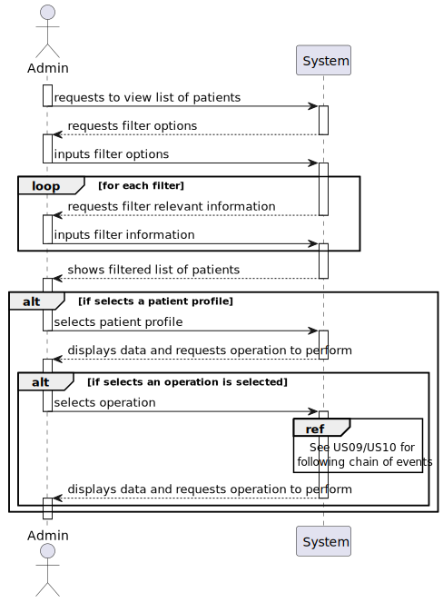
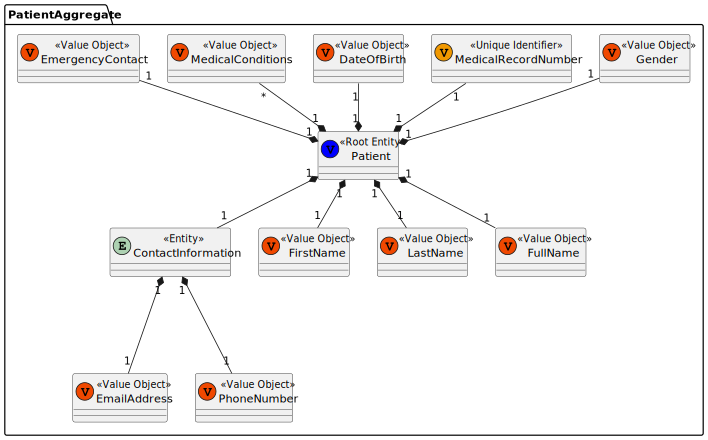
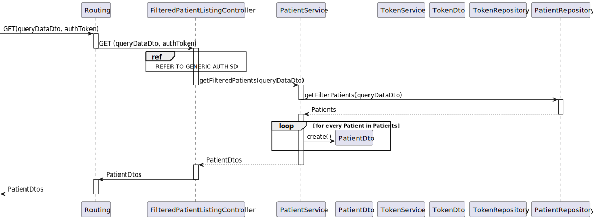
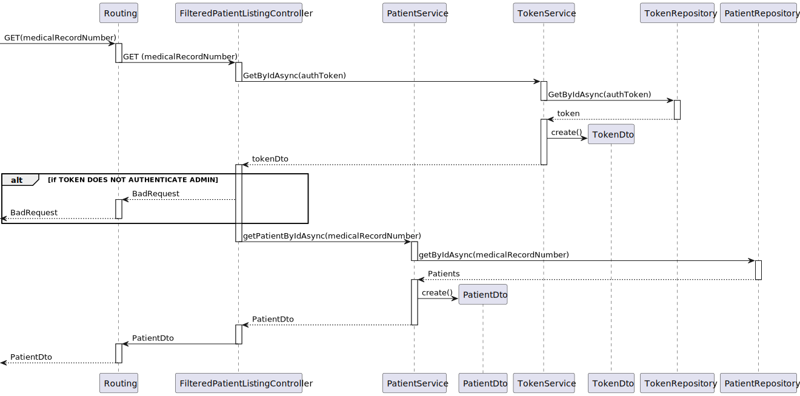
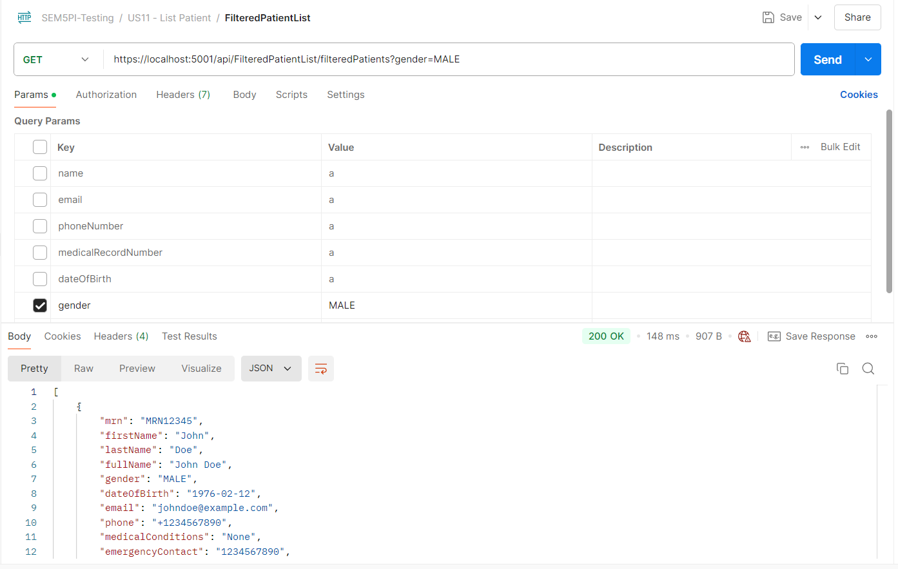

# US011 As an Admin, I want to list/search patient profiles by different attributes, so that I can view the details, edit, and remove patient profiles.


## 1. Context

* The client has tasked the team with implementing a feature that allows the administrator to list all existing patient profiles, to this end an UI will be provided to the admin to facilitate this process.

## 2. Requirements

**Client Clarifications:**

>[**"QUESTION"** *by UNIDENTIFIED STUDENT - 12/10/2024]
>>**Q1:** What filters should be able to be applied when filtering the patients?
>>>**A1:** Users should be able to search students by: name, AND/OR email, AND/OR phone number, AND/OR medical record number, AND/OR date of birth, AND/OR gender
listing of users should have the same filters available

**Acceptance Criteria:**

- **G011.1.** Admins must be able to search patient profiles by various attributes, including name, email, date of birth, or medical record number.

- **G011.2.** The system should display search results in a list view with key patient information

- **G011.3.** Admins should be able to select a profile from the list to view, edit, or delete the patient record.

- **G011.4.** The search results should be paginated, and filters are available to refine the search results.


**Dependencies/References:**

* This user story is functionally dependent on the database schema, how the attributes of the patient profile are to be set up and handled.
* User story is also dependent on the type of database used to persist information, considering we will be using a relational database (Sqlite) it has the contraints generic SQL databases also share

## 3. Analysis

* Analysis for this User Story is quite straightforward after inquiring the client about what filters were required for the system.
* Admin will input the filters they want to use
* System will filter the patients according to requested filters by querying the database.
* When it comes to selecting a specific user the system will only  request the user's ID

### System Sequence Diagram (Level 1 Process View)



> **Note:** Level 2 Process Views stand architecturally irrelevant as sprint 1 of project development encompasses only the development of the backend "Backoffice" module features, frontend interactions stand to be defined in future sprints.

### Relevant DM Excerpts



## 4. Design

### 4.1. Realization

#### Filtered Users SD (Level 3 Process View)



#### Specific User SD (Level 3 Process View)



#### 


### 4.2. Applied Patterns

- Aggregate
- Entity
- Value Object
- Service
- MVC
- Layered Architecture
- DTO
- Clean Architecture
- C4+1

### 4.4. Design Commits:

* 05/10/2024 22:11 [US11] US11 Requirements and Analysis
* 18/10/2024 10:16 [US11] Documentation final iterations
* 20/10/2024 23:26 [US11] Implementation
* 21/10/2024 10:32 [US11] Post implementation SD brush up
* 22/10/2024 20:45 [US11] SVG files
* 24/10/2024 17:59 [US11] Documentation formatting fix
* 25/10/2024 00:52 [US11] General README file restructuring to be in accordance with scrum master request
* 25/10/2024 12:51 [US11] Documentation formatting change to be in accordance to team decision
* 25/10/2024 15:49 [US11] Implementation Query fix
* 26/10/2024 16:55 [US11] Documentation Implementation evidences

## 5. Implementation

[FilteredPatientListController](../../../src/Controllers/FilteredPatientListController.cs)

```cs
[HttpGet("filteredPatients")]
        public async Task<ActionResult<List<PatientDto>>> GetFilteredUsers(
            [FromQuery] string name, 
            [FromQuery] string email, 
            [FromQuery] string phoneNumber, 
            [FromQuery] string medicalRecordNumber, 
            [FromQuery] string dateOfBirth, 
            [FromQuery] string gender, 
            [FromHeader] string token)
        {
            TokenDto tokenDto = await _tokenService.GetByIdAsync(new TokenId(token));

            if (tokenDto.TokenValue != TokenType.ADMIN_AUTH_TOKEN.ToString())
            {
                return BadRequest("ACCESS DENIED");
            }

            var queryData = new QueryDataDto
            {
                Name = name,
                Email = email,
                PhoneNumber = phoneNumber,
                MedicalRecordNumber = medicalRecordNumber,
                DateOfBirth = dateOfBirth,
                Gender = gender
            };

            return Ok((List<PatientDto>) _patService.GetFilteredPatients(queryData));
        }
```

[PatientService](../../../src/Domain/Patient/PatientService.cs)

```cs
public IEnumerable<PatientDto> GetFilteredPatients(QueryDataDto queryData)
        {
            IEnumerable<Patient> patients = _repo.GetFilteredPatients(queryData);
            
            return patients.Select(patient => patient.toDto()).ToList();
        }
```


[TokenService](../../../src/Domain/Tokens/TokenService.cs)

```cs
public virtual async Task<TokenDto> GetByIdAsync(TokenId id){

            Token token = await _tokenRepo.GetByIdAsync(id);

            if(token == null){
                throw new Exception("Token does not exist");
            }

            return token.ToDto();
        }
```

[PatientRepository](../../../src/Infraestructure/Patient/PatientRepository.cs)

```cs
public IEnumerable<Patient> GetFilteredPatients(QueryDataDto queryData)
        {
            // Fetch the patients and include related data
            var patients = _context.Patients
                .Include(p => p.ContactInformation)
                .Include(p => p.appointmentHistory)
                .Include(p => p.TheUser)
                .AsEnumerable(); // Force client-side evaluation here

            // Filter the patients based on the provided query data
            if (queryData.Name != null)
            {
                patients = patients.Where(p => p.fullName.Equals(new FullName(queryData.Name)));
            }
            if (queryData.Email != null)
            {
                patients = patients.Where(p => p.ContactInformation.Email.Equals(new EmailAddress(queryData.Email)));
            }
            if (queryData.PhoneNumber != null)
            {
                MedicalRecordNumber medicalRecordNumber = new MedicalRecordNumber(queryData.PhoneNumber);
                patients = patients.Where(p => p.Id.Equals(medicalRecordNumber));
            }
            if (queryData.MedicalRecordNumber != null)
            {
                MedicalRecordNumber medicalRecordNumber = new MedicalRecordNumber(queryData.MedicalRecordNumber);
                patients = patients.Where(p => p.Id.Equals(medicalRecordNumber));
            }
            if (queryData.Gender != null)
            {
                if (Enum.TryParse(typeof(Gender), queryData.Gender.ToUpper(), out var gender))
                {
                    patients = patients.Where(p => p.gender.Equals((Gender)gender));
                }
            }

            return patients.ToList(); // Convert to a list before returning
        }
```

### 5.2. Tests

**Assigned Tester:** Ricardo Dias - 1220976

### US11 Integration Tests

This section provides an overview of the integration tests for the `US11IntegrationTest` class. These tests ensure that the `GetFilteredPatients` endpoint correctly handles various scenarios in the Domain-Driven Design (DDD) architecture.

**Test File:** [US11IntegrationTest.cs](../../../test/IntegrationTest/US11IntegrationTest.cs)

#### Test Cases

1. **GetFilteredPatients_Sucess**
   Validates the successful deletion of a patient profile with the proper parameters. Mocks dependencies, including user, token, patient and log repositories and the patient, log and token service, to verify that the password is changed correctly.

Each test case mocks necessary services and repositories to ensure reliable isolation of the `GetFilteredPatients` functionality, enabling consistent verification of each unique scenario. Since all the values are from mock services, it is impossible to actually test the gathering of the filtered list through Integration Tests.

### System/E2E Testing

> Performed through POSTMAN, the modules through which system testing was done can be accessed in the following file:
>>[System Testing](test\SystemTest\SEM5PI-Testing.postman_collection.json)


## 6. Integration/Demonstration



## 7. Observations

* Nothing to add