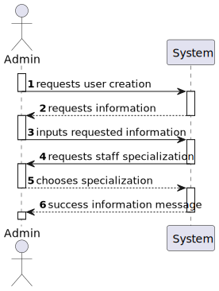
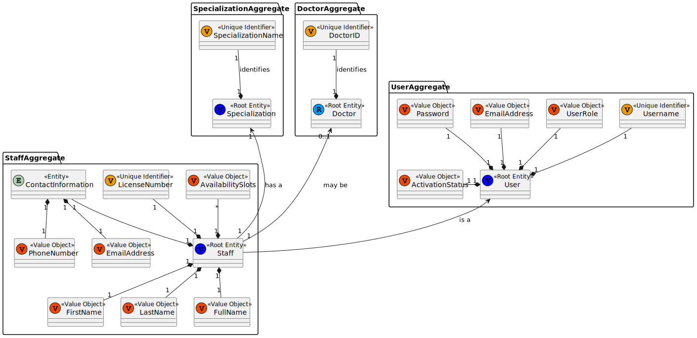
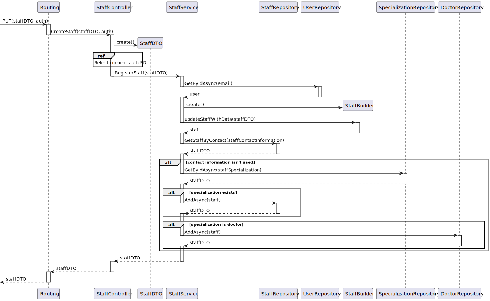

# US12 - As an Admin, I want to create a new staff profile, so that I can add them to the hospital's roster

## 1. Context

An Admin can create new users with the role of staff. This is a newly assigned task during the first sprint and is to be completed in said sprint.

## 2. Requirements

**US12** As an Admin, I want to create a new staff profile, so that I can add them to the hospital's roster

**Acceptance Criteria:**

- US12.1. Admins can input staff details such as first name, last name, contact information, and specialization.

- US12.2. A unique staff ID (License Number) is generated upon profile creation.

- US12.3. The system ensures that the staff's email and phone number are unique.

- US12.4. The profile is stored securely, and access is based on role-based permissions.

**Dependencies/References:**

This User Story has no functional dependencies to other user stories however it is functionally dependant on the implementation of the API.

## 3. Analysis

### System Sequence Diagram

### Relevant DM Excerpts

## 4. Design

### 4.1. Sequence Diagram

### 4.2. Applied Patterns

- Aggregate
- Entity
- Value Object
- Service
- MVC
- DTO
- Layered Architecture
- Clean Architecture
- C4+1

### 4.3 Main Commits:
> **11/10/2024 11:56 [US12]**
> - Started working on documentation. Requirements and analysis
> 
> **26/10/2024 12:17 [US12]** 
> - Globalized controller for admin US.
>
> **26/10/2024 20:49 [US12]**
> - Changes to controller and servive.
>
> **27/10/2024 12:47 [US12]**
> - Staff service test creation.
>
> **27/10/2024 15:21 [US12]**
> - Changed builder and service.
>
> **27/10/2024 15:33 [US12]**
> - Adding US12 integration test, fixing issues caused by staaff builder changes.
>
> **27/10/2024 17:08 [US12]**
> - Updating US12 test to test if contact information already exists in the system.
>
> **27/10/2024 18:59 [US12]**
> - Updating integration test with further functionality testing

## 5. Implementation

[StaffController](../../../src/Controllers/StaffController.cs)

[StaffService](../../../src/Domain/Staff/StaffService.cs)

[StaffDto](../../../src/Domain/Staff/StaffDto.cs)

[StaffRepository](../../../src/Infraestructure/Staff/StaffRepository.cs)

### 5.1. Tests

**Assigned Tester:** Tiago Silva

#### Staff Controller Unit Tests

[StaffControllerTest](../../../test/ControllerTest/StaffControllerTest.cs)

##### Test Cases

**Test_StaffControllerTest_Create**
> Verifies that it successfully creates a staff.

**Test_StaffControllerTest_CreateError**
> Sends a token with the value staff to test that the functionality prevents anyone, other than admins, to use it.

#### Staff Service Unit Tests

[StaffService](../../../test/ServiceTest/StaffServiceTest.cs)

##### Test Cases

**Test_StaffService_RegisterStaffSuccessful**
> Verifies that, by sending the required information, the staff is properly registered.

**Test_StaffService_RegisterStaffUnsuccessful**
> Verifies that the staff returned is null, after sending an e-mail without a created user.

#### US12 Integration Tests

[US12/Integration/Tests](../../../test/IntegrationTest/US12IntegrationTest.cs)

##### Test Cases

**Test_US12_CreatesDoctor**
>> Verifies that the functionality properly creates a doctor if the specialization of the staff is Doctor.

**Test_US12_DuplicateContactInfo**
>> Verifies that, if sent an e-mail or phone number already being used by another staff, it doesn't create create a staff, due to the contact info already being used.  

## 6. Integration/Demonstration

[US12-Demonstration_data](us12_demonstration_data.png)
[US12-Demonstration_data](us12_demonstration_result.png)

## 7. Observations

No observations.