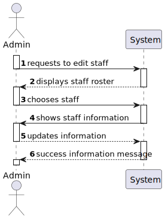
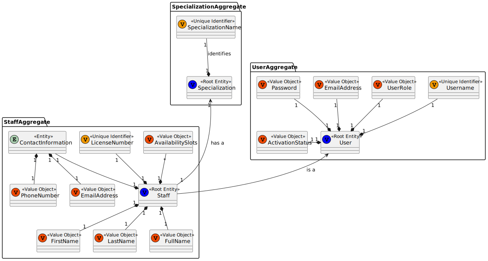
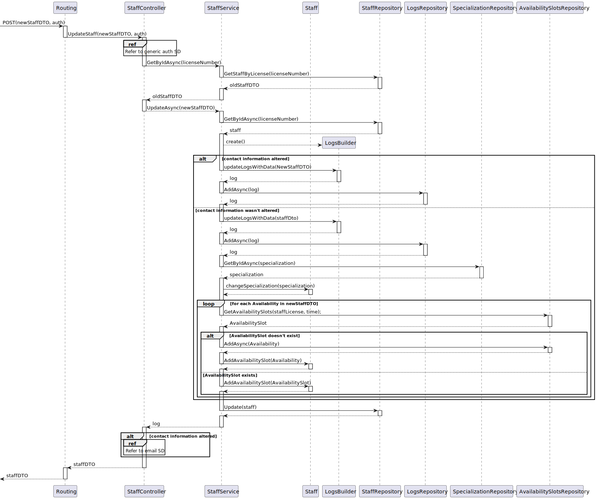
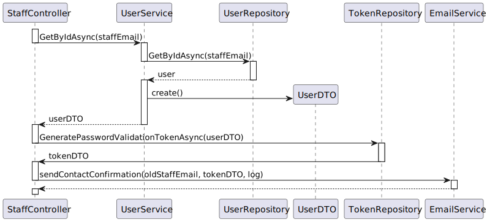
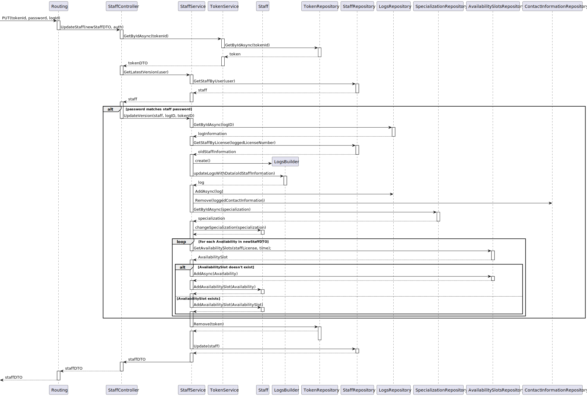

# US13 - As an Admin, I want to edit a staff’s profile, so that I can update their information

## 1. Context

An Admin can pick a staff's profile to be able to edit/update their information. This is a newly assigned task during the first sprint and is to be completed in said sprint.

## 2. Requirements

**US13** As an Admin, I want to edit a staff’s profile, so that I can update their information

**Acceptance Criteria:**

- US13.1. Admins can search for and select a staff profile to edit.

- US13.2. Editable fields include contact information, availability slots, and specialization.

- US13.3. The system logs all profile changes, and any changes to contact information trigger a confirmation email to the staff member.

- US13.4. The edited data is updated in real-time across the system.

**Dependencies/References:**

*Regarding this requirement we understand that it relates to...*

## 3. Analysis

### System Sequence Diagram

### Relevant DM Excerpts

## 4. Design

### 4.1. Sequence Diagram

#### Change staff information SD

#### Email SD 

#### Staff accept changes SD

### 4.2. Applied Patterns

- Aggregate
- Entity
- Value Object
- Service
- MVC
- DTO
- Layered Architecture
- Clean Architecture
- C4+1

### 4.3 Main Commits:
> **11/10/2024 11:56 [US13]**
> - Started working on US13 documentation. Requirements and analysis
> 
> **20/10/2024 15:17 [US13]** 
> - Added staff versioning.
>
> **20/10/2024 17:01 [US13]**
> - Updated classes that used staff, as to not cause any foreign key issues.
>
> **22/10/2024 14:52 [US13]**
> - Removed old staff versioning from everything that used it, implemented the usage of the new Logs table.
>
> **26/10/2024 12:18 [US13]**
> - Edited Builder and Service for better editing.
>
> **26/10/2024 15:33 [US13]**
> - Made availability slots into a table to allow editing.
>
> **27/10/2024 12:47 [US13]**
> - Staff service test creation.
>
> **27/10/2024 15:34 [US13]**
> - Created integration test.

## 5. Implementation

[StaffController](../../../src/Controllers/StaffController.cs)

[StaffService](../../../src/Domain/Staff/StaffService.cs)

[StaffDto](../../../src/Domain/Staff/StaffService.cs)

[StaffRepository](../../../src/Infraestructure/Staff/StaffRepository.cs)

[AvailabilityRepository](../../../src/Infraestructure/AvailabilitySlots/AvailabilitySlotsRepository.cs)

### Tests

**Assigned Tester:** Tiago Silva

#### Staff Service Unit Tests

[StaffService](../../../test/ServiceTest/StaffServiceTest.cs)

##### Test Cases

**Test_StaffService_UpdateSuccessful**
> Verifies that, by sending the required information, the staff is properly updated.

**Test_StaffService_UpdateUnsuccessful**
> Verifies that the functionality doesn't update the staff, by sending an invalid specialization.

#### US13 Integration Tests

[US13/Integration/Tests](../../../test/IntegrationTest/US13IntegrationTest.cs)

##### Test Cases

**Test_US13_UpdateContact**
>> Verifies that the functionality properly updates a doctor.

**Test_US13_UpdateContactError**
>> Verifies that, by sending a staff token, the functionality prevents the update since it an admin token wasn't sent.  

## 6. Integration/Demonstration

[US13-Demonstration_data](us13_demonstration_data.png)
[US13-Demonstration_data](us13_demonstration_email.png)
[US13-Demonstration_data](us13_demonstration_result.png)

## 7. Observations

In the demonstrations result, the returned value is the log that was created of the changes that haven't been made (since the contact information was altered).
When the staff accepts those changes, the system will get the information from that log and then update the staff.