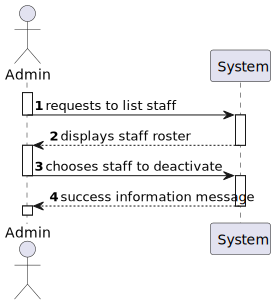
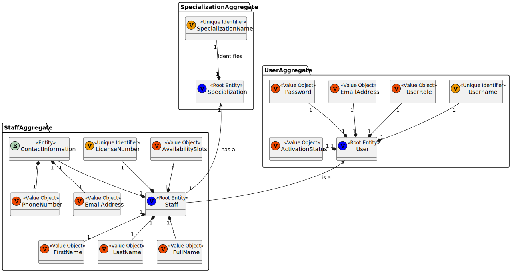
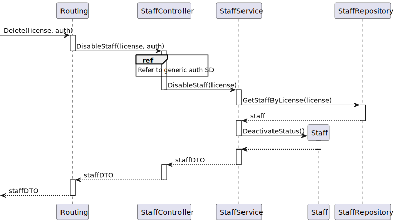

# US14 - As an Admin, I want to deactivate a staff profile, so that I can remove them from the hospital’s active roster without losing their historical data.

## 1. Context

An Admin can deactivate a staff profile, by doing so the staff is removed from the active roster but their historical data stays. This is a newly assigned task during the first sprint and is to be completed in said sprint.

## 2. Requirements

**US14** As an Admin, I want to deactivate a staff profile, so that I can remove them from the hospital’s active roster without losing their historical data.

**Acceptance Criteria:**

- US14.1. Admins can search for and select a staff profile to deactivate.

- US14.2. Deactivating a staff profile removes them from the active roster, but their historical data (e.g., appointments) remains accessible.

- US14.3. The system confirms deactivation and records the action for audit purposes.

**Dependencies/References:**

This User Story has no functional dependencies to other user stories however it is functionally dependant on the implementation of the API.

## 3. Analysis

### System Sequence Diagram

### Relevant DM Excerpts

## 4. Design

### 4.1. Sequence Diagram

### 4.2. Applied Patterns

- Aggregate
- Entity
- Value Object
- Service
- MVC
- DTO
- Layered Architecture
- Clean Architecture
- C4+1

### 4.3 Main Commits:
> **11/10/2024 11:57 [US14]**
> - Started working on documentation. Requirements and analysis
> 
> **26/10/2024 12:27 [US14]** 
> - Added functionality.
>
> **27/10/2024 12:47 [US14]**
> - Staff service test creation.
>
> **27/10/2024 12:47 [US14]**
> - Created integration test.

## 5. Implementation

[StaffController](../../../src/Controllers/StaffController.cs)

[StaffService](../../../src/Domain/Staff/StaffService.cs)

### 5.1. Tests

**Assigned Tester:** Tiago Silva

#### Staff Service Unit Tests

[StaffService](../../../test/ServiceTest/StaffServiceTest.cs)

##### Test Cases

**Test_StaffService_DisableStaff**
> Verifies that, by sending the required information, the staff is properly disabled (their activation status is set to deactivated).

#### US14 Integration Tests

[US14/Integration/Tests](../../../test/IntegrationTest/US14IntegrationTest.cs)

##### Test Cases

**Test_US14_DeactivateStaff**
>> Verifies that the sent staff activation status is set to DEACTIVATED.

**Test_US14_DeactivateStaffError**
>> Sends a token with the value staff to test that the functionality prevents anyone, other than admins, to use it.

## 6. Integration/Demonstration

[US14-Demonstration_data](us14_demonstration_data.png)

[US14-Demonstration_data_before](us14_demonstration_before.png)

[US14-Demonstration_data_after](us14_demonstration_after.png)

## 7. Observations

No observations.