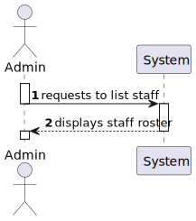
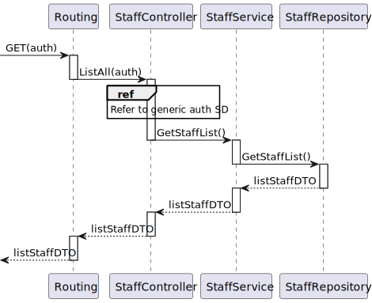

# US15 - As an Admin, I want to list/search staff profiles, so that I can see the details, edit, and remove staff profiles.

## 1. Context

An admin can list all the staff profiles and, with that list, be able to see their details, edit or remove them. This is a newly assigned task during the first sprint and is to be completed in said sprint.

## 2. Requirements

**US15** As an Admin, I want to list/search staff profiles, so that I can see the details, edit, and remove staff profiles.

**Acceptance Criteria:**

- US15.1. Admins can search staff profiles by attributes such as name, email, or specialization.

- US15.2. The system displays search results in a list view with key staff information (name, email, specialization).

- US15.3. Admins can select a profile from the list to view, edit, or deactivate.

- US15.4. The search results are paginated, and filters are available for refining the search results.

**Dependencies/References:**

This User Story has no functional dependencies to other user stories however it is functionally dependant on the implementation of the API.

## 3. Analysis

### System Sequence Diagram

### Relevant DM Excerpts

## 4. Design

### 4.1. Sequence Diagram

### 4.2. Applied Patterns

- Aggregate
- Entity
- Value Object
- Service
- MVC
- DTO
- Layered Architecture
- Clean Architecture
- C4+1

### 4.3 Main Commits:
> **11/10/2024 11:58 [US15]**
> - Started working on US15 documentation. Requirements and analysis
> 
> **26/10/2024 12:26 [US15]** 
> - Changed QueryDTO to allow filtering staff.
> 
> **26/10/2024 13:38 [US15]** 
> - Adding tests for create and filtered list.
> 
> **27/10/2024 18:59 [US15]** 
> - Updating integration test.

## 5. Implementation

[StaffController](../../../src/Controllers/StaffController.cs)

[StaffService](../../../src/Domain/Staff/StaffService.cs)

[StaffRepository](../../../src/Infraestructure/Staff/StaffRepository.cs)

### 5.1. Tests

**Assigned Tester:** Tiago Silva

#### Staff Controller Unit Tests

[StaffControllerTest](../../../test/ControllerTest/StaffControllerTest.cs)

##### Test Cases

**Test_StaffControlerTest_List**
> Verifies that the staff controller properly calls the service to return the staff list.

**Test_StaffControllerTest_ListError**
> Sends a staff token to test that the functionality only allows admins to use it.

#### Staff Service Unit Tests

[StaffService](../../../test/ServiceTest/StaffServiceTest.cs)

##### Test Cases

**Test_StaffService_FilterStaff**
> Verifies that, by sending specific filters, the returned list has the wanted staff amount.

#### US15 Integration Tests

[US15/Integration/Tests](../../../test/IntegrationTest/US15IntegrationTest.cs)

##### Test Cases

**Test_US15_FilterStaff1**
>> Verifies that the functionality properly returns a list with filtered staff, by filtering by specialization.

**Test_US15_FilterStaff2**
>> Verifies that the functionality properly returns a list with filtered staff, by filtering by email and specialization.

## 6. Integration/Demonstration

**Demonstration with e-mail that no staff has:**

[US15-Demonstration_data](us15_demonstration_data.png)
[US15-Demonstration_data](us15_demonstration_result.png)

**Demonstration with e-mail that a staff has:**

[US15-Demonstration_data](us15_demonstration_data2.png)
[US15-Demonstration_data](us15_demonstration_result2.png)

## 7. Observations

No observations made.