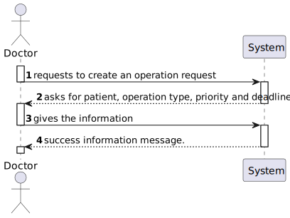

# US16 - As a Doctor, I want to request an operation, so that the Patient has access to the necessary healthcare

## 1. Context

A doctor has permission to request operations to be done on a patient. This is a newly assigned task during the first sprint and is to be completed in said sprint.

## 2. Requirements

**US16** As a Doctor, I want to request an operation, so that the Patient has access to the necessary healthcare

**Client Specifications - Q&A:**
> **Q01 –**  Can a doctor make more than one operation request for the same patient? If so, is there any limit or rules to follow? For example, doctors can make another operation request for the same patient as long as it's not the same operation type?
>
>>**A01 -** it should not be possible to have more than one "open" surgery request (that is, a surgery that is requested or scheduled but not yet performed) for the same patient and operation type.

> **Q02 –** When the doctor is creating the operation request, which data fields should be selectable, and which data fields should require manual input?
>
>> **A02 –** if a field is a reference to another concept, from an usability perspective, the user should not be forced to enter the value manually but should be allowed to select it or search and select it. PS: remember that in this sprint you are developing an API. this question is more related to the usability of the user interface. From the API perspective it doesn't matter how the value was collected from the user
> **Q03 –** Does the system adds automically the operation request to the medical history of the patient?
>
>> **A03 –** No need. it will be the doctor's responsibility to add it

**Acceptance Criteria:**

- US16.1. Doctors can create an operation request by selecting the patient, operation type, priority, and suggested deadline.

- US16.2. The system validates that the operation type matches the doctor’s specialization.

- US16.3. The operation request includes:
    - Patient ID
    - Doctor ID
    - Operation Type
    - Deadline
    - Priority

- US16.4. The system confirms successful submission of the operation request and logs the request in the patient’s medical history.

**Dependencies/References:**

This User Story has no functional dependencies to other user stories however it is functionally dependant on the implementation of the API.

## 3. Analysis

### System Sequence Diagram

### Relevant DM Excerpts

## 4. Design

### 4.1. Sequence Diagram

### 4.2. Applied Patterns

- Aggregate
- Entity
- Value Object
- Service
- MVC
- DTO
- Layered Architecture
- Clean Architecture
- C4+1

### 4.3 Main Commits:
> **11/10/2024 11:58 [US16]**
> - Started on US16 documentation, requirement and analysis.
> 
> **25/10/2024 21:38 [US16]**
> - Created operation request builder & doctor controller. Implemented US
> 
> **25/10/2024 23:15 [US16]** 
> - Further updated documentation.
>
> **26/10/2024 12:06 [US16]**
> - Adding bootstrap values.
>
> **27/10/2024 12:47 [US16]**
> - Fixed test

## 5. Implementation

[OperationRequestController](../../../src/Controllers/OperationRequestController.cs)

[OperationRequestService](../../../src/Domain/OperationRequests/OperationRequestService.cs)

[OperationRequestRepository](../../../src/Infraestructure/OperationRequest/OperationRequestRepository.cs)

### 5.1. Tests

**Assigned Tester:** Tiago Silva

#### Operation Request Controller Unit Tests

[OperationRequestControllerTest](../../../test/ControllerTest/OperationRequestControllerTest.cs)

##### Test Cases

**Test_OperationRequestController_CreateError**
> Sends a token with the value admin to test that the functionality only allows staff to use it.

**Test_OperationRequestController_Create**
> Verifies that the controller properly calls the service which will create the operation request.

#### Staff Service Unit Tests

[OperationRequestServiceTest](../../../test/ServiceTest/OperationRequestServiceTest.cs)

##### Test Cases

**Test_OperationRequest_Create**
> Verifies that, by sending the required information, the service properly creates the operation request.

#### US16 Integration Tests

[US16/Integration/Tests](../../../test/IntegrationTest/US16IntegrationTest.cs)

##### Test Cases

**Test_US16IntegrationTest_CreateRequest**
>> Verifies that the functionality properly creates an operation request.

**Test_US16IntegrationTest_CreateRequestError**
>> Verifies that, by sending a patient/doctor that doesn't exist, the funtionality prevents the operation request from being created.

## 6. Integration/Demonstration

[US16-Demonstration_data](us16_demonstration_data.png)
[US16-Demonstration_data](us16_demonstration_result.png)

## 7. Observations

No observations made.