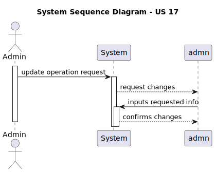

# US17 As a Doctor, I want to update an operation requisition, so that the Patient has access to the necessary healthcare

## 1. Context

This is the first time this US is tasked to us. It allows the doctor do update the operation requisition.

## 2. Requirements

**US17** As a Doctor, I want to update an operation requisition, so that the Patient has access to the necessary healthcare

### Client Specifications - Q&A

> [**Questões gerais sobre o projeto** by Gustavo Lima 1221349 - Friday, 27 de September de 2024 às 17:41]
> Olá, cliente.
> Espero que se encontre bem.
> Se não se importar, colocarei todas as questões de uma vez.
>
> 1. o user apenas pode ser um staff ou patient ou poderá ser algo mais?
> 2. o user tem a contact information, email e phone, ambos são obrigatórios?
> 3. a operation request tem o campo priority. Que priorities existem?
> 4. nos slots de availability do staff serão com um "gap temporal" de hora em hora, personalizável ou outro tempo?
> 5. para o atributo presente no appointment, date e time, há algum formato específico?
>
>> **Answer:**
>> Por favor tentem colocar apenas uma questão por post
>>
>> 1. o user apenas pode ser um staff ou patient ou poderá ser algo mais?
>> os utilizadores do sistema são os administradores, as enfermeiras e os médicos, bem como os pacientes (com limitações de funcionalidade)
>> 2. o user tem a contact information, email e phone, ambos são obrigatórios?
>> sim
>> 3. a operation request tem o campo priority. Que priorities existem?
>> Elective, Urgent, and Emergency Surgery Classifications
>> Elective Surgery: A planned procedure that is not life-threatening and can be scheduled at a convenient time (e.g., joint replacement, cataract surgery).
>> Urgent Surgery: Needs to be done sooner but is not an immediate emergency. Typically within days (e.g., certain types of cancer surgeries).
>> Emergency Surgery: Needs immediate intervention to save life, limb, or function. Typically performed within hours (e.g., ruptured aneurysm, trauma).
>> 4. nos slots de availability do staff serão com um "gap temporal" de hora em hora, personalizável ou outro tempo?
>> a disponibilidade do staff é normalmente em blocos de 15 minutos

> [**Deadline Date Suggestion by Doctors** by VARELA 1220683 - Friday, 27 de September de 2024 às 17:44]
> How does a Doctor suggests a deadline date for an appointment? Does it have any criteria? Or do they just wing it?
>> **Answer:**
>> the doctor will decide the "best" due date based on their experience. they will enter it in the system as an indication so that the planning module eventually takes that into account alongside priority and other criteria

> [**Operation Priority** by VARELA 1220683 - Friday, 27 de September de 2024 às 17:45]
> In the project document it mentions that each operation has a priority. How is a operation's priority defined? Do they have priority levels defined? Is it a scale? Or any other system?
>> **Answer:**
>> Elective Surgery: A planned procedure that is not life-threatening and can be scheduled at a convenient time (e.g., joint replacement, cataract surgery).
>> Urgent Surgery: Needs to be done sooner but is not an immediate emergency. Typically within days (e.g., certain types of cancer surgeries).
>> Emergency Surgery: Needs immediate intervention to save life, limb, or function. Typically performed within hours (e.g., ruptured aneurysm, trauma).

> [**Operation Rescheduling** by VARELA 1220683 - Friday, 27 de September de 2024 às 17:48]
> "Operations cannot exceed the estimated time unless rescheduled." is something stated in the project documentation. Can you explain this aspect of an operation appointment?
>> **Answer:**
>> basically, the planning module will schedule the operation for the average time of setup + surgery + cleaning.
>> during normal operation of the hospital a surgery might take longer than expected which will then require a rescheduling of all other surgeries for that room and staff

> [**5.1.17 - Logs** by Rui Marques 1191830 - Thursday, 10 de October de 2024 às 13:01]
> Hello Mr. Client, you want to log all updates to the operation request. Do you plan to have this info available in the app or is this just for audit purposes?
>> **Answer:**
>> the history of the operation type definition is part of the application's data. if the user needs to view the details of an operation that was performed last year, they need to be able to see the operation configuration that was in place at that time

> [**5.1.17 - Operation Request Update** by SILVA 1221675 - Monday, 21 de October de 2024 às 13:28]
> Hello,
> There was a previous question, "What information can physicians update on an operating requisition?", with the following answer, "Physicians can update the operating time, priority, and description text, but not change the patient.". However, half of this answer applies to the Operation Type, instead of the Operation Request.
> Operation Requests have, at least, an ID, a Patient, an Operation Type, a Doctor, a Deadline Date, and a Priority. Considering the previous answer, the doctor cannot change the Patient ID but can change the Priority. Besides the Priority, could the doctor also update the Deadline Date or Operation Type?
>> **Answer:**
>> the answer was about operation requests, not operation types. I believe the term "operation time" in the original answer was the reason for this misunderstanding, as it means the expected deadline for the request, not the duration.
>> thus, the doctor can change the deadline, the priority, and the description. the doctor cannot change the operation type nor the patient

### Acceptance Criteria

- US17.1. Doctors can update operation requests they created (e.g., change the deadline or priority).
- US17.2. The system checks that only the requesting doctor can update the operation request.
- US17.3. The system logs all updates to the operation request (e.g., changes to priority or deadline).
- US17.4. Updated requests are reflected immediately in the system and notify the Planning Module of any changes.

## 3. Analysis

### System Sequence Diagram

### Relevant DM Excerpts

## 4. Design

### 4.1. Realization

### 4.2. Applied Patterns

- Aggregate
- Entity
- Value Object
- Service
- MVC
- Layered Architecture
- DTO
- C4+1

### 4.3. Design Commits

> **Oct 25 2024 20:11**
>
> - documentation update

> **Oct 25 2024 20:12**
>
> - starting implementationt

> **Oct 25 2024 22:30**
>
> - fixing some implememtation issues

> **Oct 25 2024 23:41**
>
> - developing implementation

> **Oct 26 2024 00:06**
>
> - Adding bootstrap values

> **Oct 26 2024 00:33**
>
> - implementation fix

> **Oct 26 2024 01:09**
>
> - implementing US

> **Oct 26 2024 01:20**
>
> - editing implementation to reflect client specifications

> **Oct 26 2024 02:38**
>
> - documentation update sd, ssd, domain model excerpt

> **Oct 26 2024 16:58**
>
> - implementation correction, adding status, fixing request repository issues.

> **Oct 26 2024 20:17**
>
> - Creating tests for Operation Request

> **Oct 27 2024 19:37**
>
> - fixed test

## 5. Implementation

### 5.1. Code Implementation

[OperationRequestController](../../../src/Controllers/OperationRequestController.cs)

[OperationRequestService](../../../src/Domain/OperationRequests/OperationRequestService.cs)

[OperationRequest](../../../src/Domain/OperationRequests/OperationRequest.cs)

### 5.2. Tests

**Assigned Tester:** João Botelho - 1220716

#### Operation Request Controller Unit Tests

[OperationRequestControllerTest](../../../test/ControllerTest/OperationRequestControllerTest.cs)

#### Operation Request Service Unit Tests

[OperationRequestServiceTest](../../../test/ServiceTest/OperationRequestServiceTest.cs)

##### Test Cases

> EditRequest_TestSuccessful
>> Verifies the successful edit of an operation request

> EditRequest_TestUnsucessful
>> Verifies that an error is thrown in a situation when an edit should not be performed

#### US17 Integration Tests

[US17 IntegrationTest](../../../test/IntegrationTest/US17IntegrationTest.cs)

##### Test Cases

> EditOperationRequest_Successful
>> Verifies the successful edit of an operation request

> EditOperationRequest_Unsuccessful
>> Verifies that an error is thrown in a situation when an edit should not be performed

## 6. Integration/Demonstration

