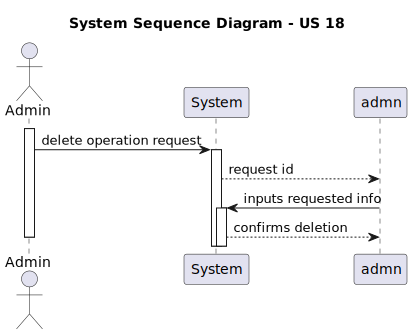
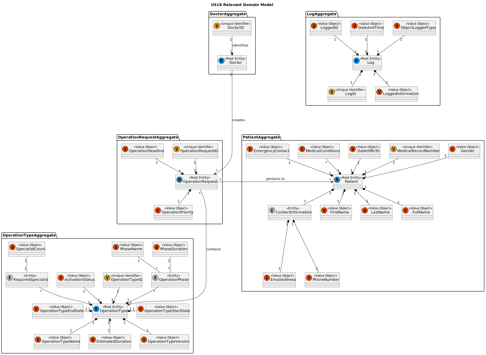
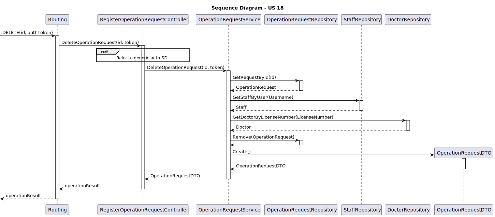
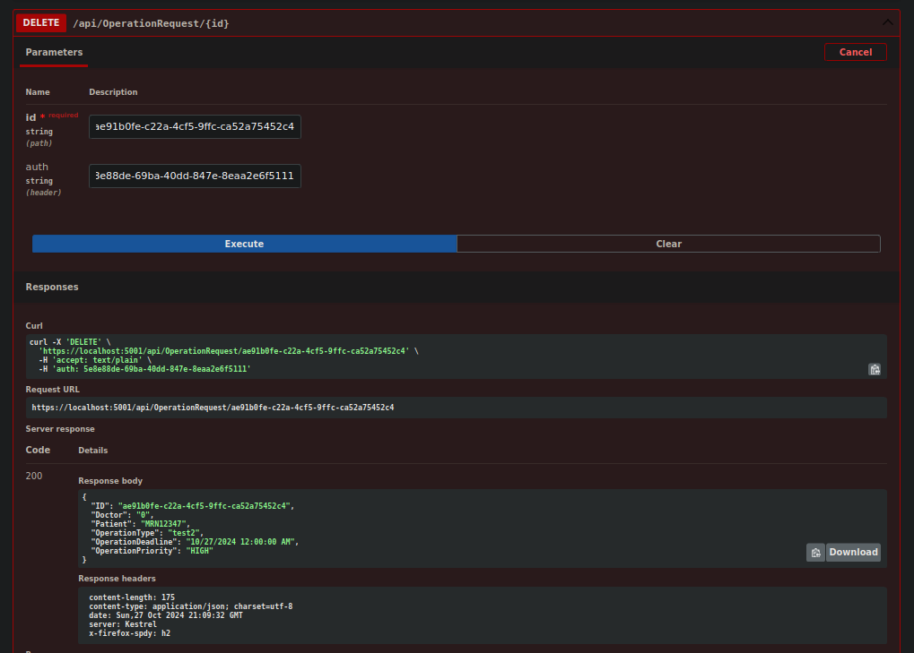

# US18 As a Doctor, I want to remove an operation requisition, so that the healthcare activities are provided as necessary

## 1. Context

This is the first time this US is tasked to us. It allows the doctor do remove an operation requisition.

## 2. Requirements

**US18** As a Doctor, I want to remove an operation requisition, so that the healthcare activities are provided as necessary

### Acceptance Criteria

- US18.1. Doctors can delete operation requests they created if the operation has not yet been scheduled.
- US18.2. A confirmation prompt is displayed before deletion.
- US18.3. Once deleted, the operation request is removed from the patient’s medical record and cannot be recovered.
- US18.4. The system notifies the Planning Module and updates any schedules that were relying on this request.

## 3. Analysis

### System Sequence Diagram

### Relevant DM Excerpts

## 4. Design

### 4.1. Realization

### 4.2. Applied Patterns

- Aggregate
- Entity
- Value Object
- Service
- MVC
- Layered Architecture
- DTO
- C4+1

### 4.3. Commits

> **Oct 26 2024 02:39**
>
> -documentation update sd, ssd, domain model excerpt

> **Oct 26 2024 01:09**
>
> - implementing US

> **Oct 27 2024 01:12**
>
> - Added tests. Slight alterations to the code.

> **Oct 27 2024 01:06**
>
> - Fixed tests.

> ** Oct 27 2024 15:24**
>
> - Updated tests.

> **Oct 27 2024 16:57**
>
> - US integration tests.

> **Oct 27 2024 19:31**
>
> - Update to tests.

## 5. Implementation

### 5.1. Code Implementation

[OperationRequestController](../../../src/Controllers/OperationRequestController.cs)

[OperationRequestService](../../../src/Domain/OperationRequests/OperationRequestService.cs)

[OperationRequest](../../../src/Domain/OperationRequests/OperationRequest.cs)

### 5.2. Tests

**Assigned Tester:** João Botelho - 1220716

#### Operation Request Controller Unit Tests

[OperationRequestControllerTest](../../../test/ControllerTest/OperationRequestControllerTest.cs)

##### Test Cases

> Test_OperationRequestController_Delete
>> Validates the deletion of an operation request

#### Operation Request Service Unit Tests

[OperationRequestServiceTest](../../../test/ServiceTest/OperationRequestServiceTest.cs)

#### US18 Integration Tests

[US18 IntegrationTest](../../../test/IntegrationTest/US18IntegrationTest.cs)

##### Test Cases

> DeleteOperationRequest_Successful
>> Verifies the successful deletion of an operation request

> DeleteOperationRequest_UnsuccessfulNoRequest
>> Verifies that an error is thrown in a situation when a deletion should not be performed

## 6. Integration/Demonstration

