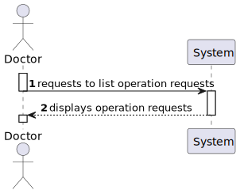

# US19 - As a Doctor, I want to list/search operation requisitions, so that I see the details, edit, and remove operation requisitions

*This is an example template*

## 1. Context

A doctor can list all their operation requisitions and, with that list, be able to see their details, edit or remove them. This is a newly assigned task during the first sprint and is to be completed in said sprint.

## 2. Requirements

**US19** As a Doctor, I want to list/search operation requisitions, so that I see the details, edit, and remove operation requisitions

**Acceptance Criteria:**

- US19.1. Doctors can search operation requests by patient name, operation type, priority, and status.

- US19.2. The system displays a list of operation requests in a searchable and filterable view.

- US19.3. Each entry in the list includes operation request details (e.g., patient name, operation type, status).

- US19.4. Doctors can select an operation request to view, update, or delete it.

**Dependencies/References:**

*Regarding this requirement we understand that it relates to...*

**Dependencies/References:**

This User Story has no functional dependencies to other user stories however it is functionally dependant on the implementation of the API.

## 3. Analysis

### System Sequence Diagram

### Relevant DM Excerpts

## 4. Design

### 4.1. Sequence Diagram

### 4.2. Applied Patterns

- Aggregate
- Entity
- Value Object
- Service
- MVC
- DTO
- Layered Architecture
- Clean Architecture
- C4+1

### 4.3. Main Commits:
> **11/10/2024 12:01 [US19]**
> - Started working on US19 documentation. Requirements and analysis.
> 
> **26/10/2024 12:38 [US19]** 
> - Fixed builder and operation request to properly add and show priority.
>
> **26/10/2024 15:47 [US19]**
> - Implementation added, added status to operation request.

## 5. Implementation

[OperationRequestController](../../../src/Controllers/OperationRequestController.cs)

[OperationRequestService](../../../src/Domain/OperationRequests/OperationRequestService.cs)

[OperationRequestBuilder](../../../src/Domain/OperationRequests/OperationRequestBuilder.cs)

[OperationRequestRepository](../../../src/Infraestructure/OperationRequest/OperationRequestRepository.cs)

### 5.1. Tests

**Assigned Tester:** Tiago Silva

#### Operation Request Controller Unit Tests

[OperationRequestControllerTest](../../../test/ControllerTest/OperationRequestControllerTest.cs)

##### Test Cases

**Test_OperationRequestController_Create**
> Verifies that the controller properly calls the service which will return the operation request list.

#### Staff Service Unit Tests

[OperationRequestServiceTest](../../../test/ServiceTest/OperationRequestServiceTest.cs)

##### Test Cases

**Test_OperationRequest_FilterList**
> Verifies that, by sending the required information, the service properly returns the operation request list.

#### US19 Integration Tests

[US19/Integration/Tests](../../../test/IntegrationTest/US19IntegrationTest.cs)

##### Test Cases

**Test_US19IntegrationTest_FilterTest1**
>> Verifies that the functionality properly returns a list with filtered operation requests, by filtering by operation priority.

**Test_US19IntegrationTest_FilterTest2**
>> Verifies that the functionality properly returns a list with filtered operation requests, by filtering by patient id and priority.

## 6. Integration/Demonstration

**Demonstration with operation type that no request has:**

[US19-Demonstration_data](us19_demonstration_data.png)
[US19-Demonstration_data](us19_demonstration_result.png)

**Demonstration with operation type that a request has:**

[US19-Demonstration_data](us19_demonstration_data2.png)
[US19-Demonstration_data](us19_demonstration_result2.png)

## 7. Observations

No observations made.