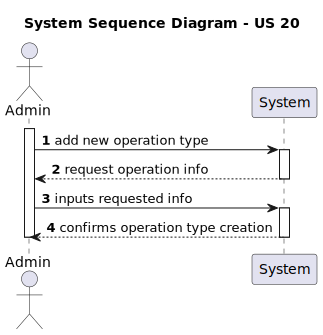
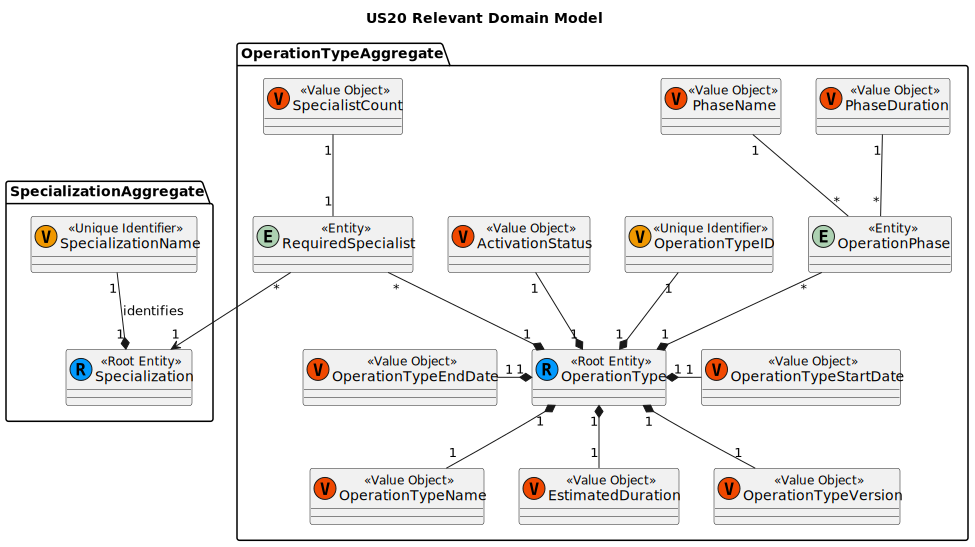
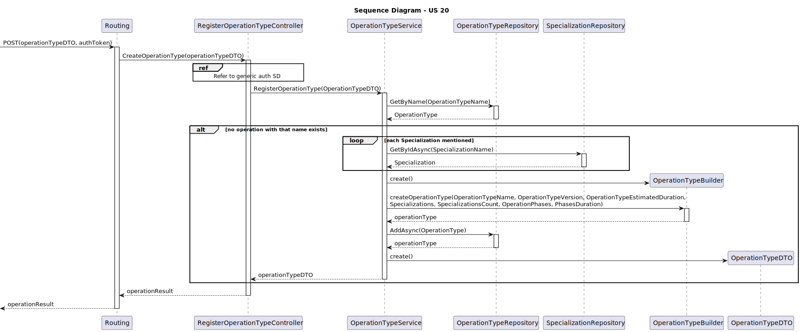
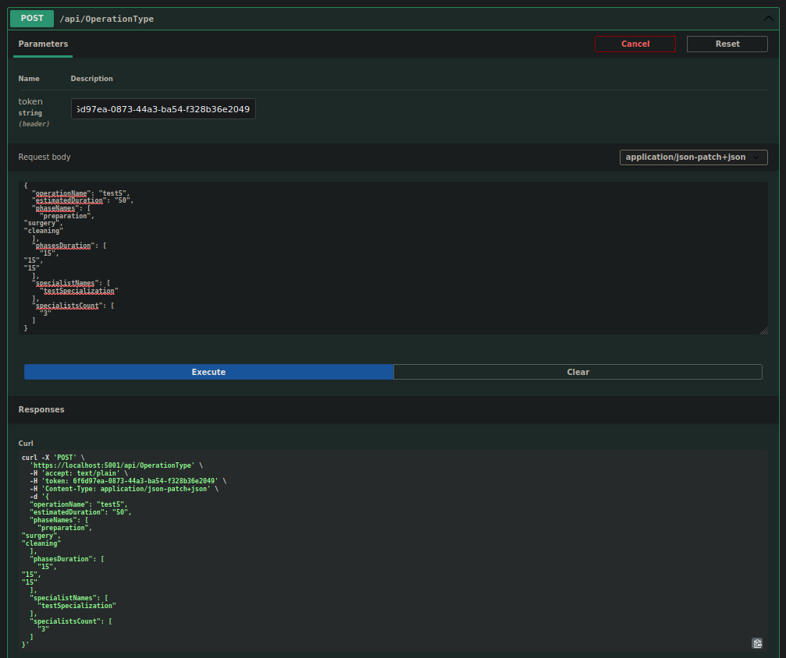
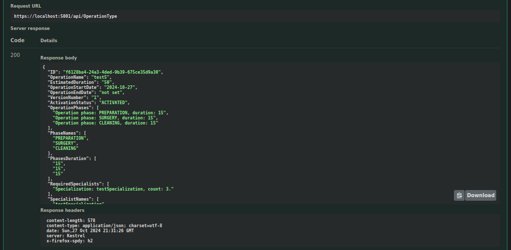

# US20 - As an Admin, I want to add new types of operations, so that I can reflect the available medical procedures in the system

## 1. Context

This User Story focuses on the creation of new operation types, so that they may be used when booking appointments.
This US was first assigned during sprint A, as such it is the first time it is being undertaken.

## 2. Requirements

**US20** As an Admin, I want to add new types of operations, so that I can reflect the available medical procedures in the system

### Client Specifications - Q&A

> [**Required Staff** by VARELA 1220683 - Friday, 27 de September de 2024 às 19:48]
> Regarding the required Staff, what is it? A list that defines the specializations and roles of the staff involved in the appointment? Like 2 heart doctors and 5 heart nurses?
>> **Answers:**
>> yes

> [**Hospital Equipment** by VARELA 1220683 - Friday, 27 de September de 2024 às 19:51]
> Does the hospital/clinic have a defined set/quantity of equipments or can it be added more equipment to the institution?
> What do you consider to be equipments? Machines or anything including disposable things like syringes?
>> **Answer:**
>> equipment is out of scope

> [**Specializations** by CASTRO 1220636 - Friday, 4 de October de 2024 às 17:38]
> Boa tarde, gostaria de saber se é objetivo o sistema diferenciar as especializações para cada tipo de staff. Ou seja se temos de validar que a especialização x só pode ser atribuída por exemplo a um membro do staff que seja doctor, ou se consideramos que qualquer especialização existente no sistema pode ser atribuída a qualquer staff ficando da autoria do responsável por criar os perfis atribuir especializações válidas de acordo com a role do staff.
>> **Answer:**
>> as especializações são independentes do professional ser médico ou enfermeiro

> [**Phases of surgery** by MIGUEL 1211281 - Saturday, 5 de October de 2024 às 12:17]
> Are the different phases of surgery relevant to the business and should they be recorded in the system?
>> **Answer:**
>> yes. they are important due to the time it takes each phase and in the future for the planning of different teams (e.g., cleaning team)

> [**Surgery time** by MIGUEL 1211281 - Saturday, 5 de October de 2024 às 12:18]
> The document you provided divides surgical times into "specific phases of the surgery," whereas the main statement only mentions recording the total surgery time. Should the system, therefore, store and specify the time spent on each phase of the surgery, or is it sufficient to only record the total surgery time without detailing the time distribution across each phase?
>> **Answer:**
>> when describing an operation type, the system must record the time for each phase

> [**5.1.20 Operation type surgery phase** by Tiago Sousa 1191583 - Monday, 7 de October de 2024 às 19:43]
> In the document with the surgeries, they all have 3 phases and respective duration:
>
> - Anesthesia/patient preparation
> - Surgery
> - Cleaning
>
> Can we assume while creating a new operation type, that the surgery must always have this 3 phases?
>> **Answer:**
>> yes

> [**Duvida 5.1.20-21** by Paulo Coelho 1050049 - Wednesday, 9 de October de 2024 às 16:28]
> 5.1.20
> Na criação de um novo tipo de operação,
> Temos um nome , 3 fases temporal da Cirurgia, lista "requeridas" de (especialidades, quantidade ).
> Esse novo tipo de operação  não deve ter uma especialidade para alem das requeridas de modo segundo 5.1.16 AC2 um médico só pode marcar Cirurgia da sua especialidade?
> O processo é criar o novo tipo de operação e depois adicionar a lista de especialidades requeridas?
>> **Answer:**
>> 5.1.20 - sim. o tipo de operação está associado com uma dada especialidade. a lista de especialidaes faz parte integrante do tipo de operação. a criação é efetuada num único passo e não em dois passos como sugeres

> [**Do change to operations affected scheduled ones** by PEREIRA 1211916 - Thursday, 10 de October de 2024 às 10:14]
> Hello,
> In US 5.1.22, when editing an operation, what happens to the scheduled ones? Do they get updated accordingly and rescheduled, or do they remain the same?
> Also regarding 5.1.20 and 5.1.21 Can the name be edited and can the name be the same as a deactivated operation?
> Best regards,
> Mário Leal
>> **Answer:**
>> the name of the operation type must be unique. even if an operation type is "deactivated" it still exists in the system and as such no other operation type can have the same name
>> when editing an operation type there is the need to indicate a date when that configuration will be put in place. if there are operations of that type, scheduled after that date, the system should ideally start a rescheduling

### Acceptance Criteria

- US20.1. Admins can add new operation types with attributes like:
  - Operation Name
  - Required Staff by Specialization
  - Estimated Duration:
    - defined for each phase of the operation
- US20.2. The system validates that the operation name is unique
- US20.3. The system logs the creation of new operation types and makes them available for scheduling immediately
- US20.4. The system logs the date of creation as the start date, since it is a new operation in the system

### Dependencies/References

- Many other user stories require/reference operation types, thus, inherently, referencing this particular user story.
- **US12 -** specialization is assigned by an admin upon staff profile creation.
- **Specialization -** requires specialization to have already been implemented.
- **Estimated duration -** will be used for the scheduling timetable.

## 3. Analysis

### System Sequence Diagram

### Relevant DM Excerpts

## 4. Design

### 4.1. Realization

### 4.2. Applied Patterns

- Aggregate
- Entity
- Value Object
- Service
- MVC
- Layered Architecture
- DTO
- C4+1
- Builder

### 4.3. Commits

> **Oct 21 2024 20:32**
>
> - US20 documentation update

> **Oct 21 2024 20:35**
>
> - US20 initial implementation

> **Oct 25 2024 17:01**
>
> - Documentation update to reflect implementation changes

> **Oct 25 2024 17:06**
>
> - implementation update

> **Oct 25 2024 21:08**
>
> - simplifying required specialist

> **Oct 26 2024 00:38**
>
> - Fixed builder and operation request to properly add and show priority.

> **Oct 26 2024 15:47**
>
> - Implementation added, added status to operation request.

## 5. Implementation

### 5.1. Code Implementation

[OperationTypeController](../../../src/Controllers/OperationTypeController.cs)

[OperationTypeService](../../../src/Domain/OperationTypes/OperationTypeService.cs)

[OperationType](../../../src/Domain/OperationTypes/OperationType.cs)

### 5.2. Tests

**Assigned Tester:** João Botelho - 1220716

#### Operation Request Controller Unit Tests

[OperationTypeControllerTest](../../../test/ControllerTest/OperationTypeControllerTest.cs)

##### Test Cases

> Create_Successful
>> Validates the successful creation of an operation type

> Create_Unsuccessful
>> Check proper error occurrence of an operation type

#### Operation Request Service Unit Tests

[OperationTypeServiceTest](../../../test/ServiceTest/OperationTypeServiceTest.cs)

##### Test Cases

> RegisterOperationType_Successful
>> Validates the successful creation of an operation type

> RegisterOperationType_UnsuccessfulNotEnoughPhases
>> Check proper error occurrence of an operation type

> RegisterOperationType_UnsuccessfulExistingType
>> Check proper error occurrence of an operation type

#### US20 Integration Tests

[US20 IntegrationTest](../../../test/IntegrationTest/US20IntegrationTest.cs)

##### Test Cases

> RegisterOperationType_Successful
>> Validates the successful creation of an operation type

> RegisterOperationType_UnsuccessfulNotEnoughPhases
>> Check proper error occurrence of an operation type

> RegisterOperationType_UnsuccessfulExistingType
>> Check proper error occurrence of an operation type

## 6. Integration/Demonstration

