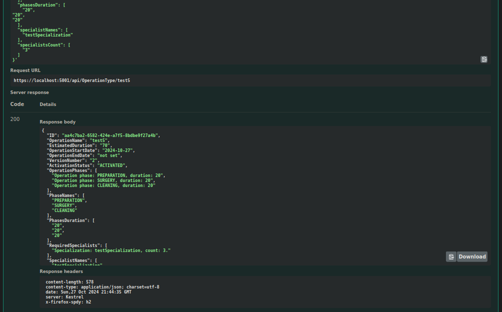

# US21 As an Admin, I want to edit existing operation types, so that I can update or correct information about the procedure

## 1. Context

This User Story is focused around updating operation types, so that they may be used when booking appointments.
This US was first assigned during sprint A, as such it is the first time it is being undertaken.

## 2. Requirements

**US21** As an Admin, I want to edit existing operation types, so that I can update or correct information about the procedure.

### Client Specifications - Q&A

> [**Required Staff** by VARELA 1220683 - Friday, 27 de September de 2024 às 19:48]
> Regarding the required Staff, what is it? A list that defines the specializations and roles of the staff involved in the appointment? Like 2 heart doctors and 5 heart nurses?
>> **Answers:**
>> yes

> [**Hospital Equipment** by VARELA 1220683 - Friday, 27 de September de 2024 às 19:51]
> Does the hospital/clinic have a defined set/quantity of equipments or can it be added more equipment to the institution?
> What do you consider to be equipments? Machines or anything including disposable things like syringes?
>> **Answer:**
>> equipment is out of scope

> [**Phases of surgery** by MIGUEL 1211281 - Saturday, 5 de October de 2024 às 12:17]
> Are the different phases of surgery relevant to the business and should they be recorded in the system?
>> **Answer:**
>> yes. they are important due to the time it takes each phase and in the future for the planning of different teams (e.g., cleaning team)

> [**Surgery time** by MIGUEL 1211281 - Saturday, 5 de October de 2024 às 12:18]
> The document you provided divides surgical times into "specific phases of the surgery," whereas the main statement only mentions recording the total surgery time. Should the system, therefore, store and specify the time spent on each phase of the surgery, or is it sufficient to only record the total surgery time without detailing the time distribution across each phase?
>> **Answer:**
>> when describing an operation type, the system must record the time for each phase

> [**5.1.20 Operation type surgery phase** by Tiago Sousa 1191583 - Monday, 7 de October de 2024 às 19:43]
> In the document with the surgeries, they all have 3 phases and respective duration:
>
> - Anesthesia/patient preparation
> - Surgery
> - Cleaning
>
> Can we assume while creating a new operation type, that the surgery must always have this 3 phases?
>> **Answer:**
>> yes

> [**5.1.21 Operation Type edit** by Tiago Sousa 1191583 - Monday, 7 de October de 2024 às 19:53]
> Can you clarify? 
> "Historical data is maintained, but new operation requests will use the updated operation type information. "
>> **Answer:**
>> it means that if an operation type is changed we need to keep track of its changes. For instance,
>> Operation Type "A" is defined as taking 30 minutes preparation, 1h surgery and 30 minutes cleaning with a team of 1 doctor with specialization X and one nurse with specialization Y some operations are requested, scheduled and performed based on this definition after sometime, the hospital changes its procedures and defines the operation type "A" as needing 30 min prep, 30 min. surgery and 30 min. cleaning, with a team of 3 doctors and one nurse.
>> new operations will be requested, scheduled and performed using this new definition, however, we need to keep historical data, so that if the admin wants to know the details of an operation in the past, the system must show the operation type as it was defined at the time of the operation request

> [**Duvida 5.1.20-21** by Paulo Coelho 1050049 - Wednesday, 9 de October de 2024 às 16:28]
> 5.1.20
> Na criação de um novo tipo de operação,
> Temos um nome , 3 fases temporal da Cirurgia, lista "requeridas" de (especialidades, quantidade ).
> Esse novo tipo de operação  não deve ter uma especialidade para alem das requeridas de modo segundo 5.1.16 AC2 um médico só pode marcar Cirurgia da sua especialidade?
> O processo é criar o novo tipo de operação e depois adicionar a lista de especialidades requeridas?
>> **Answer:**
>> 5.1.20 - sim. o tipo de operação está associado com uma dada especialidade. a lista de especialidaes faz parte integrante do tipo de operação. a criação é efetuada num único passo e não em dois passos como sugeres

> [**Do change to operations affected scheduled ones** by PEREIRA 1211916 - Thursday, 10 de October de 2024 às 10:14]
> Hello,
> In US 5.1.22, when editing an operation, what happens to the scheduled ones? Do they get updated accordingly and rescheduled, or do they remain the same?
> Also regarding 5.1.20 and 5.1.21 Can the name be edited and can the name be the same as a deactivated operation?
> Best regards,
> Mário Leal
>> **Answer:**
>> the name of the operation type must be unique. even if an operation type is "deactivated" it still exists in the system and as such no other operation type can have the same name
>> when editing an operation type there is the need to indicate a date when that configuration will be put in place. if there are operations of that type, scheduled after that date, the system should ideally start a rescheduling

> [**US5.1.21 - Edit Operation Type** by Tiago Carvalho 1221124 - Thursday, 10 de October de 2024 às 16:44]
> Dear client,
> In a previous answer you stated that "The type of operation is associated with a given specialty".
> In another answer you said "a team of 1 doctor with specialization X and one nurse with specialization Y" (regarding the required staff for a said type of operation).
> From the specifications document and the additional document with the 10 most common types of operations, we have two specializations: orthopedics and cardiology.
> My question is: If the operation type already has a specialization associated, how can we have staff with different specializations?
> What do you understand by specialization? Is it cardiology/orthopedics? Or anaesthesist/circulating/...
> Thank you for your time.
>> **Answer:**
>> the operation is mainly associated with one specialization, but for a specific operation it might require a team with multiple specializations.
>> cardiology, orthopedics, anaesthesist are specializations that either doctors or nurses can have.
>> the circulating technician is a different type of medical professional. for now the system doesn't need to support technicians

> [**Excerpt from Re: Transcript of OT class 2024.10.12** - Saturday, 12 de October de 2024 às 10:40]
> Q1: What is the process for handling the editing of operations, specifically regarding their type and history?
>> When editing an operation, the system needs to maintain the history of the original operation type. The challenge is that operation names must be unique, and you may want to track versions of operations over time. One approach is to use an auxiliary table to store operation history, ensuring you can track changes and retrieve past data, much like how VAT changes in invoices are handled.

### Acceptance Criteria

- US21.1 Admins can search for and select an existing operation type to edit.
- US21.2 Editable fields include operation name, required staff by specialization, and estimated duration.
- US21.3 Changes are reflected in the system immediately for future operation requests.
- US21.4 Historical data is maintained, but new operation requests will use the updated operation type information.

### Dependencies/References

- **US20 -** requires operations to already be in the system.
- **Specialization -** requires specialization to have already been implemented.

## 3. Analysis

### System Sequence Diagram

### Relevant DM Excerpts

## 4. Design

### 4.1. Realization

### 4.2. Applied Patterns

- Aggregate
- Entity
- Value Object
- Service
- MVC
- Layered Architecture
- DTO
- C4+1
- Builder

### 4.3. Commits

> **Oct 25 2024 17:02**
>
> - Oct 25 2024 17:02

> **Oct 27 2024 15:23**
>
> - Added service tests.

> **Oct 27 2024 19:32**
>
> - Added integration tests and controller test.

## 5. Implementation

### 5.1. Code Implementation

[OperationTypeController](../../../src/Controllers/OperationTypeController.cs)

[OperationTypeService](../../../src/Domain/OperationTypes/OperationTypeService.cs)

[OperationType](../../../src/Domain/OperationTypes/OperationType.cs)

### 5.2. Tests

**Assigned Tester:** João Botelho - 1220716

#### Operation Request Controller Unit Tests

[OperationTypeControllerTest](../../../test/ControllerTest/OperationTypeControllerTest.cs)

##### Test Cases

> UpdateByName_Successful
>> Validates the successful update of an operation type

> UpdateByName_Unsuccessful
>> Check proper error occurrence on updating an operation type

#### Operation Request Service Unit Tests

[OperationTypeServiceTest](../../../test/ServiceTest/OperationTypeServiceTest.cs)

##### Test Cases

> UpdateOperationType_Successful
>> Validates the successful update of an operation type

#### US21 Integration Tests

[US21 IntegrationTest](../../../test/IntegrationTest/US21IntegrationTest.cs)

##### Test Cases

> UpdateOperationType_Successful
>> Validates the successful update of an operation type

## 6. Integration/Demonstration

