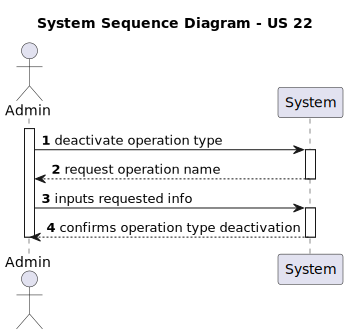
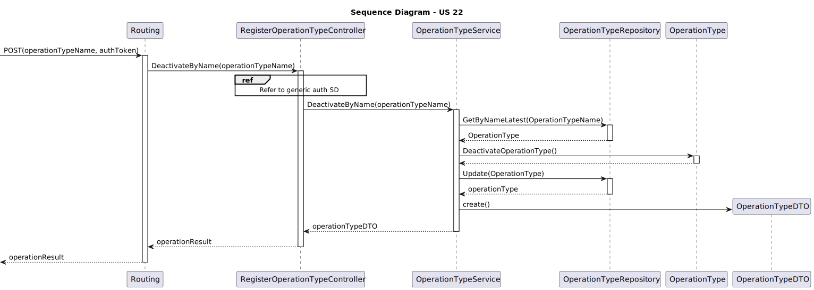

# US22 As an Admin, I want to remove obsolete or no longer performed operation types, so that the system stays current with hospital practices

## 1. Context

This User Story is focused around deactivating operation types.
This US was first assigned during sprint A, as such it is the first time it is being undertaken.

## 2. Requirements

**US22** As an Admin, I want to remove obsolete or no longer performed operation types, so that the system stays current with hospital practices

### Client Specifications - Q&A

> [**5.1.22 - As an Admin, I want to remove obsolete or no longer performed operation types, so that the system stays current with hospital practices.** by João Alexandre Oliveira 1221676 - Thursday, 10 de October de 2024 às 21:39]
> Is marking operation types intended to be permanent, or should we anticipate the possibility of reactivating them in the future?
> *addendum:* When I say "marking" I'm talking about this acceptance criteria:
> "Admins can search for and mark operation types as inactive (rather than deleting them) to preserve historical records."
>> **Answer:**
>> for now you don't need to implement reactivating a previously deactivated operation type, but that might be a requirement in the future

### Acceptance Criteria

- US22.1. Admins can search for and mark operation types as inactive (rather than deleting them) to preserve historical records.
- US22.2. Inactive operation types are no longer available for future scheduling but remain in historical data.
- US22.3. A confirmation prompt is shown before deactivating an operation type.

### Dependencies/References

- **US20 -** requires operations to already be in the system.
- **Specialization -** requires specialization to have already been implemented.

## 3. Analysis

### System Sequence Diagram

### Relevant DM Excerpts

## 4. Design

### 4.1. Realization

### 4.2. Applied Patterns

- Aggregate
- Entity
- Value Object
- Service
- MVC
- Layered Architecture
- DTO
- C4+1
- Builder

### 4.3. Commits

> **Oct 25 2024 17:02**
>
> - documentation update

> **Oct 27 2024 15:23**
>
> - Added service tests.

> **Oct 27 2024 19:32**
>
> - Added integration tests and controller test.

> **Oct 27 2024 21:52**
>
> - Fix to integration test.

## 5. Implementation

### 5.1. Code Implementation

[OperationTypeController](../../../src/Controllers/OperationTypeController.cs)

[OperationTypeService](../../../src/Domain/OperationTypes/OperationTypeService.cs)

[OperationType](../../../src/Domain/OperationTypes/OperationType.cs)

### 5.2. Tests

**Assigned Tester:** João Botelho - 1220716

#### Operation Request Controller Unit Tests

[OperationTypeControllerTest](../../../test/ControllerTest/OperationTypeControllerTest.cs)

##### Test Cases

> DeactivateByName_Successful
>> Validates the successful deactivation of an operation type

> DeactivateByName_Unsuccessful
>> Check proper error occurrence on deactivating an operation type

#### Operation Request Service Unit Tests

[OperationTypeServiceTest](../../../test/ServiceTest/OperationTypeServiceTest.cs)

##### Test Cases

> DeactivateByName_Successful
>> Validates the successful deactivation of an operation type

#### US22 Integration Tests

[US22 IntegrationTest](../../../test/IntegrationTest/US22IntegrationTest.cs)

##### Test Cases

> DeactivateByName_Successful
>> Validates the successful deactivation of an operation type

## 6. Integration/Demonstration

