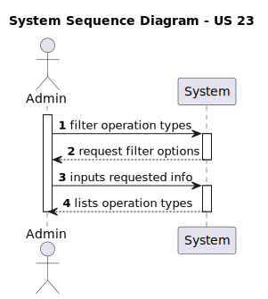
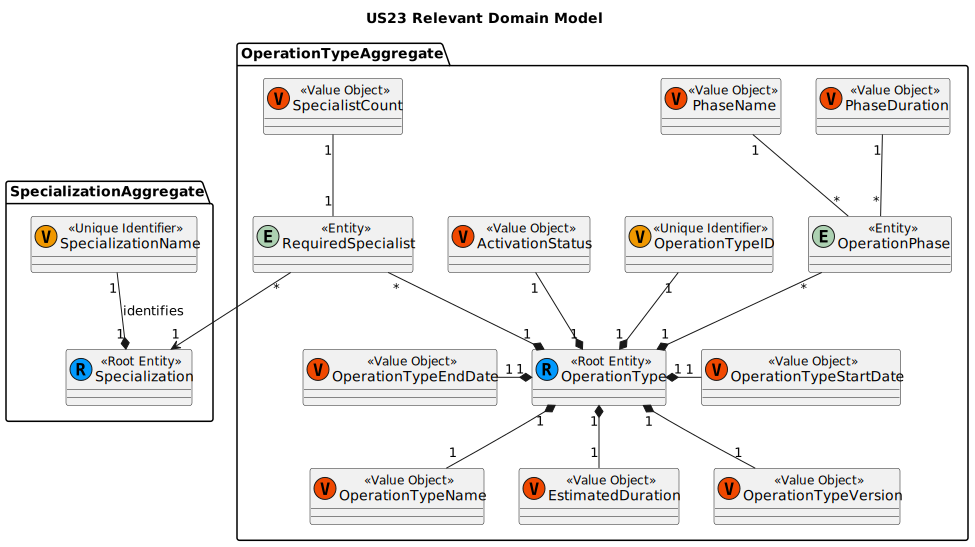
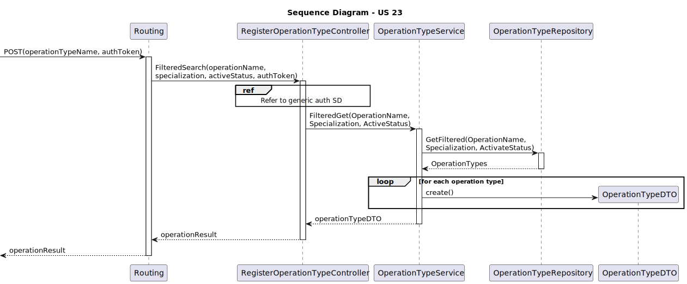
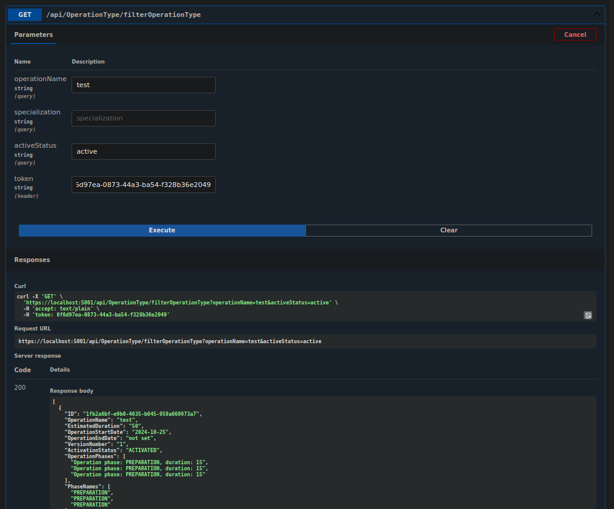
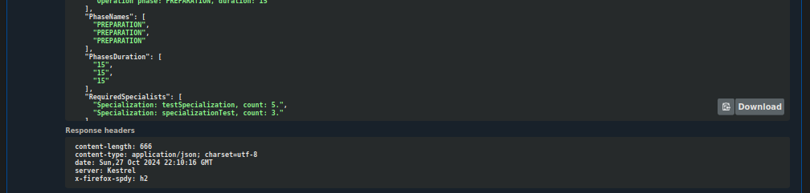

# US23 As an Admin, I want to list/search operation types, so that I can see the details, edit, and remove operation types

## 1. Context

This User Story is focused around listing operation types.
This US was first assigned during sprint A, as such it is the first time it is being undertaken.

## 2. Requirements

**US23** As an Admin, I want to list/search operation types, so that I can see the details, edit, and remove operation types

### Client Specifications - Q&A

> [**Search Filters for Profiles and Operation Types** by VARELA 1220683 - Friday, 27 de September de 2024 às 18:11]
> What filters are you looking for in the search/list of staff and patient profiles? And what about operation types?
>> **Answer:**
>> answered in 2024.10.04 class
>>> **Excerpt from 2024.10.04 class:**
>>> The next one is about User Story 23, which states that the admin can choose an operation to load one of the specific actions, with the specified action. With that in mind, should the removal or any other type of operation type action be accessible only through this method? Or can there be another way to remove or update any type of operation? I don't understand the question, but I think I understand what you are saying. So think about 5.1.23 from a user experience, user interface perspective.
>>> In terms of the API, if that's what you're talking about, yes, you need something that lets you search, and then you need something in the API that lets you edit, and you need something in the API that lets you remove an operation type. I think that was your question, right? Yes. And if it's not? I get it, yes.
>>> And if you prefer to say it in Portuguese, that's fine too. If you find it clearer. The next one is about removing operation types.
>>> This is how the user story is described, but in the acceptance criteria, the concept of deactivation is introduced. So, is removing actually deactivating the type of operation? Yes, the question is, you need to think in terms of timeline. So, I might have a specific type of operation, say, some kind of leg surgery.
>>> But for some reason, I decided that my hospital would no longer do this type of leg surgery. But I have done it in the past. So, I can't really remove the type of leg surgery.
>>> What I can do is disable this type of operation, so that it is no longer available, so that doctors can no longer order this type of operation. But if I look at the data from the past, and if I have any leg surgery operations, of course I will have the type of leg surgery operation as well. But it is disable.

> [**Excerpt from Re:Transcript of class 2024.10.04** - Friday, 4 de October de 2024 às 17:53]
> **User Story 23**:
>
> - **Question**: Should actions like removing an operation type be accessed only through specific methods?
> - **Answer**: Yes, operations like removal or deactivation should be available via specific API methods.
>
> **Deactivation vs Removal**:
>
> - **Question**: Is removing an operation type the same as deactivating it?
> - **Answer**: Yes, deactivating makes the operation type unavailable for future use but retains historical data.

### Acceptance Criteria

- US23.1. Admins can search and filter operation types by name, specialization, or status (active/inactive).
- US23.2. The system displays operation types in a searchable list with attributes such as name, required staff, and estimated duration.
- US23.3. Admins can select an operation type to view, edit, or deactivate it.

### Dependencies/References

- **US20 -** requires operations to already be in the system.
- **Specialization -** requires specialization to have already been implemented.

## 3. Analysis

*In this section, the team should report the study/analysis/comparison that was done in order to take the best design decisions for the requirement. This section should also include supporting diagrams/artifacts (such as domain model; use case diagrams, etc.),*

### System Sequence Diagram

### Relevant DM Excerpts

## 4. Design

### 4.1. Realization

### 4.2. Applied Patterns

- Aggregate
- Entity
- Value Object
- Service
- MVC
- Layered Architecture
- DTO
- C4+1
- Builder

### 4.3. Commits

> **Oct 25 2024 17:03**
>
> - documentation update

> **Oct 26 2024 16:57**
>
> - small implementation correction

> **Oct 27 2024 15:23**
>
> - Added service tests.

> **Oct 27 2024 19:32**
>
> - Added integration tests and controller test.

> **Oct 27 2024 19:43**
>
> - Fixed a test.

## 5. Implementation

### 5.1. Code Implementation

[OperationTypeController](../../../src/Controllers/OperationTypeController.cs)

[OperationTypeService](../../../src/Domain/OperationTypes/OperationTypeService.cs)

[OperationType](../../../src/Domain/OperationTypes/OperationType.cs)

### 5.2. Tests

**Assigned Tester:** João Botelho - 1220716

#### Operation Request Controller Unit Tests

[OperationTypeControllerTest](../../../test/ControllerTest/OperationTypeControllerTest.cs)

##### Test Cases

> FilteredSearch_Successful
>> Validates the successful filter of operation types in the system

> FilteredSearch_Unsuccessful
>> Check proper error occurrence when trying to filter operation types

#### Operation Request Service Unit Tests

[OperationTypeServiceTest](../../../test/ServiceTest/OperationTypeServiceTest.cs)

##### Test Cases

> FilteredGet_Successful
>> Validates the successful filter of operation types in the system

#### US23 Integration Tests

[US23 IntegrationTest](../../../test/IntegrationTest/US23IntegrationTest.cs)

##### Test Cases

> FilteredGet_Successful
>> Validates the successful filter of operation types in the system

## 6. Integration/Demonstration

