# 3D visualization Module Implementation

## Table of Contents

- [3D visualization Module Implementation](#3d-visualization-module-implementation)
  - [Table of Contents](#table-of-contents)
  - [1. Global Context](#1-global-context)
  - [2. Hospital Layout](#2-hospital-layout)
    - [2.1 Ground and Walls Setup](#21-ground-and-walls-setup)
    - [2.2 Door Creation](#22-door-creation)
    - [2.3 Object Placement](#23-object-placement)
    - [2.4 Room Identification (Sprites)](#24-room-identification-sprites)
  - [3. Texture Implementation](#3-texture-implementation)
  - [4. Camera Implementation](#4-camera-implementation)
  - [5. Light Implementation](#5-light-implementation)
    - [After Ambient Lighting](#after-ambient-lighting)
    - [After Directional Lighting](#after-directional-lighting)
      - [With Bed Shadow Casting](#with-bed-shadow-casting)
      - [With Wall and Bed Shadow Casting](#with-wall-and-bed-shadow-casting)

## 1. Global Context

In this US, the client tasked us with creating a **3D visualization of our hospital**, one that can be interacted with, so as to find the room schedule and availability at a given moment.

Although much of the **original code was altered** and **many methods accommodate a different thought process** than what was taught, this task was still **heavily inspired** in the "Basic_Thumb_Raiser" project, lectured in the SGRAI subject. Some methods, like wall creation, inspired several others, like door creation, that were **adapted to better suit the hospital environment**. So it is worth mentioning that some methods can have the same thought process, but still adapted to match the project's needs.

In this document we will also be demonstrating how this module works, along with the reasoning behind the implementation decisions that were taken. Alongside this, we will also be displaying visual demonstrations of each module, and mentioning any materials used from third party sources.

The code implementation is in: [frontend/src/app/hospital](../../../frontend/src/app/hospital/hospital.component.ts)

## 2. Hospital Layout

This section alludes to the US 6.5.1. and it explains the process of creation of the main 3D enviroment.

As previously mention, it takes inspiration on the "Basic_Thumb_Raiser" project, but it had to follow some requirements:

- JSON importable formatted file with the hospital description.
- The floor must consist of several surgical rooms.
- Each room must be enclosed by walls and include a door and a surgical table.
- There should be no representation of the ceiling.
- Representation of a room being used (3D model of a human body lying on the table).

All this criteria were met and the project was converted to TypeScript to be able to run in Angular-THREE.

### 2.1 Ground and Walls Setup

In regards to drawing the map layout, our original plan was to use the "Basic_Thumb_Raiser" map template (loquitas.json). This, however, came with several downsides:

- No visual room representation in the map;
- No space to represent room id inside the map;
- No representation for where the doors would be placed;
- Lack of versatility;

To try and counteract these we tried several other ideas, which wound up as mostly band aid fixes that didn't address our core issues, some would make into the final json representation, but most were scrapped.

***First Atempt***

```json
"map": [
        [3, 2, 2, 3, 2, 3, 2, 3, 2, 2, 2, 2, 3, 2, 1],
        [1, 0, 0, 1, 0, 1, 0, 1, 0, 0, 0, 0, 0, 0, 1],
        [1, 0, 0, 3, 3, 0, 0, 1, 0, 0, 0, 0, 3, 2, 1],
        [1, 0, 0, 1, 2, 2, 2, 2, 2, 2, 2, 3, 2, 0, 1],
        [3, 2, 2, 1, 3, 2, 3, 2, 3, 2, 1, 1, 0, 0, 1],
        [1, 0, 0, 1, 1, 0, 3, 3, 2, 3, 1, 1, 0, 0, 1],
        [1, 0, 0, 1, 1, 0, 3, 0, 0, 2, 0, 2, 3, 2, 1],
        [3, 2, 2, 1, 2, 2, 0, 0, 0, 0, 0, 3, 2, 2, 1],
        [1, 0, 0, 1, 0, 3, 2, 2, 2, 2, 1, 1, 0, 0, 1],
        [1, 0, 0, 3, 2, 1, 0, 0, 0, 0, 1, 1, 0, 0, 1],
        [2, 2, 2, 2, 2, 2, 0, 0, 2, 2, 2, 2, 2, 2, 0]
    ],
```

***Band aid fixes***

```json
"exitLocation": [0, 6, 2],
"rooms": {
 "MediumRoom1": {
  "measures":    [[[0, 0],[3, 2]]], 
  "door":        [2 , 3, 2],
  "table":    [[1, 1, 2]]
  },
 "SmallRoom1": {
  "measures":    [ [[4, 0],[6, 2]] ], 
  "door":        [5, 3, 2],
  "table":    [[6, 1, 2]]
  },
 "BigRoom1": {
  "measures":    [[[0, 7],[2, 2]], [[0,12],[1,13]]], 
  "door":        [2 , 3, 2],
  "table":    [[1, 1, 2]]
  }
```

Afterwards, while trying to come up with a new direction for the implementation, still attempting to make the original work, we came up with a new setup that would not only directly address the above issues, but also simplify our implementation, and allow for much more versatility.

````json
"layout": [
 [1,  1 ,  1 ,  1 , 1 ,  1 ,  1 ,  1 ,  1 ,  1 ,  1 ,  1 ,  1 ,  1 ,  1 ,  1 ,  1 ,  1 ,  1 ,  1 ,  1 ,  1 ,  1 ],
 [1, "A", "A", "A", 1 ,  0 ,  0 ,  1 ,  0 ,  0 ,  1 , "B", "B", "B", "B", "B", "B", "B", "B",  1 , "B", "B",  1 ],
 [1, "A", "A", "A", 1 ,  0 ,  0 ,  1 ,  0 ,  0 ,  1 , "B", "B", "B", "B", "B", "B", "B", "B", "B", "B", "B",  1 ],
 [1, "A", "A", "A", 1 ,  2 ,  1 ,  1 ,  0 ,  0 ,  1 , "B", "B", "B", "B", "B", "B", "B", "B",  1 ,  1 ,  1 ,  1 ],
 [1, "A", "A", "A", 1 ,  0 ,  2 ,  0 ,  0 ,  0 ,  1 , "B", "B", "B", "B", "B", "B", "B", "B",  1 , "C", "C",  1 ],
 [1, "A", "A", "A", 2 ,  0 ,  1 ,  1 ,  1 ,  1 ,  1 ,  2 ,  1 ,  1 ,  1 ,  1 ,  2 ,  2 ,  1 ,  1 ,  1 , "C",  1 ],
 [1, "A", "A", "A", 2 ,  0 ,  0 ,  0 ,  0 ,  0 ,  0 ,  0 ,  0 ,  0 ,  0 ,  0 ,  0 ,  0 ,  2 , "C", "C", "C",  1 ],
 [1,  1 ,  1 ,  1 , 1 ,  0 ,  1 ,  1 ,  2 ,  1 ,  1 ,  2 ,  1 ,  1 ,  2 ,  1 ,  1 ,  0 ,  2 , "C", "C", "C",  1 ],
 [1, "F", "F", "F", 2 ,  0 ,  1 ,  0 ,  0 ,  0 ,  1 ,  0 ,  0 ,  1 ,  0 ,  0 ,  1 ,  0 ,  1 , "C", "C", "C",  1 ],
 [1, "F", "F", "F", 1 ,  0 ,  1 ,  0 ,  0 ,  0 ,  1 ,  0 ,  0 ,  1 ,  0 ,  0 ,  1 ,  0 ,  1 , "C", "C", "C",  1 ],
 [1, "F", "F", "F", 1 ,  0 ,  1 ,  0 ,  0 ,  0 ,  1 ,  1 ,  1 ,  1 ,  1 ,  1 ,  1 ,  0 ,  1 , "C", "C", "C",  1 ],
 [1, "F", "F", "F", 1 ,  0 ,  1 ,  0 ,  0 ,  0 ,  1 ,  0 ,  2 ,  0 ,  2 ,  0 ,  1 ,  0 ,  1 ,  1 ,  1 ,  1 ,  1 ],
 [1, "F", "F", "F", 1 ,  0 ,  1 ,  0 ,  0 ,  0 ,  1 ,  1 ,  1 ,  0 ,  1 ,  1 ,  1 ,  0 ,  0 ,  2 ,  0 ,  0 ,  1 ],
 [1,  1 ,  1 ,  1 , 1 ,  0 ,  1 ,  1 ,  2 ,  1 ,  1 ,  0 ,  0 ,  0 ,  0 ,  0 ,  0 ,  0 ,  1 ,  1 ,  1 ,  1 ,  1 ],
 [1, "E", "E", "E", 2 ,  0 ,  0 ,  0 ,  0 ,  0 ,  0 ,  0 ,  0 ,  0 ,  0 ,  0 ,  0 ,  0 ,  1 , "D", "D", "D",  1 ],
 [1, "E", "E", "E", 1 ,  0 ,  0 ,  1 ,  2 ,  2 ,  1 ,  1 ,  1 ,  1 ,  2 ,  2 ,  1 ,  0 ,  1 , "D", "D", "D",  1 ],
 [1, "E", "E", "E", 1 ,  2 ,  1 ,  1 ,  0 ,  0 ,  0 ,  0 ,  0 ,  0 ,  0 ,  0 ,  1 ,  0 ,  1 , "D", "D", "D",  1 ],
 [1, "E", "E", "E", 1 ,  0 ,  0 ,  1 ,  0 ,  0 ,  0 ,  0 ,  0 ,  0 ,  0 ,  0 ,  1 ,  0 ,  2 , "D", "D", "D",  1 ],
 [1,  1 ,  1 ,  1 , 1 ,  1 ,  1 ,  1 ,  1 ,  1 ,  1 ,  2 ,  2 ,  1 ,  1 ,  1 ,  1 ,  1 ,  1 ,  1 ,  1 ,  1 ,  1 ]
],
````

In this implementation, the json map layout would represent the floor plan almost directly, where:

- 0 \- corridor or "empty" room;
- 1 \- represent a wall, leaving the orientation up to code implementation;
- 2 \- door, which would also allow for the use of double doors;
- "A" \- the letters (or strings), would then represent the room ID, allowing for complex rooms, that could be more than just simple squares or rectangles.

Regarding the initial implementation, a simple algorithm iterated through the array and for every 1 or 2 it found it would proceed to check its cardinal direction for another 1 or 2, drawing a "half-sized" wall in that direction.

```typescript
// loadLayout
for (let i = 0; i <= data.size.width; i++) {
 for (let j = 0; j <= data.size.height; j++) {
  if (data.layout[j][i] == 1 || data.layout[j][i] == 2) {
   if (j > 0 && (data.layout[j - 1][i] == 1 || data.layout[j - 1][i] == 2))
    // draw half wall up
   if (i < data.size.width && (data.layout[j][i + 1] == 1 || data.layout[j][i + 1] == 2))
    // ddraw half wall right
   if (j < data.size.height && (data.layout[j + 1][i] == 1 || data.layout[j + 1][i] == 2))
    // draw half wall down
   if (i > 0 && (data.layout[j][i - 1] == 1 || data.layout[j][i - 1] == 2))
    // ddraw half wall left
  }
 }
}
```

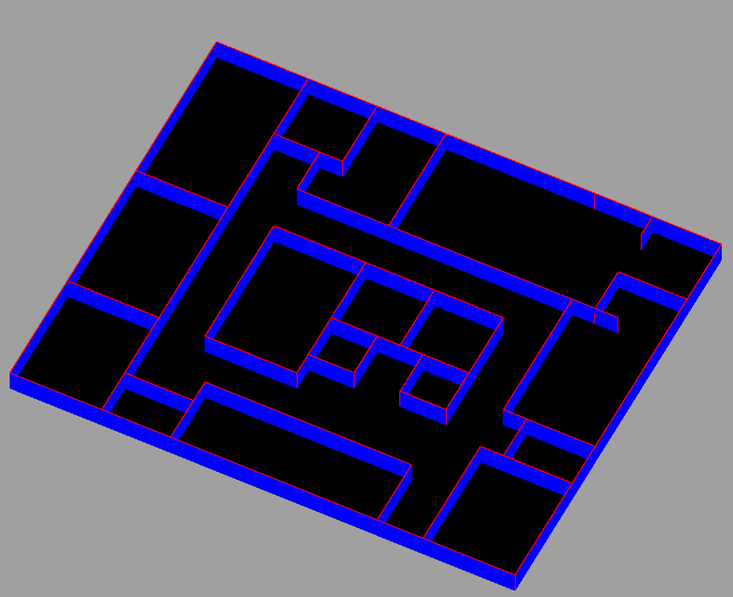

Subsequently, so as to get a simple visualization with the doors, a new object was created for them and utilized instead of the wall one.

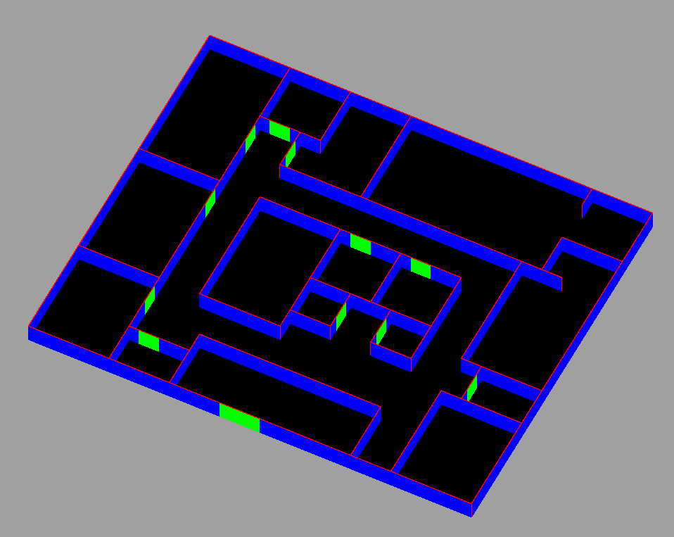

### 2.2 Door Creation

Following the simple door representation we decided on a new approach that would make the object stand out from the wall, allowing the door to have more depth and make the scene more visually interesting.
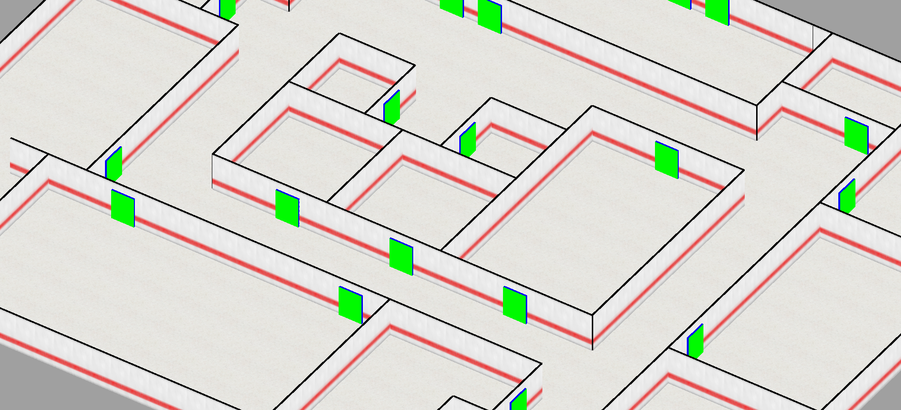

Nevertheless, this implementation did not properly account for the double doors, as the wall implementation had to be slightly rewritten, leading to the following code being added inside the original layout loop.

```typescript
// loadLayout
if (data.layout[j][i] == 2) { // found a door
 // vertical
 if (j > 0 && j < data.size.height &&
  (data.layout[j - 1][i] == 1 || data.layout[j + 1][i] == 1 ||
   data.layout[j - 1][i] == 2 || data.layout[j + 1][i] == 2)) {
  // checks if the previous position was not a door
  // skips drawing a door if so
  if (j > 0 && data.layout[j - 1][i] != 2) {
   // checks if the next position is a door
   if (j < data.size.height && data.layout[j + 1][i] == 2) {
    // draws a door that is rotated by 3π/2 and positioned a door-width further downwards
   }
   // draws original door (rotated by π/2)
  }
 }
 // horizontal
 else {
  // checks if the previous position was not a door
  // skips drawing a door if so
  if (i > 0 && data.layout[j][i - 1] != 2) {
   // clones door object at original position
   // checks if the next position is a door
   if (i < data.size.width && data.layout[j][i + 1] == 2) {
    // draw the originally cloned door rotated by π/2 (this is purely aesthetic so as to match the vertical double doors)
    // draws a door that is positioned a door-width further to the side
   }
   else
    // draw the originally cloned door
  }
 }
}
```

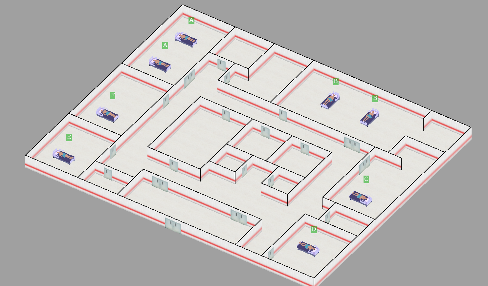

### 2.3 Object Placement

One of the requirements for this US was to place some objects in specific places. The required ones were:

- **[Opperation Table](https://sketchfab.com/3d-models/hospital-bed-41cd18dbfcd04efca9d6e861e3cc7663)**
- **[Lying Down Patient](https://sketchfab.com/3d-models/patient-00b483f284a542899b94e99831f1ad1c#download)**

Both of this models were sourced from an outside entity and their links can be found in the previous topics. The model research and implementation has two important things worth mentioning:

- The model format used was the same as the "Basic_Thumb_Raiser", which followed the `.glb` format. This required the instalation of `GLTFLoader` from `three-stdlib`. This format, although viable to implement, created a lot of problems.
- A lot of models were tested to see what fitted better, but there weren't many to choose from. Some of the problems that arised from some models were: textures missing, colours mixed, simply not working. Our selection was limited to the models that did work.
  - This made it so that our "Operation Table" transformed into a "Operation Bed", since there were very few options for tables and none that worked.

The placement was made through the `rooms` section in the hospital description file:

```json
"rooms": [
    { "id": "A", "table": [[2, 2, 2], [5, 2, 2]] },
    { "id": "B", "table": [[2, 13, 1], [2, 16, 1]] },
    { "id": "C", "table": [[9, 20, 2]] },
    { "id": "D", "table": [[15, 20, 2]] },
    { "id": "E", "table": [[16, 2, 2]] },
    { "id": "F", "table": [[11, 2, 2]] }]
```

The first two numbers indicate the coordinates of the bed, and the last number indicates if the bed if places vertically (1) or horizontally (2).

As an added bonus, the beds will always rotate in order for the head to be towards the outter wall. This is merely for reality purposes, not a required functionality.

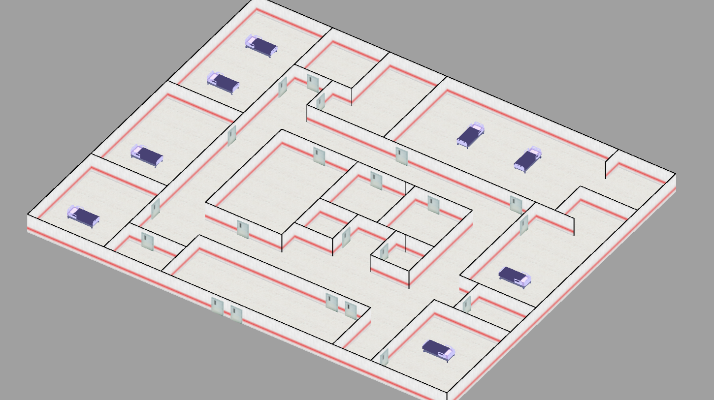

The laying patient don't need a specified placement, since they stay on top of the bed. For example purposes, they are targetted to be placed in every bed, but that will be change to only appear if the room is being used.

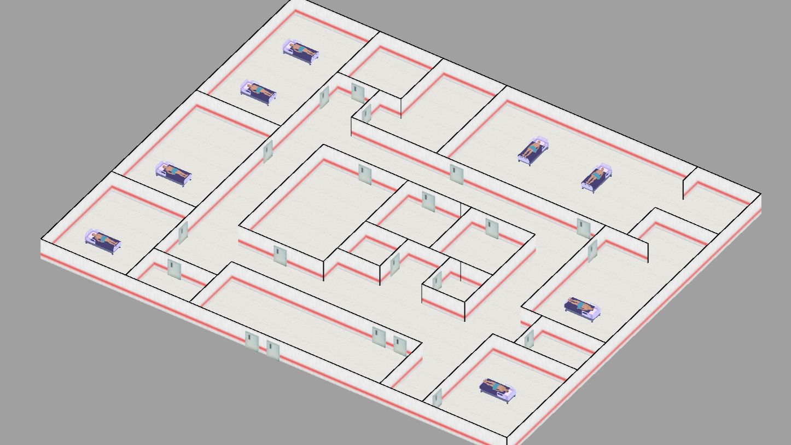

The patient also has the same bonus as the bed (although with different rotations, since its a different object).

### 2.4 Room Identification (Sprites)

Lastly, the sprite was added following the threejs tutorial (<https://threejs.org/manual/#en/billboards>), creating a new canvas for each sprite, where the room ID would then be written. A sprite is created for every operating table found in the "rooms" section fo the given json file.

```typescript
// loadLabels
rooms.forEach((room: { id: string; table: number[][] }) => {
 room.table.forEach((table: number[]) => {
  // create a label with room id as text
  let label = this.makeLabels(room.id);
  // position the label according the table position in the layout array
  label.position.set(table[1] - width / 2, 2, table[0] - height / 2);
 });
});
```

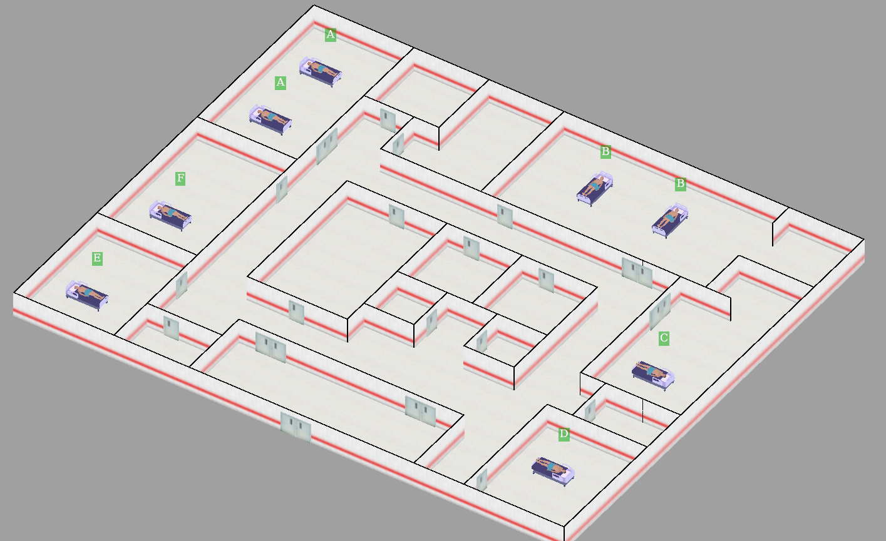

## 3. Texture Implementation

For the textures, it was only required to implement the **walls texture**, **ground texture** and **door texture**. All of these were taken from an outside source and altered to our own design:

- **Wall Texture:**
  - **[Original Image](https://www.freepik.com/free-photo/wall-texture_1034262.htm#fromView=keyword&page=1&position=2&uuid=43e8a99c-e452-48a3-acf0-9d6109e6eaca)**
  - **First Iteration (redline):**
  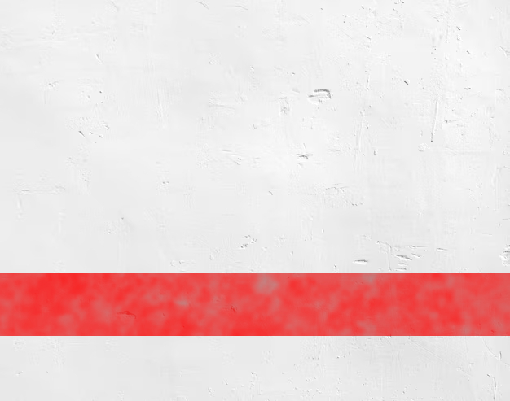
  - **Second Iteration (ground-shadow):**
  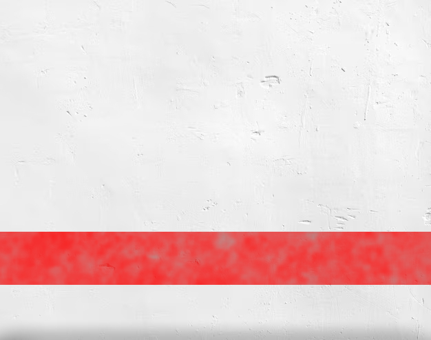
  - **Third Iteration (ceiling-shadow):**
  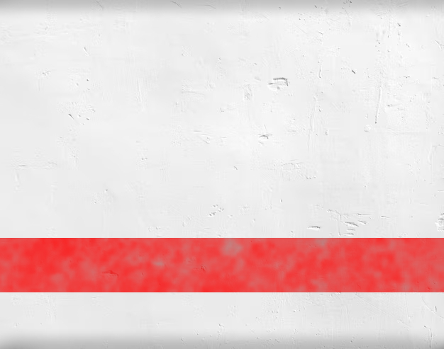
- **Ground Texture:**
  - **[Orignial Image](https://www.google.com/url?sa=i&url=https%3A%2F%2Fwww.justdial.com%2Fjdmart%2FGuwahati%2Ftexture-hospital-tile%2Fpid-800368679%2F9999PX361-X361-190926151407-N7T6&psig=AOvVaw1FlW4QFLr5kB4MzgQSU0xq&ust=1731701264121000&source=images&cd=vfe&opi=89978449&ved=0CBQQjRxqFwoTCNDCtYbQ3IkDFQAAAAAdAAAAABAE)**
  - **Iteration (brighter-floor):**
  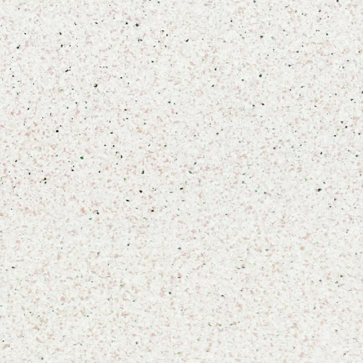
- **Door Texture:**
  - **[Original Image](https://www.google.com/url?sa=i&url=https%3A%2F%2Fm.indiamart.com%2Fproddetail%2Fhospital-doors-10535421433.html&psig=AOvVaw0_d4N5AhcjLNJJIYLZm3UI&ust=1731701473550000&source=images&cd=vfe&opi=89978449&ved=0CBQQjRxqFwoTCMivoOzQ3IkDFQAAAAAdAAAAABAE)**
  - **First Interation (background-removed+cropped):**
  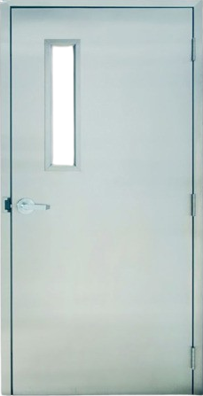
  - **Second Interation (flipped):**
  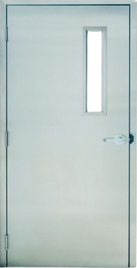

## 4. Camera Implementation

*Code to implement the perspective camera:*
```typescript
 this.camera = new THREE.PerspectiveCamera( 45, this.canvas.clientWidth / this.canvas.clientHeight, 1, 10000 );  
  
  this.controls = new OrbitControls(this.camera, this.renderer.domElement);
  
  this.controls.mouseButtons = {
    MIDDLE: THREE.MOUSE.DOLLY,
    RIGHT: THREE.MOUSE.ROTATE
  }
  
  this.controls.update();
```

this.controls.mouseButtons doesn't use the left mouse button since that will have its use on the third sprint.

*Code to implement camera constant updating:*
```typescript
 animate() {
  requestAnimationFrame(this.animate.bind(this));
  
  this.controls.update();
  this.renderer.render(this.scene, this.camera );
 }

 private render(): void {
  this.scene.add(this.ground);
  this.scene.add(this.layout);
  this.scene.add(this.labels);

  this.controls.update();

  this.renderer.render(this.scene, this.camera);

  this.animate();
 }
```

## 5. Light Implementation

### After Ambient Lighting

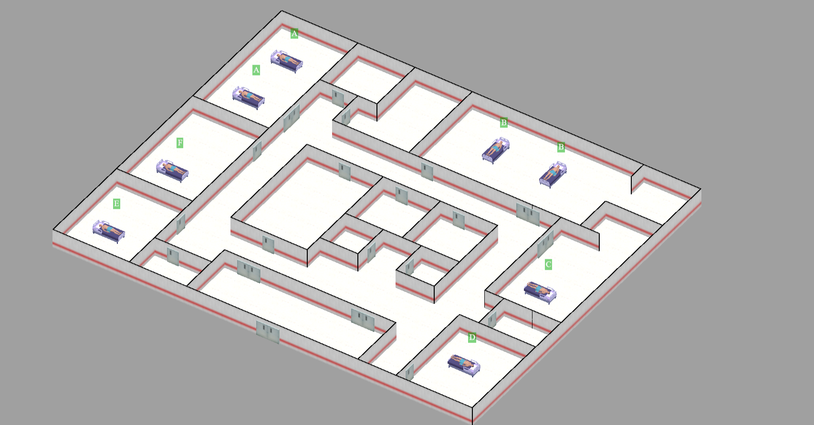

*Implementation*

```typescript
const ambientLight = new THREE.AmbientLight(0xFFFFFF, 1.5);
  this.scene.add(ambientLight);>
```

### After Directional Lighting

#### With Bed Shadow Casting

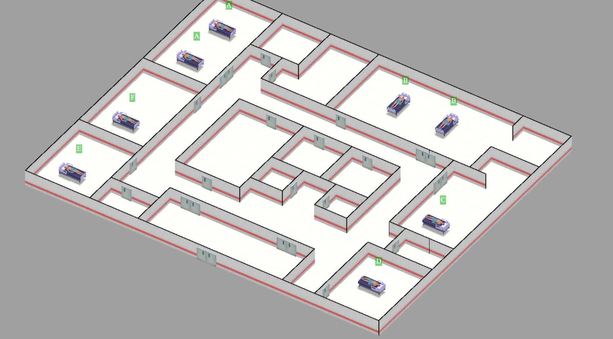

#### With Wall and Bed Shadow Casting

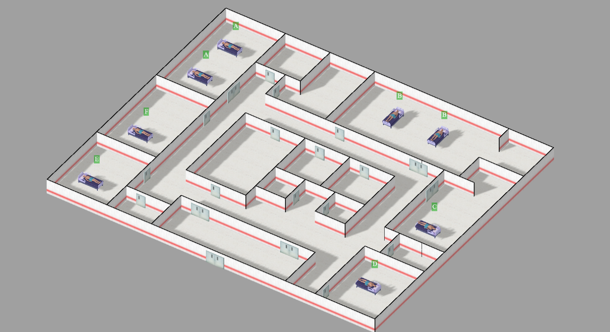

*Implementation*

```typescript
 createScene()

  this.renderer.shadowMap.enabled = true;
  const ambientLight = new THREE.AmbientLight(0xFFFFFF, 1.5);
  this.scene.add(ambientLight);

  
  const directionalLight = new THREE.DirectionalLight(0xFFFFFF, 2.5); // Bright light
  directionalLight.position.set(10, 50, 10);
  directionalLight.castShadow = true;

  // Shadow map settings
  directionalLight.shadow.mapSize.width = 2048; // High resolution
  for sharper shadows
  directionalLight.shadow.mapSize.height = 2048;
  directionalLight.shadow.camera.far = 200;

  // Adjust shadow camera bounds for directional light
  directionalLight.shadow.camera.left = -50;
  directionalLight.shadow.camera.right = 50;
  directionalLight.shadow.camera.top = 50;
  directionalLight.shadow.camera.bottom = -50;

  // Add the light to the scene
  this.scene.add(directionalLight);

```

```typescript
private createFloor(size: any, floorTexture: any): void {
  //Floor Creation 
  this.ground.receiveShadow = true;
 }
```

```typescript
private createModel(modelUrl: string, scale: any): Promise<THREE.Group> {
(gltf) => {
     //Model Load Process
     model.traverse((child) => {
      if (child instanceof THREE.Mesh) {
       child.castShadow = true; // Enable casting shadows
       child.receiveShadow = true; // Enable receiving shadows
      }});
}
```
