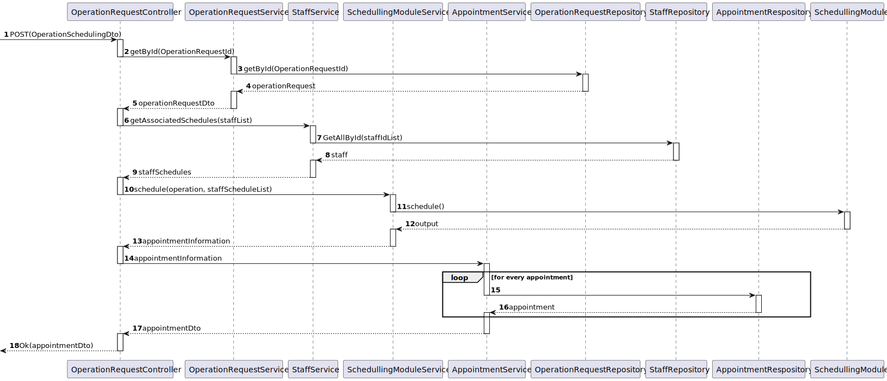

# Scheduling Integration Backend

## 1. Context

This is the first time this US is tasked to us. (...)

## 2. Requirements

"**US 6.0.0 -** As an Admin, I want to obtain the better scheduling of a set of operations
(surgeries) in a certain operation room in a specific day."


## 3. Analysis

- This was an additional User Story created by the team merely for documentation purposes for backend planning module integration.

### System Sequence Diagram


## 4. Design

### 4.1. Realization



### 4.2. Applied Patterns

- Aggregate
- Entity
- Value Object
- Service
- MVC
- Layered Architecture
- DTO
- Clean Architecture
- C4+1

### 4.3. Design Commits

> **01/11/2024 10:00 [US6.0.0]** (...)
>

## 5. Implementation

### 5.1. Code Implementation

**ExampleControler:**

```cs
using System;
using System.Collections.Generic;
using System.Diagnostics;
using System.IO;
using System.Linq;
using System.Text.RegularExpressions;
using DDDSample1.Domain.HospitalStaff;
using DDDSample1.Domain.OperationRequests;
using DDDSample1.Domain.OperationRooms;
using DDDSample1.DTO;

public class SchedulingAdapter
{
    private static readonly string prologFilePath = "C:\\Users\\alfre\\source\\repos\\projeto_integrador_lapr5\\scheduling\\planning-base.pl";

    public SchedulingAdapter()
    {
        // Constructor logic if needed
    }

    /// <summary>
    /// Schedules operations for the given staff, operation requests, and operation room on a specific day.
    /// </summary>
    /// <param name="staffList">List of staff members available for scheduling.</param>
    /// <param name="opList">List of operation requests to be scheduled.</param>
    /// <param name="opRoom">The operation room where the operations will occur.</param>
    /// <param name="day">The day for which to schedule the operations (in string format).</param>
    /// <returns>List of scheduled operations or some result object.</returns>
    public List<AssignmentsDto> ScheduleOperations(
        List<StaffDto> staffList,
        List<OperationRequestDTO> opList,
        OperationRoom opRoom,
        string day)
    {
        // Read the content of the Prolog file
        string fileContentRaw = File.ReadAllText(prologFilePath);

        // Split content by lines
        var lines = fileContentRaw.Split(new[] { '\n', '\r' }, StringSplitOptions.RemoveEmptyEntries).ToList();

        // Find the index where "%DATA" is located
        int dataIndex = lines.FindIndex(line => line.Contains("%DATA"));

        if (dataIndex == -1)
        {
            throw new InvalidOperationException("No '%DATA' marker found in the Prolog file.");
        }

        // Prepare the Prolog data to be inserted
        List<string> prologData = new List<string>();
        List<string> staffProfileData = new List<string>();
        List<string> staffTimetableData = new List<string>();
        List<string> scheduleData = new List<string>();
        List<string> assignmentData = new List<string>();

        // Add Prolog facts for surgery, staff, timetable, and assignments
        foreach (var staff in staffList)
        {
            string scheduleString = string.Join(", ", staff.AvailabilitySlots ?? new List<string>());
            string staffProfile, staffTimetable;

            if (staff.Specialization.Contains("cleaner"))
            {
                staffProfile = $"staff({staff.LicenseNumber}, cleaner, cleaner, []).";
                staffTimetable = $"timetable({staff.LicenseNumber}, {day}, (400, 1400)).";
            }
            else if (staff.Specialization.Contains("anaesthesist"))
            {
                staffProfile = $"staff({staff.LicenseNumber}, anaesthesist, anaesthesist, []).";
                staffTimetable = $"timetable({staff.LicenseNumber}, {day}, (200, 1200)).";
            }
            else
            {
                staffProfile = $"staff({staff.LicenseNumber}, doctor, doctor, []).";
                staffTimetable = $"timetable({staff.LicenseNumber}, {day}, (300, 1300)).";
            }

            staffProfileData.Add(staffProfile);
            staffTimetableData.Add(staffTimetable);

            var schedule = $"agenda_staff({staff.LicenseNumber}, {day}, [{scheduleString}]).";
            scheduleData.Add(schedule);

            
            //assignmentData.Add($"assignment_surgery(s0, {staff.LicenseNumber}).");
        }

        string surgeryId;
        List<AssignmentsDto> assignments = new List<AssignmentsDto>();
        foreach(var opDto in opList){
            AssignmentsDto ass = new AssignmentsDto();
            ass.RequestId = opDto.ID;
            foreach(var requiredSpec in opDto.RequiredSpecialists){
                string specialization = requiredSpec.Split(':')[1].Split(',')[0].Trim();
                foreach(var staff in staffList){
                    if(staff.Specialization == specialization){
                        ass.AddAssignee(staff.LicenseNumber);
                        surgeryId = opDto.ID.Split('-')[0];
                        assignmentData.Add($"assignment_surgery({surgeryId}, {staff.LicenseNumber}).");
                    }
                }
            }
            assignments.Add(ass);
        }

        foreach (var opDto in opList)
            {
                prologData.Add($"surgery({opDto.OperationType}, 20, 30, 20).");
            }

            
            int count=0;
        foreach (var opDto in opList)
            {
                surgeryId = opDto.ID.Split('-')[0];
                prologData.Add($"surgery_id({surgeryId}, {opDto.OperationType}).");
            }  
        
        prologData.AddRange(staffProfileData);
        prologData.AddRange(staffTimetableData);
        prologData.AddRange(scheduleData);
        prologData.AddRange(assignmentData);

        // Add Prolog code for operation room and heuristic query
        prologData.Add($"agenda_operation_room({opRoom.Name}, {day}, [(520,579,so100000),(1000,1059,so099999)]).");

        //prologData.Add($":-busiest_doctor_heuristic({opRoom.Id}, {day})");

        // Insert the Prolog code after the "%DATA" line
        lines.InsertRange(dataIndex + 1, prologData);

        // Write the modified content back to the Prolog file
        File.WriteAllLines(prologFilePath, lines);


        string output = RunPrologProcess(opRoom.Name, day);


        string pattern = @"\(([^)]+)\)";  // Match content inside parentheses
        var matches = Regex.Matches(output, pattern);

        string[] result = matches.Cast<Match>()
                                 .Select(m => m.Groups[1].Value)
                                 .ToArray();

        foreach (var opDto in opList)
            {
                surgeryId = opDto.ID.Split('-')[0];
                foreach (var interval in result){
                    if(interval.Contains(surgeryId)){
                        foreach(var assignment in assignments){
                            if(assignment.RequestId == opDto.ID){
                                int secondCommaIndex = interval.IndexOf(',', interval.IndexOf(',') + 1);
                                string formattedInterval = interval.Substring(0, secondCommaIndex); 

                                assignment.TimeInterval = formattedInterval;
                            }
                        }
                    }
                }
            }  

        // Read the file again
        string updatedContent = File.ReadAllText(prologFilePath);
        

        // Find the positions of %DATA and %EOD
        dataIndex = updatedContent.IndexOf("%DATA");
        int eodIndex = updatedContent.IndexOf("%EOD");

        // Check if both markers exist
        if (dataIndex != -1 && eodIndex != -1 && eodIndex > dataIndex)
        {
            // Keep everything before %DATA and after %EOD
            string beforeData = updatedContent.Substring(0, dataIndex + "% DATA".Length);
            string afterEod = updatedContent.Substring(eodIndex);

            // Create the cleaned-up content
            string cleanedContent = beforeData + "\n\n" + afterEod; // Add two newlines between % DATA and % EOD

            // Write the cleaned content back to the file
            File.WriteAllText(prologFilePath, cleanedContent);
        }

        return assignments;
    }

    private string RunPrologProcess(string operationRoomName, string day)
    {
        ProcessStartInfo startInfo = new ProcessStartInfo
        {
            FileName = "swipl",
            Arguments = $"-q -s {prologFilePath} -g \"busiest_doctor_heuristic({operationRoomName}, {day}), halt.\"",
            RedirectStandardOutput = true,
            RedirectStandardError = true,
            UseShellExecute = false,
            CreateNoWindow = true
        };

        using (Process process = new Process())
        {
            process.StartInfo = startInfo;
            process.Start();

            // Capture the output and error streams
            string output = process.StandardOutput.ReadToEnd();
            string error = process.StandardError.ReadToEnd();

            process.WaitForExit();

            if (!string.IsNullOrEmpty(error))
            {
                throw new InvalidOperationException($"Prolog process error: {error}");
            }

            return output;
        }
    }
}

```


## 6. Integration/Demonstration


## 7. Observations

(...)
