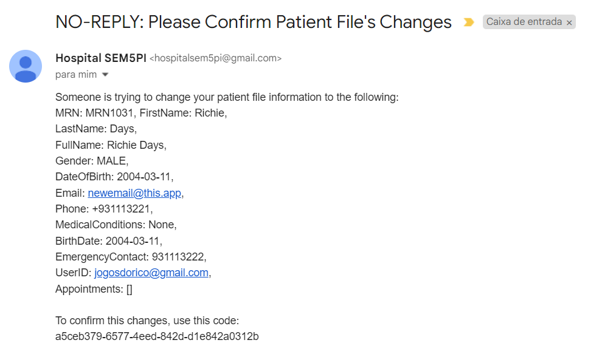

# User Interface Implementation

## Table of Contents


- [User Interface Implementation](#user-interface-implementation)
  - [Table of Contents](#table-of-contents)
  - [1. Global Context](#1-global-context)
  - [2. US Specific Requirements](#2-us-specific-requirements)
  - [3. Global Analysis](#3-global-analysis)
  - [4. Global Design](#4-global-design)
    - [4.1. Realization](#41-realization)
      - [Generic System Sequence Diagram (Generic Level 2 Process View)](#generic-system-sequence-diagram-generic-level-2-process-view)
      - [Generic Sequence Diagram (Generic Level 3 Process View)](#generic-sequence-diagram-generic-level-3-process-view)
      - [Generic Validation Sequence Diagram (Generic Level 3 Process View)](#generic-validation-sequence-diagram-generic-level-3-process-view)
    - [4.2. Applied Patterns](#42-applied-patterns)
  - [5. US Specific Implementation](#5-us-specific-implementation)
    - [US 6.2.1 Code Implementation](#us-621-code-implementation)
    - [US 6.2.2 Code Implementation](#us-622-code-implementation)
    - [US 6.2.3 Code Implementation](#us-623-code-implementation)
    - [US 6.2.4 Code Implementation](#us-624-code-implementation)
    - [US 6.2.5 Code Implementation](#us-625-code-implementation)
    - [US 6.2.6 Code Implementation](#us-626-code-implementation)
    - [US 6.2.7 Code Implementation](#us-627-code-implementation)
    - [US 6.2.8 Code Implementation](#us-628-code-implementation)
    - [US 6.2.9 Code Implementation](#us-629-code-implementation)
    - [US 6.2.10 Code Implementation](#us-6210-code-implementation)
    - [US 6.2.11 Code Implementation](#us-6211-code-implementation)
    - [US 6.2.12 Code Implementation](#us-6212-code-implementation)
    - [US 6.2.13 Code Implementation](#us-6213-code-implementation)
    - [US 6.2.14 Code Implementation](#us-6214-code-implementation)
    - [US 6.2.15 Code Implementation](#us-6215-code-implementation)
    - [US 6.2.16 Code Implementation](#us-6216-code-implementation)
    - [US 6.2.17 Code Implementation](#us-6217-code-implementation)
    - [US 6.2.18 Code Implementation](#us-6218-code-implementation)
    - [US 6.2.19 Code Implementation](#us-6219-code-implementation)
    - [US 6.2.20 Code Implementation](#us-6220-code-implementation)
    - [US 6.2.21 Code Implementation](#us-6221-code-implementation)
  - [6. US Specific Tests](#6-us-specific-tests)
    - [US 6.2.1 Tests](#us-621-tests)
      - [Component Unit Tests](#component-unit-tests)
      - [Service Unit Tests](#service-unit-tests)
    - [US 6.2.2 Tests](#us-622-tests)
      - [Component Unit Tests](#component-unit-tests-1)
      - [Service Unit Tests](#service-unit-tests-1)
      - [System/E2E Testing](#systeme2e-testing)
    - [US 6.2.3 Tests](#us-623-tests)
      - [Component Unit Tests](#component-unit-tests-2)
      - [Service Unit Tests](#service-unit-tests-2)
    - [US 6.2.4 Tests](#us-624-tests)
      - [Component Unit Testing](#component-unit-testing)
      - [Service Unit Tests](#service-unit-tests-3)
      - [System/E2E Testing](#systeme2e-testing-1)
    - [US 6.2.5 Tests](#us-625-tests)
      - [Component Unit Testing](#component-unit-testing-1)
      - [Service Unit Testing](#service-unit-testing)
    - [US 6.2.6 Tests](#us-626-tests)
      - [Component Unit Tests](#component-unit-tests-3)
      - [Service Unit Tests](#service-unit-tests-4)
      - [System/E2E Testing](#systeme2e-testing-2)
    - [US 6.2.7 Tests](#us-627-tests)
      - [Component Unit Testing](#component-unit-testing-2)
      - [Service Unit Tests](#service-unit-tests-5)
    - [US 6.2.8 Tests](#us-628-tests)
      - [Component Unit Testing](#component-unit-testing-3)
      - [Service Unit Tests](#service-unit-tests-6)
    - [US 6.2.9 Tests](#us-629-tests)
      - [Component Unit Testing](#component-unit-testing-4)
      - [Service Unit Tests](#service-unit-tests-7)
    - [US 6.2.10 Tests](#us-6210-tests)
      - [System/E2E Testing](#systeme2e-testing-3)
    - [US 6.2.11 Tests](#us-6211-tests)
      - [System/E2E Testing](#systeme2e-testing-4)
    - [US 6.2.12 Tests](#us-6212-tests)
      - [System/E2E Testing](#systeme2e-testing-5)
    - [US 6.2.13 Tests](#us-6213-tests)
      - [System/E2E Testing](#systeme2e-testing-6)
    - [US 6.2.14 Tests](#us-6214-tests)
      - [System/E2E Testing](#systeme2e-testing-7)
    - [US 6.2.15 Tests](#us-6215-tests)
      - [Component Unit Testing](#component-unit-testing-5)
      - [Service Unit Tests](#service-unit-tests-8)
      - [System/E2E Testing](#systeme2e-testing-8)
    - [US 6.2.16 Tests](#us-6216-tests)
      - [Component Unit Testing](#component-unit-testing-6)
      - [Service Unit Testing](#service-unit-testing-1)
    - [US 6.2.17 Tests](#us-6217-tests)
      - [System/E2E Testing](#systeme2e-testing-9)
    - [US 6.2.18 Tests](#us-6218-tests)
      - [Component Unit Testing](#component-unit-testing-7)
      - [Service Unit Testing](#service-unit-testing-2)
    - [US 6.2.19 Tests](#us-6219-tests)
      - [Component Unit Testing](#component-unit-testing-8)
      - [Service Unit Tests](#service-unit-tests-9)
    - [US 6.2.20 Tests](#us-6220-tests)
      - [Component Unit Testing](#component-unit-testing-9)
      - [Service Unit Tests](#service-unit-tests-10)
    - [US 6.2.21 Tests](#us-6221-tests)
      - [Component Unit Testing](#component-unit-testing-10)
      - [Service Unit Testing](#service-unit-testing-3)
  - [6. Demonstration](#6-demonstration)
    - [US 6.2.1 Demonstration](#us-621-demonstration)
    - [US 6.2.2 Demonstration](#us-622-demonstration)
    - [US 6.2.3 Demonstration](#us-623-demonstration)
    - [US 6.2.4 Demonstration](#us-624-demonstration)
    - [US 6.2.5 Demonstration](#us-625-demonstration)
    - [US 6.2.6 Demonstration](#us-626-demonstration)
    - [US 6.2.7 Demonstration](#us-627-demonstration)
    - [US 6.2.8 Demonstration](#us-628-demonstration)
    - [US 6.2.9 Demonstration](#us-629-demonstration)
    - [US 6.2.10 Demonstration](#us-6210-demonstration)
    - [US 6.2.11 Demonstration](#us-6211-demonstration)
    - [US 6.2.12 Demonstration](#us-6212-demonstration)
    - [US 6.2.13 Demonstration](#us-6213-demonstration)
    - [US 6.2.14 Demonstration](#us-6214-demonstration)
    - [US 6.2.15 Demonstration](#us-6215-demonstration)
    - [US 6.2.16 Demonstration](#us-6216-demonstration)
    - [US 6.2.17 Demonstration](#us-6217-demonstration)
    - [US 6.2.18 Demonstration](#us-6218-demonstration)
    - [US 6.2.19 Demonstration](#us-6219-demonstration)
    - [US 6.2.20 Demonstration](#us-6220-demonstration)
    - [US 6.2.21 Demonstration](#us-6221-demonstration)
  - [7. Observations](#7-observations)

## 1. Global Context

This is the first time this US is tasked to us. (...)

## 2. US Specific Requirements

"**US 6.2.1 -** As a Patient, I want to register for the healthcare application, so that I can create a user profile and book appointments online."

"**US 6.2.2 -** As a Patient, I want to update my user profile, so that I can change my personal details and preferences."

"**US 6.2.3 -** As a Patient, I want to delete my account and all associated data, so that I can exercise my right to be forgotten as per GDPR."

"**US 6.2.4 -** As a (non-authenticated) Backoffice User, I want to log in to the system using my credentials, so that I can access the backoffice features according to my assigned role."

"**US 6.2.5 -** As a Patient, I want to log in to the healthcare system, so that I can access my appointments, medical records, and other features securely."

"**US 6.2.6 -** As an Admin, I want to create a new patient profile, so that I can register their personal details and medical history."

"**US 6.2.7 -** As an Admin, I want to edit an existing patient profile, so that I can update their information when needed."

"**US 6.2.8 -** As an Admin, I want to delete a patient profile, so that I can remove patients who are no longer under care."

"**US 6.2.9 -** As an Admin, I want to list/search patient profiles by different attributes, so that I can view the details, edit, and remove patient profiles."

"**US 6.2.10 -** As an Admin, I want to create a new staff profile, so that I can add them to the hospital’s roster."

"**US 6.2.11 -** As an Admin, I want to edit a staff’s profile, so that I can update their information."

"**US 6.2.12 -** As an Admin, I want to deactivate a staff profile, so that I can remove them from the hospital’s active roster without losing their historical data."

"**US 6.2.13 -** As an Admin, I want to list/search staff profiles, so that I can see the details, edit, and remove staff profiles."

"**US 6.2.14 -** As a Doctor, I want to request an operation, so that the Patient has access to the necessary healthcare."

"**US 6.2.15 -** As a Doctor, I want to update an operation requisition, so that the Patient has access to the necessary healthcare."

"**US 6.2.16 -** As a Doctor, I want to remove an operation requisition, so that the healthcare activities are provided as necessary."

"**US 6.2.17 -** As a Doctor, I want to list/search operation requisitions, so that I see the details, edit, and remove operation requisitions."

"**US 6.2.18 -** As an Admin, I want to add new types of operations, so that I can reflect on the available medical procedures in the system."

"**US 6.2.19 -** As an Admin, I want to edit existing operation types, so that I can update or correct information about the procedure."

"**US 6.2.20 -** As an Admin, I want to remove obsolete or no longer performed operation types, so that the system stays current with hospital practices."

"**US 6.2.21 -** As an Admin, I want to list/search operation types, so that I can see the details, edit, and remove operation types."

## 3. Global Analysis

The frontend modules are to be developed following the MVC model, this model will consist of a very strict execution flow of Component->Service->Backend.

The frontend as a whole is to communicate with the backend through the API endpoints established during the previous sprint, as so the documentation of backend logic will not be reiterated in this document.

## 4. Global Design

### 4.1. Realization

#### Generic System Sequence Diagram (Generic Level 2 Process View)


#### Generic Sequence Diagram (Generic Level 3 Process View)


#### Generic Validation Sequence Diagram (Generic Level 3 Process View)


### 4.2. Applied Patterns

- Aggregate
- Entity
- Value Object
- Service
- MVC
- Layered Architecture
- DTO
- Clean Architecture
- C4+1

## 5. US Specific Implementation

### US 6.2.1 Code Implementation

[Register User Component Hyperlink](frontend\src\app\Login\login\user-registration\register-user.component.ts)

```typescript
  onRegister(): void {
    const credentials: LoginCredentialsDto = { username: this.username, password: this.password };
    console.log(credentials);
    this.loginService.register(credentials).subscribe(
      (response) => {
        this.loginService.setResponse(response);
        console.log('Register Request Successful:', response);
        this.errorMessage = '';
        this.showRegister = false;
        this.showConfirmationCode = true;
      },
      (error) => {
        console.error('Register Request Failed:', error);
        this.errorMessage = 'Error requesting registration.';
      }
    );
  }

  confirmRegistration(): void {
    if(this.confirmationCode){
      console.log(this.confirmationCode);
      this.loginService.confirmRegistration(this.confirmationCode).subscribe(
        (result) => {
          console.log('User Registration successfull:', result);
          this.errorMessage2 = '';
          this.showConfirmationCode = false;
          localStorage.setItem('action',"successfull-registration");
          this.router.navigate(['']); // Navigates to the HomeComponent
          },
        (error) => {
          console.error('Error confirming registration:', error);
          this.errorMessage2 = 'Error confirming registration.';
        }
        )
    }
  }

  onRegisterExternal(): void {
    this.loginService.registerExternal();
  }
```

[Login Service Hyperlink](frontend\src\app\login-service.service.ts)

```typescript
  register(credentials: LoginCredentialsDto): Observable<LoginResponse> {
    const url = `${this.userApiUrl}/RegisterUserPatient`;
    return this.http.post<LoginResponse>(url, credentials);
  }

  confirmRegistration(token: string){
    const url = `${this.userApiUrl}/ActivatePatientAccount`;
    const headers = new HttpHeaders({
        'token': `${token}`,
    });
    return this.http.post<any>(url, null, { headers });
  }

  registerExternal(): void {
    this.redirect(`${this.userApiUrl}/RegisterIAM`);
  }
```

### US 6.2.2 Code Implementation

[Patient Profile Update Component Hyperlink](frontend\src\app\Patient\patient-profile\patient-profile-update.component.ts)

```ts
  ngOnInit(): void {
    const storedToken = localStorage.getItem('authToken');
    console.log(storedToken);
    if (storedToken) {
      this.patientService.validate(storedToken).subscribe(response => {
        console.log(response.role);
        if(response.role != "PATIENT"){
          console.log(response.role);
          this.router.navigate(['']);
        }
      })
      // Assign the stored token to response and trigger patient data loading
      this.response = { Token: storedToken } as LoginResponse;
      this.initializeData(storedToken);
    } else {
      // Subscribe to the loginService response$ if no token is in localStorage
      this.loginService.response$.subscribe((response: LoginResponse | null) => {
        if (response) {
          this.response = response;
          // Store the token in localStorage
          localStorage.setItem('authToken', response.Token);
          this.initializeData(response.Token);
        }
      });
    }
  }

  initializeData(storedToken:string): void {
    this.patientService.getPatientById(storedToken)
    this.patientService.selectedPatient$.subscribe((patient: PatientData | null) => {
      this.patient = patient;
      console.log('Fetched patient by ID:', this.patient);
    });
  }

  convertToEditPatientDto(patient: PatientData): EditPatientDtoPatient {
    return {
      firstName: patient.firstName,
      lastName: patient.lastName,
      fullName: patient.fullName,
      email: patient.email,
      phone: patient.phone,
      dateOfBirth: patient.dateOfBirth,
      medicalConditions: patient.medicalConditions,
      gender: patient.gender,
      emergencyContact: patient.emergencyContact
    };
  }

  editPatient(): void {
    if (this.patient && this.response) {
      const editPatientDto = this.convertToEditPatientDto(this.patient);
      this.patientService.editPatientProfile(editPatientDto, this.response.Token).subscribe(
        (result) => {
          if(this.isMessageObject(result)){
            console.log('Sensitive information is trying to be altered. Patient update request successfull:', result);
            this.sucessMessage = 'Sensitive information is trying to be altered. An e-mail has been sent to confirm changes.';
            this.showConfirmationCode = true;
          } else {
            console.log('Patient updated successfully:', result);
            this.sucessMessage = 'Patient Updated Successfully!';
          }
          this.errorMessage = '';
        }, 
        (error) => {
          console.error('Error updating patient:', error);
          this.errorMessage = 'Error Updating Patient.';
          this.sucessMessage = '';
        }
      );
    }
  }

  // Helper function to check if the result is a message object
  private isMessageObject(result: any): result is { message: string } {
    return result && typeof result === 'object' && 'message' in result;
  }

  confirmUpdate(): void{
    if(this.confirmationCode){
      console.log(this.confirmationCode);
      this.patientService.confirmPatientProfileUpdate(this.confirmationCode).subscribe(
        (result) => {
          console.log('Patient updated successfully:', result);
          this.sucessMessage = 'Patient Updated Successfully!';
          this.errorMessage = '';
          this.showConfirmationCode = false;
          },
        (error) => {
          console.error('Error confirming update:', error);
          this.errorMessage = 'Error confirming update.';
          this.sucessMessage = '';
        }
        )
    }
  }
```

[Patient Service Hyperlink](frontend\src\app\Patient\patient.service.ts)

```ts
  editPatientProfile(editData: EditPatientDtoPatient, token: string): Observable<any> {
    console.log('Editing patient profile in service');
    const url = `${this.apiUrl}/editPatient_Patient`;  // Endpoint for editing patient data
    const headers = new HttpHeaders({
      'token': `${token}`,  // Sending the token in the header
    });

    return this.http.post<any>(url, editData, { headers });
  }

  confirmPatientProfileUpdate(token:string):Observable<any> {
      console.log('Confirming patient profile update in service');
      const url = `${this.apiUrl}/ConfirmUpdate`;
      const headers = new HttpHeaders({
        'token': `${token}`,  // Sending the token in the header
      });
      console.log(token);
      console.log(headers);
      // Fix: Pass headers as part of the options object
      return this.http.post<any>(url, null, { headers });
  }
```

### US 6.2.3 Code Implementation

[Patient Profile Delete Component Hyperlink](frontend\src\app\Patient\patient-profile\patient-profile-delete.component.ts)

```ts
ngOnInit(): void {
    // Check if the token is in localStorage
    const storedToken = localStorage.getItem('authToken');
    console.log(storedToken);
    if (storedToken) {
      this.patientService.validate(storedToken).subscribe(response => {
        console.log(response.role);
        if(response.role != "PATIENT"){
          console.log(response.role);
          this.router.navigate(['']);
        }
      })
      // Assign the stored token to response and trigger patient data loading
      this.response = { Token: storedToken } as LoginResponse;
      this.initializeData(storedToken);
    } else {
      // Subscribe to the loginService response$ if no token is in localStorage
      this.loginService.response$.subscribe((response: LoginResponse | null) => {
        if (response) {
          this.response = response;
          // Store the token in localStorage
          localStorage.setItem('authToken', response.Token);
          this.initializeData(response.Token);
        }
      });
    }
  }

  // Method to initialize or refresh data
  initializeData(storedToken:string): void {
    this.patientService.getPatientById(storedToken)
    this.patientService.selectedPatient$.subscribe((patient: PatientData | null) => {
      this.patient = patient;
      console.log('Fetched patient by ID:', this.patient);
    });
  }

  convertToEditPatientDto(patient: PatientData): EditPatientDtoPatient {
    return {
      firstName: patient.firstName,
      lastName: patient.lastName,
      fullName: patient.fullName,
      email: patient.email,
      phone: patient.phone,
      dateOfBirth: patient.dateOfBirth,
      medicalConditions: patient.medicalConditions,
      gender: patient.gender,
      emergencyContact: patient.emergencyContact
    };
  }

  deleteSelfProfile(): void {
    if (this.patient && this.response) {
      this.patientService.deletePatientProfile(this.response.Token).subscribe(
        (result) => {
            console.log('Delete request successfull:', result);
            this.showConfirmationCode = true;
            this.showDeleteButton = false;
            this.message = 'Email Requesting Deletion Sent. Please input the sent code.'
            this.errorMessage = '';
        }, 
        (error) => {
          console.error('Error requesting deletion:', error);
          this.errorMessage = 'Error Requesting the Delete.';
        }
      );
    }
  }

  confirmDelete(): void{
    if(this.confirmationCode){
      console.log(this.confirmationCode);
      this.patientService.confirmPatientProfileDelete(this.confirmationCode).subscribe(
        (result) => {
          console.log('Patient updated successfully:', result);
          this.showConfirmationCode = false;
          this.showDeleteButton = false;
          this.message = 'Deletion Request Accepted. The profile will be deleted within the GRPD parameters (within 30 days).'
          this.errorMessage = '';
          },
        (error) => {
          console.error('Error confirming deletion:', error);
        }
        )
    }
  }
```

[Patient Service](frontend\src\app\Patient\patient.service.ts)

```ts
  deletePatientProfile(token: string): Observable<any> {
    const url = `${this.apiUrl}/DeleteSelfPatient`;
    const headers = new HttpHeaders({
      'token': token,
    });
  
    return this.http.delete<any>(url, {headers});
  }

  confirmPatientProfileDelete(token:string):Observable<any> {
    console.log('Confirming patient profile delete in service');
    const url = `${this.apiUrl}/ConfirmPatientDeletion`;
    const headers = new HttpHeaders({
      'token': `${token}`,  // Sending the token in the header
    });
    return this.http.delete<any>(url, { headers });
  }
```

### US 6.2.4 Code Implementation

[Admin Service Hyperlink](../../../frontend/src/app/Admin/admin.service.ts)

```typescript
getAllPatients(queryData: PatientQueryData): void {
    // Convert queryData to a URL query string
    const params = new HttpParams({ fromObject: { ...queryData } });

    this.http.get<PatientData[]>('https://localhost:5001/api/Patient/filter', { params }).subscribe({
      next: (patients: PatientData[]) => {
        this.patientsSubject.next(patients); // Update the BehaviorSubject with the fetched data
      },
      error: (err) => {
        console.error('Error fetching filtered patients', err); // Handle error appropriately
      }
    });
  }
```

### US 6.2.5 Code Implementation

[Login Component Hyperlink](frontend\src\app\Login\login\login.component.ts)

```ts
  ngOnInit(): void {
    var storedToken;
    const params = new URLSearchParams(window.location.search);
    const token = params.get('token');
    const error = params.get('error');
    const action = params.get('action');

    if (token){
      localStorage.setItem('authToken', token);
    }

    if (error){
      this.errorMessage = "Error happened: " + error;
    } 

    if (action){
      localStorage.setItem('action', action);
    }
    
    if (localStorage.getItem('action')){
      switch(localStorage.getItem('action')){
        case "successfull-registration":
          this.successMessage = 'Registration was a sucess! Please login with the new informations.'
        break;
      }
      //localStorage.removeItem('action');
    }
    
    storedToken = localStorage.getItem('authToken');

    if(storedToken){
      this.loginService.validate(storedToken).subscribe(response => {
      switch(response.role){
        case "ADMIN":
          this.router.navigate(['adminPanel']);
        break;
        case "STAFF":
          this.router.navigate(['doctor-panel']);
        break;
        case "PATIENT":
          this.router.navigate(['patient-panel']);
        break;
      }
    }) 
  }
  }

  onLoginExternal(): void {
    this.loginService.loginExternal();
  }
```

[Login Service Hyperlink](frontend\src\app\login-service.service.ts)

```ts
  loginExternal(): void {
    this.redirect(`${this.loginApiUrl}/LoginIAM`);
  }
```

### US 6.2.6 Code Implementation

[Admin Patient Create Component Hyperlink](frontend\src\app\Admin\patient-control\admin-patient-create.component.ts)

```ts
ngOnInit(): void {
    // Check if the token is in localStorage
    const initPatient = this.initiatePatientDate();
    this.patient = initPatient;
    const storedToken = localStorage.getItem('authToken');
    if (storedToken) {
      // Assign the stored token to response and trigger patient data loading
      this.response = { Token: storedToken } as LoginResponse;
    } else {
      // Subscribe to the loginService response$ if no token is in localStorage
      this.loginService.response$.subscribe((response: LoginResponse | null) => {
        if (response) {
          this.response = response;
          // Store the token in localStorage
          localStorage.setItem('authToken', response.Token);
        }
      });
    }
  }

  initiatePatientDate(): PatientRegistrationDto {
      return{
        firstName: '',
        lastName: '',
        fullName: '',
        email: '',
        phone: '',
        dateOfBirth: '',
        gender: '',
        emergencyContact: ''
      }
  }

  createPatient(): void {
    if (!this.patient || !this.response) {
      this.errorMessage = 'Missing patient or response data.';
      this.sucessMessage = '';
      return;
    }
  
    const missingField = Object.keys(this.patient).find(
      (key) => this.patient![key as keyof PatientRegistrationDto] === ''
    );
  
    if (missingField) {
      this.errorMessage = `Missing information for: ${missingField}`;
      this.sucessMessage = '';
      return;
    }

    if (this.patient && this.response) {
      this.adminService.createPatientAdmin(this.patient, this.response.Token).subscribe(
        (result) => {
            console.log('Patient Created Sucessfully!:', result);
            this.sucessMessage = 'Patient Created Sucessfully!';
            this.errorMessage = '';
        }, 
        (error) => {
          console.error('Error creating patient:', error);
          this.errorMessage = 'Error Creating Patient.';
          this.sucessMessage = '';
        }
      );
    }
  }
```

[Admin Service Hyperlink](../../../frontend/src/app/Admin/admin.service.ts)

```ts
  createPatientAdmin(createData: PatientRegistrationDto, token: string): Observable<any> {
    console.log('Create patient in service');
    const url = `${this.apiUrl}/CreatePatient`;  // Endpoint for editing patient data
    const headers = new HttpHeaders({
      'token': `${token}`,  // Sending the token in the header
    });

  return this.http.post<any>(url, createData, { headers });
  }
```

### US 6.2.7 Code Implementation

[Admin Service Hyperlink](../../../frontend/src/app/Admin/admin.service.ts)

```typescript
editPatientAdmin(editData: EditPatientDtoAdmin, token: string): Observable<any> {
    console.log('Editing patient in service');
    const url = `${this.apiUrl}/editPatient_Admin`;  // Endpoint for editing patient data
    const headers = new HttpHeaders({
      'token': `${token}`,  // Sending the token in the header
    });

    return this.http.post<any>(url, editData, { headers });
  }
```

### US 6.2.8 Code Implementation

[Admin Service Hyperlink](../../../frontend/src/app/Admin/admin.service.ts)

```typescript
// DELETE request to delete patient by MRN (Medical Record Number)
  deletePatientProfile(mrn: string, token: string): Observable<any> {
    const url = `${this.apiUrl}/DeletePatient`;
    const headers = new HttpHeaders({
      'token': token,
      'Content-Type': 'application/json'  // Ensure the body is sent as JSON
    });
  
    return this.http.delete<any>(url, {
      headers,
      body: JSON.stringify(mrn)  // Explicitly send mrn as a JSON string
    });
  }
```

### US 6.2.9 Code Implementation

[Admin Service Hyperlink](../../../frontend/src/app/Admin/admin.service.ts)

```typescript
 getAllStaff(queryData: StaffQueryData, Token: string): void {
    const params = new HttpParams({ fromObject: { ...queryData } });

    // The headers will include the 'auth' token
    const headers = new HttpHeaders({ 'auth': Token,  // Replace with the actual auth token or dynamic value
    });

    // Send POST request with query parameters and headers
    this.http.post<StaffData[]>(
      'https://localhost:5001/api/Staff/Filter', 
      null, // For POST, if no body content, you can pass `null` here
      { params: params, headers: headers }
    ).subscribe({
      next: (staff: StaffData[]) => {
        console.log('Fetched staff data from API:', staff);
        this.staffSubject.next(staff);  // Update the BehaviorSubject with the fetched data
      },
      error: (err) => {
        console.error('Error fetching staff', err); // Handle error appropriately
      }
    });
  }
```

### US 6.2.10 Code Implementation

[Admin Service Hyperlink](../../../frontend/src/app/Admin/admin.service.ts)

```typescript
  createStaff(bodyData: EditStaffDtoAdmin, Token: string) {
    const url = environment.apiUrl + `Staff/Create`;  // Endpoint for editing patient data

    let headers = new HttpHeaders().set('auth', Token);

    return this.http.put<any>(url, bodyData, { headers }).subscribe();
  }
```

### US 6.2.11 Code Implementation

[Admin Service Hyperlink](../../../frontend/src/app/Admin/admin.service.ts)

```typescript
getStaffById(license: string): void {
  const url = environment.apiUrl + `Staff/id?id=${license}`;  // Correct URL construction
  this.http.get<StaffData>(url).subscribe({
    next: (staff: StaffData) => {
      this.selectedStaffSubject.next(staff);  // Emit the fetched staff data
    },
    error: (err) => {
      console.error(`Error fetching staff with license ${license}`, err);
    }
  });
}

editStaffAdmin(editData: EditStaffDtoAdmin, token: string): Observable<any> {
  const url = environment.apiUrl + `Staff/Update`;  // Endpoint for editing patient data
  const headers = new HttpHeaders({
   'auth': `${token}`,  // Sending the token in the header
  });

  return this.http.patch<any>(url, editData, { headers });
}
```

### US 6.2.12 Code Implementation

[Admin Service Hyperlink](../../../frontend/src/app/Admin/admin.service.ts)

```typescript
deactivateStaffProfile(license: string, token: string): Observable<any> {
  const url = environment.apiUrl + `Staff/Disable?license=${license}`
  const headers = new HttpHeaders({
   'auth': token,
   'Content-Type': 'application/json'  // Ensure the body is sent as JSON
  });

  return this.http.delete<any>(url, {
   headers,
   body: JSON.stringify(license)  // Explicitly send mrn as a JSON string
  });
}
```

### US 6.2.13 Code Implementation

[Admin Service Hyperlink](../../../frontend/src/app/Admin/admin.service.ts)

```typescript
getAllStaff(queryData: StaffQueryData, Token: string): void {
  const params = new HttpParams({ fromObject: { ...queryData } });

  const headers = new HttpHeaders({
   'auth': Token,  
  });

  this.http.post<StaffData[]>(
   environment.apiUrl + 'Staff/Filter',
   null,
   { params: params, headers: headers }
  ).subscribe({
   next: (staff: StaffData[]) => {
    console.log('Fetched staff data from API:', staff);
    this.staffSubject.next(staff);
   },
   error: (err) => {
    console.error('Error fetching staff', err);
   }
  });
}
```

### US 6.2.14 Code Implementation

[Doctor Service Hyperlink](../../../frontend/src/app/Doctor/doctor.service.ts)

```typescript
createOperation(mrn: string, operationType: string, deadline: string, priority: string, token: string): void {
  const url = this.apiUrl + `OperationRequest?patient=${mrn}&type=${operationType}&deadline=${deadline}&priority=${priority}`

  let headers = new HttpHeaders();
  headers = headers.set('auth', token);

  this.http.post<any>(url, null, { headers }).subscribe();
}
```

### US 6.2.15 Code Implementation

[Doctor Operation Control Hyperlink](../../../frontend/src/app/Doctor/operation-control/doctor-operation-control.component.ts)

```typescript
fetchOperationById(id: string) {
	if (this.storedToken && id) {
		this.doctorService.getOperationById(id, this.storedToken);
		this.doctorService.selectedRequest$.subscribe((opRequest: OperationRequestData | null) => {
			this.selectedRequest = opRequest;
			if (this.selectedRequest == null) {
				console.log("couldn't find operation request data");
				return;
			}
			this.selectedRequest.OperationDeadline = new Date(this.selectedRequest.OperationDeadline).toISOString().split('T')[0];
			console.log("Operation Request data: ", this.operationRequests);
		});
	}
}

editRequest(): void {
	if (this.storedToken) {
		console.log("doing thing");
		if (this.selectedRequest == null) {
			console.log("selected request null");
			return;
		}
		console.log(this.selectedRequest.OperationPriority);
		console.log(this.selectedRequest);
		this.doctorService.editOperationRequest(this.selectedRequest.ID, this.selectedRequest.OperationDeadline, this.selectedRequest.OperationPriority, this.storedToken);
	}
	// this.searchForOperation();
}
```

[Doctor Service Hyperlink](../../../frontend/src/app/Doctor/doctor.service.ts)

```typescript
editOperationRequest(id: string, deadline: string, priority: string, auth: string): void {
	// https://localhost:5001/api/OperationRequest/3666b44c-3481-424a-b6f3-e324fe21d5df?deadline=2024-12-27&priority=HIGH
	// https://localhost:5001/api/OperationRequest/*id*?deadline=*deadline*&priority=*priority*
	let url = this.apiUrl + `OperationRequest/${id}?deadline=${deadline}&priority=${priority}`;

	let headers = new HttpHeaders({
		'auth': `${auth}`
	});

	this.http.patch<OperationRequestData>(url, null, { headers }).subscribe({
		next: (opRequest: OperationRequestData) => {
			console.log("Patched operation request: ", opRequest);
			this.selectedRequestSubject.next(opRequest);
		},
		error: (err) => {
			console.error('Error patching operation request', err);
		}
	});
}
```

### US 6.2.16 Code Implementation

[Doctor Service Hyperlink](../../../frontend/src/app/Doctor/doctor.service.ts)

```typescript
deleteOperationRequest(id: string, auth: string): void {
	let url = this.apiUrl + `OperationRequest/${id}`

	let headers = new HttpHeaders({
		'auth': `${auth}`
	});

	this.http.delete<any>(url, { headers });
}
```

### US 6.2.17 Code Implementation

[Doctor Service Hyperlink](../../../frontend/src/app/Doctor/doctor.service.ts)

```typescript
 getOperationRequests(patient: string, operationType: string, deadline: string, priority: string, token: string) {
  const url = this.apiUrl + `OperationRequest?patient=${patient}&type=${operationType}&deadline=${deadline}&priority=${priority}` // À PATA

  const headers = new HttpHeaders({
   'auth': `${token}`, // Really should start thinking about having everything either be named 'auth' or 'token'.
  });

  this.http.get<OperationRequestData[]>(url, { headers }).subscribe({
   next: (opRequest: OperationRequestData[]) => {
    console.log('Fetched operation type from API:', opRequest);
    this.opReqSubject.next(opRequest);
   },
   error: (err) => {
    console.error('Error fetching operation type', err);
   }
  });
 }

 getOperationById(id: string, token: string) {
  const url = this.apiUrl + `OperationRequest/Operation?id=${id}`

  const headers = new HttpHeaders({
   'auth': `${token}`,
  });

  this.http.get<OperationRequestData>(url, { headers }).subscribe({
   next: (opRequest: OperationRequestData) => {
    console.log('Fetched operation type from API:', opRequest);
    this.selectedRequestSubject.next(opRequest);
   },
   error: (err) => {
    console.error('Error fetching operation type', err);
   }
  });
 }
```

### US 6.2.18 Code Implementation

[Admin Operation Type Creation](../../../frontend/src/app/Admin/operation-type-creation/admin-operation-type-creation.component.ts)

```typescript
ngOnInit(): void {
	if (this.storedToken) {
		this._service.validate(this.storedToken).subscribe(response => {
			if (response.role != "ADMIN") {
				console.log("not an admin");
				this._router.navigate(['']);
			}
		})
		this.response = { Token: this.storedToken } as LoginResponse;
		this.initializeData(this.storedToken);
	} else {
		this._router.navigate(['']);
	}

}

initializeData(token: string) {
	this._service.getAllSpecializations(token);
	this._service.specialization$.subscribe((specialization: string[]) => {
		this.specializations = specialization;
		// console.log("Specializations: ", this.specializations);
	});
}

addRequiredSpecialist(phase: number) {
	if (this.requiredSpecialistHelper[phase].specialization == null ||
		this.requiredSpecialistHelper[phase].specialization == '' ||
		this.requiredSpecialistHelper[phase].count <= 0)
		return;
	let specialist: RequiredSpecialist = {
		specialization: this.requiredSpecialistHelper[phase].specialization,
		count: this.requiredSpecialistHelper[phase].count,
		phase: this.requiredSpecialistHelper[phase].phase
	}
	this.requiredSpecialists.push(specialist);
	this.requiredSpecialistHelper[phase].specialization = '';
	this.requiredSpecialistHelper[phase].count = 0;
	console.log(this.requiredSpecialists);
}

createOperationType(): void {
	this.operationType.phases = this.operationPhases;
	this.operationType.specialists = this.requiredSpecialists;


	if (this.storedToken) {
		if (this.operationType == null)
			return;
		/* console.log("doing thing");
		console.log(this.operationType); */
		let phaseNames: string[] = [], phaseDurations: string[] = [];
		this.operationPhases.forEach(op => {
			phaseNames.push(op.phaseName);
			phaseDurations.push(op.duration.toString());
		});
		let specialistNames: string[] = [], specialistsCount: string[] = [], specialistPhases: string[] = [];
		this.requiredSpecialists.forEach(rs => {
			specialistNames.push(rs.specialization);
			specialistsCount.push(rs.count.toString());
			specialistPhases.push(rs.phase);
		});
		this._service.createOperationType(this.storedToken, this.operationType.name,
			this.operationType.estimatedDuration, phaseNames, phaseDurations,
			specialistNames, specialistsCount, specialistPhases
		);
	}

	this.operationPhases = [
		{ phaseName: 'Preparation', duration: 0 },
		{ phaseName: 'Surgery', duration: 0 },
		{ phaseName: 'Cleaning', duration: 0 },
	];
	this.requiredSpecialists = [];
	this.requiredSpecialistHelper = [
		{ specialization: '', count: 0, phase: 'Preparation' },
		{ specialization: '', count: 0, phase: 'Surgery' },
		{ specialization: '', count: 0, phase: 'Cleaning' },
	];
	this.operationType = { name: '', phases: [], specialists: [], estimatedDuration: 0 };
}
```

[Admin Service](../../../frontend/src/app/Admin/admin.service.ts)

```typescript
createOperationType(token: string, operationName: string, estimatedDuration: number, phaseNames: string[],
	phasesDuration: string[], specialistNames: string[], specialistsCount: string[], specialistPhases: string[]
): void {
	let url = environment.apiUrl + `OperationType/createOperation`;

	let headers = new HttpHeaders({
		'token': `${token}`
	});

	let body = {
		operationName: operationName,
		estimatedDuration: estimatedDuration,
		phaseNames: phaseNames,
		phasesDuration: phasesDuration,
		specialistNames: specialistNames,
		specialistsCount: specialistsCount,
		specialistPhases: specialistPhases
	};

	this.http.post<OperationTypeData>(url, body, { headers }).subscribe({
		next: (opType: OperationTypeData) => {
			console.log("Created Operation: ", opType);
			this.operationTypeSubject.next(opType);
		},
		error: (err) => {
			console.log('Error creating operation type', err);
		}

	});
}
```

### US 6.2.19 Code Implementation

[Admin Operation Type Control Component](../../../frontend/src/app/Admin/operation-type-control/admin-operation-type-control.component.ts)

```typescript
patchOperation(): void {
	if (!this.storedToken || this.operationTypeResult == null)
		return;

	let specialist: string[] = [];
	let count: string[] = [];
	let phases: string[] = [];

	try {
		let helper = this.requireSpecialistChangeHelper.split("\n");
		// console.log(helper);

		helper.forEach((h: string) => {
			if (h != "") {
				specialist.push(h.split(':')[1].split(',')[0].trim());
				count.push(h.split(':')[2].split(',')[0].trim());
				phases.push(h.split(':')[3].split('.')[0].trim());
				// console.log(h);
			}
		});
		/* console.log(specialist);
		console.log(count);
		console.log(phases); */
		let phaseNames: string[] = [], phaseDurations: string[] = [];
		this.operationPhases.forEach(op => {
			phaseNames.push(op.phaseName);
			phaseDurations.push(op.duration.toString());
		});
		this._service.patchOperationType(this.storedToken,
			this.operationTypeResult.OperationName, this.operationTypeResult.EstimatedDuration,
			this.operationTypeResult.PhaseNames, this.operationTypeResult.PhasesDuration,
			specialist, count, phases);
		specialist = [];
		count = [];
		phases = [];
		this.requireSpecialistChangeHelper = "";
		this.operationTypeResult = null;
	} catch (error) {
		console.log(error);
	}
}
```

[Admin Service](../../../frontend/src/app/Admin/admin.service.ts)

```typescript
patchOperationType(token: string, operationName: string, estimatedDuration: string, phaseNames: string[],
	phasesDuration: string[], specialistNames: string[], specialistsCount: string[], specialistPhases: string[]
): void {
	// https://localhost:5001/api/OperationType/test2
	let url = environment.apiUrl + `OperationType/updateOperation/${operationName}`;

	let headers = new HttpHeaders({
		'token': `${token}`
	});

	let body = {
		operationName: operationName,
		estimatedDuration: estimatedDuration,
		phaseNames: phaseNames,
		phasesDuration: phasesDuration,
		specialistNames: specialistNames,
		specialistsCount: specialistsCount,
		specialistPhases: specialistPhases
	};
	// console.log(body);

	this.http.patch<OperationTypeData>(url, body, { headers }).subscribe({
		next: (opType: OperationTypeData) => {
			console.log("Pached Operation: ", opType);
			this.operationTypeSubject.next(opType);
		},
		error: (err) => {
			console.log('Error patching operation type', err);
		}
	});
}
```

### US 6.2.20 Code Implementation

[Admin Operation Type Control Component](../../../frontend/src/app/Admin/operation-type-control/admin-operation-type-control.component.ts)

```typescript
gotOperation(id: string): void {
	this.operationTypeResult = null;
	this.requireSpecialistChangeHelper = "";
	for (let ot of this.operationTypeResults) {
		if (ot.ID === id) {
			this.operationTypeResult = ot;
			break;
		}
	}
	if (this.operationTypeResult) {
		this.operationTypeResult.RequiredSpecialists.forEach((rs: string) => {
			this.requireSpecialistChangeHelper += rs + "\n";
		});
	}
	}
deactivateOperation(): void {
	console.log(this.storedToken);
	if (this.storedToken && this.operationTypeResult) {
		this._service.deleteOperationType(this.storedToken, this.operationTypeResult.OperationName);
	}
	this.requireSpecialistChangeHelper = "";
	this.operationTypeResult = null;
	// this.findOperationType();
}
```

[Admin Service](../../../frontend/src/app/Admin/admin.service.ts)

```typescript
deleteOperationType(token: string, name: string): void {
	let url = environment.apiUrl + `OperationType/deactivateOperation/${name}`
	let headers = new HttpHeaders().set('token', token);
	console.log(token);
	console.log(headers);

	console.log("Hello???", url);

	this.http.delete<any>(url, {
		headers,
		//body: JSON.stringify(name)  // Explicitly send mrn as a JSON string
	}).subscribe({
		next: (response) => console.log("Delete successful:", response),
		error: (err) => console.error("Delete failed:", err),
	});
}
```

### US 6.2.21 Code Implementation

[Admin Operation Type Control Component](../../../frontend/src/app/Admin/operation-type-control/admin-operation-type-control.component.ts)

```typescript
initializeData(token: string) {
	this._service.getAllSpecializations(token);
	this._service.specialization$.subscribe((specialization: string[]) => {
		this.specializations = specialization;
		// console.log("Specializations: ", this.specializations);
	});
	this._service.getOperationTypeFiltered(token, "", "", "");
	this._service.operationTypeResults$.subscribe((opTypes: OperationTypeResultData[]) => {
		this.operationTypeResults = opTypes;
		console.log("Operations returned: ", this.operationType);
	});
}
findOperationType(): void {
	if (this.storedToken) {
		console.log(this.operationTypeQuery);
		this._service.getOperationTypeFiltered(this.storedToken,
			this.operationTypeQuery.name, this.operationTypeQuery.specialization,
			this.operationTypeQuery.status);
		this._service.operationTypeResults$.subscribe((opTypes: OperationTypeResultData[]) => {
			this.operationTypeResults = opTypes;
			//console.log("Operations returned: ", this.operationType);
		});
	}
	this.operationTypeResult = null;
	this.requireSpecialistChangeHelper = "";
}
```

[Admin Service](../../../frontend/src/app/Admin/admin.service.ts)

```typescript
getOperationTypeFiltered(token: string, operationName: string, specialization: string, status: string): void {
	// https://localhost:5001/api/OperationType/filterOperationType?operationName=test2&specialization=testSpecialization&activeStatus=active
	let url = environment.apiUrl + `OperationType/filterOperationType`;
	// let url = `https://localhost:5001/api/OperationType/filterOperationType?operationName=${operationName}&specialization=${specialization}&activeStatus=${status}`

	/* let headers = new HttpHeaders({
		'token': `${token}`
	}); */
	let headers = new HttpHeaders().set('token', token);

	let check = false;
	if (operationName != "") {
		url += `?operationName=${operationName}`;
		check = true;
	}
	if (specialization != "") {
		if (check)
			url += `&specialization=${specialization}`;
		else {
			check = true
			url += `?specialization=${specialization}`;
		}
	}
	if (status != "") {
		if (check)
			url += `&activeStatus=${status}`;
		else {
			check = true;
			url += `?activeStatus=${status}`;
		}
	}
	console.log(url);
	console.log(headers);

	this.http.get<OperationTypeResultData[]>(url, { headers }).subscribe({
		next: (opType: OperationTypeResultData[]) => {
			console.log("Got Operation: ", opType);
			this.operationTypeResultsSubject.next(opType);
		},
		error: (err) => {
			console.log('Error getting operation type', err);
		}
	});
}
```

## 6. US Specific Tests

### US 6.2.1 Tests

**Assigned Tester:** Alfredo Ferreira

#### Component Unit Tests

```typescript
it('should create the component', () => {
    expect(component).toBeTruthy();
  });

  it('should navigate to home on navigateToHome', () => {
    component.navigateToHome();
    expect(mockRouter.navigate).toHaveBeenCalledWith(['']);
  });

  it('should clear error message and show confirmation code input on successful registration', () => {
    component.username = 'testuser';
    component.password = 'testpassword';

    component.onRegister();

    const req = httpTestingController.expectOne('https://localhost:5001/api/Users/RegisterUserPatient');
    expect(req.request.method).toBe('POST');
    expect(req.request.body).toEqual({ username: 'testuser', password: 'testpassword' });

    req.flush({ message: 'success' }); // Simulate successful response

    expect(component.errorMessage).toBe('');
    expect(component.showRegister).toBeFalse();
    expect(component.showConfirmationCode).toBeTrue();
  });

  

  it('should clear error message and navigate to home on successful confirmation', () => {
    component.confirmationCode = '12345';

    component.confirmRegistration();

    const req = httpTestingController.expectOne('https://localhost:5001/api/Users/ActivatePatientAccount');
    expect(req.request.method).toBe('POST');
    expect(req.request.headers.get('token')).toBe('12345');

    req.flush({ message: 'success' }); // Simulate successful response

    expect(component.errorMessage2).toBe('');
    expect(component.showConfirmationCode).toBeFalse();
    expect(mockRouter.navigate).toHaveBeenCalledWith(['']);
    expect(localStorage.getItem('action')).toBe('successfull-registration');
  });

  it('should set error message on failed confirmation', () => {
    component.confirmationCode = '12345';

    component.confirmRegistration();

    const req = httpTestingController.expectOne('https://localhost:5001/api/Users/ActivatePatientAccount');
    expect(req.request.method).toBe('POST');

    req.flush({ error: 'Confirmation failed' }, { status: 400, statusText: 'Bad Request' });

    expect(component.errorMessage2).toBe('Error confirming registration.');
    expect(component.showConfirmationCode).toBeFalse();
  });

  it('should call redirect method on external registration', () => {
    spyOn(loginService, 'redirect');
    component.onRegisterExternal();
    expect(loginService.redirect).toHaveBeenCalledWith('https://localhost:5001/api/Users/RegisterIAM');
  });

  it('should call redirect method on external login', () => {
    spyOn(loginService, 'redirect');
    loginService.loginExternal();
    expect(loginService.redirect).toHaveBeenCalledWith('https://localhost:5001/api/Login/LoginIAM');
  });
```

#### Service Unit Tests

```typescript
it('should register a user and return a response', () => {
    const credentials: LoginCredentialsDto = {
      username: 'newuser',
      password: 'newpassword',
    };

    service.register(credentials).subscribe((response) => {
      expect(response).toEqual(mockLoginResponse);
    });

    const req = httpMock.expectOne('https://localhost:5001/api/Users/RegisterUserPatient');
    expect(req.request.method).toBe('POST');
    expect(req.request.body).toEqual(credentials);
    req.flush(mockLoginResponse);
  });

  it('should confirm registration with a token', () => {
    const token = 'mock-confirmation-token';

    service.confirmRegistration(token).subscribe((response) => {
      expect(response).toEqual({ message: 'Account activated' });
    });

    const req = httpMock.expectOne('https://localhost:5001/api/Users/ActivatePatientAccount');
    expect(req.request.method).toBe('POST');
    expect(req.request.headers.get('token')).toBe(token);
    req.flush({ message: 'Account activated' });
  });

  it('should redirect to external registration URL', () => {
    spyOn(service, 'redirect');
    service.registerExternal();
    expect(service.redirect).toHaveBeenCalledWith('https://localhost:5001/api/Users/RegisterIAM');
  });
```

### US 6.2.2 Tests

**Assigned Tester:** Alfredo Ferreira

#### Component Unit Tests

```typescript
it('should initialize patient data on component initialization', () => {
    component.response = { Result: "AUTH", Token: "fjkdsnndsfajk", Type: 1};
    localStorage.setItem('authToken', 'fjkdsnndsfajk');

    component.ngOnInit();

    expect(patientService.validate).toHaveBeenCalledWith('fjkdsnndsfajk');
    expect(patientService.getPatientById).toHaveBeenCalled();
    
  });

  it('should call editPatientProfile on editPatient', () => {
    component.patient = mockPatient;
    component.response = { Result: "AUTH", Token: "fjkdsnndsfajk", Type: 1};

    component.editPatient();

    expect(patientService.editPatientProfile).toHaveBeenCalled();
  });

  it('should handle confirmPatientProfileUpdate correctly', () => {
    component.response = { Result: "AUTH", Token: "fjkdsnndsfajk", Type: 1};
    const mockToken = 'mock-confirmation-code';
    component.confirmationCode = mockToken;

    component.confirmUpdate();

    expect(patientService.confirmPatientProfileUpdate).toHaveBeenCalledWith(mockToken);
    expect(component.sucessMessage).toBe('Patient Updated Successfully!');
    expect(component.errorMessage).toBe('');
  });

  it('should navigate to login if user role is not "PATIENT"', () => {
    component.response = { Result: "AUTH", Token: "fjkdsnndsfajk", Type: 1};
    patientService.validate.and.returnValue(of({ role: 'ADMIN' }));

    component.ngOnInit();

    expect(router.navigate).toHaveBeenCalledWith(['']);
  });
```

#### Service Unit Tests

```typescript
describe('editPatientProfile', () => {
    it('should send a POST request with the correct payload and headers', () => {
      const token = 'mock-token';

      service.editPatientProfile(mockEditData, token).subscribe(response => {
        expect(response).toEqual({ success: true });
      });

      const req = httpMock.expectOne('https://localhost:5001/api/Patient/editPatient_Patient');
      expect(req.request.method).toBe('POST');
      expect(req.request.body).toEqual(mockEditData);
      expect(req.request.headers.get('token')).toBe(token);
      req.flush({ success: true });
    });
  });
```

#### System/E2E Testing

> Performed through POSTMAN, the modules through which system testing was done can be accessed in the following file:
>> [System Testing](test\SystemTest\)

### US 6.2.3 Tests

**Assigned Tester:** Alfredo Ferreira

#### Component Unit Tests

[](../../../frontend/src/app/Patient/patient-profile/patient-profile-delete.omponent.spec.ts)

```typescript
it('should navigate to login if user role is not "PATIENT"', () => {
    patientService.validate.and.returnValue(of({ role: 'ADMIN' }));

    component.ngOnInit();

    expect(router.navigate).toHaveBeenCalledWith(['']);
  });

  it('should call deletePatientProfile and update UI on deleteSelfProfile', () => {
    const mockToken = 'mock-token';
    component.response = { Token: mockToken, Type: 1 } as any;

    component.deleteSelfProfile();

    expect(patientService.deletePatientProfile).toHaveBeenCalledWith(mockToken);
    expect(component.showConfirmationCode).toBeTrue();
    expect(component.showDeleteButton).toBeFalse();
    expect(component.message).toBe('Email Requesting Deletion Sent. Please input the sent code.');
  });


  it('should call confirmPatientProfileDelete and update UI on confirmDelete', () => {
    const mockCode = 'mock-code';
    component.confirmationCode = mockCode;

    component.confirmDelete();

    expect(patientService.confirmPatientProfileDelete).toHaveBeenCalledWith(mockCode);
    expect(component.message).toBe(
      'Deletion Request Accepted. The profile will be deleted within the GRPD parameters (within 30 days).'
    );
    expect(component.errorMessage).toBe('');
    expect(component.showConfirmationCode).toBeFalse();
    expect(component.showDeleteButton).toBeFalse();
  });
```

#### Service Unit Tests

```typescript
describe('deletePatientProfile', () => {
    it('should send a DELETE request with the correct token in headers', () => {
      const token = 'mock-token';

      service.deletePatientProfile(token).subscribe(response => {
        expect(response).toEqual({ success: true });
      });

      const req = httpMock.expectOne('https://localhost:5001/api/Patient/DeleteSelfPatient');
      expect(req.request.method).toBe('DELETE');
      expect(req.request.headers.get('token')).toBe(token);
      req.flush({ success: true });
    });
  });
```

### US 6.2.4 Tests

**Assigned Tester:** Ricardo Dias

#### Component Unit Testing

```js
describe('onLogin', () => {
    it('should log in and navigate based on response type', fakeAsync(() => {
      component.username = 'testuser';
      component.password = 'testpassword';

      const mockLoginResponse: LoginResponse = { Token: 'mock-token', Result: 'Success', Type: '' };
      mockLoginService.login.and.returnValue(of(mockLoginResponse));

      component.onLogin();
      tick();

      expect(mockLoginService.login).toHaveBeenCalledWith('testuser', 'testpassword');
      expect(mockLoginService.setResponse).toHaveBeenCalledWith(mockLoginResponse);
      expect(localStorage.getItem('authToken')).toBe('mock-token');
    }));

    it('should handle login failure and log the error', fakeAsync(() => {
      component.username = 'testuser';
      component.password = 'wrongpassword';

      const mockError = { error: 'Invalid credentials' };
      mockLoginService.login.and.returnValue(throwError(mockError));
      spyOn(console, 'error');

      component.onLogin();
      tick();

      expect(mockLoginService.login).toHaveBeenCalledWith('testuser', 'wrongpassword');
      expect(console.error).toHaveBeenCalledWith('Login Failed:', mockError);
    }));
  });
```

#### Service Unit Tests

```js
  it('should be created', () => {
    expect(service).toBeTruthy();
  });

  it('should login and return a token', () => {
    const username = 'testuser';
    const password = 'testpassword';

    service.login(username, password).subscribe((response) => {
      expect(response).toEqual(mockLoginResponse);
    });

    const req = httpMock.expectOne('https://localhost:5001/api/Login/Login');
    expect(req.request.method).toBe('POST');
    expect(req.request.body).toEqual({ username, password });
    req.flush(mockLoginResponse);
  });

  it('should handle login failure', () => {
    const username = 'testuser';
    const password = 'wrongpassword';
    const errorResponse = { error: 'Invalid credentials' };
  
    service.login(username, password).subscribe(
      () => fail('should have failed'),
      (error) => {
        expect(error.status).toBe(400); // Verify status code
        expect(error.error).toEqual(errorResponse); // Verify the error payload
      }
    );
  
    const req = httpMock.expectOne('https://localhost:5001/api/Login/Login');
    expect(req.request.method).toBe('POST');
    req.flush(errorResponse, { status: 400, statusText: 'Bad Request' });
  });
```

#### System/E2E Testing

```ts
describe('Login Page Tests', () => {
  beforeEach(() => {
    // Visit the login page before each test
    cy.visit('http://localhost:4200');
  });

  it('should display the login page with all required elements', () => {
    // Check if the title exists
    cy.get('h2').should('contain', 'Login');

    // Check if the username and password input fields exist
    cy.get('#username').should('exist').and('have.attr', 'placeholder', 'Enter username');
    cy.get('#password').should('exist').and('have.attr', 'placeholder', 'Enter password');

    // Check if the login button exists
    cy.get('.login-button').should('exist').and('contain', 'Login');

    // Check if the Google login button exists
    cy.get('.google-button').should('exist').and('contain', 'Google Login');

    // Check if the register button exists
    cy.get('.register-button').should('exist').and('contain', 'Register Account');

    // Check if the error message element exists
    cy.get('.error-message').should('exist');
  });

  it('should display an error message for invalid login credentials', () => {
    // Capture the initial URL
    cy.url().then((initialUrl) => {
    // Input invalid username and password
    cy.get('#username').type('invalidUser');
    cy.get('#password').type('invalidPass');
    
    // Click the login button
    cy.get('.login-button').click();

    // Simulate the error response (mock the backend or handle the expected error)
    cy.intercept('POST', '/api/login', {
      statusCode: 401,
      body: { message: 'Invalid username or password' },
    });

    cy.window().then((win) => {
      expect(win.localStorage.getItem('authToken')).to.be.null;  // Expect null (no authToken)
    });

    // Assert that the URL remains the same
    cy.url().should('eq', initialUrl);
    });
  });

  it('should log in successfully with valid credentials', () => {
    // Fill in valid credentials
    cy.get('input#username').type('testuser');
    cy.get('input#password').type('correctpassword');
    
    // Intercept the login API call and mock a successful response
    cy.intercept('POST', '**/Login', {
      statusCode: 200,
      body: { Token: 'dummyToken', Type: 'ADMIN_AUTH_TOKEN' },
    });

    // Submit the form
    cy.get('button.login-button').click();

    // Verify redirection or the token being stored in localStorage
    cy.window().then((win) => {
      expect(win.localStorage.getItem('authToken')).to.eq('dummyToken');
    });

    // Assert that the correct route is navigated to
    cy.url().should('include', '/adminPanel');
  });
});
```

### US 6.2.5 Tests

**Assigned Tester:** Alfredo Ferreira

#### Component Unit Testing

```typescript
describe('onLoginExternal', () => {
    it('should redirect to external login URL', () => {
      component.onLoginExternal();
      expect(mockLoginService.loginExternal).toHaveBeenCalled();
    });
  });


  describe('ngOnInit', () => {
    it('should validate token from URL query parameters and navigate based on role', fakeAsync(() => {
      const mockResponse = { role: 'ADMIN' };
      mockLoginService.validate.and.returnValue(of(mockResponse));
  
      component.ngOnInit();
      tick();
  
      expect(mockLoginService.validate).toHaveBeenCalledWith('mock-token');
      expect(mockRouter.navigate).toHaveBeenCalledWith(['adminPanel']);

    }));
  });
```

#### Service Unit Testing

```typescript
it('should redirect to external login URL', () => {
    spyOn(service, 'redirect');
    service.loginExternal();
    expect(service.redirect).toHaveBeenCalledWith('https://localhost:5001/api/Login/LoginIAM');
  });
```

> Performed through POSTMAN, the modules through which system testing was done can be accessed in the following file:
>> [System Testing](test\SystemTest\)

### US 6.2.6 Tests

**Assigned Tester:** Alfredo Ferreira

#### Component Unit Tests

```typescript
it('should initialize patient data on component initialization', () => {
    component.ngOnInit();

    component.response = { Token: 'mock-token', Result: 'SUCCESS', Type : 1 };
    expect(component.patient).toEqual({
      firstName: '',
      lastName: '',
      fullName: '',
      email: '',
      phone: '',
      dateOfBirth: '',
      gender: '',
      emergencyContact: '',
    });
  });

  it('should set error message when patient or response is missing on createPatient', () => {
    component.patient = null;
    component.response = null;

    component.createPatient();

    expect(component.errorMessage).toBe('Missing patient or response data.');
    expect(component.sucessMessage).toBe('');
  });

  it('should set error message when a required field is missing on createPatient', () => {
    component.patient = { ...mockPatient, firstName: '' }; // firstName is missing
    component.response = { Token: 'mock-token', Result: 'SUCCESS', Type : 1 };

    component.createPatient();

    expect(component.errorMessage).toBe('Missing information for: firstName');
    expect(component.sucessMessage).toBe('');
  });

  it('should call createPatientAdmin and show success message on successful creation', () => {
    component.patient = mockPatient;
    component.response = { Token: 'mock-token', Result: 'SUCCESS', Type : 1 };

    component.createPatient();

    expect(adminService.createPatientAdmin).toHaveBeenCalledWith(mockPatient, 'mock-token');
    expect(component.sucessMessage).toBe('Patient Created Sucessfully!');
    expect(component.errorMessage).toBe('');
  });
```

#### Service Unit Tests

```typescript
it('should log an error when the POST request fails', () => {
      const mockToken = 'mock-token';
      const mockRequestBody: PatientRegistrationDto = {
        firstName: 'John',
        lastName: 'Doe',
        fullName: 'John Doe',
        gender: 'Male',
        dateOfBirth: '1990-01-01',
        email: 'john.doe@example.com',
        phone: '+123456789',
        emergencyContact: JSON.stringify({
          name: 'Jane Doe',
          phoneNumber: '+123456789',
          relation: 'Spouse',
        }),
      };
      const mockError = { message: 'Error creating patient' };
    
      // Simulate the HttpErrorResponse
      const errorResponse = new HttpErrorResponse({
        error: mockError,
        status: 500,
        statusText: 'Server Error',
        url: 'https://localhost:5001/api/Patient/CreatePatient',
      });
    
      
    
      service.createPatientAdmin(mockRequestBody, mockToken).subscribe(
        () => fail('Expected an error, but none was thrown'),
        (error) => {
          expect(error).toEqual(errorResponse);  // Check against the full HttpErrorResponse object
        }
      );

      // Mock the HTTP service to throw an error
      const req = httpMock.expectOne('https://localhost:5001/api/Patient/CreatePatient');
      expect(req.request.method).toBe('POST');
      expect(req.request.body).toEqual(mockRequestBody);
    
      req.flush(mockError, { status: 500, statusText: 'Server Error' });
    });
```

#### System/E2E Testing

```typescript
import { LoginResponse } from '../../../src/app/login-result';
describe('Admin Create Patient Panel', () => {
  const validPatientData = {
    firstName: 'John',
    lastName: 'Doe',
    fullName: 'John Doe',
    email: 'johndoe@example.com',
    phone: '919505991',
    dateOfBirth: '1980-01-01',
    gender: 'Male',
    emergencyContact: '919505891',
  };

  const errorMessage = 'Missing information for:';
  const successMessage = 'Patient Created Sucessfully!';
  
  beforeEach(() => {
    // Set the localStorage auth token before visiting the page
    window.localStorage.setItem('authToken', 'd17a7e65-02c0-4189-affa-3101b4c0a4e9');
    cy.visit('http://localhost:4200/admin-patient-create');
  });

  it('should display the patient form', () => {
    cy.get('input#input1').should('be.visible'); // First Name input
    cy.get('input#input2').should('be.visible'); // Last Name input
    cy.get('button.update').should('be.visible'); // CREATE button
  });

  it('should create a patient successfully', () => {
    // Fill in the form with valid data
    cy.get('input#input1').type(validPatientData.firstName);
    cy.get('input#input2').type(validPatientData.lastName);
    cy.get('input#input3').type(validPatientData.fullName);
    cy.get('input#input4').type(validPatientData.email);
    cy.get('input#input5').type(validPatientData.gender);
    cy.get('input#input6').type(validPatientData.dateOfBirth);
    cy.get('input#input7').type(validPatientData.phone);
    cy.get('input#input8').type(validPatientData.emergencyContact);

    // Click the 'CREATE' button
    cy.get('button.update').click();

    // Check if success message is shown
    cy.get('p').contains(successMessage).should('be.visible');
    cy.get('p').contains(errorMessage).should('not.exist');
  });

  it('should display an error if required fields are missing', () => {
    cy.get('input#input2').type(validPatientData.lastName);
    cy.get('input#input3').type(validPatientData.fullName);
    cy.get('input#input4').type(validPatientData.email);
    cy.get('input#input5').type(validPatientData.gender);
    cy.get('input#input6').type(validPatientData.dateOfBirth);
    cy.get('input#input7').type(validPatientData.phone);
    cy.get('input#input8').type(validPatientData.emergencyContact);

    // Click the 'CREATE' button
    cy.get('button.update').click();

    // Check if error message is shown
    cy.get('p').contains(errorMessage).should('be.visible');
    cy.get('p').contains(successMessage).should('not.exist');
  });

  it('should display missing firstName if no firstName', () => {
    // Leave out one required field (e.g., first name)
    cy.get('input#input2').type(validPatientData.lastName);
    cy.get('input#input3').type(validPatientData.fullName);
    cy.get('input#input4').type(validPatientData.email);
    cy.get('input#input5').type(validPatientData.gender);
    cy.get('input#input6').type(validPatientData.dateOfBirth);
    cy.get('input#input7').type(validPatientData.phone);
    cy.get('input#input8').type(validPatientData.emergencyContact);

    // Click the 'CREATE' button
    cy.get('button.update').click();

    // Check if error message is shown
    cy.get('p').contains(errorMessage).should('be.visible');
    cy.get('p').contains(errorMessage).should('have.text', `Missing information for: firstName`);
    cy.get('p').contains(successMessage).should('not.exist');

    cy.get('p').contains(errorMessage)
  });

  it('should display missing email if no email', () => {
    // Fill in the form with valid data
    cy.get('input#input1').type(validPatientData.firstName);
    cy.get('input#input2').type(validPatientData.lastName);
    cy.get('input#input3').type(validPatientData.fullName);
    cy.get('input#input5').type(validPatientData.gender);
    cy.get('input#input6').type(validPatientData.dateOfBirth);
    cy.get('input#input7').type(validPatientData.phone);
    cy.get('input#input8').type(validPatientData.emergencyContact);

    // Click the 'CREATE' button
    cy.get('button.update').click();

    // Check if success message is shown
    cy.get('p').contains(errorMessage).should('be.visible');
    cy.get('p').contains(errorMessage).should('have.text', `Missing information for: email`);
    cy.get('p').contains(successMessage).should('not.exist');

    cy.get('p').contains(errorMessage)
  });

  it('should display missing phone if no phone', () => {
    cy.get('input#input1').type(validPatientData.firstName);
    cy.get('input#input2').type(validPatientData.lastName);
    cy.get('input#input3').type(validPatientData.fullName);
    cy.get('input#input4').type(validPatientData.email);
    cy.get('input#input5').type(validPatientData.gender);
    cy.get('input#input6').type(validPatientData.dateOfBirth);
    cy.get('input#input8').type(validPatientData.emergencyContact);

    // Click the 'CREATE' button
    cy.get('button.update').click();

    // Check if error message is shown
    cy.get('p').contains(errorMessage).should('be.visible');
    cy.get('p').contains(errorMessage).should('have.text', `Missing information for: phone`);
    cy.get('p').contains(successMessage).should('not.exist');

    cy.get('p').contains(errorMessage)
  });

  it('should display missing emergencyContact if no emergency contact', () => {
    cy.get('input#input1').type(validPatientData.firstName);
    cy.get('input#input2').type(validPatientData.lastName);
    cy.get('input#input3').type(validPatientData.fullName);
    cy.get('input#input4').type(validPatientData.email);
    cy.get('input#input5').type(validPatientData.gender);
    cy.get('input#input6').type(validPatientData.dateOfBirth);
    cy.get('input#input7').type(validPatientData.phone);

    // Click the 'CREATE' button
    cy.get('button.update').click();

    // Check if error message is shown
    cy.get('p').contains(errorMessage).should('be.visible');
    cy.get('p').contains(errorMessage).should('have.text', `Missing information for: emergencyContact`);
    cy.get('p').contains(successMessage).should('not.exist');

    cy.get('p').contains(errorMessage)
  });

  it('should initialize token on init', () => {
    // Visit the page again to trigger login token assignment
    cy.visit('http://localhost:4200/admin-patient-create');
  
    // Wait for the localStorage to be updated
    cy.window().should('have.property', 'localStorage');
    cy.window().then((window) => {
      
    });
    cy.wrap(window.localStorage.getItem('authToken')).should('exist');
    const token = window.localStorage.getItem('authToken');
    expect(token).to.eq('d17a7e65-02c0-4189-affa-3101b4c0a4e9');
    cy.wrap(window.localStorage.getItem('authToken')).should('exist');

  });

  it('should retrieve the token successfully after initializing', () => {
    cy.get('#response-token').should('have.text', 'd17a7e65-02c0-4189-affa-3101b4c0a4e9');
  });
  
});
```

### US 6.2.7 Tests

**Assigned Tester:** Ricardo Dias

#### Component Unit Testing

```js
it('should create the component', () => {
    expect(component).toBeTruthy();
  });

  it('should initialize data and load patients on init when token exists', () => {
    spyOn(localStorage, 'getItem').and.returnValue('mock-token');
    spyOn(component, 'initializeData');

    component.ngOnInit();

    expect(component.response?.Token).toBe('mock-token');
    expect(component.initializeData).toHaveBeenCalled();
    expect(component.statusMessage).toBe('Patient Data Initialized');
  });

  it('should handle missing token by subscribing to loginService response$', () => {
    spyOn(localStorage, 'getItem').and.returnValue(null);

    component.ngOnInit();

    expect(component.response?.Token).toBe('mock-token');
    expect(component.statusMessage).toBe('Patient Data Initialized');
  });

  it('should refresh patients and update patient list', () => {
    component.refreshPatients();

    expect(adminService.getAllPatients).toHaveBeenCalledWith(component.queryData);
    expect(component.statusMessage).toBe('Patient List Refreshed.');
  });
```

#### Service Unit Tests

```js
describe('getAllPatients', () => {
    it('should fetch all patients and update', () => {
      const patientQuery: PatientQueryData = {
        name: 'John',
        email: '',
        phoneNumber: '',
        medicalRecordNumber: '',
        dateOfBirth: '',
        gender: ''
      };
    
      const mockPatients: PatientData[] = [
        {
          mrn: '12345',
          firstName: 'John',
          lastName: 'Doe',
          fullName: 'John Doe',
          gender: 'Male',
          dateOfBirth: '1990-01-01',
          email: 'john.doe@example.com',
          phone: '123-456-7890',
          medicalConditions: 'None',
          emergencyContact: 'Jane Doe - 123-456-7891',
          appointmentHistory: [],
          userId: 'user-12345'
        }
      ];
    
      // Call the service method
      service.getAllPatients(patientQuery).subscribe();
    
      // Intercept the HTTP request and provide a mock response
      const req = httpMock.expectOne((req) => {
        const urlMatch = req.url === 'https://localhost:5001/api/Patient/filter';
        const paramsMatch = req.params.get('name') === 'John' &&
          req.params.get('email') === '' &&
          req.params.get('phoneNumber') === '' &&
          req.params.get('medicalRecordNumber') === '' &&
          req.params.get('dateOfBirth') === '' &&
          req.params.get('gender') === '';
        return urlMatch && paramsMatch;
      });
    
      expect(req.request.method).toBe('GET');
      req.flush(mockPatients); // Provide the mock response data
    
      // Subscribe to the observable to check the data emitted by the BehaviorSubject
      service.patients$.subscribe((patients) => {
        expect(patients).toEqual(mockPatients); // Assert the response
      });
    
      // Verify that there are no outstanding requests
      httpMock.verify();
    });
    
    it('should log an error if fetching patients fails', () => {
      const patientQuery: PatientQueryData = {
        name: 'trash',
        email: 'trash',
        phoneNumber: 'trash',
        medicalRecordNumber: 'trash',
        dateOfBirth: 'trash',
        gender: 'trash'
      };
    
      // Spy on console.error to ensure it's called on error
      spyOn(console, 'error');
    
      // Call the method
      service.getAllPatients(patientQuery).subscribe({
        next: () => fail('Expected an error, but got a success response'),
        error: (error) => {
          expect(error).toBe('failure');
          expect(console.error).toHaveBeenCalledWith(
            'Error fetching filtered patients',
            jasmine.anything() // Match the actual error object
          );
        }
      });
    
      // Match the exact request
      const req = httpMock.expectOne((req) =>
        req.url === 'https://localhost:5001/api/Patient/filter' &&
        req.params.get('name') === 'trash' &&
        req.params.get('email') === 'trash' &&
        req.params.get('phoneNumber') === 'trash' &&
        req.params.get('medicalRecordNumber') === 'trash' &&
        req.params.get('dateOfBirth') === 'trash' &&
        req.params.get('gender') === 'trash'
      );
    
      // Simulate a server error
      req.flush('Error', { status: 500, statusText: 'Server Error' });
    });
    
  });

  describe('getPatientByID', () => {
    it('should fetch patient by ID and update the selected patient subject', () => {
      const mockPatient = {
        mrn: '12345',
        firstName: 'John',
        lastName: 'Doe',
        fullName: 'John Doe',
        gender: 'Male',
        dateOfBirth: '1990-01-01',
        email: 'john.doe@example.com',
        phone: '123-456-7890',
        medicalConditions: 'None',
        emergencyContact: 'Jane Doe - 123-456-7891',
        appointmentHistory: [],
        userId: 'user-12345'
      };
    
      service.getPatientById('12345');
    
      const req = httpMock.expectOne('https://localhost:5001/api/Patient/id?id=12345');
      expect(req.request.method).toBe('GET');
      req.flush(mockPatient);
    
      service.selectedPatient$.subscribe((patient) => {
        expect(patient).toEqual(mockPatient);
      });
    });

    it('should log an error if fetching patient by ID fails', () => {
      spyOn(console, 'error');
    
      service.getPatientById('invalid-id');
    
      const req = httpMock.expectOne('https://localhost:5001/api/Patient/id?id=invalid-id');
      expect(req.request.method).toBe('GET');
      req.flush('Error', { status: 404, statusText: 'Not Found' });
    
      expect(console.error).toHaveBeenCalledWith(
        'Error fetching patient with MRN invalid-id',
        jasmine.anything()
      );
    });
  })
```

### US 6.2.8 Tests

**Assigned Tester:** Ricardo Dias

#### Component Unit Testing

```js
it('should fetch a patient by ID and update the selected patient', () => {
    component.fetchPatientById('123');

    expect(adminService.getPatientById).toHaveBeenCalledWith('123');
    adminService.selectedPatient$.subscribe((patient) => {
      expect(component.patient).toEqual(patient);
    });
  });

  it('should display an error when fetching a patient fails', () => {
    adminService.selectedPatient$ = throwError(() => new Error('Error fetching patient'));

    component.fetchPatientById('123');

    expect(component.statusMessage).toBe('Error fetching patient by ID.');
  });

  it('should edit a patient and update the status message', () => {
    component.response = { 
      Token: 'mock-token',
      Result: 'success', 
      Type: 'ADMIN_AUTH_TOKEN'
    };
    component.patient = { mrn: '123', firstName: 'John', lastName: 'Doe' } as PatientData;

    component.editPatient();

    expect(adminService.editPatientAdmin).toHaveBeenCalled();
    expect(component.statusMessage).toBe('Patient Edited Successfully.');
  });
```

#### Service Unit Tests

```js
describe('editPatientAdmin', () => {
    it('should send a POST request with the correct payload and headers', () => {
      const mockEditData: EditPatientDtoAdmin = {
        patientId: '123',                // Assuming 'patientId' corresponds to 'id'
        firstName: 'John',
        lastName: 'Doe',
        fullName: 'John Doe',
        email: 'john.doe@example.com',
        phone: '123-456-7890',
        medicalHistory: {                // Optional field
          // You can add mock data for AppointmentHistory if you want to test this field
          id: "",
          dateAndTime: "24-01-21",
          appointmentStatus: "SCHEDULED",
          reason: "patient has cancer",
          diagnosis: "cancer",
          notes: "they have cancer",
          staffId: "192",
          patientNumber: "MRN712"
        },
        dateOfBirth: '1990-01-01'        // Required field
      };
      const mockResponse = { success: true };

      service.editPatientAdmin(mockEditData, 'mock-token').subscribe((response) => {
        expect(response).toEqual(mockResponse);
      });

      const req = httpMock.expectOne('https://localhost:5001/api/Patient/editPatient_Admin');
      expect(req.request.method).toBe('POST');
      expect(req.request.body).toEqual(mockEditData);
      expect(req.request.headers.get('token')).toBe('mock-token');
      req.flush(mockResponse);
    });
  });
```

### US 6.2.9 Tests

**Assigned Tester:** Ricardo Dias

#### Component Unit Testing

```js
it('should delete a patient and refresh the patient list', () => {
    component.response = { 
      Token: 'mock-token',
      Result: 'success', 
      Type: 'ADMIN_AUTH_TOKEN'
    };
    component.patient = { mrn: '123', firstName: 'John', lastName: 'Doe' } as PatientData;

    component.deleteSelectedPatient();

    expect(adminService.deletePatientProfile).toHaveBeenCalledWith('123', 'mock-token');
    expect(component.statusMessage).toBe('Patient has been successfully deleted.');
    expect(component.patient).toBeNull();
  });

  it('should display an error when delete operation fails', () => {
    adminService.deletePatientProfile = jasmine.createSpy().and.returnValue(
      throwError(() => new Error('Error deleting patient'))
    );

    component.response = { 
      Token: 'mock-token',
      Result: 'success', 
      Type: 'ADMIN_AUTH_TOKEN'
    };
    component.patient = { mrn: '123', firstName: 'John', lastName: 'Doe' } as PatientData;

    component.deleteSelectedPatient();

    expect(component.statusMessage).toBe('Error deleting patient.');
  });
```

#### Service Unit Tests

```js
describe('deletePatientProfile', () => {
    it('should send a DELETE request with the correct payload and headers', () => {
      const mrn = '12345';
      const mockResponse = { success: true };

      service.deletePatientProfile(mrn, 'mock-token').subscribe((response) => {
        expect(response).toEqual(mockResponse);
      });

      const req = httpMock.expectOne('https://localhost:5001/api/Patient/DeletePatient');
      expect(req.request.method).toBe('DELETE');
      expect(req.request.body).toBe(JSON.stringify(mrn));
      expect(req.request.headers.get('token')).toBe('mock-token');
      req.flush(mockResponse);
    });
  });
```

### US 6.2.10 Tests

**Assigned Tester:** Tiago Silva

#### Component Unit Testing

```ts
it('should call AdminService.createStaff with correct data and set correct to true on success', () => {
	const token = 'validToken';
	spyOn(localStorage, 'getItem').and.returnValue(token); // Mock token

	component.storedToken = token;
	component.license = '123';
	component.firstname = 'John';
	component.lastname = 'Doe';
	component.email = 'john.doe@example.com';
	component.phone = '555-5555';
	component.specialization = 'Cardiology';

	const expectedDto = {
		LicenseNumber: '123',
		firstName: 'John',
		lastName: 'Doe',
		fullName: 'John Doe',
		email: 'john.doe@example.com',
		phone: '555-5555',
		specialization: 'Cardiology',
		status: '1',
		availabilitySlots: [],
	};

	component.createStaff();

	expect(mockAdminService.createStaff).toHaveBeenCalledWith(expectedDto, token);
	expect(component.correct).toBeTrue();
	expect(component.wrong).toBeFalse();
});
```

#### Service Unit Tests

```ts
describe('createStaff', () => {
	it('should send a PUT request to create a staff member', () => {
		const mockBody: EditStaffDtoAdmin = {
			LicenseNumber: '',
			firstName: '',
			lastName: '',
			fullName: '',
			email: '',
			phone: '',
			specialization: '',
			status: '',
			availabilitySlots: []
		};
		const mockToken = 'testToken';

		service.createStaff(mockBody, mockToken);

		const req = httpMock.expectOne('https://localhost:5001/api/Staff/Create');
		expect(req.request.method).toBe('PUT');
		expect(req.request.body).toEqual(mockBody);
		expect(req.request.headers.get('auth')).toBe(mockToken);

		req.flush({}); // Mock response
	});

});
```

### US 6.2.11 Tests

**Assigned Tester:** Tiago Silva

#### Component Unit Testing

```ts
it('should edit selected staff', () => {
	component.response = { Token: 'mock-token', Result: '', Type: '' };
	component.staff = {
		LicenseNumber: '123',
		FirstName: 'John',
		LastName: 'Doe',
		Fullname: 'John Die',
		Email: 'john.doe@example.com',
		Phone: '1234567890',
		Specialization: 'Cardiology',
		Status: 'Active',
		AvailabilitySlots: []
	};

	spyOn(adminService, 'editStaffAdmin').and.returnValue(of({ success: true }));
	component.editStaff();
	expect(adminService.editStaffAdmin).toHaveBeenCalled();
});
```

#### Service Unit Tests

```ts
```

### US 6.2.12 Tests

**Assigned Tester:** Tiago Silva

#### Component Unit Testing

```ts
it('should deactivate selected staff and refresh staff list', () => {
	const mockToken = 'mock-token';
	component.staff = {
		LicenseNumber: '123',
		Email: 'test@email.com',
		FirstName: 'John',
		Fullname: 'John Doe',
		LastName: 'Doe',
		Status: '',
		Phone: '',
		Specialization: 'Nurse',
		AvailabilitySlots: [],
	};
	component.response = {
		Token: 'mock-token',
		Result: 'Success',
		Type: ''
	};
	spyOn(adminService, 'deactivateStaffProfile').and.returnValue(of(true));
	spyOn(component, 'refreshStaff');

	component.deactivateSelectedStaff();

	expect(adminService.deactivateStaffProfile).toHaveBeenCalledWith('123', mockToken);
	expect(component.refreshStaff).toHaveBeenCalled();
});
```

#### Service Unit Tests

```ts
describe('deactivateStaffProfile', () => {
	it('should send a DELETE request to deactivate a staff profile', () => {
		const license = 'testLicense';
		const mockToken = 'testToken';
		const mockResponse = { success: true };

		service.deactivateStaffProfile(license, mockToken).subscribe((response) => {
			expect(response).toEqual(mockResponse);
		});

		const req = httpMock.expectOne(`https://localhost:5001/api/Staff/Disable?license=${license}`);
		expect(req.request.method).toBe('DELETE');
		expect(req.request.headers.get('auth')).toBe(mockToken);
		expect(req.request.headers.get('Content-Type')).toBe('application/json');
		expect(req.request.body).toBe(JSON.stringify(license));

		req.flush(mockResponse); // Mock response
	});

});
```

### US 6.2.13 Tests

**Assigned Tester:** Tiago Silva

#### Component Unit Testing

```ts
it('should fetch staff data', () => {
	const mockToken = 'mock-token';
	const mockStaff = [{
		LicenseNumber: '123',
		Email: 'test@email.com',
		FirstName: 'John',
		Fullname: 'John Doe',
		LastName: 'Doe',
		Status: '',
		Phone: '',
		Specialization: 'Nurse',
		AvailabilitySlots: [],
	}];
	spyOn(adminService, 'getAllStaff');
	/* spyOn(adminService.staff$, 'subscribe').and.callFake((callback) => {
		callback(mockStaff);
	}); */
	spyOn(adminService.staff$, 'subscribe').and.callFake((callback: (value: StaffData[]) => void) => {
		callback(mockStaff);
		return {
			unsubscribe: () => { }
		} as Subscription;
	});

	component.initializeData(mockToken);

	expect(adminService.getAllStaff).toHaveBeenCalledWith(component.queryStaffData, mockToken);
	expect(component.staffRoster).toEqual(mockStaff);
});
```

#### Service Unit Tests

```ts
describe('getAllStaff', () => {
	it('should send a POST request to fetch staff with query parameters', () => {
		const mockQuery: StaffQueryData = {
			license: '',
			name: '',
			email: '',
			specialization: '',
			status: '',
		};
		const mockToken = 'testToken';

		service.getAllStaff(mockQuery, mockToken);
		const req = httpMock.expectOne((request) => {
			const urlMatches = request.url === 'https://localhost:5001/api/Staff/Filter';
			const methodMatches = request.method === 'POST';

			// Ensure all query parameters match
			const paramsMatch =
				request.params.get('license') === mockQuery.license &&
				request.params.get('name') === mockQuery.name &&
				request.params.get('email') === mockQuery.email &&
				request.params.get('specialization') === mockQuery.specialization &&
				request.params.get('status') === mockQuery.status;

			return urlMatches && methodMatches && paramsMatch;
		});

		// Additional assertions
		expect(req.request.headers.get('auth')).toBe(mockToken);
		expect(req.request.body).toBeNull();

		/* const req = httpMock.expectOne((request) =>
			request.url === 'https://localhost:5001/api/Staff/Filter' &&
			request.method === 'POST'
		);

		expect(req.request.headers.get('auth')).toBe(mockToken);
		expect(req.request.params.keys()).toEqual(Object.keys(mockQuery)); */

		req.flush([]); // Mock response
	});

});
```

### US 6.2.14 Tests

**Assigned Tester:** Tiago Silva

#### Component Unit Testing

```ts
```

#### Service Unit Tests

```ts
it('should send a POST request to create an operation', () => {
	const token = 'testToken';
	const mrn = '123';
	const operationType = 'TestType';
	const deadline = '2024-12-01';
	const priority = 'HIGH';

	service.createOperation(mrn, operationType, deadline, priority, token);

	const req = httpMock.expectOne(`${environment.apiUrl}OperationRequest?patient=${mrn}&type=${operationType}&deadline=${deadline}&priority=${priority}`);
	expect(req.request.method).toBe('POST');
	expect(req.request.headers.get('auth')).toBe(token);

	req.flush({}); // Mock response
});
```

#### System/E2E Testing

```ts
/// <reference types="cypress" />

describe('Doctor Create Operation Request E2E Tests', () => {
	beforeEach(() => {
		// Mock API responses using Cypress intercept
		cy.intercept({
			method: 'POST',
			url: 'https://localhost:5001/api/Tokens'
		}).as('validateToken');
		cy.intercept({
			method: 'GET',
			url: 'https://localhost:5001/api/Patient'
		}).as('getPatients');
		cy.intercept({
			method: 'GET',
			url: 'https://localhost:5001/api/Patient/id*'
		}).as('getPatientByID');
		cy.intercept({
			method: 'Get',
			url: 'https://localhost:5001/api/OperationType/ListForOperation'
		}).as('getOperationTypes');
		cy.intercept({
			method: 'POST',
			url: 'https://localhost:5001/api/OperationRequest?*'
		}).as('createOperationRequest');

		localStorage.setItem('authToken', 'c6dcb583-c2e6-4893-966b-9a5f68c9b88a');
		cy.visit('http://localhost:4200/doctor-operation-request');
	});

	it('redirects unauthenticated users to login page', () => {
		localStorage.removeItem('authToken');
		cy.visit('http://localhost:4200/doctor-operation-request');
		cy.url().should('eq', 'http://localhost:4200/');
	});

	it('loads patients and operation types on initialization', () => {
		cy.wait('@getPatients');
		cy.wait('@getOperationTypes');

		// Assert patients are listed in the scroll box
		cy.get('.scroll-box p').should('have.length.greaterThan', 0);
	});

	it('fetches and displays patient details on click', () => {
		cy.wait('@getPatients');
		cy.get('.scroll-box p').first().click();

		// Verify patient details are displayed in the form
		cy.get('#input1').should('not.have.value', '');
		cy.get('.editable-box').should('be.visible');
	});

	it('displays operation types', () => {
		cy.wait('@getPatients');
		cy.wait('@getOperationTypes');
		cy.get('.scroll-box p').first().click();

		cy.wait('@getPatientByID');
		cy.get('#input2').should('be.visible');
		cy.get('#input2').should('have.length.greaterThan', 0);
	});

	it('validates and submits the operation request', () => {
		cy.wait('@getPatients');
		cy.wait('@getOperationTypes');
		cy.get('.scroll-box p').first().click();

		cy.wait('@getPatientByID');
		// Fill in the form
		cy.get('#input2').select('heartSurgery');
		cy.get('#input3').type('2024-12-31'); // Deadline
		cy.get('#input4').select('1');

		// Submit the form
		cy.get('.update').click();

		// Verify the request was sent
		cy.wait('@createOperationRequest').its('request.body').should('exist');
	});

	it('shows errors for incomplete form submissions', () => {
		cy.wait('@getPatients');
		cy.get('.scroll-box p').first().click();

		cy.get('.update').click();

		cy.get('@createOperationRequest.all').should('have.length', 0);
	});
});

```

### US 6.2.15 Tests

**Assigned Tester:** João Botelho

#### Component Unit Testing

```js
  it('should call patchOperationType with the correct arguments when patchOperation is called', () => {
    // Arrange
    const mockToken = 'test-token'; // Set the mock token
    component.storedToken = mockToken;
  
    // Set up the operationTypeResult with necessary values
    component.operationTypeResult = {
      ID: '1',
      OperationName: 'Test Operation',
      RequiredSpecialists: [],
      EstimatedDuration: '120',
      PhaseNames: ['Preparation', 'Surgery'],
      PhasesDuration: ['30', '90'],
      OperationStartDate: '',
      OperationEndDate: '',
      VersionNumber: '',
      ActivationStatus: '',
      OperationPhases: [],
      SpecialistNames: [],
      SpecialistsCount: [],
      SpecialistsPhases: []
    };
  
    component.requireSpecialistChangeHelper = 'Spec1: 2, Preparation\nSpec2: 1, Surgery\nSpec3: 3, Cleaning';
  
    component.operationPhases = [
      { phaseName: 'Preparation', duration: 30 },
      { phaseName: 'Surgery', duration: 90 },
      { phaseName: 'Cleaning', duration: 60 }
    ];
  
    mockAdminService.patchOperationType.and.returnValue();
  
    spyOn(console, 'log');
  
    component.patchOperation();
  
    expect(mockAdminService.patchOperationType).toHaveBeenCalledWith(
      'test-token',
      'Test Operation',
      '120',
      ['Preparation', 'Surgery', 'Cleaning'],
      ['30', '90', '60'], 
      ['Spec1', 'Spec2'],
      ['2', '1'],
      ['Preparation', 'Surgery'] 
    );
  
    expect(console.log).not.toHaveBeenCalled();
  
    expect(component.requireSpecialistChangeHelper).toBe('');
    expect(component.operationTypeResult).toBeNull();
  });
```

#### Service Unit Tests

```js
  describe('patchOperationType', () => {
    it('should send a PATCH request with the correct payload and headers', () => {
      const mockToken = 'test-token';
      const operationName = 'Test';
      const estimatedDuration = '120';
      const phaseNames = ['Preparation', 'Surgery'];
      const phasesDuration = ['30', '90'];
      const specialistNames = ['Spec1', 'Spec2'];
      const specialistsCount = ['2', '1'];
      const specialistPhases = ['Preparation', 'Surgery'];

      const mockResponse = { success: true }; 

      service.patchOperationType(
        mockToken, operationName, estimatedDuration, phaseNames, phasesDuration,
        specialistNames, specialistsCount, specialistPhases
      );

      const req = httpMock.expectOne(`https://localhost:5001/api/OperationType/updateOperation/${operationName}`);
      expect(req.request.method).toBe('PATCH');
      expect(req.request.headers.get('token')).toBe(mockToken);

      expect(req.request.body).toEqual({
        operationName: operationName,
        estimatedDuration: estimatedDuration,
        phaseNames: phaseNames,
        phasesDuration: phasesDuration,
        specialistNames: specialistNames,
        specialistsCount: specialistsCount,
        specialistPhases: specialistPhases
      });

      req.flush(mockResponse);
    });
  });
```

#### System/E2E Testing

```ts
/// <reference types="cypress" />

describe('Doctor Create Operation Request E2E Tests', () => {
    beforeEach(() => {
        // Mock API responses using Cypress intercept
        cy.intercept({
            method: 'POST',
            url: 'https://localhost:5001/api/Tokens'
        }).as('validateToken');
        cy.intercept({
            method: 'GET',
            url: 'https://localhost:5001/api/OperationRequest?*'
        }).as('getOperationRequest');
        cy.intercept({
            method: 'GET',
            url: 'https://localhost:5001/api/OperationRequest/Operation*'
        }).as('getOperationById');
        cy.intercept({
            method: 'PATCH',
            url: 'https://localhost:5001/api/OperationRequest?*'
        }).as('editOperationRequest');

        localStorage.setItem('authToken', 'a1f925e6-9f86-4d31-ac8f-15762d1297d5');
        cy.visit('http://localhost:4200/doctor-operation-control');
    });

    it('redirects unauthenticated users to login page', () => {
        localStorage.removeItem('authToken');
        cy.visit('http://localhost:4200/doctor-operation-control');
        cy.url().should('eq', 'http://localhost:4200/');
    });

    it('loads operation requests on initialization', () => {
        cy.wait('@getOperationRequest');

        // Assert patients are listed in the scroll box
        cy.get('.scroll-box p').should('have.length.greaterThan', 0);
    });

    it('fetches and displays request details on click', () => {
        cy.wait('@getOperationRequest');
        cy.get('.scroll-box p').first().click();

        cy.get('#input1').should('not.have.value', '');
        cy.get('.editable-box').should('be.visible');
    });

    it('displays operation types', () => {
        cy.wait('@getOperationRequest');
        cy.get('.scroll-box p').first().click();

        cy.wait('@getOperationById');
        cy.get('#input2').should('be.visible');
        cy.get('#input2').should('have.length.greaterThan', 0);
    });

    it('validates and submits the operation request', () => {
        cy.wait('@getOperationRequest');
        cy.get('.scroll-box p').first().click();

        cy.wait('@getOperationById');
        cy.get('#input5') 
		.type('2024-12-25')
		.should('have.value', '2024-12-25'); 

        cy.get('#input6').select('LOW');

        // Submit the form
        cy.get('.update').click();

        // Verify the request was sent
        //cy.wait('@editOperationRequest').its('request.body').should('exist');
    });

    it('shows errors for incomplete form submissions', () => {
        cy.wait('@getOperationRequest');
        cy.get('.scroll-box p').first().click();

        cy.get('.update').click();

        cy.get('@editOperationRequest.all').should('have.length', 0);
    });
});
```

### US 6.2.16 Tests

**Assigned Tester:** João Botelho

#### Component Unit Testing

```js
describe('deleteRequest', () => {
  it('should call the service to delete an operation request', () => {
   const token = 'mock-token';
   component.storedToken = token;
   component.selectedRequest = {
    ID: '123',
    Doctor: 'Dr. A',
    Patient: 'P1',
    OperationType: 'Type1',
    OperationDeadline: '2025-12-23',
    OperationPriority: '',
    RequiredSpecialists: []
   };

   component.deleteRequest();

   expect(mockDoctorService.deleteOperationRequest).toHaveBeenCalledWith('123', token);
  });

  it('should log and return if no selected request is available', () => {
   spyOn(console, 'log');
   component.storedToken = 'mock-token';
   component.selectedRequest = null;

   component.deleteRequest();

   expect(console.log).toHaveBeenCalledWith('selected request null');
   expect(mockDoctorService.deleteOperationRequest).not.toHaveBeenCalled();
  });
});
```

#### Service Unit Testing

```js
  describe('deleteOperationRequest', () => {
    it('should send a DELETE request with the correct URL and headers', () => {
      const mockId = 'test-id'; 
      const mockAuth = 'test-auth-token'; 

      service.deleteOperationRequest(mockId, mockAuth);

      const expectedUrl = `https://localhost:5001/api/OperationRequest/${mockId}`;

      const req = httpMock.expectOne(expectedUrl);

      expect(req.request.method).toBe('DELETE');
      expect(req.request.headers.get('auth')).toBe(mockAuth);

      req.flush({ success: true });
    });
 })
```

### US 6.2.17 Tests

**Assigned Tester:** Tiago Silva

#### Component Unit Testing

```ts
describe('initializeData', () => {
	it('should fetch operation requests and operation types', () => {
		const token = 'mock-token';
		const mockRequests = [{
			ID: '1',
			Doctor: 'Dr. A',
			Patient: 'P1',
			OperationType: 'Type1',
			OperationDeadline: '',
			OperationPriority: '',
			RequiredSpecialists: []
		}];
		const mockTypes = [{ ID: '1', OperationName: 'Type1', EstimatedDuration: '', OperationStartDate: '', OperationEndDate: '', VersionNumber: '', ActivationStatus: '', OperationPhases: [], PhaseNames: [], PhasesDuration: [], RequiredSpecialists: [], SpecialistNames: [], SpecialistsCount: [] }];

		mockDoctorService.opRequests$ = of(mockRequests);
		mockDoctorService.opTypes$ = of(mockTypes);

		component.initializeData(token);

		expect(mockDoctorService.getOperationRequests).toHaveBeenCalledWith('', '', '', '', token);
		expect(mockDoctorService.getOperationTypes).toHaveBeenCalledWith(token);

		mockDoctorService.opRequests$.subscribe(() => {
			expect(component.operationRequests).toEqual(mockRequests);
		});

		mockDoctorService.opTypes$.subscribe(() => {
			expect(component.operationTypes).toEqual(mockTypes);
		});
	});
});
```

#### Service Unit Tests

```ts
describe('getAllStaff', () => {
	it('should send a POST request to fetch staff with query parameters', () => {
		const mockQuery: StaffQueryData = {
			license: '',
			name: '',
			email: '',
			specialization: '',
			status: '',
		};
		const mockToken = 'testToken';

		service.getAllStaff(mockQuery, mockToken);
		const req = httpMock.expectOne((request) => {
			const urlMatches = request.url === 'https://localhost:5001/api/Staff/Filter';
			const methodMatches = request.method === 'POST';

			// Ensure all query parameters match
			const paramsMatch =
				request.params.get('license') === mockQuery.license &&
				request.params.get('name') === mockQuery.name &&
				request.params.get('email') === mockQuery.email &&
				request.params.get('specialization') === mockQuery.specialization &&
				request.params.get('status') === mockQuery.status;

			return urlMatches && methodMatches && paramsMatch;
		});

		// Additional assertions
		expect(req.request.headers.get('auth')).toBe(mockToken);
		expect(req.request.body).toBeNull();

		/* const req = httpMock.expectOne((request) =>
			request.url === 'https://localhost:5001/api/Staff/Filter' &&
			request.method === 'POST'
		);

		expect(req.request.headers.get('auth')).toBe(mockToken);
		expect(req.request.params.keys()).toEqual(Object.keys(mockQuery)); */

		req.flush([]); // Mock response
	});

});
```

### US 6.2.18 Tests

**Assigned Tester:** João Botelho

#### Component Unit Testing

```js
  it('should add required specialist to the list', () => {
    component.requiredSpecialistHelper[0] = { specialization: 'Cardiology', count: 2, phase: 'Preparation' };
    component.addRequiredSpecialist(0);

    expect(component.requiredSpecialists.length).toBe(1);
    expect(component.requiredSpecialists[0]).toEqual({ specialization: 'Cardiology', count: 2, phase: 'Preparation' });
  });

  it('should not add required specialist if input is invalid', () => {
    component.requiredSpecialistHelper[0] = { specialization: '', count: 0, phase: 'Preparation' };
    component.addRequiredSpecialist(0);

    expect(component.requiredSpecialists.length).toBe(0);
  });

  it('should create an operation type', () => {
    const operationTypeData = {
      name: 'Heart Surgery',
      estimatedDuration: 120,
      phases: [{ phaseName: 'Preparation', duration: 30 }],
      specialists: [{ specialization: 'Cardiology', count: 2, phase: 'Preparation' }],
    };
  
    component.operationType = operationTypeData as any;
  
    spyOn(adminService, 'createOperationType').and.callThrough();
  
    component.createOperationType();
  
    expect(adminService.createOperationType).toHaveBeenCalledWith(
      'mock-token',
      'Heart Surgery',
      120,
      ['Preparation', 'Surgery', 'Cleaning'],
      ['0', '0', '0'],
      [],
      [],
      []
    );
  
    const req = httpMock.expectOne('https://localhost:5001/api/OperationType/createOperation');
    expect(req.request.method).toBe('POST');
  
    req.flush({ message: 'Operation type created successfully' });
  
    httpMock.verify();
  });
  

  it('should reset the form after creating an operation type', () => {
    const operationTypeData = {
      name: 'Heart Surgery',
      estimatedDuration: 120,
      phases: [{ phaseName: 'Preparation', duration: 30 }],
      specialists: [{ specialization: 'Cardiology', count: 2, phase: 'Preparation' }],
    };
  
    component.operationType = operationTypeData as any;
    component.createOperationType();
  
    expect(component.operationPhases).toEqual([
      { phaseName: 'Preparation', duration: 0 },
      { phaseName: 'Surgery', duration: 0 },
      { phaseName: 'Cleaning', duration: 0 },
    ]);
    expect(component.requiredSpecialists).toEqual([]);
    expect(component.operationType).toEqual({ name: '', phases: [], specialists: [], estimatedDuration: 0 });
  
    const req = httpMock.expectOne('https://localhost:5001/api/OperationType/createOperation');
    expect(req.request.method).toBe('POST');
  
    req.flush({ message: 'Operation type created successfully' });
  
    httpMock.verify();
  });
  

  it('should call validate and check admin role', () => {
    component.ngOnInit();

    expect(adminService.validate).toHaveBeenCalledWith(mockToken);
    expect(router.navigate).not.toHaveBeenCalled();
  });
```

#### Service Unit Testing

```js
describe('createOperationType', () => {
  it('should send a POST request to create an operation type', () => {
   const mockToken = 'test-token';
   const mockOperationName = 'Test Operation';
   const mockEstimatedDuration = 120;
   const mockPhases = [
    { phaseName: 'Preparation', duration: 60 },
    { phaseName: 'Execution', duration: 60 },
   ];
   const mockSpecialists = [
    { specialization: 'Surgeon', count: 2, phase: 'Execution' },
    { specialization: 'Nurse', count: 1, phase: 'Preparation' },
   ];
 
   const mockResponse: OperationTypeData = {
    name: mockOperationName,
    phases: mockPhases,
    specialists: mockSpecialists,
    estimatedDuration: mockEstimatedDuration,
   };
 
   service.createOperationType(
    mockToken,
    mockOperationName,
    mockEstimatedDuration,
    mockPhases.map(p => p.phaseName),
    mockPhases.map(p => p.duration.toString()),
    mockSpecialists.map(s => s.specialization),
    mockSpecialists.map(s => s.count.toString()),
    mockSpecialists.map(s => s.phase)
   );
 
   const req = httpMock.expectOne(
    `https://localhost:5001/api/OperationType/createOperation`
   );
 
   expect(req.request.method).toBe('POST');
   expect(req.request.headers.get('token')).toBe(mockToken);
   expect(req.request.body).toEqual({
    operationName: mockOperationName,
    estimatedDuration: mockEstimatedDuration,
    phaseNames: mockPhases.map(p => p.phaseName),
    phasesDuration: mockPhases.map(p => p.duration.toString()),
    specialistNames: mockSpecialists.map(s => s.specialization),
    specialistsCount: mockSpecialists.map(s => s.count.toString()),
    specialistPhases: mockSpecialists.map(s => s.phase),
   });
 
   req.flush(mockResponse);
  });
 });
```

### US 6.2.19 Tests

**Assigned Tester:** João Botelho

#### Component Unit Testing

```js
  it('should call patchOperationType with the correct arguments when patchOperation is called', () => {
    // Arrange
    const mockToken = 'test-token'; // Set the mock token
    component.storedToken = mockToken;
  
    // Set up the operationTypeResult with necessary values
    component.operationTypeResult = {
      ID: '1',
      OperationName: 'Test Operation',
      RequiredSpecialists: [],
      EstimatedDuration: '120',
      PhaseNames: ['Preparation', 'Surgery'],
      PhasesDuration: ['30', '90'],
      OperationStartDate: '',
      OperationEndDate: '',
      VersionNumber: '',
      ActivationStatus: '',
      OperationPhases: [],
      SpecialistNames: [],
      SpecialistsCount: [],
      SpecialistsPhases: []
    };
  
    component.requireSpecialistChangeHelper = 'Spec1: 2, Preparation\nSpec2: 1, Surgery\nSpec3: 3, Cleaning';
  
    component.operationPhases = [
      { phaseName: 'Preparation', duration: 30 },
      { phaseName: 'Surgery', duration: 90 },
      { phaseName: 'Cleaning', duration: 60 }
    ];
  
    mockAdminService.patchOperationType.and.returnValue();
  
    spyOn(console, 'log');
  
    component.patchOperation();
  
    expect(mockAdminService.patchOperationType).toHaveBeenCalledWith(
      'test-token',
      'Test Operation',
      '120',
      ['Preparation', 'Surgery', 'Cleaning'],
      ['30', '90', '60'], 
      ['Spec1', 'Spec2'],
      ['2', '1'],
      ['Preparation', 'Surgery'] 
    );
  
    expect(console.log).not.toHaveBeenCalled();
  
    expect(component.requireSpecialistChangeHelper).toBe('');
    expect(component.operationTypeResult).toBeNull();
  });
```

#### Service Unit Tests

```js
  describe('patchOperationType', () => {
    it('should send a PATCH request with the correct payload and headers', () => {
      const mockToken = 'test-token';
      const operationName = 'Test';
      const estimatedDuration = '120';
      const phaseNames = ['Preparation', 'Surgery'];
      const phasesDuration = ['30', '90'];
      const specialistNames = ['Spec1', 'Spec2'];
      const specialistsCount = ['2', '1'];
      const specialistPhases = ['Preparation', 'Surgery'];

      const mockResponse = { success: true }; 

      service.patchOperationType(
        mockToken, operationName, estimatedDuration, phaseNames, phasesDuration,
        specialistNames, specialistsCount, specialistPhases
      );

      const req = httpMock.expectOne(`https://localhost:5001/api/OperationType/updateOperation/${operationName}`);
      expect(req.request.method).toBe('PATCH');
      expect(req.request.headers.get('token')).toBe(mockToken);

      expect(req.request.body).toEqual({
        operationName: operationName,
        estimatedDuration: estimatedDuration,
        phaseNames: phaseNames,
        phasesDuration: phasesDuration,
        specialistNames: specialistNames,
        specialistsCount: specialistsCount,
        specialistPhases: specialistPhases
      });

      req.flush(mockResponse);
    });
  });
```

### US 6.2.20 Tests

**Assigned Tester:** João Botelho

#### Component Unit Testing

```js
  it('should deactivate an operation', () => {

    component.storedToken = 'test-token'; /
  
    component.operationTypeResult = {
      ID: '1',
      OperationName: 'Test Operation',
      RequiredSpecialists: [],
      EstimatedDuration: "120",
      PhaseNames: [],
      PhasesDuration: [],
      OperationStartDate: '',
      OperationEndDate: '',
      VersionNumber: '',
      ActivationStatus: '',
      OperationPhases: [],
      SpecialistNames: [],
      SpecialistsCount: [],
      SpecialistsPhases: []
    };
  
    mockAdminService.deleteOperationType.and.returnValue(); 
    
    component.deactivateOperation();
  
    expect(mockAdminService.deleteOperationType).toHaveBeenCalledWith(
      'test-token',
      'Test Operation'
    );
    expect(component.operationTypeResult).toBeNull(); 
  });
```

#### Service Unit Tests

```js
describe('deleteOperationType', () => {
    it('should send a DELETE request with the correct URL and headers', () => {
      const mockToken = 'test-token';
      const operationName = 'Test Operation';
      const mockResponse = { success: true }; // Mock response from the server

      service.deleteOperationType(mockToken, operationName);

      const req = httpMock.expectOne(`https://localhost:5001/api/OperationType/deactivateOperation/${operationName}`);

      expect(req.request.method).toBe('DELETE');
      expect(req.request.headers.get('token')).toBe(mockToken);

      req.flush(mockResponse);
    });
  });
```

### US 6.2.21 Tests

**Assigned Tester:** João Botelho

#### Component Unit Testing

```js
  it('should filter operation types', () => {

const mockToken = 'test-token';
    component.storedToken = mockToken; 
    component.operationTypeQuery = {
      name: 'Test',
      specialization: 'Specialist1',
      status: 'Active',
    };
  
    mockAdminService.getOperationTypeFiltered.and.callFake(() => {
      return;
    });
    component.findOperationType();
  
    expect(mockAdminService.getOperationTypeFiltered).toHaveBeenCalledWith(
      mockToken,
      'Test',
      'Specialist1',
      'Active'
    );
  });
```

#### Service Unit Testing

```js
  describe('getOperationTypeFiltered', () => {
    it('should send a GET request with the correct URL and headers based on the parameters', () => {
      const mockToken = 'test-token';
      const operationName = 'Test Operation';
      const specialization = 'Specialist1';
      const status = 'Active';
      const mockResponse = [{ id: '1', operationName: 'Test Operation', specialization: 'Specialist1', status: 'Active' }]; // Mock response

      service.getOperationTypeFiltered(mockToken, operationName, specialization, status);

      const expectedUrl = `https://localhost:5001/api/OperationType/filterOperationType?operationName=${operationName}&specialization=${specialization}&activeStatus=${status}`;
      const req = httpMock.expectOne(expectedUrl);

      expect(req.request.method).toBe('GET');
      expect(req.request.headers.get('token')).toBe(mockToken);

      req.flush(mockResponse);
    });
  });
```

## 6. Demonstration

### US 6.2.1 Demonstration


### US 6.2.2 Demonstration




### US 6.2.3 Demonstration


### US 6.2.4 Demonstration


### US 6.2.5 Demonstration


### US 6.2.6 Demonstration


### US 6.2.7 Demonstration


### US 6.2.8 Demonstration


### US 6.2.9 Demonstration


### US 6.2.10 Demonstration


### US 6.2.11 Demonstration


### US 6.2.12 Demonstration


### US 6.2.13 Demonstration


### US 6.2.14 Demonstration


### US 6.2.15 Demonstratio


### US 6.2.16 Demonstration


### US 6.2.17 Demonstration


### US 6.2.18 Demonstration


### US 6.2.19 Demonstration


### US 6.2.20 Demonstration


### US 6.2.21 Demonstration


## 7. Observations

(...)
