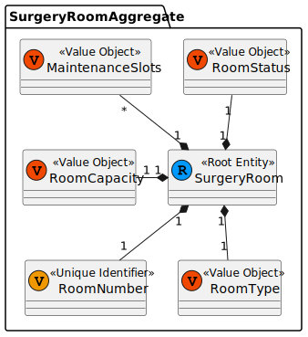
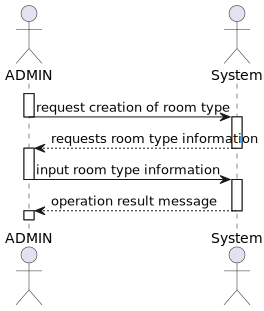
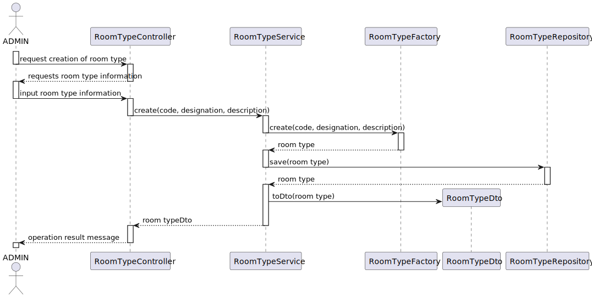
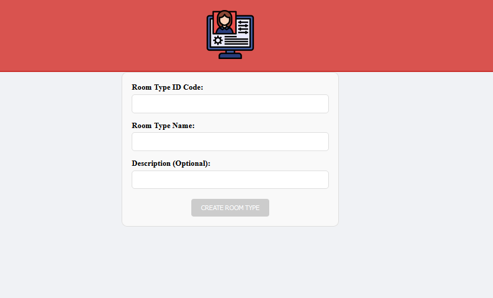

# US 7.2.10 - As an Admin, I want to add new Types of rooms, so that I can reflect on the available medical procedures in the system.

## 1. Context

The client has tasked the team with implementing a creation functionality, this is done to enable the creation of operation rooms using a graphic interface

## 2. Requirements

"**US 7.2.10 -** As an Admin, I want to add new Types of rooms, so that I can reflect on the available medical procedures in the system.

**Client Specifications - Q&A:**
> [**"7.2.10"** *by CARDOSO 1221083 - Saturday, 1st November of 2024 at 11:38*]
> What will be the Room Type fields to input when adding?
>>**Answer -** a room type is characterized by an internal code, a designation and an optional longer description. it also indicates if it the room type is suitable for surgeries or not

> [**"7.2.10"** *by CARDOSO 1221083 - Saturday, 1st November of 2024 at 11:38*]
> With the characterization of the room type, the internal code must have a format? If so, what will be the format? 
> For the designation, exists any restrition (max n° of characters, is unique, etc.)? If so, what restrition?
>>**Answer -** code is a text entered by the Admin. it must be 8 characters long, no spaces, only letters, numbers, and dashes ("-") are allowed. it must be unique.
designation. free text, alphanumeric, 100 characters max.

**Acceptance Criteria:**

- **US 7.10.4.1** The room type must contain the attributes: internal code, designation and option long description
- **US 7.10.4.2** The room internal code should be 8 characters long with only alphanumerical characters and "-"
- **US 7.10.4.3** The designation should be 100 characters max

## 3. Analysis

The functionality is rather simple in concept, just aims to provide more specific descriptions and classifying to the already existing concept of rooms

Room Attributes:

- Code (IDC)
- Designation
- (Optional) Longer Description

### Relevant DM Excerpts

### System Sequence Diagram

## 4. Design

### 4.1. Realization

### 4.2. Applied Patterns

- Aggregate
- Entity
- Value Object
- Service
- MVC
- Layered Architecture
- DTO
- Clean Architecture
- C4+1

### 4.3. Design Commits

> **01/11/2024 10:00 [US6.0.0]** (...)
>

## 5. Implementation

### 5.1. Code Implementation

## Frontend

### Component

[Component](../../../frontend/src/app/Admin/op-room-type-create/operation-room-type-create/operation-room-type-create.component.ts)

### Service

[ADmin Service](../../../frontend/src/app/Admin/admin.service.ts)

## Backend

### Controller

[Controller](../../../backoffice/src/Controllers/OperationRoomTypeController.cs)

### Service

[Service](../../../backoffice/src/Domain/OperationRoomType/OperationRoomTypeService.cs)

### Repository

[Operation Room Type Repository](../../../backoffice/src/Infraestructure/OperationRoomType/OperationRoomTypeRepository.cs)

### Utilities

[OperationRoomTypeDto](../../../backoffice/src/Domain/DTOs/OpRoomTypeDto.cs)
[OperationRoomType](../../../backoffice/src/Domain/OperationRoomType/OperationRoomType.cs)

### Main Commits

> **31/12/2024 19:21 [documentation update/fix (forgot DM excerpts my bad)]**
> Alfredo Augusto da Silva Ferreira

> **30/12/2024 18:02 [implementation documentation update]**
> Alfredo Augusto da Silva Ferreira

> **29/12/2024 13:13 [ui fix]**
> Alfredo Augusto da Silva Ferreira

> **21/12/2024 23:49 [mapper fix]**
> Alfredo Augusto da Silva Ferreira

> **16/12/2024 15:10 [frontend implementation]**
> Alfredo Augusto da Silva Ferreira

## 6. Integration/Demonstration

## 7. Observations

(...)
