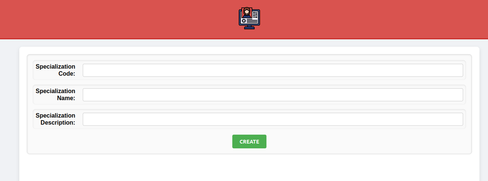

# US 7.2.11 - As an Admin, I want to add new Specializations, so that I can update or correct information about the staff and operation type (procedure)

## 1. Context

This User Story focuses on expanding the Specializations feature, allowing it to have a new code reference, and a description.
This US was first assigned during sprint C, as such it is the first time it is being undertaken.

## 2. Requirements

US 7.2.11 - As an Admin, I want to add new Specializations, so that I can update or correct information about the staff and operation type (procedure).

### Client Specifications - Q&A

> [7.2.11 por Tiago Sousa 1191583 - Saturday, 30 de November de 2024 às 11:37]
> The Specialization consist in what?
> Just a name or are there more fields?
>> **Answer:**
>> a specialization has a code (for example, based on SNOMED CT (Systematized Nomenclature of Medicine - Clinical Terms)), a designation and an optional longer description

### Acceptance Criteria

- US-7.2.11.1 - Admins can create new specializations.
- US-7.2.11.2 - Specializations must contain 3 value objects, code, name, and a description.
- US-7.2.11.3 - Description must be optional.

### Dependencies/References

This US has no dependencies, however, due to the necessary changes to an already existing class, several other User Stories that depended on Specializations where slightly affected.

## 3. Analysis

### System Sequence Diagram


### Relevant DM Excerpts


## 4. Design

### 4.1. Realization


### 4.2. Applied Patterns

- Aggregate
- Entity
- Value Object
- Service
- MVC
- Layered Architecture
- DTO
- C4+1
- Builder

### 4.3. Commits

> **Mon Dec 30 2024 22:31:47**
>
> - changing specialization to include new specifications

> **Tue Dec 31 2024 18:07:03**
>
> - initial documentation along with DM excerpt, SD and SSD

> **Tue Dec 31 2024 18:09:32**
>
> - small specialization update

> **Tue Dec 31 2024 18:11:43**
>
> - adding controller and service

> **Tue Dec 31 2024 18:12:52**
>
> - adding domain, controller, and service test

> **Wed Jan 01 2025 18:28:45**
>
> - slight refactor to controller http requests

> **Wed Jan 01 2025 18:30:17**
>
> - ui methods implementation

> **Wed Jan 01 2025 18:31:15**
>
> - ui methods implementation

> **Fri Jan 03 2025 14:40:15**
>
> - small correction to Specialization in the backend

> **Fri Jan 03 2025 14:41:13**
>
> - implementing US frontend UI

> **Fri Jan 03 2025 15:54:27**
>
> - updating UI

> **Sun Jan 05 2025 19:22:40**
>
> - adding integration tests

> **Sun Jan 05 2025 20:03:58**
>
> - adding fronted unit tests

## 5. Backend Implementation

### 5.1. Code Implementation

[SpecializationController](../../../backoffice/src/Controllers/SpecializationController.cs)

[SpecializationService](../../../backoffice/src/Domain/Specializations/SpecializationService.cs)

[Specialization](../../../backoffice/src/Domain/Specializations/Specialization.cs)

### 5.2. Tests

#### Specialization Controller Unit Tests

[SpecializationControllerTest](../../../backoffice/test/ControllerTest/SpecializationControllerTest.cs)

##### Test Cases

> CreateSpecializations
>> Validates the successful creation of a specialization

#### Specialization Service Unit Tests

[SpecializationServiceTest](../../../backoffice/test/ServiceTest/SpecializationServiceTest.cs)

##### Test Cases

> RegisterSpecialization_Successful
>> Validates the successful creation of a specialization

> RegisterSpecialization_Unsuccessful
>> Check proper error occurrence of a specialization

#### US-7.2.11 Integration Tests

[US-7.2.11 IntegrationTest](../../../backoffice/test/IntegrationTest/US_7_2_11_IntegrationTest.cs)

##### Test Cases

> CreateSpecialization_Successful
>> Validates the successful creation of a specialization

> CreateSpecialization_UnSuccessful
>> Check proper error occurrence of a specialization

## 6. UI Implementation

### 6.1. Code Implementation

[Specialization Creation](../../../frontend/src/app/Admin/specialization-creation/specialization-creation.component.ts)

```ts
export class SpecializationCreationComponent implements OnInit {
	response: LoginResponse | null = null;
	storedToken = localStorage.getItem('authToken');

	spCode: string = "";
	spName: string = "";
	spDesc: string = "";

	specialization: SpecializationData = { SpecializationName: "", SpecializationCode: "", SpecializationDescription: "" };

	constructor(
		private _service: AdminService,
		private _router: Router
	) { }

	ngOnInit(): void {
		if (this.storedToken) {
			this._service.validate(this.storedToken).subscribe(response => {
				if (response.role != "ADMIN") {
					console.log("not an admin");
					this._router.navigate(['']);
				}
			})
			this.response = { Token: this.storedToken } as LoginResponse;
		} else {
			this._router.navigate(['']);
		}
	}

	createSpecialization(): void {
		if (this.storedToken) {
			if (this.specialization.SpecializationName == "")
				return;

			let dto: SpecializationData = {
				SpecializationCode: this.specialization.SpecializationCode,
				SpecializationName: this.specialization.SpecializationName,
				SpecializationDescription: this.specialization.SpecializationDescription
			};

			this._service.createSpecialization(this.storedToken, dto);
		}

		this.specialization.SpecializationCode = "";
		this.specialization.SpecializationName = "";
		this.specialization.SpecializationDescription = "";
	}

}
```

### 6.2. Tests

#### Unit Tests

[Admin Service Tests](../../../frontend/src/app/Admin/admin.service.spec.ts)

```ts
describe('getSpecializations', () => {
	it('should send a GET request with the correct URL and headers based on the parameters', () => {
		const mockToken = 'test-token';
		const spec: SpecializationData[] = [{
			SpecializationCode: "1234",
			SpecializationName: "testName",
			SpecializationDescription: ""
		}];

		service.getSpecializations(mockToken);


		// Expect the DELETE request to be made to the correct URL
		const req = httpMock.expectOne(
			`https://localhost:5001/api/Specialization/GetSpecializationList`
		);

		expect(req.request.method).toBe('GET');
		expect(req.request.headers.get('token')).toBe(mockToken);

		req.flush(spec);
	});
});
```

#### Component Tests

[Specialization Creation Component Tests](../../../frontend/src/app/Admin/specialization-creation/specialization-creation.component.spec.ts)

```ts
describe('SpecializationCreationComponent', () => {
	let component: SpecializationCreationComponent;
	let adminServiceSpy: jasmine.SpyObj<AdminService>;
	let routerSpy: jasmine.SpyObj<Router>;
	let fixture: ComponentFixture<SpecializationCreationComponent>;

	beforeEach(async () => {
		const adminServiceMock = jasmine.createSpyObj('AdminService', ['validate', 'createSpecialization']);
		const routerMock = jasmine.createSpyObj('Router', ['navigate']);

		await TestBed.configureTestingModule({
			imports: [HttpClientTestingModule, SpecializationCreationComponent], // Include standalone component in imports
			providers: [
				{ provide: AdminService, useValue: adminServiceMock },
				{ provide: Router, useValue: routerMock }
			]
		}).compileComponents();

		fixture = TestBed.createComponent(SpecializationCreationComponent);
		component = fixture.componentInstance;
		adminServiceSpy = TestBed.inject(AdminService) as jasmine.SpyObj<AdminService>;
		routerSpy = TestBed.inject(Router) as jasmine.SpyObj<Router>;
	});

	it('should create the component', () => {
		expect(component).toBeTruthy();
	});

	it('should create a specialization when inputs are valid', () => {
		component.storedToken = 'mockToken';
		component.specialization.SpecializationCode = '001';
		component.specialization.SpecializationName = 'Cardiology';
		component.specialization.SpecializationDescription = 'Heart specialization';

		component.createSpecialization();

		expect(adminServiceSpy.createSpecialization).toHaveBeenCalledWith('mockToken', {
			SpecializationCode: '001',
			SpecializationName: 'Cardiology',
			SpecializationDescription: 'Heart specialization'
		});

		expect(component.specialization.SpecializationCode).toBe('');
		expect(component.specialization.SpecializationName).toBe('');
		expect(component.specialization.SpecializationDescription).toBe('');
	});

	it('should not create a specialization if the name is empty', () => {
		component.storedToken = 'mockToken';
		component.specialization.SpecializationCode = '001';
		component.specialization.SpecializationName = ''; // Name is empty
		component.specialization.SpecializationDescription = 'Heart specialization';

		component.createSpecialization();

		expect(adminServiceSpy.createSpecialization).not.toHaveBeenCalled();
	});
});
```

### 6.3. Demonstration


