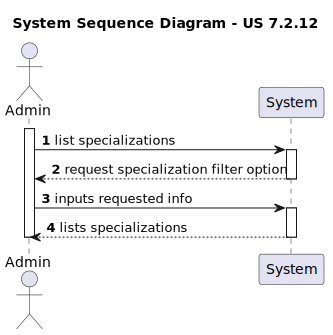
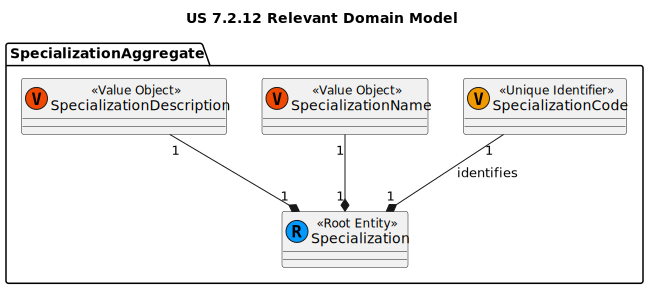
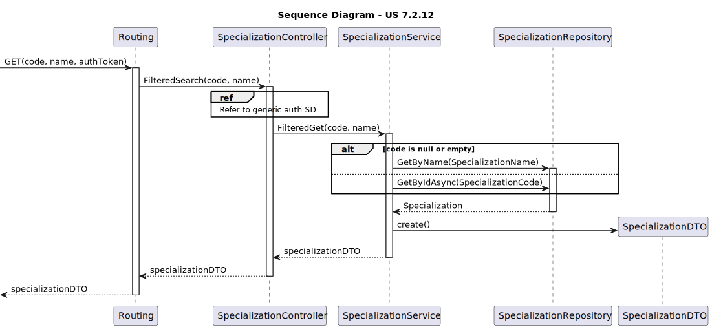
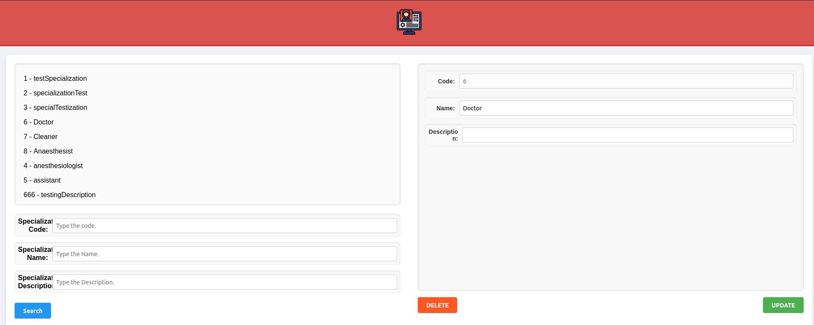

# US 7.2.12 - As an Admin, I want to list/search Specializations, so that I can see the details, and edit Specialization

## 1. Context

Making use of the new specifications this US aims to allow the admin to search for specific Specializations according to several criteria.
This US was first assigned during sprint C, as such it is the first time it is being undertaken.

## 2. Requirements

US 7.2.12 - As an Admin, I want to list/search Specializations, so that I can see the details, and edit Specialization.

### Client Specifications - Q&A

> [US 7.2.12 por CARDOSO 1221174 - Friday, 6 de December de 2024 às 18:27 ]
> Relativamente à US 7.2.12 - "As an Admin, I want to list/search Specializations, so that I can see the details and edit a Specialization," por quais filtros é possível procurar/listar? Por exemplo, designação, descrição, ... 
>> **Answer:**
>> deve ser possivel pesquisar por código (pesquisa exata), designação (pesquisa parcial) e descrição (pesquisa parcial).
>> Por pesquisa parcial, entende-se que o termo de pesquisa exista no respetivo atirbuto. por exmeplo, pesquisar por "orto" deve retornar todas as especialidades cuja designação/descrição contenha o termo "orto"

### Acceptance Criteria

- US-7.2.12.1 - Admins must be able to search for specific Specialization.
- US-7.2.12.2 - UI implementation must allow partial search from name and description.
- US-7.2.12.3 - Backend implementation must allow for specific search using code or name.

### Dependencies/References

- **US-7.2.11 -** requires specialization to have already been updated.

## 3. Analysis

### System Sequence Diagram



### Relevant DM Excerpts



## 4. Design

### 4.1. Realization



### 4.2. Applied Patterns

- Aggregate
- Entity
- Value Object
- Service
- MVC
- Layered Architecture
- DTO
- C4+1

### 4.3. Commits

> **Tue Dec 31 2024 18:07**
>
> - initial documentation along with DM excerpt, SD and SSD

> **Tue Dec 31 2024 18:11**
>
> - adding controller and service

> **Tue Dec 31 2024 18:12**
>
> - adding domain, controller, and service test

> **Wed Jan 01 2025 18:28**
>
> - slight refactor to controller http requests

> **Wed Jan 01 2025 18:31**
>
> - ui methods implementation

> **Fri Jan 03 2025 15:55**
>
> - finished UI implementation

> **Sun Jan 05 2025 18:42**
>
> - adding end to end test on specialization control

> **Sun Jan 05 2025 19:22**
>
> - adding integration tests

## 5. Backend Implementation

### 5.1. Code Implementation

[SpecializationController](../../../backoffice/src/Controllers/SpecializationController.cs)

[SpecializationService](../../../backoffice/src/Domain/Specializations/SpecializationService.cs)

[Specialization](../../../backoffice/src/Domain/Specializations/Specialization.cs)

### 5.2. Tests

#### Specialization Controller Unit Tests

[SpecializationControllerTest](../../../backoffice/test/ControllerTest/SpecializationControllerTest.cs)

##### Test Cases

> FilteredSearch_UnSuccessful
>> Validates the successful filtering of a specialization

#### Specialization Service Unit Tests

[SpecializationServiceTest](../../../backoffice/test/ServiceTest/SpecializationServiceTest.cs)

##### Test Cases

> FilteredGet_NameSuccessful
>> Validates the successful filtering of a specialization

> FilteredGet_CodeSuccessful
>> Validates the successful filtering of a specialization

#### US-7.2.12 Integration Tests

[US-7.2.12 IntegrationTest](../../../backoffice/test/IntegrationTest/US_7_2_12_IntegrationTest.cs)

##### Test Cases

> ListSpecialization_Successful1
>> Validates the successful filtering of a specialization

> ListSpecialization_Successful2
>> Validates the successful filtering of a specialization

> ListSpecialization_UnSuccessful
>> Check proper error occurrence of a specialization filtering

## 6. UI Implementation

### 6.1. Code Implementation

[Specialization Control](../../../frontend/src/app/Admin/specialization-control/specialization-control.component.ts)

```ts
gotSpecialization(code: string) {
	this.spPicked = null;
	for(let sp of this.spDisplay) {
		if (sp.SpecializationCode == code) {
			this.spPicked = sp;
			break;
		}
	}
	console.log(this.spPicked);
}

partialSearch(place: string, event: Event) {
	this.spPicked = null;
	if (place == 'name') {
		this.spPicked = null;
		this.spDisplay = [];
		for (let sp of this.specializations) {
			if (sp.SpecializationName.includes(this.searchName))
				this.spDisplay.push(sp);
		}
	}
	else if (place == 'description') {
		this.spPicked = null;
		this.spDisplay = [];
		for (let sp of this.specializations) {
			if (sp.SpecializationDescription.includes(this.searchDescription))
				this.spDisplay.push(sp);
		}
	}
}
```

### 6.2. Tests

#### Unit Tests

[Admin Service Tests](../../../frontend/src/app/Admin/admin.service.spec.ts)

```ts
describe('editSpecialization', () => {
	it('should send a PATCH request with the correct payload and headers', () => {
		const mockToken = 'test-token';
		const spec: SpecializationData = {
			SpecializationCode: "1234",
			SpecializationName: "testName",
			SpecializationDescription: ""
		};

		const mockResponse = { success: true };

		service.editSpecialization(
			mockToken, spec
		);

		const req = httpMock.expectOne(
			`https://localhost:5001/api/Specialization/EditSpecialization/${spec.SpecializationCode}`
		);

		expect(req.request.method).toBe('PATCH');
		expect(req.request.headers.get('token')).toBe(mockToken);
		expect(req.request.body).toEqual({
			SpecializationCode: spec.SpecializationCode,
			SpecializationName: spec.SpecializationName,
			SpecializationDescription: spec.SpecializationDescription
		});

		req.flush(mockResponse);
	});
});
```

#### Component Tests

[Specialization Control Tests](../../../frontend/src/app/Admin/specialization-control/specialization-control.component.spec.ts)

```ts
it('should filter specializations by name using partialSearch', () => {
	component.specializations = [
		{ SpecializationCode: '001', SpecializationName: 'Cardiology', SpecializationDescription: 'Heart related' },
		{ SpecializationCode: '002', SpecializationName: 'Neurology', SpecializationDescription: 'Brain related' }
	];

	component.searchName = 'Cardiology';
	component.partialSearch('name', {} as Event);

	expect(component.spDisplay.length).toBe(1);
	expect(component.spDisplay[0].SpecializationName).toBe('Cardiology');
});

it('should filter specializations by code using findSpecialization', () => {
	component.specializations = [
		{ SpecializationCode: '001', SpecializationName: 'Cardiology', SpecializationDescription: 'Heart related' },
		{ SpecializationCode: '002', SpecializationName: 'Neurology', SpecializationDescription: 'Brain related' }
	];

	component.searchCode = '001';
	component.findSpecialization();

	expect(component.spDisplay.length).toBe(1);
	expect(component.spDisplay[0].SpecializationCode).toBe('001');
});
```

#### System/E2E Tests

[Cypress Specialization Control Tests](../../../frontend/cypress/e2e/specialization-control/specialization-control.component.spec.cy.ts)

```ts
it('fetches and displays patient details on click', () => {
	cy.window().then((window) => {
		const component = window.ng.getComponent(window.document.querySelector('app-specialization-control'));

		component.initializeData('c6dcb583-c2e6-4893-966b-9a5f68c9b88a');
		component.spDisplay = [{
			SpecializationCode: "testCode1",
			SpecializationName: "testName1",
			SpecializationDescription: "description 1"
		}, {
			SpecializationCode: "testCode2",
			SpecializationName: "testName2",
			SpecializationDescription: "description 2"
		}, {
			SpecializationCode: "testCode3",
			SpecializationName: "testName3",
			SpecializationDescription: "description 3"
		}];

		component.spPicked = component.spDisplay[0];
	});

	// Verify patient details are displayed in the form
	cy.get('#input1').should('not.have.value', '');
	cy.get('.editable-box').should('be.visible');
});
```

### 6.3. Demonstration


