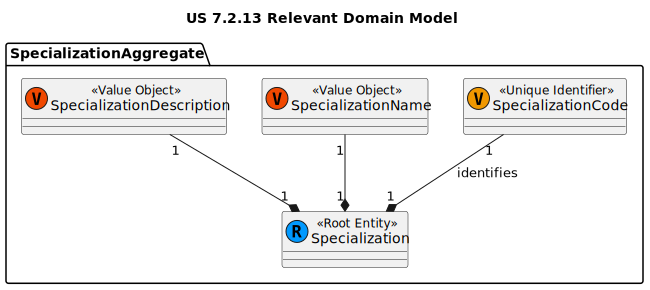
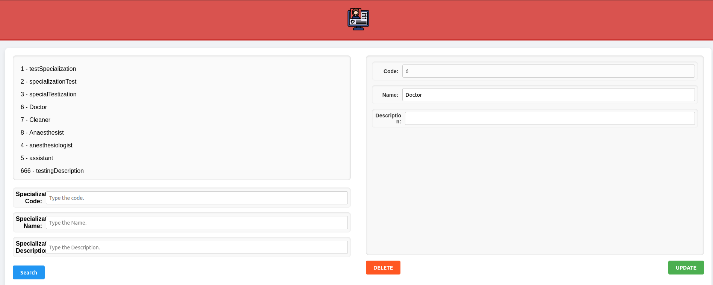

# US 7.2.13 - As an Admin, I want to edit Specializations, so that I can update or correct information about the staff and operation type (procedure)

## 1. Context

This US focuses on allowing admins to alter the new Specialization attributes.
This US was first assigned during sprint C, as such it is the first time it is being undertaken.

## 2. Requirements

US 7.2.13 - As an Admin, I want to edit Specializations, so that I can update or correct information about the staff and operation type (procedure).

### Client Specifications - Q&A

> [US 7.2.13 por CARDOSO 1221174 - Friday, 6 de December de 2024 às 18:30 ]
> Relativamente à US 7.2.13 - "As an Admin, I want to edit Specializations, so that I can update or correct information about the staff and operation type (procedure).", quais são os parâmetros possíveis para edição? Por exemplo, designação, descrição, ...
> 
>> **Answer:**
>> deve ser possivel editar a designação e a descrição

### Acceptance Criteria

- US-7.2.13.1 - Admins must be able to edit designation and description.
- US-7.2.13.2 - Specializations can't share the same name.

### Dependencies/References

- **US-7.2.11 -** requires specialization to have already been updated.

## 3. Analysis

### System Sequence Diagram


### Relevant DM Excerpts



## 4. Design

### 4.1. Realization


### 4.2. Applied Patterns

- Aggregate
- Entity
- Value Object
- Service
- MVC
- Layered Architecture
- DTO
- C4+1
- Builder

### 4.3. Commits

> **Tue Dec 31 2024 18:07**
>
> - initial documentation along with DM excerpt, SD and SSD

> **Tue Dec 31 2024 18:11**
>
> - adding controller and service

> **Tue Dec 31 2024 18:12**
>
> - adding domain, controller, and service test

> **Wed Jan 01 2025 18:28**
>
> - slight refactor to controller http requests

> **Wed Jan 01 2025 18:31**
>
> - ui methods implementation

> **Fri Jan 03 2025 15:55**
>
> - finished UI implementation

> **Sun Jan 05 2025 18:42**
>
> - adding end to end test on specialization control

> **Sun Jan 05 2025 19:22**
>
> - adding integration tests

## 5. Backend Implementation

### 5.1. Code Implementation

[SpecializationController](../../../backoffice/src/Controllers/SpecializationController.cs)

[SpecializationService](../../../backoffice/src/Domain/Specializations/SpecializationService.cs)

[Specialization](../../../backoffice/src/Domain/Specializations/Specialization.cs)

### 5.2. Tests

#### Specialization Controller Unit Tests

[SpecializationControllerTest](../../../backoffice/test/ControllerTest/SpecializationControllerTest.cs)

#### Specialization Service Unit Tests

[SpecializationServiceTest](../../../backoffice/test/ServiceTest/SpecializationServiceTest.cs)

##### Test Cases

> Edit_Successful
>> Validates the successful filtering of a specialization

> Edit_Unsuccessful1
>> Check proper error occurrence of a specialization editing

> Edit_Unsuccessful2
>> Check proper error occurrence of a specialization editing

#### US-7.2.13 Integration Tests

[US-7.2.13 IntegrationTest](../../../backoffice/test/IntegrationTest/US_7_2_13_IntegrationTest.cs)

##### Test Cases

> Edit_Successful
>> Validates the successful filtering of a specialization

> Edit_Unsuccessful1
>> Check proper error occurrence of a specialization editing

> Edit_Unsuccessful2
>> Check proper error occurrence of a specialization editing

## 6. UI Implementation

### 6.1. Code Implementation

[Specialization Control](../../../frontend/src/app/Admin/specialization-control/specialization-control.component.ts)

```ts
editSpecialization() {
	if (this.storedToken && this.spPicked) {
		this._service.editSpecialization(this.storedToken, this.spPicked);
		this.specializations = this.specializations.filter(
			sp => sp.SpecializationCode != this.spPicked?.SpecializationCode
		);
		this.specializations.push(this.spPicked);
		this.spPicked = null;
		this.spDisplay = [];
		this.specializations.forEach(sp => {
			this.spDisplay.push(sp);
		});
	}
}
```

### 6.2. Tests

#### Unit Tests

[Admin Service Tests](../../../frontend/src/app/Admin/admin.service.spec.ts)

```ts
describe('editSpecialization', () => {
	it('should send a PATCH request with the correct payload and headers', () => {
		const mockToken = 'test-token';
		const spec: SpecializationData = {
			SpecializationCode: "1234",
			SpecializationName: "testName",
			SpecializationDescription: ""
		};

		const mockResponse = { success: true };

		service.editSpecialization(
			mockToken, spec
		);

		const req = httpMock.expectOne(
			`https://localhost:5001/api/Specialization/EditSpecialization/${spec.SpecializationCode}`
		);

		expect(req.request.method).toBe('PATCH');
		expect(req.request.headers.get('token')).toBe(mockToken);
		expect(req.request.body).toEqual({
			SpecializationCode: spec.SpecializationCode,
			SpecializationName: spec.SpecializationName,
			SpecializationDescription: spec.SpecializationDescription
		});

		req.flush(mockResponse);
	});
});
```

#### Component Tests

[Specialization Control Tests](../../../frontend/src/app/Admin/specialization-control/specialization-control.component.spec.ts)

```ts
it('should call editSpecialization and update the specialization', () => {
	const mockSpecializations: SpecializationData[] = [
		{ SpecializationCode: '001', SpecializationName: 'Cardiology', SpecializationDescription: 'Heart related' },
		{ SpecializationCode: '002', SpecializationName: 'Neurology', SpecializationDescription: 'Brain related' }
	];
	component.specializations = [...mockSpecializations];
	component.spPicked = { SpecializationCode: '001', SpecializationName: 'Cardiology', SpecializationDescription: 'Heart and blood vessels' };
	let spPicked = { SpecializationCode: '001', SpecializationName: 'Cardiology', SpecializationDescription: 'Heart and blood vessels' };

	adminServiceSpy.editSpecialization.and.callThrough(); // Mock service method call

	component.editSpecialization();

	expect(adminServiceSpy.editSpecialization).toHaveBeenCalledWith('mock-token', spPicked);
	expect(component.specializations.length).toBe(2);
	expect(component.spPicked).toBeNull();
	expect(component.spDisplay.length).toBe(2);
	expect(component.specializations[1].SpecializationDescription).toBe('Heart and blood vessels');
});
```

#### System/E2E Tests

[Cypress Specialization Control Tests](../../../frontend/cypress/e2e/specialization-control/specialization-control.component.spec.cy.ts)

```ts
it('sends update request', () => {
	cy.window().then((window) => {
		const component = window.ng.getComponent(window.document.querySelector('app-specialization-control'));

		component.initializeData('c6dcb583-c2e6-4893-966b-9a5f68c9b88a');
		component.spDisplay = [{
			SpecializationCode: "testCode1",
			SpecializationName: "testName1",
			SpecializationDescription: "description 1"
		}, {
			SpecializationCode: "testCode2",
			SpecializationName: "testName2",
			SpecializationDescription: "description 2"
		}, {
			SpecializationCode: "testCode3",
			SpecializationName: "testName3",
			SpecializationDescription: "description 3"
		}];

		component.spPicked = component.spDisplay[0];
	});

	cy.get('.delete').click();
	cy.wait('@deleteSpecialization').its('request.body').should('exist');
});
```

### 6.3. Demonstration


