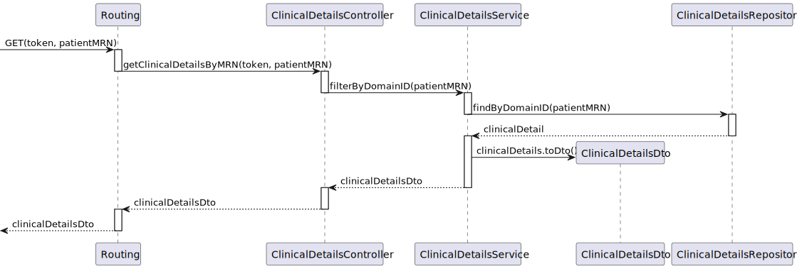

# US 7.2.14 -  As a Doctor, I want to include the access of the Patient Medical Record during the patient profile visualization and management, so that I manage it in that context

## 1. Context

A Patient can view their own Patient Medical Record, allowing them to see their own Medical Conditions and Allergies.
This is a newly assigned task during the third sprint and is to be completed in said sprint.

## 2. Requirements

**US7.2.14** As a Doctor, I want to include the access of the Patient Medical Record during the patient profile visualization and management, so that I manage it in that context

**Client Specifications - Q&A:**
> [**"7.2.14"** *by MONTEIRO 1220783 - Wednesday, 27 de November de 2024 às 11:38*]
>
> If im understanding the user story correctly, when the user opens the patient profile, it should be possible to view the data from the medical 
> record, correct?
> Or is this user story something else or more than this?
>
>>**Answer -** that's correct

**Acceptance Criteria:**

- US7.2.14.1. Patients can see their own medical record in their profile.

**Dependencies/References:**

No dependencies were found.

## 3. Analysis

### System Sequence Diagram

### Relevant DM Excerpts

## 4. Design

### 4.1. Sequence Diagram

#### Change staff information SD

#### Email SD 

#### Staff accept changes SD

### 4.2. Applied Patterns

- Aggregate
- Entity
- Value Object
- Service
- MVC
- DTO
- Layered Architecture
- Clean Architecture
- C4+1

### 4.3 Main Commits:

> **04/01/2025 [US7.2.14]**
> - Documentation
>
> **04/01/2025 [US7.2.14]**
> - UI functionality implemented.

## 5. Implementation

[ClinicalDetailsController](../../../PMD/src/controllers/ClinicalDetailsController.ts)

[ClinicalDetailsService](../../../PMD/src/services/ClinicalDetailsService.ts)

[ClinicalDetailsRepo](../../../PMD/src/repos/clinicalDetailsRepo.ts)

[ClinicalDetailsDTO](../../../PMD/src/dto/IClinicalDetailsDTO.ts)

### Tests

## 6. Integration/Demonstration

## 7. Observations

In the demonstration, the relevant data is what's at the bottom of the page. The allergies and medical conditions.
