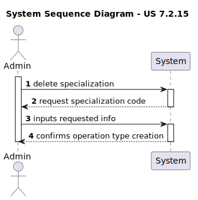
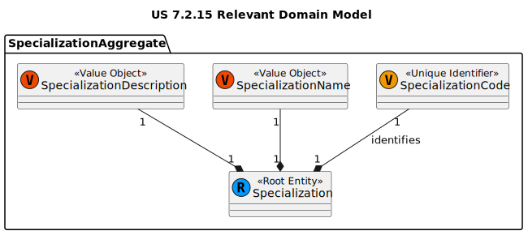
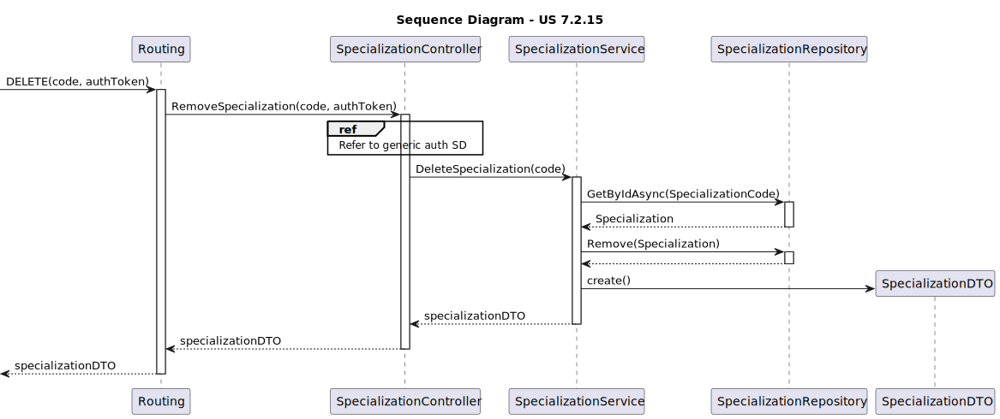
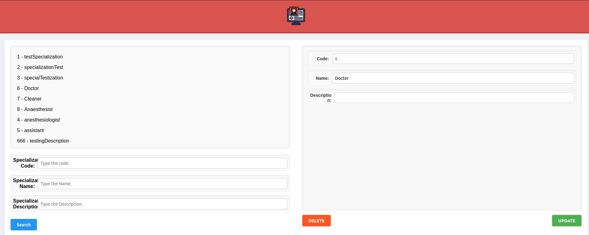

# US 7.2.15 - As an Admin, I want to list/search Specializations, so that I can see the details, and edit and remove Specializations

## 1. Context

This US was first assigned during sprint C, as such it is the first time it is being undertaken.

## 2. Requirements

US 7.2.15 - As an Admin, I want to list/search Specializations, so that I can see the details, and edit and remove Specializations.

### Acceptance Criteria

- US-7.2.15.1 - Admins must be able to delete specializations.

### Dependencies/References

- **US-7.2.11 -** requires specialization to have already been updated.

## 3. Analysis

### System Sequence Diagram



### Relevant DM Excerpts



## 4. Design

### 4.1. Realization



### 4.2. Applied Patterns

- Aggregate
- Entity
- Value Object
- Service
- MVC
- Layered Architecture
- DTO
- C4+1
- Builder

### 4.3. Commits

> **Tue Dec 31 2024 18:07**
>
> - initial documentation along with DM excerpt, SD and SSD

> **Tue Dec 31 2024 18:11**
>
> - adding controller and service

> **Tue Dec 31 2024 18:12**
>
> - adding domain, controller, and service test

> **Wed Jan 01 2025 18:28**
>
> - slight refactor to controller http requests

> **Wed Jan 01 2025 18:31**
>
> - ui methods implementation

> **Fri Jan 03 2025 15:55**
>
> - finished UI implementation

> **Sun Jan 05 2025 18:42**
>
> - adding end to end test on specialization control

> **Sun Jan 05 2025 19:22**
>
> - adding integration tests

## 5. Backend Implementation

### 5.1. Code Implementation

[SpecializationController](../../../backoffice/src/Controllers/SpecializationController.cs)

[SpecializationService](../../../backoffice/src/Domain/Specializations/SpecializationService.cs)

[Specialization](../../../backoffice/src/Domain/Specializations/Specialization.cs)

### 5.2. Tests

#### Specialization Controller Unit Tests

[SpecializationControllerTest](../../../backoffice/test/ControllerTest/SpecializationControllerTest.cs)

##### Test Cases

> DeleteSpecializations
>> Validates the successful deletion of a specialization

#### Specialization Service Unit Tests

[SpecializationServiceTest](../../../backoffice/test/ServiceTest/SpecializationServiceTest.cs)

##### Test Cases

> Delete_Successful
>> Validates the successful deletion of a specialization

#### US-7.2.15 Integration Tests

[US-7.2.15 IntegrationTest](../../../backoffice/test/IntegrationTest/US_7_2_15_IntegrationTest.cs)

##### Test Cases

> DeleteSpecialization_Successful
>> Validates the successful filtering of a specialization

> DeleteSpecialization_UnSuccessful
>> Check proper error occurrence of a specialization editing

## 6. UI Implementation

### 6.1. Code Implementation

[Specialization Control](../../../frontend/src/app/Admin/specialization-control/specialization-control.component.ts)

```ts
deleteSpecialization() {
	if (this.storedToken && this.spPicked) {
		this._service.deleteSpecialization(this.storedToken, this.spPicked.SpecializationCode);
		this.spPicked = null;
		this.spDisplay = [];
		this.specializations = this.specializations.filter(
			sp => sp.SpecializationCode != this.spPicked?.SpecializationCode
		);
		this.specializations.forEach(sp => {
			this.spDisplay.push(sp);
		});
	}
}
```

### 6.2. Tests

#### Unit Tests

[Admin Service Tests](../../../frontend/src/app/Admin/admin.service.spec.ts)

```ts
describe('deleteSpecialization', () => {
	it('should send a DELETE request with the correct URL and headers', () => {
		const mockToken = 'test-token';
		const spec: SpecializationData = {
			SpecializationCode: "1234",
			SpecializationName: "testName",
			SpecializationDescription: ""
		};

		const mockResponse = { success: true }; // Mock response from the server

		// Call the deleteOperationType method
		service.deleteSpecialization(mockToken, spec.SpecializationCode);

		// Expect the DELETE request to be made to the correct URL
		const req = httpMock.expectOne(
			`https://localhost:5001/api/Specialization/DeleteSpecialization/${spec.SpecializationCode}`
		);

		// Assert that the request method is DELETE
		expect(req.request.method).toBe('DELETE');

		// Assert that the correct token header is being sent
		expect(req.request.headers.get('token')).toBe(mockToken);

		// Simulate a successful response
		req.flush(mockResponse);
	});
});
```

#### Component Tests

[Specialization Control Tests](../../../frontend/src/app/Admin/specialization-control/specialization-control.component.spec.ts)

```ts
it('should call deleteSpecialization and update specialization lists', () => {
	const mockSpecializations: SpecializationData[] = [
		{ SpecializationCode: '001', SpecializationName: 'Cardiology', SpecializationDescription: 'Heart related' },
		{ SpecializationCode: '002', SpecializationName: 'Neurology', SpecializationDescription: 'Brain related' }
	];
	component.specializations = [...mockSpecializations];
	component.spPicked = { SpecializationCode: '001', SpecializationName: 'Cardiology', SpecializationDescription: 'Heart related' };

	adminServiceSpy.deleteSpecialization.and.callThrough(); // Mock service method call

	component.deleteSpecialization();

	expect(adminServiceSpy.deleteSpecialization).toHaveBeenCalledWith('mock-token', '001');
	expect(component.specializations.length).toBe(2);
	expect(component.spPicked).toBeNull();
	expect(component.spDisplay.length).toBe(2);
});
```

#### System/E2E Tests

[Cypress Specialization Control Tests](../../../frontend/cypress/e2e/specialization-control/specialization-control.component.spec.cy.ts)

```ts
it('sends delete request', () => {
	cy.window().then((window) => {
		const component = window.ng.getComponent(window.document.querySelector('app-specialization-control'));

		component.initializeData('c6dcb583-c2e6-4893-966b-9a5f68c9b88a');
		component.spDisplay = [{
			SpecializationCode: "testCode1",
			SpecializationName: "testName1",
			SpecializationDescription: "description 1"
		}, {
			SpecializationCode: "testCode2",
			SpecializationName: "testName2",
			SpecializationDescription: "description 2"
		}, {
			SpecializationCode: "testCode3",
			SpecializationName: "testName3",
			SpecializationDescription: "description 3"
		}];

		component.spPicked = {
			SpecializationCode: "testCode1",
			SpecializationName: "testName1",
			SpecializationDescription: "new description 1"
		};
	});

	cy.get('.update').click();
	cy.wait('@patchSpecialization').its('request.body').should('exist');
});
```

### 6.3. Demonstration


