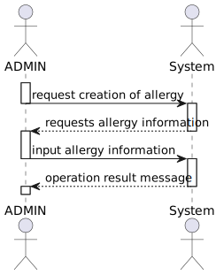
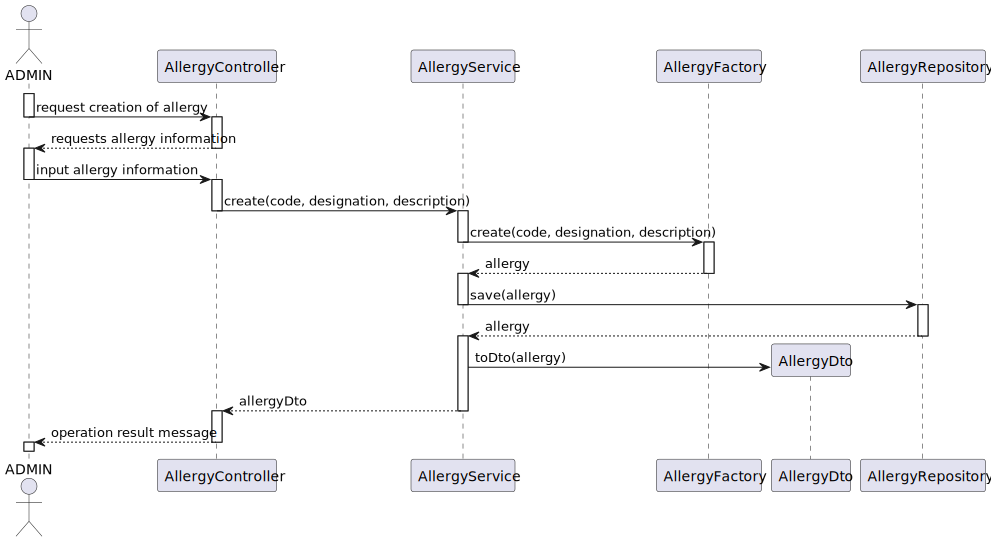
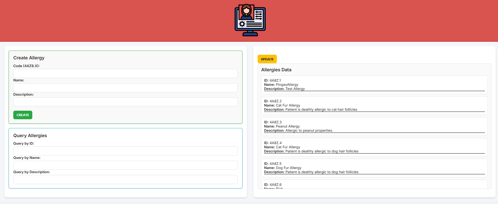

# US 7.2.2 - As an Admin, I want to add new Allergy, so that the Doctors can use it to update the Patient Medical Record.

## 1. Context

This is the first time this US is tasked to us. It tasks the implementation of a new functionality that requires the update of the previously implemented objects.

This functionality adds a new complexity to the patient profile that will be controlled by the admin.

## 2. Requirements

"**US 7.2.2 -** As an Admin, I want to add new Medical Condition, so that the Doctors can use it to update the Patient Medical Record"

**Client Specifications - Q&A:**
> [**"7.2.2"** *by VARELA 1220683 - Saturday, 1st December of 2024 at 11:38*]
>What information is to be known in an Allergy? Like designation, and anything more?
>>**Answer -**it consist of a code (for instance, SNOMED CT (Systematized Nomenclature of Medicine - Clinical Terms) or ICD-11 (International Classification of Diseases, 11th Revision)), a designation and an optional longer description

**Acceptance Criteria:**

- **US 7.2.4.1** *[From ClientSpecifications]* The Allergy has to have:
  - Code (IDC)
  - Designation
  - (Optional) Longer Description

**Dependencies/References:**

- "**US 7.2.3** - *As a Doctor, I want to search for Allergies, so that I can use it to update the Patient Medical Record.*"
  - The US 7.2.1 needs to be completed before the rest of the Patient Profile related USs.
- "**US 7.2.6** - *As a Doctor, I want to update the Patient Medical Record, namely respecting Medical Conditions and Allergies.*"
- "**US 7.2.7** - *As a Doctor, I want to search for entries in the Patient Medical Record, namely respecting Medical Conditions and Allergies.*"

## 3. Analysis

The functionality is rather simple in concept, just aims to facilitate the storage of allergy records in the database of the PMD backend, this will however require some refactoring of the Backoffice module and have some things moved from it to the new PMD module, that will be where the brunt of the work is.

Previously, the MedicalConditions/Allergies was a single attribute with no required data, being merely a string. Now, they are two different attributes and the Medical Conditions needs to have the following information:

- Code (IDC)
- Designation
- (Optional) Longer Description

### System Sequence Diagram

### Relevant DM Excerpts

## 4. Design

### 4.1. Realization

### 4.2. Applied Patterns

- Aggregate
- Entity
- Value Object
- Service
- MVC
- Layered Architecture
- DTO
- Clean Architecture
- C4+1

### 4.3. Design Commits

> **01/11/2024 10:00 [US6.0.0]** (...)
>

## 5. Implementation

### 5.1. Code Implementation

## Frontend

### Component

[Component](../../../frontend/src/app/Admin/allergy-control/allergy-controller/allergy-controller.component.css)

### Service

[Admin Service](../../../frontend/src/app/Admin/admin.service.ts)

### Controller

[Allergy Controller](../../../PMD/src/controllers/allergyController.ts)

### Service

[Allergy Service](../../../PMD/src/services/allergyService.ts)

### Repository

[Allergy Repostiory](../../../PMD/src/repos/allergyRepo.ts)

### Utilities

[AllergyDTO](../../../PMD/src/dto/IAllergyDTO.ts)
[Allergy](../../../PMD/src/domain/Allergy.ts)
[AllergyId](../../../PMD/src/domain/AllergyId.ts)
[AllergyMap](../../../PMD/src/mappers/AllergyMap.ts)

## 5.2. Tests

**Assigned Tester:** Ricardo Dias

## Unit Tests

This section provides an overview of the unit tests for the `allergy-controller.component` (front-end).

**Test File:** [allergy-controller.component.spec.cs](../../../frontend/src/app/Admin/allergy-control/allergy-controller/allergy-controller.component.spec.ts)

### Test Cases

1. **All the Tests**
   - should create the component
   - should initialize token from localStorage on ngOnInit
   - should call getAllergies and set allergies correctly
   - should set status message when getAllergies fails
   - should call patchAllergies and update the status message
   - should set status message when patchAllergies fails
   - should call createAllergy and set success status message
   - should set status message when createAllergy fails
   - should reset queryData after creating an allergy
   - should set selectedAllergy when fetchAllergyById is called
   - should set selectedAllergy to null when fetchAllergyById does not find the allergy

This section provides an overview of the unit tests for the `AllergyController`.

**Test File:** [allergyController.spec.cs](../../../PMD/tests/unit/controller/allergyController.spec.ts)

### Test Cases

1. **createAllergy**
   - should return 400 if token is missing
   - should return 401 if token is unauthorized
   - should return 400 if service fails
   - should return 201 if service succeeds

This section provides an overview of the unit tests for the `AllergyService`.

**Test File:** [allergyService.spec.cs](../../../PMD/tests/unit/services/allergyService.spec.ts)

### Test Cases

1. **createAllergy**
   - should return 201 if allergy is created successfully

### US7.2.2 Integration Tests

This section provides an overview of the integration tests for the `allergyIntegration` class. These tests ensure proper integration between controller and service layers.

**Test File:** [allergyIntegration.spec.cs](../../../PMD/tests/integration/allergyIntegration.spec.ts)

#### Test Cases

1. **createAllergy**
   - should return 201 and the created allergy if token is valid
   - should return 500 if there is an error in the service

### System/E2E Testing

#### Cypress E2E Testing

**Test File:** [E2E Tests](../../../frontend/cypress/e2e/create-allergy/create-alergy-spec.cy.ts)

> Performed through POSTMAN, the modules through which system testing was done can be accessed in the following file:
>>[System Testing](../../../backoffice/test/SystemTest/Allergies-Testing.postman_collection.json)

### Main Commits

> **04/01/2025 11:50 [implementation update on frontend]**
> Alfredo Augusto da Silva Ferreira

> **31/12/2024 19:21 [documentation update/fix (forgot DM excerpts my bad)]**
> Alfredo Augusto da Silva Ferreira

> **30/12/2024 18:02 [implementation documentation update]**
> Alfredo Augusto da Silva Ferreira

> **15/12/2024 00:56 [frontend implementation]**
> Alfredo Augusto da Silva Ferreira

> **09/12/2024 15:46 [implementation first iteration]**
> Alfredo Augusto da Silva Ferreira

## 6. Integration/Demonstration

## 7. Observations

(...)
