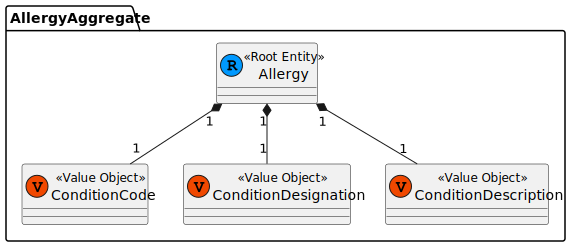
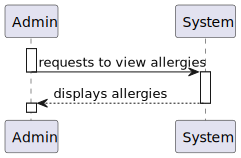
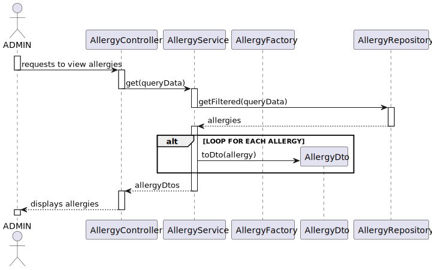
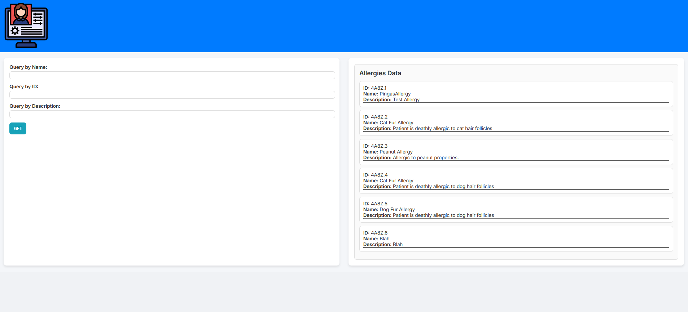

# US 7.2.3 - As a Doctor, I want to search for Allergies, so that I can use it to update the Patient Medical Record.

## 1. Context

The client has tasked the team with implementing a listing functionality for the allergies, this functionality should facilitate app use by providing the user with an interactive interface.

## 2. Requirements

"**US 7.2.3 -** As a Doctor, I want to search for Allergies, so that I can use it to update the Patient Medical Record."

**Client Specifications - Q&A:**
> [**"7.2.3"** *by  SANTOS 1220738 - Saturday, 29th November of 2024 at 11:38*]
> Gostariamos de lhe perguntar se existe alguma lista de alergias que prefere que utilizemos no sistema por default,  se sim, quais? Também gostariamos de perguntar se quando diz "I want to search for Allergies, so that I can use it to update the Patient Medical Record" o que é que implica a ultima parte? Que a procura é feita para adicionar imediatamente ao perfil de paciente ou se é apenas uma procura feita para ir buscar a informação sobre uma alergia por exemplo
>>**Answer -** em relação à segunda parte da pergunta, o que se pretende é que o médico possa indicar quais as alergias que o paciente tem seleccionando-as da lista de alergias existentes no sistema. notem que um paciente pode ter mais que uma alergia

**Acceptance Criteria:**

- **US 7.2.4.1** The user should be have a view of all the allergies in the system
- **US 7.2.4.2** The user should be have a view of all the allergies associated to a patient medical record
- **US 7.2.4.3** The user should be able to select allergies to add to the patient medical record

## 3. Analysis

The functionality is rather simple in concept, just aims to facilitate the storage of allergy records in the database of the PMD backend, this will however require some refactoring of the Backoffice module and have some things moved from it to the new PMD module, that will be where the brunt of the work is.

Previously, the MedicalConditions/Allergies was a single attribute with no required data, being merely a string. Now, they are two different attributes and the Medical Conditions needs to have the following information:

- Code (IDC)
- Designation
- (Optional) Longer Description

Our process will consist in updating the Patient Profile and everything it includes (backend + frontend) and then implementing the functionality.

### Relevant DM Excerpts

### System Sequence Diagram

## 4. Design

### 4.1. Realization

### 4.2. Applied Patterns

- Aggregate
- Entity
- Value Object
- Service
- MVC
- Layered Architecture
- DTO
- Clean Architecture
- C4+1

### 4.3. Design Commits

> **01/11/2024 10:00 [US6.0.0]** (...)
>

## 5. Implementation

## 5.1. Code Implementation

## Frontend

### Component

[Component](../../../frontend/src/app/Doctor/doctor-view-allergies/doctor-view-allergies/doctor-view-allergies.component.ts)

### Service

[Doctor Service](../../../frontend/src/app/Doctor/doctor.service.ts)

## Backend

### Controller

[Controller ](../../../PMD/src/controllers/allergyController.ts)

### Service

[Allergy Service](../../../PMD/src/services/allergyService.ts)

### Repository

[Allergy Repository](../../../PMD/src/repos/allergyRepo.ts)

### Utilities

[AllergyDTO](../../../PMD/src/dto/IAllergyDTO.ts)
[Allergy](../../../PMD/src/domain/Allergy.ts)
[AllergyId](../../../PMD/src/domain/AllergyId.ts)
[AllergyMap](../../../PMD/src/mappers/AllergyMap.ts)

## 5.2. Tests

**Assigned Tester:** Ricardo Dias

## Unit Tests

This section provides an overview of the unit tests for the `doctor-view-allergies.component` (front-end).

**Test File:** [doctor-view-allergies.component.spec.cs](../../../frontend/src/app/Doctor/doctor-view-allergies/doctor-view-allergies/doctor-view-allergies.component.spec.ts)

### Test Cases

1. **All the Tests**
   - should create the component
   - should initialize token from localStorage on ngOnInit
   - should call getAllergies and set allergies correctly
   - should set status message when getAllergies fails
   - should reset queryData after fetching allergies
   - should set selectedAllergy when fetchAllergyById is called
   - should set selectedAllergy to null when fetchAllergyById does not find the allergy

This section provides an overview of the unit tests for the `doctor.service` (front-end).

**Test File:** [doctor.service.spec.cs](../../../frontend/src/app/Doctor/doctor.service.spec.ts)

### Test Cases

1. **All the Tests**
   - should send a GET request to fetch allergies with the correct parameters and headers
   - should handle error when fetching allergies

This section provides an overview of the unit tests for the `AllergyController`.

**Test File:** [allergyController.spec.cs](../../../PMD/tests/unit/controller/allergyController.spec.ts)

### Test Cases

1. **queryAllergies**
   - should return 400 if token is missing
   - should return 401 if token is unauthorized
   - should return 400 if service fails
   - should return 201 if service succeeds

This section provides an overview of the unit tests for the `AllergyService`.

**Test File:** [allergyService.spec.cs](../../../PMD/tests/unit/services/allergyService.spec.ts)

### Test Cases

1. **queryAllergies**
   - should return 400 if query fails
   - should return 200 if allergies are queried successfully

### US7.2.2 Integration Tests

This section provides an overview of the integration tests for the `allergyIntegration` class. These tests ensure proper integration between controller and service layers.

**Test File:** [allergyIntegration.spec.cs](../../../PMD/tests/integration/allergyIntegration.spec.ts)

#### Test Cases

1. **queryAllergies**
   - should return 200 and a list of allergies if token is valid
   - should return 401 if token is invalid
   - should return 500 if there is an error in the service

### System/E2E Testing

> Performed through POSTMAN, the modules through which system testing was done can be accessed in the following file:
>>[System Testing](../../../backoffice/test/SystemTest/Allergies-Testing.postman_collection.json)

### Main Commits

> **31/12/2024 19:21 [documentation update/fix (forgot DM excerpts my bad)]**
> Alfredo Augusto da Silva Ferreira

> **30/12/2024 18:02 [implementation documentation update]**
> Alfredo Augusto da Silva Ferreira

> **17/12/2024 15:56 [UI Implementation]**
> Alfredo Augusto da Silva Ferreira

> **15/12/2024 00:56 [frontend implementation]**
> Alfredo Augusto da Silva Ferreira

> **10/12/2024 23:03 [implementation first iteration]**
> Alfredo Augusto da Silva Ferreira

## 6. Integration/Demonstration

## 7. Observations

(...)
