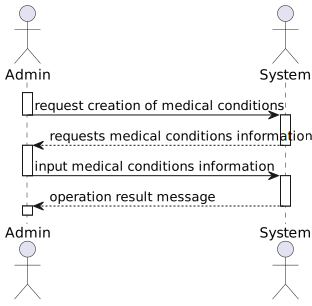
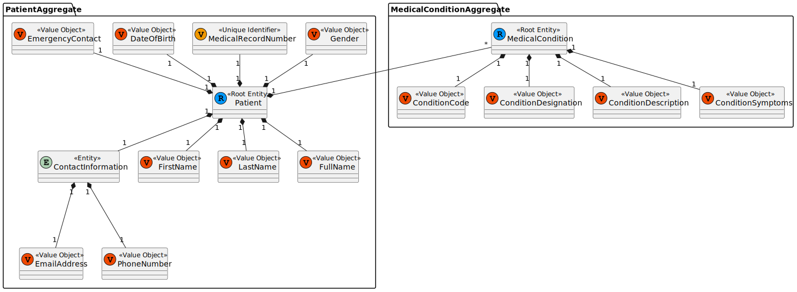
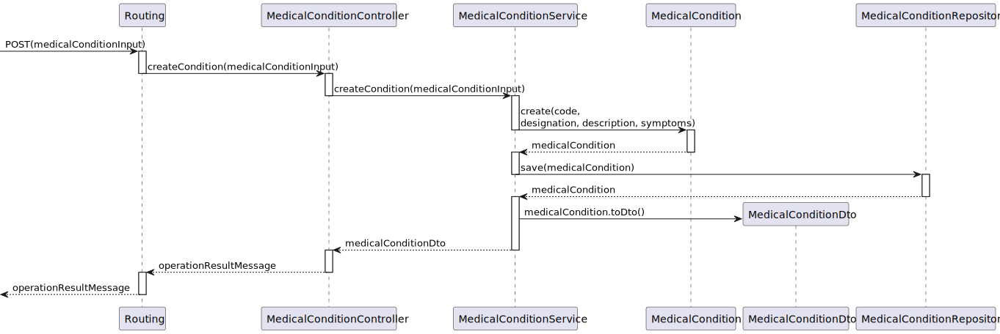
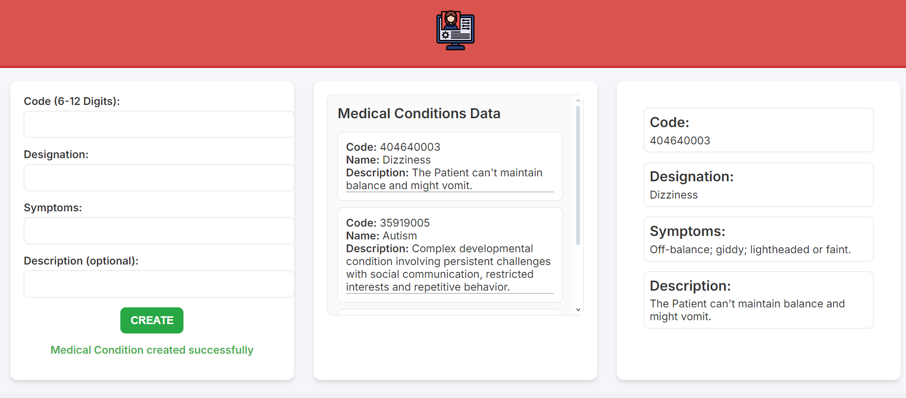

# US 7.2.4 - As an Admin, I want to add new Medical Condition, so that the Doctors can use it to update the Patient Medical Record

## 1. Context

This is the first time this US is tasked to us. It tasks the implementation of a new functionality that requires the update of the previously implemented objects.

This functionality adds a new complexity to the patient profile that will be controlled by the admin.

## 2. Requirements

"**US 7.2.4 -** As an Admin, I want to add new Medical Condition, so that the Doctors can use it to update the Patient Medical Record"

**Client Specifications - Q&A:**
> [**"7.2.4"** *by Tiago Sousa 1191583 - Saturday, 30th November of 2024 at 11:38*]
> The medical condition consist in what?
> Just a name or are there more fields?
>>**Answer -** it consists of a code (for example following ICD (International Classification of Diseases)), a designation and a longer description as well a list of common symptoms.

> [**"7.2.4"** *by Tiago Sousa 1191583 - Monday, 2nd December of 2024 at 16:40*]
> Earlier, you said the medical condition needed a code.
> Is this code automatic or is writen by the admin?
>>**Answer -** it must conform with the classficiation system you select, for instance, SNOMED CT (Systematized Nomenclature of Medicine - Clinical Terms) or ICD-11 (International Classification of Diseases, 11th Revision).

**Acceptance Criteria:**

- **US 7.2.4.1** *[From ClientSpecifications]* The Medical Contitions has to have:
  - Code (SNOMED-CT)
  - Designation
  - Longer Description
  - List of common symptoms
- **US 7.2.4.2** *[From ClientSpecifications]* The Code must conform with the classification selected by the team.

**Dependencies/References:**

- "**US 7.2.1** - *As Software Architect, I want to adopt a decentralized architecture of the backoffice module.*"
  - The US 7.2.1 needs to be completed before the rest of the Patient Profile related USs.
- "**US 7.2.5** - *As a Doctor, I want to search for Medical Conditions, so that I can use it to update the Patient Medical Record*"
  - The US 7.2.5 is dependent of the US 7.2.4 to be implemented.
- "**US 7.2.6** - *As a Doctor, I want to update the Patient Medical Record, namely respecting Medical Conditions and Allergies*"
  - The US 7.2.5 is dependent of the US 7.2.4 to be implemented.

## 3. Analysis

The functionality itself isn't too hard to implement, but the modifications that it requires to the already implemented functionalities are the ones most likely to cause problems.

Previously, the MedicalConditions/Allergies was a single attribute with no required data, being merely a string. Now, they are two different attributes and the Medical Conditions needs to have the following information:

- Code (we choose SNOMED-CT)
- Designation
- Longer Description
- List of common symptoms

Our process will consist in updating the Patient Profile and everything it includes (backend + frontend) and then implementing the functionality.

### System Sequence Diagram



### Relevant DM Excerpts



## 4. Design

### 4.1. Realization



### 4.2. Applied Patterns

- Aggregate
- Entity
- Value Object
- Service
- MVC
- Layered Architecture
- DTO
- Clean Architecture
- C4+1

### 4.3. Design Commits

> **04/12/2024 14:10 [US 7.2.4]** Documentation Started:
>
>-> Context & Requirements done (Client Specificiations might be updated)
>-> Analysis Started (missing SSD)

> **12/12/2024 18:43 [US 7.2.4]** Documentation Update:
>
>-> Analysis Completed - SSD & DM Excerpt done.
>-> Design Completed - SD done.

## 5. Implementation

### 5.1. Code Implementation

**MedicalConditionController:**

```ts
@Service()
export default class MedicalConditionController implements IMedicalConditionController {
  constructor(
    @Inject(config.services.condition.name) private conditionServiceInstance: IMedicalConditionService
  ) {}

  public async createCondition(token: string, req: Request, res: Response, next: NextFunction): Promise<Response> {
    console.log('Creating Medical Condition');
    //console.log(token);
    try {
      const rsa = new RSADecryptionService();
      const decryptedToken = rsa.decrypt(token);

      if(token == null){
        console.error('No token in header');
        return res.status(400).send({ message: 'No token in header' });
      }
      try {
        const tokenObject = JSON.parse(decryptedToken);
        const authZ = tokenObject.TokenValue;
        console.log(authZ);
        if (authZ != 'ADMIN_AUTH_TOKEN') {
          return res.status(401).send({ message: 'Unauthorized' });
        }
      } catch (error) {
        console.error('Error parsing token JSON:', error.message);
        throw error;
      }

      const conditionOrError = await this.conditionServiceInstance.createCondition(req.body as IMedicalConditionDTO) as Result<IMedicalConditionDTO>;
      
      if (conditionOrError.isFailure) {
        console.log(conditionOrError.errorValue());
        return res.status(400).send({ message: conditionOrError.errorValue() });
      }

      const medicalConditionDTO = conditionOrError.getValue();
      console.log(medicalConditionDTO);
      
      return res.status(201).json(medicalConditionDTO);
    } catch (e) {
      console.error('Error in createCondition:', e);
      console.log('DSFJKBHBGDFKJJKDSGFBKDSFBKDSJFGH');
      return res.status(500).send({ message: 'Internal server error' });
    }
  }
}
```

**ConditionService:**

```ts
@Service()
class ConditionService implements IMedicalConditionService {
  constructor(@Inject(config.repos.conditions.name) private conditionRepo: IConditionRepo) {}

  public async createCondition(conditionDTO: IMedicalConditionDTO): Promise<Result<IMedicalConditionDTO>> {
    console.log('Creating Medical Condition');
    try {
      let ConditionOrError;

      if(conditionDTO.code != null){
        ConditionOrError = MedicalCondition.create(conditionDTO, conditionDTO.code);
      }else{
        return Result.fail<IMedicalConditionDTO>('Code must be provided.');
      }
      
      if (ConditionOrError.isFailure) {
        return Result.fail<IMedicalConditionDTO>(ConditionOrError.errorValue());
      }

      const condition = ConditionOrError.getValue();
      await this.conditionRepo.save(condition);
      const conditionDTOResult = this.toDTO(condition);

      return Result.ok<IMedicalConditionDTO>(conditionDTOResult);
    } catch (e) {
      throw e;
    }
  }
}
```

## 5.2. Tests

**Assigned Tester:** Alfredo Ferreira

This section provides an overview of the unit tests for the `MedicalConditionControllerComponent`.

**Test File:** [medical-condition-controller.component.spec.ts](../../../frontend/src/app/Admin/medical-condition-controller/medical-condition-controller.component.spec.ts)

### Test Cases

1. **ngOnInit**
   - should set token from localStorage and refresh conditions

2. **getMedicalConditions**
   - should fetch medical conditions and set them on success

3. **createMedicalCondition**
   - should create a medical condition and refresh the list on success
   - should handle validation errors and set errorMessage

4. **resetData**
   - should reset queryData, createData, and selectedCondition

5. **refreshConditions**
   - should call getMedicalConditions

6. **fetchConditionById**
   - should set selectedCondition based on the given code
   - should set selectedCondition to null if no match is found

   
This section provides an overview of the unit tests for the `adminService`.

**Test File:** [medicalConditionController.spec.ts](../../../frontend/src/app/Admin/admin.service.spec.ts)

1. **searchCondition**
    - should fetch medical conditions with the correct query parameters and headers

2. **createCondition**
    - should create medical conditions with the correct query parameters and headers

### Test Cases

1. **createCondition**
   - should create a valid MedicalCondition
   - should return 201 if token is provided
   - should return 401 if unauthorized
   - should return 400 if MedicalCondition creation fails


This section provides an overview of the unit tests for the `medicalConditionController`.

**Test File:** [medicalConditionController.spec.ts](../../../PMD/tests/unit/controller/medicalConditionController.spec.ts)

### Test Cases

1. **createCondition**
   - should create a valid MedicalCondition
   - should return 201 if token is provided
   - should return 401 if unauthorized
   - should return 400 if MedicalCondition creation fails


This section provides an overview of the unit tests for the `conditionService`.

**Test File:** [conditionService.spec.ts](../../../PMD/tests/unit/services/conditionService.spec.ts)

### Test Cases

1. **createCondition**
   - should create a valid MedicalCondition
   - should return failure if code is not provided
   - should return failure if MedicalCondition creation fails


### US7.2.4 Integration Tests

This section provides an overview of the integration tests for the `medicalCondition-Controller-Service.spec.ts` class. These tests ensure proper integration between controller and service layers.

**Test File:** [Integration Tests](../../../PMD/tests/integration/medicalConditionIntegration.spec.ts)

### Test Cases

1. **createCondition**
   - should create a valid MedicalCondition
   - should return 500 if there is an error in the service


### System/E2E Testing

#### Cypress E2E Testing

**Test File:** [E2E Tests](../../../frontend/cypress/e2e/create-medical-condition/create-medical-condition-spec.cy.ts)

### Test Cases

1. **Should create a new medical condition and check if it is added to the list**
   - Fill out the form
   - Click the create button
   - Check success message

2. **Created Medical Condition should show in Scroll Box after Creation**
   - Check if the created medical condition is displayed in the scroll box

3. **Should show error message if mandatory fields are empty**
   - Leave form fields empty
   - Click the create button
   - Check error message

4. **Should show error message if code is empty**
   - Leave code field empty
   - Fill out other fields
   - Click the create button
   - Check error message

5. **Should show error message if designation is empty**
   - Leave designation field empty
   - Fill out other fields
   - Click the create button
   - Check error message

6. **Should show error message if symptoms is empty**
   - Leave symptoms field empty
   - Fill out other fields
   - Click the create button
   - Check error message

7. **Should allow creation if only optional field is empty**
   - Leave description field empty
   - Fill out other fields
   - Click the create button
   - Check success message

8. **Should display error message for code format mismatch**
   - Enter an invalid code format
   - Fill out other fields
   - Click the create button
   - Check error message


> Performed through POSTMAN, the modules through which system testing was done can be accessed in the following file:
>>[System Testing](../../../PMD/tests/SystemTests/System%20Testing%20US7.2.4%20US7.2.5.postman_collection.json)

### Main Commits

> **21/12/2024 17:16 [US 7.2.4]** Implementation Start:
>
>-> Classes creation.

> **21/12/2024 17:17 [US 7.2.4]** Implementation Start:
>
>-> Repository Creation.

> **22/12/2024 16:47 [US 7.2.4]** Implementation Continuation:
>
>-> Small error fixes to previous classes:
>--> Forced Condition Creation to have an ID (has it should)
>--> Updated the "update" method, to not be implemented. (it follows the same thought process as the Allergy but it wasn't requested by the client, so it remains commented).

> **22/12/2024 16:47 [US 7.2.4]** Implementation Continuation:
>
>-> Controller and Service methods created.

> **27/12/2024 17:33 [US 7.2.4]** MedicalCondition Schema Implemented (was missing for the persisntence) and index+config updated to include all the required classes (schema, controller, repo and service).

> **28/12/2024 16:28 [US 7.2.4]** Condition Route Creation and Implementation.

> **28/12/2024 16:31 [US 7.2.4]** Small Errors Correction on the Back-End

> **28/12/2024 16:32 [US 7.2.4]** Functionality Fully Implemented in the Front-end.

> **28/12/2024 19:01 [US 7.2.4]** Code Cleanup and Small Improvements.

## 6. Integration/Demonstration


