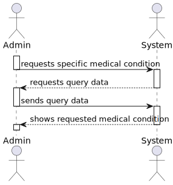
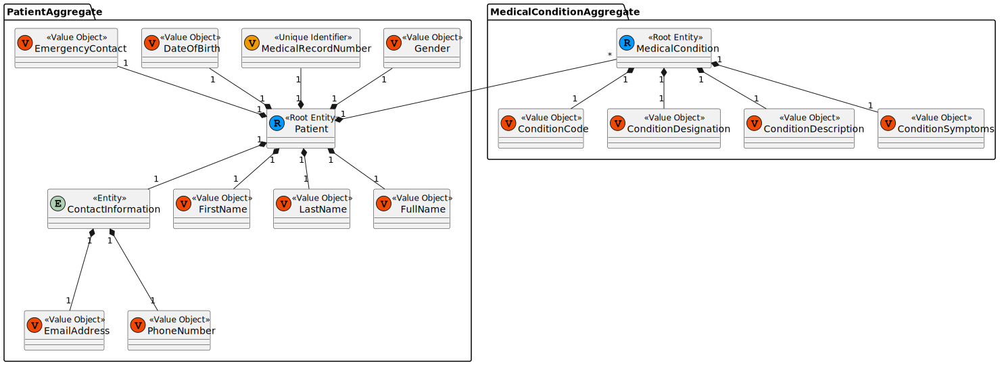
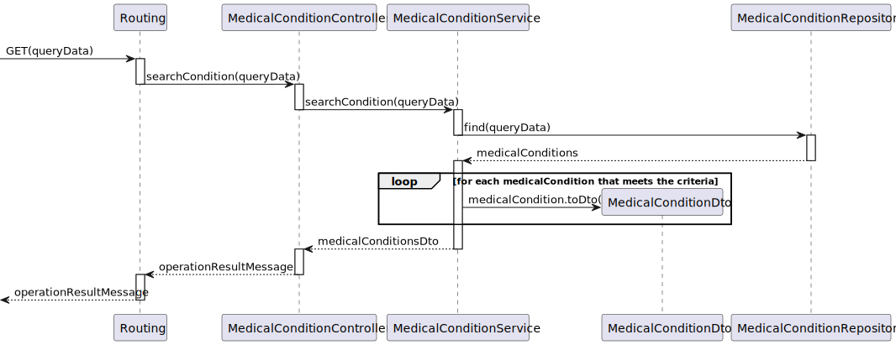
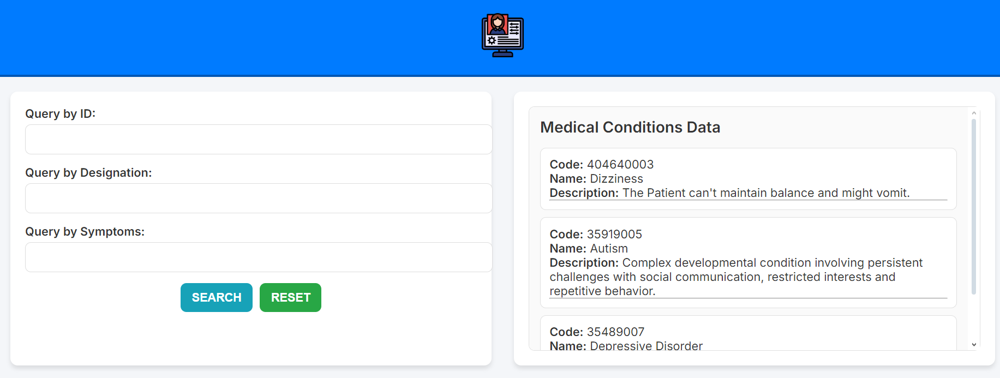
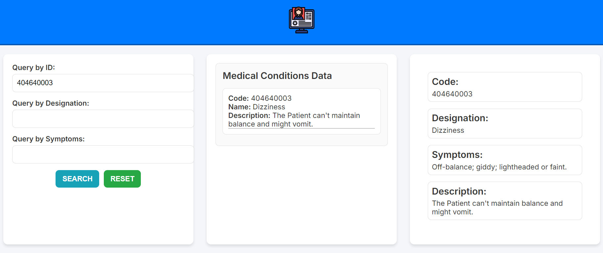

# US 7.2.5 - As a Doctor, I want to search for Medical Conditions, so that I can use it to update the Patient Medical Record

## 1. Context

This is the first time this US is tasked to us. It tasks the implementation of a new functionality that requires the update of the previously implemented objects. This update is already made through another US (7.2.4)

This functionality adds a new functionality for the doctor to the patient profile.

## 2. Requirements

"**US 7.2.5 -** As a Doctor, I want to search for Medical Conditions, so that I can use it to update the Patient Medical Record."

**Client Specifications - Q&A:**
> [**"US 7.2.5"** *by VARELA 1220683 - Monday, 2nd December of 2024 at 09:43*]
> What do you define as Medical Condition? Is it an allergy?
>
>>**Answer -** they are two different things.
a Medical Condition represents a diagnosed health issue or disease. Examples: Diabetes, Hypertension, Asthma, etc.

> [**"US 7.2.5"** *by VARELA 1220683 - Wednesday, 4th December of 2024 at 10:03*]
> Gostaria de lhe perguntar se existe alguma lista de medical conditions que prefere que utilizemos no sistema por default, se sim, quais? Também gostariamos de perguntar se quando diz "I want to search for Medical Conditions, so that I can use it to update the Patient Medical Record" o que é que implica a ultima parte?
> Que a procura é feita para adicionar imediatamente ao perfil de paciente ou se é apenas uma procura feita para ir buscar a informação sobre uma medical condition por exemplo?
>
>>**Answer -** quando o médico está a editar o registo médico do paciente, deve ter a possibilidade de inserir entradas de alergias e/ou condições médicas através de pesquisa de alergias/condições médicas

**Acceptance Criteria:**

- None Specified.

**Dependencies/References:**

- "**US 7.2.1** - *As Software Architect, I want to adopt a decentralized architecture of the backoffice module.*"
  - The US 7.2.1 needs to be completed before the rest of the Patient Profile related USs.
- "**US 7.2.4** - *As an Admin, I want to add new Medical Condition, so that the Doctors can use it to update the Patient Medical Record*"
  - This US can't be implemented until the US 7.2.4 is completed.

## 3. Analysis

This functionality is merely an option to search for a Medical Conditions that falls into a specific criteria. It should also show all the information related to it, and it should be able to be searched by `designation` and `code`.

This process will be really simple: the user writes the criteria he wants to see if it exists. The program searches if the program has medical conditions that have the criteria, it shows those medical conditions. It can be one or more.

### System Sequence Diagram



### Relevant DM Excerpts



## 4. Design

### 4.1. Realization



### 4.2. Applied Patterns

- Aggregate
- Entity
- Value Object
- Service
- MVC
- Layered Architecture
- DTO
- Clean Architecture
- C4+1

### 4.3. Design Commits

> **04/12/2024 14:10 [US 7.2.5]** Documentation Started:
>
>-> Context & Requirements done (Client Specificiations might be updated)

> **12/12/2024 18:44 [US 7.2.5]** Documentation Update:
>
>-> Analysis Completed - SSD & DM Excerpt done.
>-> Design Completed - SD done.

## 5. Implementation

### 5.1. Code Implementation

**MedicalConditionController:**

```ts
@Service()
export default class MedicalConditionController implements IMedicalConditionController {
  constructor(
    @Inject(config.services.condition.name) private conditionServiceInstance: IMedicalConditionService
  ) {}

  public async searchCondition(token: string, req: Request, res: Response, next: NextFunction): Promise<Response> {
    console.log(token)
    if(token == null){
      console.error('No token in header');
      return res.status(400).send({ message: 'No token in header' });
    }
    try {
      const rsa = new RSADecryptionService();
      const decryptedToken = rsa.decrypt(token);

      try {
        const tokenObject = JSON.parse(decryptedToken);
        const authZ = tokenObject.TokenValue;
        console.log(authZ);
        if (authZ != 'ADMIN_AUTH_TOKEN' && authZ != 'STAFF_AUTH_TOKEN') {
          return res.status(401).send({ message: 'Unauthorized' });
        }
      } catch (error) {
        console.error('Error parsing token JSON:', error.message);
        throw error;
      }
      
      const queryDto: IMedicalConditionQueryDto = req.query as IMedicalConditionQueryDto;
      const conditionOrError = await this.conditionServiceInstance.searchCondition(queryDto) as Result<IMedicalConditionDTO[]>;

      if (conditionOrError.isFailure) {
        return res.status(400).send({ message: conditionOrError.errorValue() });
      }

      const conditions = conditionOrError.getValue();
      return res.status(200).json(conditions);
    } catch (e) {
      console.error('Error in searchConditions:', e);
      return res.status(500).send({ message: 'Internal server error' });
    }
  }
}
```

**ConditionService:**

```ts
@Service()
class ConditionService implements IMedicalConditionService {
  constructor(@Inject(config.repos.conditions.name) private conditionRepo: IConditionRepo) {}

public async searchCondition(queryDto: IMedicalConditionQueryDto): Promise<Result<IMedicalConditionDTO[]>> {
    console.log('Querying Conditions');
    try {
      const conditions = await this.conditionRepo.find(queryDto);
      const conditionDTOs = conditions.map(condition => this.toDTO(condition));
      return Result.ok<IMedicalConditionDTO[]>(conditionDTOs);
    } catch (e) {
      return Result.fail<IMedicalConditionDTO[]>(e.message);
    }
  }
}
```

# 5.2. Tests

**Assigned Tester:** Alfredo Ferreira

## Unit Tests

This section provides an overview of the unit tests for the `update-clinical-details.component`.

**Test File:** [update-clinical-details.component.spec.ts](../../../frontend/src/app/Doctor/doctor-update-clinical-details/update-clinical-details.component.spec.ts)

### Test Cases

1. **getMedicalConditions**
   - should fetch medical conditions
   - should handle error when fetching medical conditions

2. **getAllergies**
   - should fetch allergies
   - should handle error when fetching allergies

3. **getPatients**
   - should fetch patients
   - should handle error when fetching patients

4. **fetchConditionById**
   - should fetch condition by ID and update buttons accordingly

5. **fetchAllergyById**
   - should fetch allergy by ID and update buttons accordingly

6. **fetchPatientById**
   - should fetch patient by ID and retrieve clinical details
   - should handle error when fetching clinical details

7. **addAllergy**
   - should add an allergy to the clinical details
   - should handle error when no clinical details are selected

8. **removeAllergy**
   - should remove an allergy from the clinical details
   - should handle error when no clinical details are selected

9. **addMedicalCondition**
   - should add a medical condition to the clinical details
   - should handle error when no clinical details are selected

10. **removeMedicalCondition**
    - should remove a medical condition from the clinical details
    - should handle error when no clinical details are selected

11. **updateClinicalDetails**
    - should update clinical details if changes are detected
    - should show error message if no changes were made while updating clinical details
    - should handle error when no clinical details are selected


This section provides an overview of the unit tests for the `doctorService`.

**Test File:** [doctorService.spec.ts](../../../PMD/tests/unit/services/doctorService.spec.ts)

### Test Cases

1. **getMedicalConditions**
   - should fetch medical conditions
   - should handle error when fetching medical conditions

2. **getFilteredDetails**
   - should fetch filtered clinical details
   - should handle error when fetching filtered clinical details

3. **updateClinicalDetails**
   - should update clinical details
   - should handle error when updating clinical details


This section provides an overview of the unit tests for the `medicalConditionController`.

**Test File:** [medicalConditionController.spec.ts](../../../PMD/tests/unit/controller/medicalConditionController.spec.ts)

### Test Cases


2. **searchCondition**
   - should return a list of MedicalConditionDTOs
   - should return 401 if unauthorized
   - should return 500 if an error occurs


This section provides an overview of the unit tests for the `conditionService`.

**Test File:** [conditionService.spec.ts](../../../PMD/tests/unit/services/conditionService.spec.ts)

### Test Cases

1. **searchCondition**
   - should return a list of MedicalConditionDTOs
   - should fail if an error occurs


### US7.2.4 Integration Tests

This section provides an overview of the integration tests for the `medicalCondition-Controller-Service.spec.ts` class. These tests ensure proper integration between controller and service layers.

**Test File:** [Integration Tests](../../../PMD/tests/integration/medicalConditionIntegration.spec.ts)

### Test Cases

1. **createCondition**
   - should create a valid MedicalCondition
   - should return 500 if there is an error in the service

2. **searchCondition**
   - should return a list of conditions if token is valid
   - should return 401 if token is invalid
   - should return 500 if there is an error in the service


### System/E2E Testing

> Performed through POSTMAN, the modules through which system testing was done can be accessed in the following file:
>>[System Testing](test\SystemTest\SEM5PI-Testing.postman_collection.json)

### Main Commits

> **21/12/2024 17:18 [US 7.2.5]** Implementation Start:
>
>-> Search Query Created and method implemented.

> **22/12/2024 16:47 [US 7.2.5]** Implementation Continuation:
>
>-> Controller and Service methods created.

> **27/12/2024 17:33 [US 7.2.5]** MedicalCondition Schema Implemented (was missing for the persisntence) and index+config updated to include all the required classes (schema, controller, repo and service).

> **28/12/2024 16:28 [US 7.2.5]** Condition Route Creation and Implementation.

> **28/12/2024 16:31 [US 7.2.5]** Small Errors Correction on the Back-End

> **28/12/2024 19:01 [US 7.2.5]** Functionality Fully Implemented in the Front-end.

> **28/12/2024 19:02 [US 7.2.5]** Back-End Cleanup and Improvements

## 6. Integration/Demonstration



