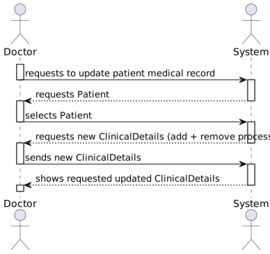
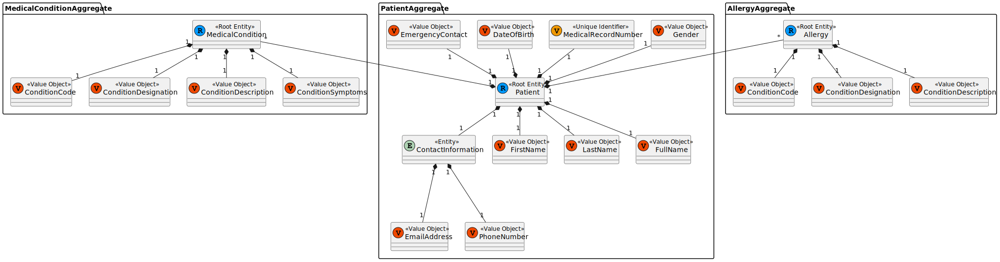
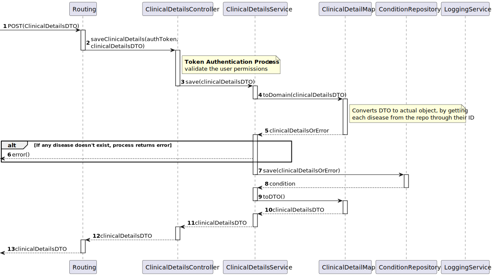
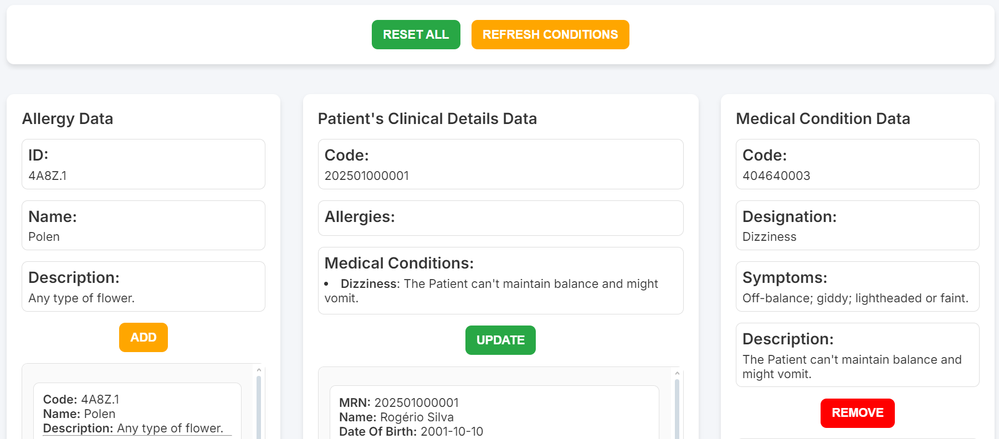

# US 7.2.6 - As a Doctor, I want to update the Patient Medical Record, namely respecting Medical Conditions and Allergies

## 1. Context

This is the first time this US is tasked to us. It tasks the implementation of a new functionality that requires the update of the previously implemented objects. This update is already made through another US (7.2.4)

This functionality adds a new functionality for the doctor to the patient profile.

## 2. Requirements

"**US 7.2.6 -** As a Doctor, I want to update the Patient Medical Record, namely respecting Medical Conditions and Allergies."

**Client Specifications - Q&A:**
> [**"7.2.6 Medical Record"** *by SILVA 1221719 - Tuesday, 3rd of December of 2024 at 00:41*]
> Boa noite,
O medical record pode incluir várias alergias e medical conditions.
Estas informações são suficientes ou considera necessário um campo de texto livre?
>
>>**Answer -** sim. pode incluir o registo de várias alergias e conditions.

**Acceptance Criteria:**

- None Specified.

**Dependencies/References:**

- "**US 7.2.1** - *As Software Architect, I want to adopt a decentralized architecture of the backoffice module.*"
  - The US 7.2.1 needs to be completed before the rest of the Patient Profile related USs.
- "**US 7.2.4** - *As an Admin, I want to add new Medical Condition, so that the Doctors can use it to update the Patient Medical Record*"
  - This US can't be implemented until the US 7.2.4 is completed.

## 3. Analysis

This functionality will include the posibility to update the Medical Conditions and Allergies of a Patient Medical Record. For this, the doctor will be able to change the object "Clinical Details" which will be connected to its respective Patient and diseases by their ID.

This process will allow the doctor to choose which diseases he wants to add or delete. The doctor can only add diseases that are already implemented in the database. He is not allowed to manually write the disease he wants to add.

In the front-end implementation, the search functionality will be merged into this functionality, to garantee that it will always send the correct disease and patient information's.

### System Sequence Diagram



### Relevant DM Excerpts



## 4. Design

### 4.1. Realization



### 4.2. Applied Patterns

- Aggregate
- Entity
- Value Object
- Service
- MVC
- Layered Architecture
- DTO
- Clean Architecture
- C4+1

### 4.3. Design Commits

> **04/12/2024 14:11 [US 7.2.6]** Documentation Started:
>
>-> Context & Requirements done (Client Specificiations might be updated)

> **12/12/2024 18:45 [US 7.2.6]** Documentation Update:
>
>-> Analysis Completed - SSD & DM Excerpt done.
>-> Design Completed - SD done.

## 5. Implementation

### 5.1. Code Implementation

**ClinicalDetailsController:**

```ts
@Service()
export default class ClinicalDetailsController implements IClinicalDetailsController {
  constructor(
    @Inject(config.services.clinicalDetails.name) private clinicalDetailsService: IClinicalDetailsService
  ) {}
  public async saveClinicalDetails(token: string, req: Request, res: Response, next: NextFunction): Promise<Response> {
    console.log('Creating Clinical Details');
    try {
      const rsa = new RSADecryptionService();
      const decryptedToken = rsa.decrypt(token);

      if(token == null){
        console.error('No token in header');
        return res.status(400).send({ message: 'No token in header' });
      }
      try {
        const tokenObject = JSON.parse(decryptedToken);
        const authZ = tokenObject.TokenValue;
        console.log(authZ);
        if (authZ != 'ADMIN_AUTH_TOKEN' && authZ != 'STAFF_AUTH_TOKEN') {
          return res.status(401).send({ message: 'Unauthorized' });
        }
      } catch (error) {
        console.error('Error parsing token JSON:', error.message);
        throw error;
    }
    try {
      const result = await this.clinicalDetailsService.save(req.body);

      return res.status(201).json(result);
    } catch (e) {
      next(e);
    }
    } catch (error) {
      next(error);
    }
  } 
}
```

**ClinicalDetailsService:**

```cs
@Service()
class ClinicalDetailsService implements IClinicalDetailsService {
  constructor(
    @Inject(config.repos.clinicalDetails.name) private clinicalDetailsRepo: IClinicalDetailsRepo
  ) {}

  public async save(clinicalDetailsDto: any): Promise<IClinicalDetailsDTO> {
    const clinicalDetails = await ClinicalDetailsMap.toDomain(clinicalDetailsDto);
    console.log(clinicalDetails);
    console.log('============ Save - Service ============');
    try {
      console.log('Patient MRN: ' + clinicalDetails.id);
      const clinicalDetailsOrError = ClinicalDetails.createWithDetails(clinicalDetails.allergies, clinicalDetails.medicalConditions, clinicalDetails.id.toString());
      if (clinicalDetailsOrError.isFailure) {
        throw new Error(clinicalDetailsOrError.errorValue().toString());
      }
      const result = await this.clinicalDetailsRepo.save(clinicalDetailsOrError.getValue());
      return ClinicalDetailsMap.toDTO(result);
    } catch (e) {
      throw new Error(`Error saving ClinicalDetails [Service]: ${e.message}`);
    }
  }
}
```

**ClinicalDetailsMap:**

```cs
export class ClinicalDetailsMap extends Mapper<ClinicalDetails> {
  public static toDTO(clinicalDetails: ClinicalDetails): IClinicalDetailsDTO {
    return {
      patientMRN: clinicalDetails.id.toString(),
      allergies: clinicalDetails.allergies.map(allergy => AllergyMap.toDTO(allergy)),
      medicalConditions: clinicalDetails.medicalConditions.map(condition => condition.toDTO()),
    } as IClinicalDetailsDTO;
  }

  public static async toDomain(raw: any): Promise<ClinicalDetails> {
    console.log('============ ToDomain ============');
    console.log('Mapping Clinical Details to Domain');
    const allergyRepo = Container.get(AllergyRepo);
    const medicalConditionRepo = Container.get(ConditionRepo);
  
    const allergies = raw.allergies ? await this.mapAllergies(allergyRepo, raw.allergies) : [];
    const medicalConditions = raw.medicalConditions ? await this.mapMedicalConditions(medicalConditionRepo, raw.medicalConditions) : [];
  
    console.log(allergies)

    console.log('Allergies and Medical Conditions mapped');
    const clinicalDetailsOrError = ClinicalDetails.createWithDetails(allergies, medicalConditions, raw.patientMRN);
    
    clinicalDetailsOrError.isFailure ? console.log(clinicalDetailsOrError.error) : '';
  
    return clinicalDetailsOrError.isSuccess ? clinicalDetailsOrError.getValue() : null;
  }
```

# 5.2. Tests

**Assigned Tester:** Alfredo Ferreira

## Unit Tests

This section provides an overview of the unit tests for the `update-clinical-details.component`.

**Test File:** [update-clinical-details.component.spec.ts](../../../frontend/src/app/Doctor/doctor-update-clinical-details/update-clinical-details.component.spec.ts)

### Test Cases

1. **getMedicalConditions**
   - should fetch medical conditions
   - should handle error when fetching medical conditions

2. **getAllergies**
   - should fetch allergies
   - should handle error when fetching allergies

3. **getPatients**
   - should fetch patients
   - should handle error when fetching patients

4. **fetchConditionById**
   - should fetch condition by ID and update buttons accordingly

5. **fetchAllergyById**
   - should fetch allergy by ID and update buttons accordingly

6. **fetchPatientById**
   - should fetch patient by ID and retrieve clinical details
   - should handle error when fetching clinical details

7. **addAllergy**
   - should add an allergy to the clinical details
   - should handle error when no clinical details are selected

8. **removeAllergy**
   - should remove an allergy from the clinical details
   - should handle error when no clinical details are selected

9. **addMedicalCondition**
   - should add a medical condition to the clinical details
   - should handle error when no clinical details are selected

10. **removeMedicalCondition**
    - should remove a medical condition from the clinical details
    - should handle error when no clinical details are selected

11. **updateClinicalDetails**
    - should update clinical details if changes are detected
    - should show error message if no changes were made while updating clinical details
    - should handle error when no clinical details are selected


This section provides an overview of the unit tests for the `doctorService`.

**Test File:** [doctorService.spec.ts](../../../PMD/tests/unit/services/doctorService.spec.ts)

### Test Cases

1. **getMedicalConditions**
   - should fetch medical conditions
   - should handle error when fetching medical conditions

2. **getFilteredDetails**
   - should fetch filtered clinical details
   - should handle error when fetching filtered clinical details

3. **updateClinicalDetails**
   - should update clinical details
   - should handle error when updating clinical details


This section provides an overview of the unit tests for the `clinicalDetailsController`.

**Test File:** [clinicalDetailsController.spec.ts](../../../PMD/tests/unit/controller/clinicalDetailsController.spec.ts)

### Test Cases

1. **getClinicalDetailsByMRN**
   - should return clinical details when authorized
   - should return 401 if unauthorized

2. **filterClinicalDetails**
   - should return filtered clinical details when authorized
   - should return 401 if unauthorized

3. **saveClinicalDetails**
   - should save clinical details when authorized
   - should return 401 if unauthorized

4. **createBlankClinicalDetails**
   - should create blank clinical details when authorized
   - should return 401 if unauthorized


This section provides an overview of the unit tests for the `conditionService`.

**Test File:** [conditionService.spec.ts](../../../PMD/tests/unit/services/conditionService.spec.ts)

### Test Cases

1. **createCondition**
   - should create a valid MedicalCondition
   - should fail if code is not provided
   - should fail if MedicalCondition creation fails

2. **searchCondition**
   - should return a list of MedicalConditionDTOs
   - should fail if an error occurs


### US7.2.6 Integration Tests

This section provides an overview of the integration tests for the `clinicalDetailsController` and `clinicalDetailsService`. These tests ensure proper integration between controller and service layers.

**Test File:** [Integration Tests](../../../PMD/tests/integration/clinicalDetailsIntegration.spec.ts)

### Test Cases

1. **getClinicalDetailsByMRN**
   - should return clinical details when authorized
   - should return 401 if unauthorized

2. **filterClinicalDetails**
   - should return filtered clinical details when authorized
   - should return 401 if unauthorized

3. **saveClinicalDetails**
   - should save clinical details when authorized
   - should return 401 if unauthorized

4. **createBlankClinicalDetails**
   - should create blank clinical details when authorized
   - should return 401 if unauthorized

### System/E2E Testing

> Performed through POSTMAN, the modules through which system testing was done can be accessed in the following file:
>>[System Testing](test\SystemTest\SEM5PI-Testing.postman_collection.json)

### Main Commits

> **21/12/2024 17:19 [US 7.2.6]** Implementation Start:
>
>-> Edit Dto created and method implemented

> **27/12/2024 17:33 [US 7.2.6]** MedicalCondition Schema Implemented (was missing for the persisntence) and index+config updated to include all the required classes (schema, controller, repo and service).

> **30/12/2024 18:06 [US 7.2.6]** Clinical Data Instantiating (my part) - Overall Naming Correction

> **30/12/2024 18:07 [US 7.2.6]** US BackEnd Method Implementation

> **01/01/2025 23:53 [US 7.2.6]** Front-End Implementation - The main functionalities for the user to update the ClinicalDetails are implemented, but it is missing the update functionality. That is being worked on.

> **01/01/2025 23:54 [US 7.2.6]** Small Backoffice updates to accomodate front-end implementations.

> **01/01/2025 23:59 [US 7.2.6]** More Small PMD Updates to accomodate new Front-end Implementations

> **03/01/2025 00:00 [US 7.2.6]** Clinical Data Overall BackEnd Remodule:
>
>-> The original creation of the Class had many conflicting and overlaping concepts that made the UpdateProcess impossible. This remodule removes redundancy, improves efficiency, readability and allows the update to function.
>->The update function still needs some improvements and fixes. The connection between the backend and the frontend make this process be really slow.

> **03/01/2025 00:02 [US 7.2.6]** Complement to the Backend Remodule.

> **04/01/2025 13:03 [US 7.2.6]** BackEnd Final Fix to make the Update Functionality be fully functional.

> **04/01/2025 13:09 [US 7.2.6]** Functionality Implementation in the Front-End:
>
>-> The update functionality is finally ready and fully tested. FrontEnd might need a bit of clean-up, but the functionality now works.

## 6. Integration/Demonstration



## 7. Observations

The creation of the ClinicalDetails class, required a refactor to several implementations already present in the project. Mainly:

- **Admin Patient Creation -** It was required to create a method called "createBlankClinicalDetails" that automatically creates a ClinicalDetails when a Patient Medical Record is created, with its MRN.
  - Legacy Patients (patients which were created in the last sprint) don't have a ClinicalDetails associated to them, since the individual creation of the ClinicalDetails wasn't a requirement of the client.
- **Patient Medical Record Update -** The update functionality had to be shared with the Patient since he already was able to update its own Patient MR.
