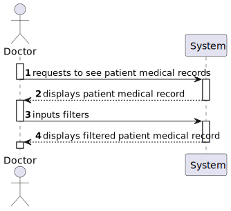
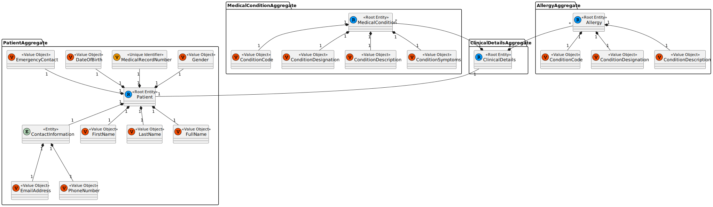
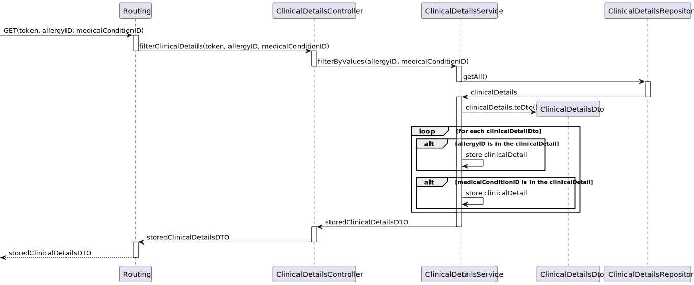
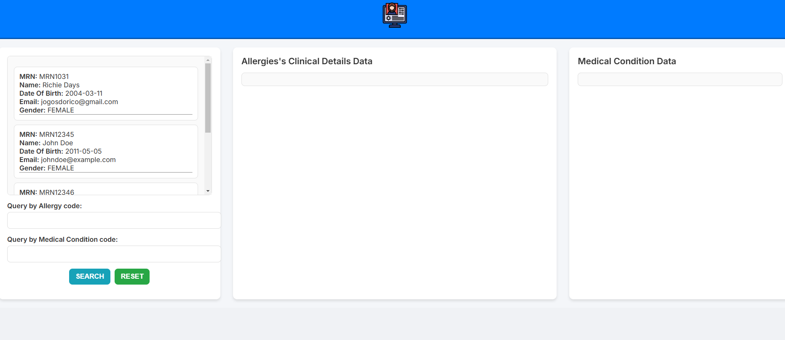
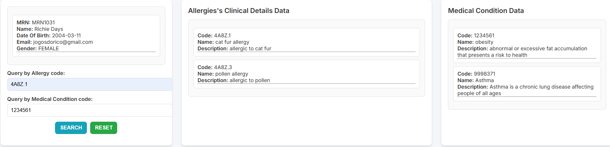

# US 7.2.7 - As a Doctor, I want to search for entries in the Patient Medical Record, namely respecting Medical Conditions and Allergies

## 1. Context

A Doctor can search in the Patient Medical Record, allowing them to see the Medical Conditions and Allergies related to a patient.
This is a newly assigned task during the first sprint and is to be completed in said sprint.

## 2. Requirements

**US7.2.7** As an Admin, I want to edit a staff’s profile, so that I can update their information

**Client Specifications - Q&A:**
> [**"7.2.7 Medical Record"** *by ESTEBAINHA 1220664 - Tuesday, 3rd of December of 2024 at 09:49*]
> Bom dia,
> Na tarefa 7.2.7, refere-se à filtragem de Medical Records através de Allergies e Medical Conditions ou à pesquisa de Allergies
> Medical Conditions dentro de um Medical Record?
>
> Obrigado pela atenção,
>>**Answer -** pretende-se procurar entradas do medical record em que exista menções a determinadas alergias ou condições médicas

**Acceptance Criteria:**

- US7.2.7.1 Patients will be filtered by the allergies and/or medical conditions that they have.

- US7.2.7.2. If only one of them has been chosen, it will filter by that one. If both filters have been applied, it will apply both of them simultaneously.

**Dependencies/References:**

No dependencies were found.

## 3. Analysis

### System Sequence Diagram

### Relevant DM Excerpts

## 4. Design

### 4.1. Sequence Diagram

#### Change staff information SD

### 4.2. Applied Patterns

- Aggregate
- Entity
- Value Object
- Service
- MVC
- DTO
- Layered Architecture
- Clean Architecture
- C4+1

### 4.3 Main Commits:
> **04/01/2025 [US7.2.7]**
> - Documentation
>
> **04/01/2025 [US7.2.7]**
> - Created routes for the UIs, implemented methods to fetch needed information from backend
>
> **04/01/2025 [US7.2.7]**
> - Added UI implementation
>

## 5. Implementation

[ClinicalDetailsController](../../../PMD/src/controllers/ClinicalDetailsController.ts)

[ClinicalDetailsService](../../../PMD/src/services/ClinicalDetailsService.ts)

[ClinicalDetailsRepo](../../../PMD/src/repos/clinicalDetailsRepo.ts)

[ClinicalDetailsDTO](../../../PMD/src/dto/IClinicalDetailsDTO.ts)

### Tests

## 6. Integration/Demonstration

## 7. Observations

In the demonstrations result, once a patient has been clicked, it will show their respective allergies and medical conditions.