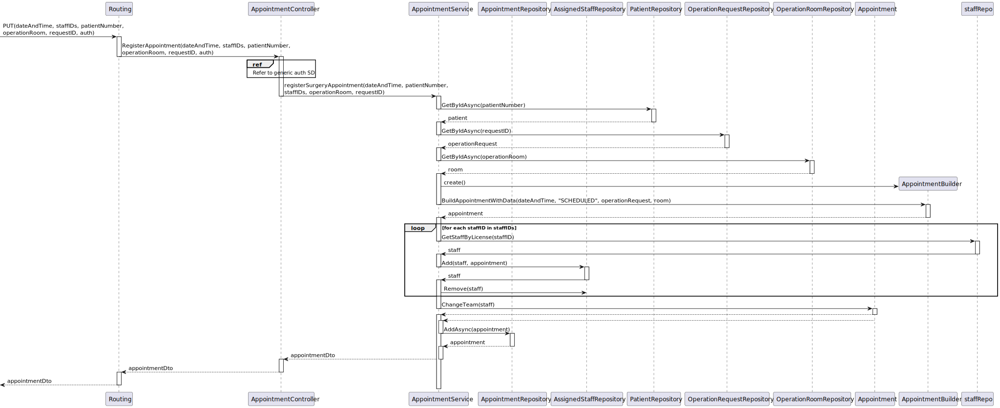

# US 7.2.8 - As a Doctor, I want to create a Surgery Appointment, so that the Patient doesn’t need to wait for the automatically generated planning

## 1. Context

A Doctor can create appointments for patients so that the patients won't have to wait for the automatically generated planning. This is a newly assigned task during the third sprint and is to be completed in said sprint.

## 2. Requirements

**US 7.2.8** As a Doctor, I want to create a Surgery Appointment, so that the Patient doesn’t need to wait for the automatically generated planning

**Client Specifications - Q&A:**
> [**"7.2.9"** *by Vicente Cardoso 1180664 - Wednesday, 27 de November de 2024 às 12:44*]
>
>Good afternoon,
>Should the doctor be able to make a surgery appointment without making a prior operation request for said appointment?
>
>Best regards,
>
>Vicente Cardoso
>
>>**Answer -** The doctor must be able to "transform" an existing operation request into an actual appointment by specifying the room, date and team of the surgery. the system must ensure all the resources and personnel is available at the selected time according to the operation type duration.

**Acceptance Criteria:**

- US7.2.8.1. The doctor has to choose a date, a room, an operation request and staff needed.

- US7.2.8.2. Staff picked has to be available.

**Dependencies/References:**

No dependencies were found.

## 3. Analysis

### System Sequence Diagram

### Relevant DM Excerpts

## 4. Design

### 4.1. Sequence Diagram

#### Change staff information SD

### 4.2. Applied Patterns

- Aggregate
- Entity
- Value Object
- Service
- MVC
- DTO
- Layered Architecture
- Clean Architecture
- C4+1

### 4.3 Main Commits:

> **04/01/2025 [US7.2.8]**
> - Documentation
>
> **04/01/2025 [US7.2.8]**
> - Added controller and service
>
> **04/01/2025 [US7.2.8]**
> -  Update appointment repository and appointment to support US requirements.
>
> **04/01/2025 [US7.2.8]**
> - Update to DTOs and operationrequest repo for frontend usage.
>
> **04/01/2025 [US7.2.8]**
> - Added repository method to get staff availability slots.
> **04/01/2025 [US7.2.8]**
> - Added AssignedStaff table to support N to N relation between staff and appointment
> 
> **04/01/2025 [US7.2.8]**
> - New method in operation request controller for frontend usage
> 
> **04/01/2025 [US7.2.8]**
> - Created routes for the UIs, implemented methods to fetch needed information from backend
> 
> > **04/01/2025 [US7.2.8]**
> - Added attribute to OperationRequestData to help with the frontend.
> 
> **04/01/2025 [US7.2.8]**
> - Added UI implementation
> 
 
## 5. Implementation

[AppointmentController](../../../backoffice/src/Controllers/AppointmentController.cs)

[AppointmentService](../../../backoffice/src/Domain/Appointment/AppointmentService.cs)

[AppointmentDto](../../../backoffice/src/Domain/Appointment/AppointmentDto.cs)

[AppointmentRepository](../../../backoffice/src/Infraestructure/Appointment/AppointmentRepository.cs)

[AssignedStaffRepository](../../../backoffice/src/Infraestructure/AssignedStaff/AssignedStaffRepository.cs)

### Tests

[AppointmentControllerTest](../../../backoffice/test/ControllerTest/AppointmentControllerTest.cs)

[AppointmentServiceTest](../../../backoffice/test/ServiceTest/AppointmentServiceTest.cs)

[E2E cypress](../../../frontend/cypress/e2e/doctor-schedule/doctor-schedule.cy.ts)

## 6. Integration/Demonstration

[US7.2.8-Demonstration_frontend](us7.2.8_frontend.png)
[US7.2.8-Demonstration_frontend2](us7.2.8_frontend2.png)

## 7. Observations

No observations.