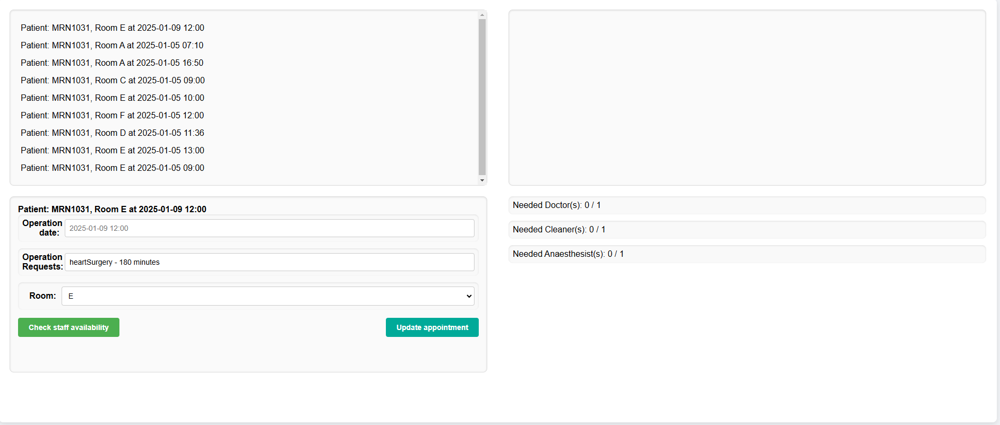

# US 7.2.9 - As a Doctor, I want to update a Surgery Appointment, so that I can override the automatically generated planning

## 1. Context

A Doctor can update a surgery appointment that's already made. This is a newly assigned task during the third sprint and is to be completed in said sprint.

## 2. Requirements

**US 7.2.9** As a Doctor, I want to update a Surgery Appointment, so that I can override the automatically generated planning

**Client Specifications - Q&A:**
> [**"7.2.9"** *by  Vicente Cardoso 1180664 - Wednesday, 27 de November de 2024 às 15:08*]
>
>As a follow-up question, what exactly can the doctor update about the appointment? Can they, for
> example, change the surgery room for the surgery?
>
>Best regards,
>
>Vicente Cardoso
>
>>**Answer -** after the appointment is planned, it is possible to update the team, room and date. the system must ensure all the resources and personnel is available at the selected time according to the operation type duration.

**Acceptance Criteria:**

- US7.2.9.1 Editable fields are: the appointment team, the room and the date.

- US7.2.9.2 When picking out the team, only staff who are available will be able to be picked.

**Dependencies/References:**

No dependencies were found.

## 3. Analysis

### System Sequence Diagram

### Relevant DM Excerpts

## 4. Design

### 4.1. Sequence Diagram

#### Change staff information SD

#### Email SD 

#### Staff accept changes SD

### 4.2. Applied Patterns

- Aggregate
- Entity
- Value Object
- Service
- MVC
- DTO
- Layered Architecture
- Clean Architecture
- C4+1

### 4.3 Main Commits:

> **04/01/2025 [US7.2.9]**
> - Documentation
>
> **04/01/2025 [US7.2.9]**
> - Added controller and service
>
> **04/01/2025 [US7.2.9]**
> -  Update appointment repository and appointment to support US requirements.
>
> **04/01/2025 [US7.2.9]**
> - Update to DTOs and operationrequest repo for frontend usage.
>
> **04/01/2025 [US7.2.9]**
> - Added AssignedStaff table to support N to N relation between staff and appointment
>
> **04/01/2025 [US7.2.9]**
> - Commited missed file.
> 
> **04/01/2025 [US7.2.9]**
> - Update to DTOs and operationrequest repo for frontend usage.e
> 
> **04/01/2025 [US7.2.9]**
> - New method in operation request controller for frontend usage
> 
> **04/01/2025 [US7.2.9]**
> - Created routes for the UIs, implemented methods to fetch needed information from backend
>
> **04/01/2025 [US7.2.9]**
> - Added attribute to OperationRequestData to help with the frontend.
> 
> **04/01/2025 [US7.2.9]**
> - Added UI implementation
> 

## 5. Implementation

[AppointmentController](../../../backoffice/src/Controllers/AppointmentController.cs)

[AppointmentService](../../../backoffice/src/Domain/Appointment/AppointmentService.cs)

[AppointmentDto](../../../backoffice/src/Domain/Appointment/AppointmentDto.cs)

[AppointmentRepository](../../../backoffice/src/Infraestructure/Appointment/AppointmentRepository.cs)

[AssignedStaffRepository](../../../backoffice/src/Infraestructure/AssignedStaff/AssignedStaffRepository.cs)

### Tests

[AppointmentControllerTest](../../../backoffice/test/ControllerTest/AppointmentControllerTest.cs)

[AppointmentServiceTest](../../../backoffice/test/ServiceTest/AppointmentServiceTest.cs)

## 6. Integration/Demonstration

## 7. Observations

Podemos ver na demonstração, que a cirurgia marcada para dia 05 às 06:00 foi movida para dia 09 às 12:00, tendo a sua sala mudada da A para a E.
